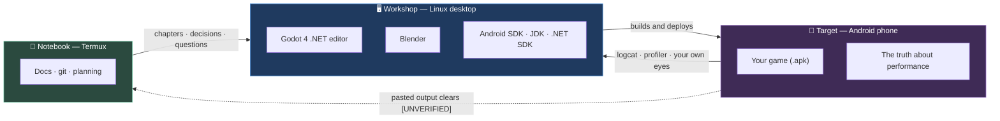

# Chapter 0.1 — Machines and Their Roles

🪜 **Scaffolding: 90 / 10.** Every step is given. The independent tenth is the practicals at the end.

---

## 🎯 Goal

By the end of this chapter, a **committed, filled-in inventory of the three machines this course runs on** exists in your repository — including the numbers that will constrain every performance decision you make from Module 5 onwards.

---

## 🏃 Fast-Track Summary

*Path C: read this and the cheat sheet, do ⭐ P1, move on.*

- Three machines, three jobs: **desktop = workshop** (Godot, Blender, .NET, Android SDK), **phone = target** (the only honest judge of performance), **Termux = notebook** (docs, git, planning — no builds).
- The split is not a preference. **Godot's Android editor build has no C#/.NET runtime**, so C# authoring requires a desktop. See [ADR-004](../meta/Decisions.md#adr-004).
- Audit the desktop:
  ```bash
  uname -a; lscpu | head -20; free -h; df -h ~; lspci | grep -i vga
  ```
- Audit the phone from **Settings → About phone** (model, Android version, RAM, chipset). `adb` is not available until [0.5](#-whats-next).
- Record both in the version-log tables in [`Setup 01`](../guides/Setup_01_Prerequisites.md#3-your-version-log), which **closes [D-003](../meta/Doubts.md#d-003)** — an open blocker in this repo.
- Compute the **desktop : phone ratio** for RAM and cores. If it is above ~3×, that gap is the reason Module 5 exists.
- Note whether your phone supports **Vulkan** — it decides Mobile vs Compatibility renderer in [6.13](../TableOfContents.md).
- Prove the role split with one command: `dotnet --version` in Termux fails. That is the chapter's Break-it.
- Commit: `ch 0.1: machine inventory — desktop, phone, notebook`

---

## 🧭 Before you start

| You need | Why |
|---|---|
| Your **desktop**, powered on — Windows 11 **or** Linux | It is the machine you will audit first |
| Your **Android phone**, in your hand | You will read its Settings; no cable needed yet |
| This repo **cloned on the desktop** | You will edit and commit a file in it |
| Nothing installed | Not Godot, not Blender, not the Android SDK. That is [0.2](Chapter_00.02_GodotAndDotNet.md) onwards |

> 🐣 **New to this?** "Cloning a repo" means downloading a copy of this course's files that stays linked to the online version. If you have not done it yet, run `git clone https://github.com/Tyrostir/godot-zero-to-hero.git` on your desktop. If `git` is not installed: 🪟 `winget install Git.Git` · 🐧 `sudo apt install git`.

> 🖥️ **Which desktop?** This course supports **Windows 11 native** and **Linux native** as the workshop. **WSL2 is a companion shell, not a workshop** — it has no USB passthrough, so `adb` cannot see your phone from inside it, and that breaks this course's core loop. The reasoning, and the recommended Windows + WSL split, are in [`Platforms.md`](../reference/Platforms.md). Read it before choosing.

---

## 🔨 Build

You are going to produce a document. That is the deliverable — not a warm-up for one.

### Step 1 — Audit the desktop

Open a terminal **on your desktop** (not Termux) and run these one at a time. Copy each result somewhere you can paste from.

> 🐧 **Linux / WSL** — bash

```bash
uname -a                                              # OS and kernel
cat /etc/os-release | head -3                         # distribution
lscpu | grep -E '^(Model name|CPU\(s\)|Thread|Core)'  # CPU
free -h                                               # RAM
df -h ~                                               # free disk
lspci | grep -Ei 'vga|3d|display'                     # graphics
```

> 🪟 **Windows (PowerShell)** — press `Win`, type *PowerShell*, open it

```powershell
Get-ComputerInfo -Property OsName,OsVersion,OsBuildNumber,CsSystemType

Get-CimInstance Win32_Processor |
  Select-Object Name,NumberOfCores,NumberOfLogicalProcessors

(Get-CimInstance Win32_ComputerSystem).TotalPhysicalMemory / 1GB   # RAM in GB

(Get-PSDrive C).Free / 1GB                                          # free disk in GB

Get-CimInstance Win32_VideoController |
  Select-Object Name,DriverVersion
```

`[UNVERIFIED]` — the exact output format on your OS. Paste what you actually get into [`toAgent/`](../../toAgent/) and this marker clears.

> ⚠️ 🐧 **If `lspci` is not found:** `sudo apt install pciutils`. If `lscpu` is missing: `sudo apt install util-linux`.
> ⚠️ 🪟 **Use PowerShell, not Command Prompt.** `cmd.exe` will not run any of the above.

> 🐣 **What am I looking at?**
> - **Kernel** — the core of the operating system. You will rarely care, but version mismatches occasionally explain a driver problem.
> - **Cores / threads** — how many things the CPU can do at once. Blender rendering and Godot's lightmap baking use all of them.
> - **RAM** — working memory. Godot and Blender open together is the normal state from [Module 3](../TableOfContents.md) onward, and that is where 8 GB starts to hurt.
> - **VGA / 3D controller** — your graphics card. The name matters because Godot 4's renderers need Vulkan support.

### Step 2 — Check the desktop's Vulkan support

Godot 4's Forward+ renderer requires Vulkan. You will ship on the **Mobile** renderer ([ADR-010](../meta/Decisions.md#adr-010)), but the editor itself wants a working graphics driver.

> 🐧 **Linux / WSL**

```bash
vulkaninfo --summary 2>/dev/null | head -20 || echo "vulkaninfo not installed"
# if missing: sudo apt install vulkan-tools
```

> 🪟 **Windows (PowerShell)**

```powershell
dxdiag /t "$env:USERPROFILE\dxdiag.txt"; Start-Sleep 5
Select-String -Path "$env:USERPROFILE\dxdiag.txt" -Pattern "Card name|Driver Version"
```

For a definitive Vulkan answer on Windows, install the free **Vulkan SDK** from <https://vulkan.lunarg.com/> and run `vulkaninfoSDK.exe --summary`, or note your GPU model and check the vendor's driver notes.

If Vulkan reports **zero devices**, your graphics driver needs attention before [0.2](Chapter_00.02_GodotAndDotNet.md) — note it now rather than discovering it while trying to open Godot.

`[UNVERIFIED]` — whether `vulkaninfo --summary` exists in your distribution's package version, and dxdiag's exact field names on your build.

### Step 3 — Audit the phone

**No cable, no `adb`, no apps required.** `adb` arrives in [0.5](../TableOfContents.md); today you read the phone directly.

On the phone, open **Settings → About phone** and write down:

| Field | Where to find it |
|---|---|
| Model | Settings → About phone |
| Android version | Settings → About phone → Android version |
| RAM | Settings → About phone (or Settings → Storage / Device info) |
| Chipset / processor | Settings → About phone. If absent, look up your model number online |
| Screen resolution | Settings → Display |
| Refresh rate | Settings → Display → Refresh rate (60 / 90 / 120 Hz) |
| Has a notch or cutout? | Look at it |
| Free storage | Settings → Storage |

> 💡 **The chipset is the number that matters most.** "Snapdragon 695", "Dimensity 700", "Exynos 1280" — that string tells you the GPU family, which sets your realistic triangle, texture and shader budget for the whole course. Write it down exactly.

> 🔬 **Deep dive — finding the GPU.** Phone manufacturers hide the GPU. Search your chipset name plus "GPU"; you will get an Adreno, Mali or PowerVR part number. Note it. In [Module 5](../TableOfContents.md) you will look up its fill rate and memory bandwidth, and those two numbers explain most of your framerate.

Write the answers straight into this shape — you will paste it into a file in Step 6:

```markdown
| Field | Value |
|-------|-------|
| Model | |
| Android version | |
| RAM | |
| Chipset | |
| GPU | |
| Resolution | |
| Refresh rate | |
| Notch / cutout | |
| Free storage | |
| Vulkan | |
```

### Step 4 — Determine Vulkan support on the phone

This one **does** want a free app: **Vulkan Hardware Capability Viewer** (Play Store, free, open source). Install it, open it, and record:

- Does it report a Vulkan device at all?
- What API version?

If it reports nothing, your phone predates usable Vulkan and you will use Godot's **Compatibility** renderer instead of **Mobile**. That is a real fork in the road for [6.13](../TableOfContents.md) — better to know now.

> 🐣 **What is Vulkan?** A modern way for software to talk to a GPU. Godot 4's better renderers require it; its Compatibility renderer uses the older OpenGL ES path instead. You do not need to understand more than that today.

### Step 5 — Check your USB cable actually carries data

One minute now saves an evening in [0.5](../TableOfContents.md), where the single most common failure is a charge-only cable that looks identical to a data cable.

1. Plug the phone into the desktop.
2. On the phone, pull down the notification shade. Look for a **"Charging this device via USB"** notification and tap it.
3. You want to see options like *File Transfer / Android Auto / PTP*. If the only option is **"No data transfer"** and nothing else is selectable, the cable is charge-only.

> 🐧 **Linux** *(⚠️ WSL will **not** see the phone — [Platforms.md §2.1](../reference/Platforms.md))*

```bash
lsusb
```

> 🪟 **Windows (PowerShell)**

```powershell
Get-PnpDevice -PresentOnly | Where-Object InstanceId -like "USB*" |
  Select-Object FriendlyName, Status
```

Unplug and re-run the command. **A line should disappear.** If the two lists are identical, the cable is not carrying data — find another one before [0.5](../TableOfContents.md).

> ⚠️ **This is not a rare problem.** Cables bundled with power banks, car chargers and cheap wall plugs are frequently charge-only. They look exactly like data cables. Test now, while the test is one minute and not a debugging session.

`[UNVERIFIED]` — the exact notification wording, which varies by Android version and manufacturer.

### Step 6 — Create your machine inventory

**This is the chapter's deliverable.** The template is already in the repo — your job is to fill it.

```bash
cd ~/godot-zero-to-hero                    # 🐧
```
```powershell
cd $env:USERPROFILE\godot-zero-to-hero      # 🪟
```

Then open `docs/meta/Machines.md` in any editor.

Fill in **every** field in the *Workshop*, *Target* and *Ratios* sections from Steps 1–4. Leave the tool-version table alone for now; [0.2](Chapter_00.02_GodotAndDotNet.md)–[0.4](Chapter_00.04_AndroidToolchain.md) fill that.

Mark a field `?` if you genuinely could not find it. **Never guess** — a wrong number is worse than a missing one, because you will trust it later.

<details>
<summary>What the file looks like, if you want to see it before opening it</summary>

```markdown
---
title: "Machines — the three devices this course runs on"
document_id: MACHINES
version: 1.0
status: Active
created: <today>
last_updated: <today>
update_trigger: "When a machine changes, or a spec is corrected"
---

# 🖥️📱🐧 Machines

## Roles

| Role | Machine | Runs here | Must never happen here |
|------|---------|-----------|------------------------|
| 🖥️ Workshop | | Godot, Blender, .NET SDK, Android SDK, editor | Performance judgements |
| 📱 Target | | The game. Every build. Every measurement | Authoring |
| 🐧 Notebook | Termux | Docs, git, planning, questions | Builds of any kind |

## Workshop — desktop

| Field | Value |
|-------|-------|
| OS / version | |
| Kernel | |
| CPU model | |
| Cores / threads | |
| RAM | |
| Free disk (home) | |
| GPU | |
| Vulkan working? | |
| Data cable verified? | |

## Target — phone (Tier: Mid)

| Field | Value |
|-------|-------|
| Model | |
| Android version | |
| RAM | |
| Chipset | |
| GPU | |
| Resolution | |
| Refresh rate | |
| Notch / cutout | |
| Free storage | |
| Vulkan? | |
| ⇒ Renderer implied | Mobile / Compatibility |

## Second target — phone (Tier: Low) *(optional, see P3)*

| Field | Value |
|-------|-------|
| Model | |
| Chipset / GPU | |
| RAM | |
| ⇒ This is my performance truth | |

## Ratios

| | Desktop | Phone | Ratio |
|---|---|---|---|
| RAM | | | ×  |
| Cores | | | ×  |
| Free storage | | | ×  |

## Prediction *(P4)*

> On <today>, I predict the first thing to limit me on the phone will be **____**, because ____.
```

</details>

### Step 7 — Close the open doubt

Two files to update, both real:

1. [`docs/guides/Setup_01_Prerequisites.md`](../guides/Setup_01_Prerequisites.md) — fill in the **test device** table in §3. Leave the tool-version rows blank; those come in [0.2](Chapter_00.02_GodotAndDotNet.md)–[0.4](Chapter_00.04_AndroidToolchain.md).
2. [`docs/meta/Doubts.md`](../meta/Doubts.md) — move **[D-003](../meta/Doubts.md#d-003)** from *Open* to *Resolved* and write the answer **in your own words**, linking to `Machines.md`.

> 🚨 **This is not paperwork.** D-003 is an open blocker in this repository right now, and it gates real decisions in Modules 5, 6 and 11. You are the only person who can close it, and you are closing it today.

### Step 8 — Commit

```bash
git add docs/meta/Machines.md docs/guides/Setup_01_Prerequisites.md docs/meta/Doubts.md
git commit -m "ch 0.1: machine inventory — desktop, phone, notebook

Closes D-003."
git push
```

> 🐣 **First commit of the course.** `git add` stages the files you want to save, `git commit` records them with a message, `git push` sends them to GitHub. If `push` asks for a password, use a personal access token rather than your account password — GitHub stopped accepting passwords for git operations.

---

## ▶️ Run it

You should now be able to answer all of these from your own notes, without looking anything up:

- [ ] Desktop: OS, cores, RAM, free disk, GPU, Vulkan working?
- [ ] Phone: model, Android version, RAM, chipset, GPU, resolution, refresh rate, notch, Vulkan?
- [ ] Which machine does which job, written down
- [ ] `docs/meta/Machines.md` exists and every field is filled or explicitly `?`
- [ ] Your USB cable is confirmed to carry data
- [ ] D-003 marked Resolved, in your own words
- [ ] Committed and pushed

If any box is empty, the chapter is not finished. Go back for it — every one of them is used later.

---

## 👀 Observe

Look at your two hardware tables side by side and compute three ratios. Write them in your [journal](../meta/Journal.md):

```text
RAM     desktop ____ GB  :  phone ____ GB   =  ____ ×
Cores   desktop ____     :  phone ____      =  ____ ×
Storage desktop ____ GB  :  phone ____ GB   =  ____ ×
```

**Name what you are looking at before reading on.** Most people find a gap between 2× and 6×.

That number is not trivia. It is the reason [Module 5](../TableOfContents.md) exists, the reason [ADR-010](../meta/Decisions.md#adr-010) makes mobile-safe technique the default, and the reason you will be told — repeatedly — that a thing running at 200 fps in the editor tells you nothing at all.

---

## 🧠 Why it works

Three machines, three jobs, and none of the three is interchangeable with another. Here is the actual reason for each.

### The desktop is the workshop because C# leaves you no choice

Godot ships an **Android editor build**, and it is genuinely impressive — a full engine editor running on a phone. It also has **no C#/.NET runtime**. C# scripting requires a desktop .NET SDK and MSBuild to compile your code before the engine can run it.

So this is a hard constraint of the toolchain, not a preference. If you were writing GDScript — which is interpreted and needs no build step — developing entirely on the phone would be viable. You are writing C# ([ADR-001](../meta/Decisions.md#adr-001)), so it is not.

> 🔬 **Deep dive — why the build step exists at all.** GDScript is interpreted: the engine reads your source and executes it. C# is compiled: your source becomes an assembly first, and the engine loads that. That extra step buys you static typing, real refactoring, and the entire NuGet ecosystem — and costs you an edit→build→run loop instead of edit→run. You will measure exactly what it costs in [0.12](../TableOfContents.md).

### The phone is the target because it is the only honest judge

A mid-range Android phone has roughly the GPU budget of a decade-old laptop and — the part that surprises people — a **thermal budget of about ten minutes**. It will run beautifully for a demo and then quietly halve its own clock speed to avoid cooking itself.

Your desktop has none of these problems. It has active cooling, a power cable, and ten times the memory bandwidth. **A frame rate measured on it is not evidence about anything.**

This is why [ADR-034](../meta/Decisions.md#adr-034) makes device testing structural rather than optional, and why every project from P01 onward has *"tested on device"* in its done-criteria.

### Termux is the notebook because it is neither of the above

You are reading and planning this course from Termux on Android. It is excellent for that: git, text, and conversation. It has no Godot, no Blender, no .NET SDK and no Android SDK, and — by your own instruction — nothing will be installed there.

That constraint is also why this course carries `[UNVERIFIED]` markers ([ADR-016](../meta/Decisions.md#adr-016)). Anything I cannot run, I mark rather than invent. You clear the markers by pasting real output into [`toAgent/`](../../toAgent/).

---

## 🗺️ Mental model



The arrow that people forget is the one coming **back** from the phone. Deploying is half a loop; measuring is the other half.

---

## 💥 Break it

Prove the role split rather than taking my word for it. **In Termux** — the notebook, not the desktop — run:

```bash
dotnet --version
```

Then:

```bash
godot --version
```

---

## 🔎 Diagnose

**Before opening the answer: what exactly failed, and what does the wording of the failure tell you?**

Write your answer down first. Then check.

<details>
<summary>Answer</summary>

Both commands fail with a message along the lines of `bash: dotnet: command not found`.

The important part is *which* kind of failure this is. It is **not** a permissions error, a version mismatch, or a broken install. It is `command not found` — the shell searched every directory in `$PATH` and there is no such program. Nothing is misconfigured; the tool simply is not there.

That distinction matters more than it looks, and you will use it constantly:

| Failure | Means |
|---|---|
| `command not found` | The tool is not installed, or is not on `$PATH` |
| `permission denied` | It is there; you are not allowed to run it |
| `No such file or directory` *(on a command that exists)* | Usually a missing shared library, or a bad interpreter line |
| A version number you did not expect | Two copies are installed and the wrong one wins |

So Termux cannot build anything, and the split is a fact about the machine rather than a rule I imposed. Confirmed in one command.

`[UNVERIFIED]` — the exact wording your Termux shell produces.

</details>

---

## 🏋️ Practicals

**⭐ P1 — Close D-003.** *(Required. Everything else in Module 0 assumes it.)* Fill both tables in Setup 01, move D-003 to Resolved, write the answer in your own words, commit.

**P2 — Find your GPU.** Your chipset name is not your GPU name. Search the chipset, find the Adreno / Mali / PowerVR part, and record it. In [Module 5](../TableOfContents.md) you will look up its fill rate and bandwidth.

**P3 — Find a second device.** Beg or borrow the oldest Android phone you can — a five-year-old handset is ideal. Add it to your table as **Tier: Low**. It becomes your *performance truth* in [2.13](../TableOfContents.md): build for that one and the good phone looks after itself. Skip only if you genuinely cannot find one.

**🔬 P4 — Predict a bottleneck.** From your two tables alone, write one sentence predicting which will limit you first on the phone: CPU, GPU, RAM, or thermals. Date it. You will check the prediction in [Module 5](../TableOfContents.md) — and being wrong is more instructive than being right.

---

## ✅ Check yourself

Answer out loud or in writing **before** opening the answers.

1. Why can't you author this course's game on the Android editor build of Godot?
2. Name one thing each machine must never be used for.
3. Your game runs at 200 fps in the editor. What does that tell you about how it will run on your phone?
4. Why does a phone that hits 60 fps for thirty seconds still fail a performance test?
5. What does `command not found` rule out, compared with `permission denied`?

<details>
<summary>Answers</summary>

1. **It has no C#/.NET runtime.** C# must be compiled by a desktop .NET SDK and MSBuild before the engine can load it. This is a toolchain fact, not a preference — GDScript, being interpreted, would work fine there. ([ADR-004](../meta/Decisions.md#adr-004))
2. **Desktop:** never make a performance judgement on it. **Phone:** never author on it. **Termux:** never build on it.
3. **Essentially nothing.** Different GPU architecture, different memory bandwidth, active cooling, mains power. The only measurement that means anything is one taken on the target device.
4. **Thermal throttling.** A phone will happily run at full clock for a short burst and then halve its own speed to protect itself. This is why the course specifies a **30-minute soak test** rather than a 30-second benchmark ([Module 5](../TableOfContents.md)).
5. `command not found` means the shell searched all of `$PATH` and found no such program — nothing is installed or nothing is on the path. `permission denied` means the program **is** there and you are not allowed to execute it. The first is an installation problem; the second is a permissions problem, and they are fixed in completely different ways.

</details>

---

## 📎 Cheat sheet

| Command | Tells you |
|---------|-----------|
| `uname -a` | Kernel and architecture |
| `cat /etc/os-release` | Distribution and version |
| `lscpu` | CPU model, cores, threads |
| `free -h` | RAM, in human-readable units |
| `df -h ~` | Free disk in your home directory |
| `lspci \| grep -Ei 'vga\|3d'` | Graphics hardware |
| `vulkaninfo --summary` | Whether Vulkan works and which GPU it sees |
| `dotnet --version` | Whether a .NET SDK is present *(it is not, in Termux)* |

| Role | Machine | Never used for |
|------|---------|----------------|
| 🖥️ Workshop | Linux desktop | Performance judgements |
| 📱 Target | Android phone | Authoring |
| 🐧 Notebook | Termux | Builds |

**Phone fields to record:** model · Android version · RAM · chipset · GPU · resolution · refresh rate · notch · Vulkan · free storage.

---

## 🔗 Further reading

- [`Setup 01 — Prerequisites`](../guides/Setup_01_Prerequisites.md) — the tables you just filled
- [ADR-004](../meta/Decisions.md#adr-004) — why the machine split exists
- [ADR-010](../meta/Decisions.md#adr-010) — why mobile-safe technique is the default
- [ADR-016](../meta/Decisions.md#adr-016) — the `[UNVERIFIED]` protocol
- [`ReferenceLinks.md`](../reference/ReferenceLinks.md) — Godot and Android documentation

---

## 💾 Commit

```text
ch 0.1: machine inventory — desktop, phone, notebook

Closes D-003.
```

---

## ➡️ What's next

**[0.2 — Installing Godot 4 (.NET build) and the .NET SDK](../TableOfContents.md).** You now know what the workshop is; next you equip it. The one mistake that costs people an evening is downloading the wrong Godot build — 0.2 opens with how to avoid it.

---

## 🪞 Reflection

In two sentences, in your own words: **why does this course need three machines, and what would go wrong if you tried to use two?**

If you cannot answer without scrolling up, the chapter is not finished.

---

## 📝 Chapter changelog

| Version | Date | Change |
|---------|------|--------|
| 1.0 | 2026-09-02 | First published. Carries `[UNVERIFIED]` markers on all command output. |
