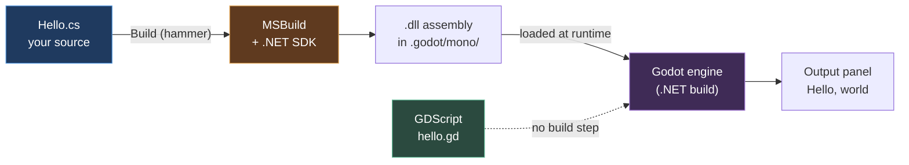

# Chapter 0.2 — Installing Godot 4 (.NET) and the .NET SDK

🪜 **Scaffolding: 90 / 10.** Every step is given.

---

## 🎯 Goal

By the end, a **Godot editor that compiles and runs your C#** exists on your desktop, with matching export templates installed and its exact versions recorded.

---

## 🏃 Fast-Track Summary

- Download the **.NET build** from <https://godotengine.org/download/>. The filename contains **`mono`** — that is the same thing. `[UNVERIFIED]`
- **Do not** move the binary out of its folder. The .NET build ships a `GodotSharp/` directory beside it and breaks without it.
- Install the .NET **SDK** (not just the runtime): 🪟 `winget install Microsoft.DotNet.SDK.8` · 🐧 `sudo apt install dotnet-sdk-8.0`. Verify with `dotnet --list-sdks`.
- Verify Godot is the right build: **Help → About** must mention .NET/Mono. No Build button = wrong download.
- `Editor → Manage Export Templates → Download and Install`. Must match the editor version **exactly**.
- Smoke test: a `Node` with a C# script that prints in `_Ready()`. Press **Build** (hammer), then **F5**.
- The class must be `public partial class X : Node` in a file named `X.cs`. Both halves matter.
- Record every version in [`Machines.md`](../meta/Machines.md) and [Setup 01 §3](../guides/Setup_01_Prerequisites.md#3-your-version-log).
- Commit: `ch 0.2: godot .net + dotnet sdk installed`

---

## 🧭 Before you start

| You need | From |
|---|---|
| [Chapter 0.1](Chapter_00.01_MachinesAndTheirRoles.md) done | You know your specs, and `vulkaninfo` sees your GPU |
| ~3 GB free disk | Godot ~200 MB, .NET SDK ~1 GB, export templates ~1 GB |
| A terminal on the **desktop** | PowerShell 🪟 or bash 🐧 — **not Termux, and not WSL** ([Platforms.md](../reference/Platforms.md)) |

---

## 🔨 Build

### Step 1 — Download the correct Godot build

Go to <https://godotengine.org/download/> and pick your platform.

You will see **two** downloads for Linux. This is the single most consequential click in the chapter.

| Download | Contains | Use it? |
|---|---|---|
| **Godot Engine** | GDScript only | ❌ **No** |
| **Godot Engine – .NET** | GDScript **and C#** | ✅ **This one** |

> ⚠️ **The filename may say `mono`, not `dotnet`.** Godot's C# support grew out of the Mono runtime and the file naming has lagged the branding. A file called `Godot_v4.x-stable_mono_linux_x86_64.zip` **is** the .NET build. `[UNVERIFIED]` — the exact filename for your version.

> 🐣 **Why two builds at all?** The .NET build is bigger and carries a whole language runtime that GDScript users would never touch. Rather than make everyone download it, Godot ships two. You need the bigger one.

### Step 2 — Extract it, and leave it alone

> 🐧 **Linux**

```bash
mkdir -p ~/opt && cd ~/opt
unzip ~/Downloads/Godot_v4*_mono_linux_x86_64.zip
cd Godot_v4*_mono_linux_x86_64/ && ls
chmod +x Godot_v4*_mono_linux.x86_64
```

> 🪟 **Windows (PowerShell)**

```powershell
# ⚠️ Unblock first — Windows marks downloaded archives, and Defender can
#    quarantine files inside GodotSharp\ after extraction
Unblock-File "$env:USERPROFILE\Downloads\Godot_v4*_mono_win64.zip"

New-Item -ItemType Directory -Force "$env:USERPROFILE\opt" | Out-Null
Expand-Archive "$env:USERPROFILE\Downloads\Godot_v4*_mono_win64.zip" `
  -DestinationPath "$env:USERPROFILE\opt"
Get-ChildItem "$env:USERPROFILE\opt\Godot_v4*_mono_win64"
```

Either way you should see a **folder**, not a bare executable — containing the Godot binary **and** a `GodotSharp/` directory.

> 🚨 **Do not move the binary out of this folder.** The standard build is a single portable executable and people learn that habit first. **The .NET build is not.** It needs `GodotSharp/` sitting beside it, and moving the binary alone produces a Godot that launches, opens projects, and silently cannot compile C#. This wastes an evening surprisingly often.

Make it launchable from anywhere:

> 🐧 **Linux**

```bash
mkdir -p ~/.local/bin
ln -sf ~/opt/Godot_v4*_mono_linux_x86_64/Godot_v4*_mono_linux.x86_64 ~/.local/bin/godot
echo 'export PATH="$HOME/.local/bin:$PATH"' >> ~/.bashrc && source ~/.bashrc
godot --version
```

> 🪟 **Windows (PowerShell)** — add the folder to your user PATH, then **reopen PowerShell**

```powershell
$godotDir = (Get-ChildItem "$env:USERPROFILE\opt\Godot_v4*_mono_win64").FullName
[Environment]::SetEnvironmentVariable(
  "Path", "$([Environment]::GetEnvironmentVariable('Path','User'));$godotDir", "User")
# close this window, open a new PowerShell, then:
Godot_v4*_mono_win64\Godot_v4*_mono_win64.exe --version
```

⚠️ 🪟 **Environment changes need a new terminal.** `setx` and `SetEnvironmentVariable` do not affect the window you ran them in.

Record that version string. You will need it to match export templates in Step 5.

### Step 3 — Install the .NET SDK

Godot needs the **SDK**, not just the runtime, because it invokes MSBuild to compile your code.

> 🐧 **Linux**

```bash
sudo add-apt-repository ppa:dotnet/backports
sudo apt update && sudo apt install -y dotnet-sdk-8.0
```

> 🪟 **Windows (PowerShell)**

```powershell
winget install Microsoft.DotNet.SDK.8
```

Then, on both:

```bash
dotnet --list-sdks
dotnet --version
```

`[UNVERIFIED]` — whether your distribution packages `dotnet-sdk-8.0` under that exact name, and the current winget package id. If either fails, use the official installer at <https://dotnet.microsoft.com/download>.

> ⚠️ **Runtime ≠ SDK.** `dotnet-runtime-8.0` will let you *run* .NET programs and will **not** let Godot build one. If `dotnet --list-sdks` prints nothing, you have the runtime only.

### Step 4 — Confirm Godot is the build you think it is

Launch it (🐧 `godot`, or 🪟 double-click the `.exe`).

Create a new project — call it `Scratch`, put it in `~/scratch/Scratch`, renderer **Mobile** ([ADR-010](../meta/Decisions.md#adr-010)).

Now check **Help → About**. It should identify itself as the .NET/Mono build. `[UNVERIFIED]` — the exact wording.

Then look at the **top-right toolbar**. You are looking for a **hammer icon** — the Build button. 

- **Hammer present** → correct build. Continue.
- **No hammer** → you have the standard build. Go back to Step 1.

### Step 5 — Install export templates

`Editor → Manage Export Templates → Download and Install`.

This is a ~1 GB download. While it runs, understand what you are downloading: **export templates are the Godot engine itself, precompiled for each target platform.** Your project is data; the template is the program that runs it.

> 🚨 **Templates must match your editor version exactly** — including the suffix (`4.x.y.stable` vs `4.x.y.rc1`) **and** the .NET variant. A mismatch gives you either a refusal at export time, or an APK that installs and crashes instantly with no useful message. **When you upgrade Godot, re-download templates in the same sitting.**

Verify they landed:

> 🐧 **Linux**

```bash
ls ~/.local/share/godot/export_templates/
```

> 🪟 **Windows (PowerShell)**

```powershell
Get-ChildItem "$env:APPDATA\Godot\export_templates"
```

`[UNVERIFIED]` — the exact path on your platform and version; older Godot releases used `.../godot/templates/`.

### Step 6 — Point Godot at the .NET SDK

`Editor → Editor Settings → Dotnet → Editor`.

- **Editor Path** — usually auto-detected. If blank, set it to the output of 🐧 `which dotnet` · 🪟 `(Get-Command dotnet).Source`.
- **External Editor** — set to VS Code or Rider if you have one; otherwise leave it and use Godot's built-in editor for now.

### Step 7 — The smoke test: does C# actually compile?

In your `Scratch` project:

1. In the Scene dock, click **Other Node**, choose **Node**, and press Create.
2. Rename it to `Hello`.
3. With `Hello` selected, click the **Attach Script** icon (a scroll with a `+`).
4. Set **Language: C#**. The path should default to `res://Hello.cs`. **Leave the filename matching the node name.** Create.
5. Replace the file's contents with exactly this:

```csharp
using Godot;

public partial class Hello : Node
{
    [Export] public string Who { get; set; } = "world";

    public override void _Ready()
    {
        GD.Print($"Hello, {Who} — C# is alive.");
    }
}
```

6. Press the **Build** button (hammer, top right). Watch the bottom panel.
7. Press **F5**. Godot will ask you to select a main scene — save the current one as `Hello.tscn` and pick it.

### Step 8 — Record the versions

Fill these into [`docs/meta/Machines.md`](../meta/Machines.md) (created in 0.1) and [Setup 01 §3](../guides/Setup_01_Prerequisites.md#3-your-version-log):

```bash
godot --version        # 🪟 use the full path to the .exe, or add it to PATH first
dotnet --version
dotnet --list-sdks
```

Add a row for **export templates version** — the same string as `godot --version`.

### Step 9 — Commit

```bash
git add docs/meta/Machines.md docs/guides/Setup_01_Prerequisites.md
git commit -m "ch 0.2: godot .net + dotnet sdk installed"
git push
```

---

## ▶️ Run it

The **Output** panel at the bottom of the editor should contain:

```text
Hello, world — C# is alive.
```

Now, without stopping the game, change `Who` in the **Inspector** to your name, stop, and press F5 again. The message changes.

- [ ] `godot --version` prints a version
- [ ] `dotnet --list-sdks` lists at least one SDK
- [ ] **Help → About** says .NET/Mono
- [ ] The hammer icon exists and Build succeeds
- [ ] The Output panel prints your line
- [ ] Changing `Who` in the Inspector changes the output
- [ ] Export templates installed and version recorded

---

## 👀 Observe

You pressed **Build**, and *then* F5. Note how long the build took — a second or two, probably.

That pause is the price of C#. GDScript has no equivalent step. You will measure this properly in [0.12](../TableOfContents.md) and decide what it is worth; for now, just notice that it exists.

Also notice what `[Export]` did: a C# **property** appeared in the Inspector as an editable field, with your default already in it. No glue code. That mechanism is how every tunable value in this course reaches a designer.

---

## 🧠 Why it works

### Two builds, because C# is not free

The .NET build carries a complete language runtime and the MSBuild machinery to drive a compiler. That is a large payload for someone writing GDScript, so Godot ships it separately. The cost of choosing wrong is not an error message at download time — it is a missing button you have to notice.

### Why C# needs a build step and GDScript does not

GDScript is **interpreted**: the engine reads your source and executes it directly. C# is **compiled**: your source becomes a .NET assembly first, and the engine loads that assembly.

That extra step buys you static typing, real refactoring, compile-time error detection, and the entire NuGet package ecosystem ([0.16](../TableOfContents.md)). It costs you an edit→**build**→run loop instead of edit→run.

> 🔬 **Deep dive — what a Target Framework is.** When Godot creates a C# project it writes a `.csproj` file containing a line like `<TargetFramework>net8.0</TargetFramework>`. That declares which .NET version your code targets, and it is the authoritative answer to "which SDK do I need" — not my guess, and not a version number in a tutorial. Open the generated `.csproj` in your `Scratch` project and read it.

### `public partial class X : Node` — every word earns its place

- **`public`** — Godot must be able to see the type from outside your assembly.
- **`partial`** — Godot's source generators write *additional* code into your class (signal plumbing, property metadata). `partial` is what allows a class to be assembled from more than one file.
- **`: Node`** — it must derive from a Godot type to be attachable.
- **The filename must match the class name.** Godot locates the type by filename.

Break any one of these and the script silently fails to attach. Which is exactly what you are about to do.

---

## 🗺️ Mental model



The dotted line is why GDScript iterates faster. The solid path is what you traded it for.

---

## 💥 Break it

Three sabotages. Do all three, one at a time, restoring after each.

1. **Rename the class**, leaving the filename alone: change `public partial class Hello` to `public partial class Greeter`. Build. Run.
2. **Restore.** Now delete the word `partial`. Build.
3. **Restore.** Now delete `using Godot;`. Build.

---

## 🔎 Diagnose

**Write down, for each of the three, what failed and at which stage — editor, build, or run — before opening the answer.**

<details>
<summary>Answer</summary>

**1 — Class name ≠ filename.** The build may well *succeed*. The failure is at attach time: Godot cannot find a type named `Hello` in `Hello.cs`, so the script does not attach and `_Ready` never runs. Nothing prints.

This is the nastiest of the three precisely because **the compiler is happy**. Your code is valid C#; it is Godot's convention you broke. Whenever a script "does nothing", check the class name against the filename first.

**2 — Missing `partial`.** This fails at **build** time. Godot's source generator emits a second part of your class; without `partial` the compiler sees two definitions of the same type and refuses. `[UNVERIFIED]` — the exact diagnostic, but expect something naming your class and the word `partial`.

**3 — Missing `using Godot;`.** Also a **build** failure, and the friendliest of the three: the compiler names `Node`, `GD` and `Export` as unrecognised. Unknown-symbol errors are usually a missing `using`.

**The pattern worth keeping:**

| Symptom | Where it broke | Usual cause |
|---|---|---|
| Build fails, names a symbol | Compiler | Missing `using`, or a typo |
| Build fails, names your class | Source generator | Missing `partial` |
| **Build succeeds, nothing happens** | Godot's attach step | **Class name ≠ filename** |

</details>

---

## 🏋️ Practicals

**⭐ P1 — Read the `.csproj`.** Open `Scratch.csproj` in your project root. Find `<TargetFramework>`. Confirm the SDK you installed matches it. Record both in `Machines.md`.

**P2 — Export a second value.** Add `[Export] public int Times { get; set; } = 3;` and make `_Ready` print the greeting that many times. Set it to 5 in the Inspector without touching the code.

**🔬 P3 — Find the assembly.** Look inside `.godot/mono/` in your project. Find the `.dll` your Build produced. Note its size — that is your code, compiled.

---

## ✅ Check yourself

1. What is the difference between the .NET runtime and the .NET SDK, and which does Godot need?
2. Why must the .NET build's binary stay in its extracted folder?
3. Your C# script attaches without error but nothing happens at runtime. What do you check first?
4. What does `partial` do, and who writes the other part?
5. Why must export templates match the editor version exactly?

<details>
<summary>Answers</summary>

1. The **runtime** executes .NET programs; the **SDK** contains the compiler and MSBuild needed to *build* them. Godot needs the **SDK** — it shells out to MSBuild every time you press the hammer. `dotnet --list-sdks` printing nothing means you have runtime only.
2. Because the .NET build ships a **`GodotSharp/` directory** that must sit beside the binary. The standard build is a single portable executable, which teaches people the wrong habit. Moving the .NET binary alone gives you an editor that launches and silently cannot compile C#.
3. **Whether the class name matches the filename.** That failure produces no compiler error — the code is valid C#, and it is Godot's lookup convention that broke.
4. `partial` lets one class be assembled from multiple files. **Godot's source generators** write the other part — signal plumbing and property metadata. Without it the compiler sees a duplicate type.
5. An export template **is the Godot engine**, precompiled for a target platform. Editor and engine must agree on the data format they exchange. A mismatch gives an export refusal at best, and an APK that installs and instantly crashes at worst.

</details>

---

## 📎 Cheat sheet

| Command | Purpose |
|---|---|
| `godot --version` | Editor version — must match export templates |
| `dotnet --version` | Active SDK version |
| `dotnet --list-sdks` | All SDKs. **Empty = you have the runtime only** |
| `which dotnet` 🐧 / `(Get-Command dotnet).Source` 🪟 | Path for Godot's Editor Settings |
| `ls ~/.local/share/godot/export_templates/` 🐧<br/>`Get-ChildItem "$env:APPDATA\Godot\export_templates"` 🪟 | Confirm templates installed |

| Rule | Consequence of breaking it |
|---|---|
| Download the **.NET** build | No Build button; C# never compiles |
| Keep the binary with `GodotSharp/` | Editor runs, C# silently fails |
| 🪟 `Unblock-File` the download | Defender may quarantine files inside `GodotSharp/` |
| 🪟 Reopen the terminal after a PATH change | `godot: command not found` in the same window |
| `public partial class X : Node` in `X.cs` | Build error, or a script that silently does nothing |
| Templates match editor version | Export refused, or an APK that crashes on launch |

---

## 🔗 Further reading

- [Godot C# basics](https://docs.godotengine.org/en/stable/tutorials/scripting/c_sharp/index.html)
- [Setup 02](../guides/Setup_02_Godot_And_DotNet.md) — the reference version of this chapter
- [ADR-001](../meta/Decisions.md#adr-001) — why C# is primary
- [ADR-022](../meta/Decisions.md#adr-022) — the accepted cost of C# on Android

---

## 💾 Commit

```text
ch 0.2: godot .net + dotnet sdk installed
```

---

## ➡️ What's next

**[0.3 — Installing Blender, and configuring it once so you never fight it again](Chapter_00.03_Blender.md).** You have the code half of the workshop. Next, the art half — and a round-trip test that proves the two agree about how big a metre is.

---

## 🪞 Reflection

In two sentences: **what does pressing Build actually do, and what did you give up by needing it?**

---

## 📝 Chapter changelog

| Version | Date | Change |
|---|---|---|
| 1.0 | 2026-09-02 | First published. `[UNVERIFIED]` on all version strings and error text. |
