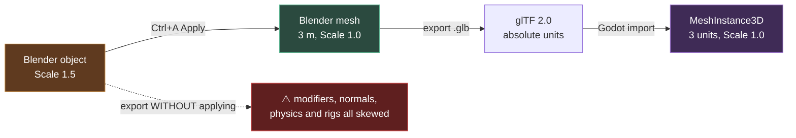

# Chapter 0.3 — Installing Blender, and Configuring It Once

🪜 **Scaffolding: 90 / 10.**

---

## 🎯 Goal

By the end, Blender is installed and configured so you never fight it again — and you have **proved** that Blender and Godot agree about how big a metre is, by sending a 2 m cube from one to the other.

---

## 🏃 Fast-Track Summary

- Install from the **official tarball**, not snap. Snap's sandbox restricts file access in ways that bite later. `[UNVERIFIED]`
- `tar -xf blender-*.tar.xz -C ~/opt/`, symlink to `~/.local/bin/blender`.
- Preferences pass: Developer Extras · Python Tooltips · Emulate Numpad (if no numpad) · Turntable orbit · Clip Start `0.01` · Undo 64 · **Auto Save 2 min**. Save Preferences.
- Enable add-ons: **Node Wrangler**, Extra Objects (Mesh + Curve), Copy Attributes.
- Scene → Units: **Metric, Unit Scale 1.0, Metres**. Then `File → Defaults → Save Startup File`.
- ⭐ **The round trip:** 2 m cube → `Ctrl+A` Apply All Transforms → export `.glb` → drop into Godot → **must be exactly 2 units**.
- Break it: skip Apply Transforms on a scaled cube and watch the size lie.
- Commit: `ch 0.3: blender installed, configured, round-trip verified`

---

## 🧭 Before you start

| You need | Why |
|---|---|
| [0.2](Chapter_00.02_GodotAndDotNet.md) done | The round trip needs a Godot project to import into |
| ~1 GB disk | Blender is about 300 MB extracted |
| Your `Scratch` Godot project | You will import into it |

---

## 🔨 Build

### Step 1 — Install from the tarball

Go to <https://www.blender.org/download/> and take the current stable **4.x** Linux release (`.tar.xz`).

```bash
mkdir -p ~/opt
tar -xf ~/Downloads/blender-4*-linux-x64.tar.xz -C ~/opt/
ln -sf ~/opt/blender-4*-linux-x64/blender ~/.local/bin/blender
blender --version
```

> ⚠️ **Not the snap package.** `sudo snap install blender` works, and its sandbox confines file access in ways that cause confusing failures later — saving textures outside your home, add-ons that write to disk, external tool integration. The tarball is self-contained, updates by extracting a new one, and never surprises you. `[UNVERIFIED]` — snap's exact confinement behaviour on your distribution.

> 🐣 **What is a tarball?** A compressed archive, like a `.zip`. Extracting it gives you a folder containing the whole program; there is no installer and nothing is scattered across your system. To uninstall, delete the folder.

### Step 2 — The preferences pass

Launch `blender`, then `Edit → Preferences`. These are not cosmetic — each removes a class of future frustration.

| Section | Setting | Value | Why |
|---|---|---|---|
| Interface | **Developer Extras** | on | Exposes Python names in tooltips — the fastest way to learn what a control does |
| Interface → Tooltips | **Python Tooltips** | on | Same |
| Input | **Emulate Numpad** | on *if you have no numpad* | View shortcuts move to the top-row number keys |
| Input | **Emulate 3 Button Mouse** | on *if you use a trackpad* | `Alt`+LMB substitutes for the middle button |
| Navigation | Orbit Method | **Turntable** | Matches how you think about a ground plane. Trackball gets disorienting fast |
| Viewport | **Clip Start** | `0.01 m` | Stops near-clipping when modelling small props |
| System | Undo Steps | `64` | Sculpting eats undo steps |
| Save & Load | **Auto Save** | on, **2 min** | Non-negotiable |
| Save & Load | Save Versions | `2` | Keeps `.blend1` backups |

Then, still in Preferences, go to **Add-ons** and enable:

- **Node Wrangler** — shader-editor shortcuts. `Ctrl+Shift+T` alone justifies it (chapter B14).
- **Extra Objects** (Mesh) and (Curve) — more primitives than the default eight.
- **Copy Attributes Menu** — useful in rigging (Module 4).

Finally: bottom-left hamburger → **Save Preferences**.

### Step 3 — Set units, then make them the default

This is the setting that matters most in the whole chapter.

In the **Properties** editor (right side), click the **Scene** tab (the cone-and-sphere icon) → **Units**:

| Field | Value |
|---|---|
| Unit System | **Metric** |
| Unit Scale | **1.0** |
| Length | **Metres** |

Now bake it into every future file:

1. Delete the default cube, camera and light if you want a clean start (or keep them — your choice, it is your default).
2. `File → Defaults → Save Startup File`. Confirm.

Every new Blender file you create from now on starts correct.

### Step 4 — Build the test cube

New file (`File → New → General`). If you deleted the default cube, add one: `Add → Mesh → Cube`.

Open the **N-panel** (press `N` in the viewport) → **Item** tab. You will see **Dimensions**.

A default Blender cube is **2 m × 2 m × 2 m** already — it is 2 units across because it spans −1 to +1. Confirm that is what Dimensions says.

Now deliberately make it interesting:

1. Press `S`, type `1.5`, press `Enter`. The cube is now scaled to 1.5×.
2. Look at the N-panel: **Dimensions** says `3 m × 3 m × 3 m`, and **Scale** says `1.5, 1.5, 1.5`.

**That mismatch is the trap.** The mesh data still describes a 2 m cube; the *object* is stretching it. Fix it:

3. `Ctrl+A` → **All Transforms**.
4. Look again: **Dimensions** still `3 m`, but **Scale** is now `1.0, 1.0, 1.0`.

The size is now baked into the mesh itself. This is the single most important habit in the entire Blender track.

### Step 5 — Export it

`File → Export → glTF 2.0 (.glb/.gltf)`.

In the export panel on the right:

- **Format:** `glTF Binary (.glb)` — one self-contained file
- **Include → Limit to:** tick **Selected Objects** (select the cube first)
- Leave everything else default for now; every checkbox is explained in chapter **B17**

Save as `~/scratch/testcube.glb`.

### Step 6 — Import into Godot and measure

1. Open your `Scratch` Godot project from [0.2](Chapter_00.02_GodotAndDotNet.md).
2. Copy the file in: `cp ~/scratch/testcube.glb ~/scratch/Scratch/`
3. Godot's FileSystem dock will notice it and import automatically.
4. Open a 3D scene (or add a `Node3D` root), then **drag `testcube.glb` from the FileSystem dock into the scene**.
5. Select the imported mesh. In the Inspector, expand **Transform**. Confirm **Scale** is `1, 1, 1`.
6. Now measure it. In the 3D viewport, look at the grid — Godot's default grid squares are **1 unit**. Your cube should span exactly **3 squares**.

> 💡 **A more precise check:** select the `MeshInstance3D`, and in the Inspector open its `Mesh` resource. `[UNVERIFIED]` — Godot's exact readout for mesh AABB size in your version, but you are looking for a size of `3, 3, 3`.

### Step 7 — Record and commit

Add to [`docs/meta/Machines.md`](../meta/Machines.md):

```markdown
| Blender version | |
| Units verified (2 m cube → Godot) | ✅ / ❌ |
```

```bash
git add docs/meta/Machines.md docs/guides/Setup_01_Prerequisites.md
git commit -m "ch 0.3: blender installed, configured, round-trip verified"
git push
```

---

## ▶️ Run it

- [ ] `blender --version` prints a 4.x version
- [ ] Preferences saved; Node Wrangler enabled
- [ ] Startup file saved with Metric / 1.0 / Metres
- [ ] A 3 m cube with Scale `1,1,1` in Blender
- [ ] The same cube in Godot, spanning **exactly 3 grid squares**, Scale `1,1,1`

**If it is not 3 units in Godot, stop.** Do not continue to 0.4. Every asset you make for the rest of the course depends on this being right, and diagnosing it now takes ten minutes rather than three months.

---

## 👀 Observe

You made a cube 3 m across in one program and it arrived 3 units across in another, with no conversion, no scale factor, and no fiddling.

That sounds unremarkable. It is the exception. Asset pipelines routinely lose factors of 100 between tools, and finding out in Module 5 — after fifty assets exist — means fixing fifty assets.

Note also what `Ctrl+A` changed: **Dimensions stayed the same; Scale went to 1.0.** Nothing visible happened. Everything underneath changed.

---

## 🧠 Why it works

### One metre, two programs

Blender's Metric system with Unit Scale 1.0 means one grid square is one metre. Godot's 3D space is nominally 1 unit = 1 metre. glTF stores absolute sizes with no ambiguity about units. So all three agree, and nothing needs converting.

That agreement is a **choice you just made**, not a property of the tools. Change Unit Scale to 0.01 — as some architectural workflows do — and everything you export arrives 100× wrong.

### Why unapplied scale is poison

An object with Scale `1.5, 1.5, 1.5` has mesh data describing a 2 m cube and an object-level instruction to stretch it. Most things cope. Four things do not:

| What breaks | Why |
|---|---|
| **Modifiers** — bevel, solidify | Widths are computed in local space, so they come out uneven |
| **Normals** | Non-uniform scale skews them, giving wrong shading *and* wrong normal-map bakes |
| **Physics** in Godot | Collision shapes inherit the distortion |
| **Rigging** | Bone deformation inherits it too, and the errors compound |

`Ctrl+A → All Transforms` writes the transform into the mesh data and resets the object to identity. **Do it before UVs, before baking, before export, every time.**

> 🔬 **Deep dive — why not just scale in Godot?** You could import at Scale `1,1,1` and set the node to `1.5` in the engine. It looks identical. But the collision shape, the lightmap UV density, the LOD generation thresholds and the physics mass all read the *unscaled* mesh. You will get a crate that looks right and collides wrong. Fix scale at the earliest point in the chain, always.

---

## 🗺️ Mental model



---

## 💥 Break it

1. In Blender, add a fresh cube. Scale it by `0.01` (`S`, `0.01`, `Enter`). **Do not apply.**
2. Export it as `~/scratch/tiny.glb`.
3. Import into Godot and drop it in the scene next to your good cube.
4. Now go back to Blender, change the Scene → Units → **Unit Scale to `0.01`**, and export the original 3 m cube again as `~/scratch/wrongunits.glb`. Import that too.

---

## 🔎 Diagnose

**For each of the two bad cubes: what size did it arrive, what was the cause, and where in the pipeline would you fix it? Answer before opening.**

<details>
<summary>Answer</summary>

**The unapplied 0.01 scale cube** arrives at the size you see in Blender — glTF exports world-space geometry, so visually it is "correct". The damage is invisible here and appears later: the mesh data is still 2 m while the object says 0.01, so collision shapes, normal bakes and any modifier widths will be wrong by 100×. **Fix: `Ctrl+A → All Transforms` in Blender, before export.**

**The wrong-Unit-Scale cube** arrives at the wrong *size* outright, because you changed what "one metre" means. **Fix: Scene → Units → Unit Scale back to 1.0.**

**The diagnostic order, which is worth memorising** — when a model arrives the wrong size, check in this sequence and fix at the **earliest** wrong point:

1. Object **Scale** in the N-panel — is it `1,1,1`? Was `Ctrl+A` done?
2. Scene **Unit Scale** — is it `1.0`?
3. Was the asset authored in **centimetres**? Common for anything FBX-derived.
4. glTF **export panel** — any transform option changed?
5. Godot's **import dock** — the mesh import scale setting.

Fixing it downstream — scaling the node in Godot — leaves you with broken physics, broken lightmaps and broken rigging later. This list is in [answers/module-03.md](../reference/answers/module-03.md) too, because you will need it again.

</details>

---

## 🏋️ Practicals

**⭐ P1 — Model to spec.** Build a doorway exactly **2 m wide × 3 m tall × 0.2 m deep**, origin at the **floor centre** (not the object centre), transforms applied. Export and verify in Godot. This is the exact discipline the Foundry Kit needs in Module 3.

**P2 — Break the startup file on purpose.** Set Unit Scale to `0.01`, save the startup file, make a new file, and see the trap you built for yourself. Then restore it to `1.0` and re-save. Now you know what a corrupted default feels like.

**🔬 P3 — Read the glTF.** Export as `.gltf` (not `.glb`) instead — you get a JSON file. Open it in a text editor and find the vertex positions. Confirm the numbers are what you expect.

---

## ✅ Check yourself

1. What does `Ctrl+A → All Transforms` actually change, and what does it deliberately not change?
2. Name three things that break when scale is left unapplied.
3. Why the tarball rather than snap?
4. Your model arrives in Godot at 1/100th size. List the checks, in order.
5. Why fix scale in Blender rather than just scaling the node in Godot?

<details>
<summary>Answers</summary>

1. It writes the object's transform **into the mesh data** and resets the object's Scale to `1,1,1`. **Dimensions do not change** — nothing moves visually. Everything underneath does.
2. Any three of: **modifiers** (bevel/solidify widths computed in local space come out uneven), **normals** (skewed by non-uniform scale, wrong shading and wrong normal-map bakes), **physics** (collision shapes inherit the distortion), **rigging** (bone deformation inherits it and compounds).
3. Snap's **sandbox confines file access**, which causes confusing failures with textures outside your home directory, add-ons that write to disk, and external tool integration. The tarball is self-contained and predictable.
4. Object Scale in the N-panel (and was `Ctrl+A` done?) → Scene Unit Scale → was it authored in centimetres → glTF export options → Godot's import-dock scale. **Fix at the earliest wrong point.**
5. Because the node's scale is not what the rest of the engine reads. **Collision shapes, lightmap UV density, LOD thresholds and physics mass all use the unscaled mesh.** You get a crate that looks right and collides wrong.

</details>

---

## 📎 Cheat sheet

| Blender | Does |
|---|---|
| `N` | N-panel — Dimensions, Scale, Location |
| `S` then a number | Scale numerically |
| **`Ctrl+A` → All Transforms** | **Bake transform into mesh data. Do this before every export** |
| `Ctrl+Alt+U` | Preferences |
| `File → Defaults → Save Startup File` | Make the current file the template for all new files |

| Setting | Value | Consequence if wrong |
|---|---|---|
| Unit System | Metric | Sizes meaningless |
| **Unit Scale** | **1.0** | **Everything exports at the wrong size** |
| Auto Save | 2 min | You lose an afternoon of sculpting |
| Clip Start | 0.01 m | Small props clip when you zoom in |

---

## 🔗 Further reading

- [Blender Manual](https://docs.blender.org/manual/en/latest/) — genuinely excellent and badly underused
- [Setup 03](../guides/Setup_03_Blender.md) — the reference version of this chapter
- [`BlenderTrack.md`](../BlenderTrack.md) — B1–B42, where this leads
- [ADR-009](../meta/Decisions.md#adr-009) — why glTF and nothing else

---

## 💾 Commit

```text
ch 0.3: blender installed, configured, round-trip verified
```

---

## ➡️ What's next

**[0.4 — JDK, Android SDK, platform tools, and the debug keystore](Chapter_00.04_AndroidToolchain.md).** Code half done, art half done. Next is the part that turns them into something your phone will install — and the part with the most fiddly failure modes in the whole course.

---

## 🪞 Reflection

In two sentences: **why does applying transforms matter if nothing visible changes?**

---

## 📝 Chapter changelog

| Version | Date | Change |
|---|---|---|
| 1.0 | 2026-09-02 | First published. `[UNVERIFIED]` on snap behaviour and Godot's AABB readout. |
