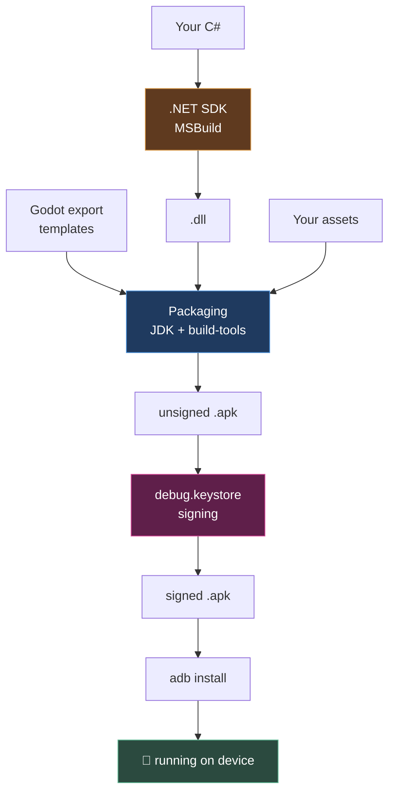

# Chapter 0.4 — JDK, Android SDK, and the Debug Keystore

🪜 **Scaffolding: 90 / 10.**

---

## 🎯 Goal

By the end, `adb version` works, Godot knows where every Android tool lives, and a debug keystore exists — the three things standing between you and an APK.

---

## 🏃 Fast-Track Summary

```bash
sudo apt install -y openjdk-17-jdk && java -version
mkdir -p ~/android-sdk/cmdline-tools
unzip ~/Downloads/commandlinetools-linux-*.zip -d ~/android-sdk/cmdline-tools
mv ~/android-sdk/cmdline-tools/cmdline-tools ~/android-sdk/cmdline-tools/latest   # ⚠️ the step everyone misses
export ANDROID_HOME=~/android-sdk
export PATH="$ANDROID_HOME/cmdline-tools/latest/bin:$ANDROID_HOME/platform-tools:$PATH"
sdkmanager "platform-tools" "build-tools;34.0.0" "platforms;android-34"
sdkmanager --licenses
keytool -keyalg RSA -genkeypair -alias androiddebugkey -keypass android \
  -keystore ~/android-sdk/debug.keystore -storepass android \
  -dname "CN=Android Debug,O=Android,C=US" -validity 9999 -deststoretype pkcs12
adb version
```

- ⚠️ **The `latest` rename is the failure everyone hits.** The zip extracts to `cmdline-tools/`; `sdkmanager` requires `cmdline-tools/latest/`.
- Command-line tools only (~1 GB). **Not** Android Studio (~8 GB) — you are on Linux and will never open the IDE ([D-001](../meta/Doubts.md#d-001)).
- Point Godot at all four paths in `Editor → Editor Settings → Export → Android`.
- Debug keystore credentials are deliberately public: `androiddebugkey` / `android`. **The release keystore in [11.13](../TableOfContents.md) is not, and losing it is unrecoverable.**
- Commit: `ch 0.4: android toolchain + debug keystore`

---

## 🧭 Before you start

| You need | Why |
|---|---|
| [0.2](Chapter_00.02_GodotAndDotNet.md) done | Godot must exist to configure |
| A **data** cable, verified in [0.1](Chapter_00.01_MachinesAndTheirRoles.md) | Not needed today; needed in [0.5](../TableOfContents.md) |
| ~2 GB disk | JDK ~300 MB, SDK ~1 GB |

> 📎 **The always-current reference:** <https://docs.godotengine.org/en/stable/tutorials/export/exporting_for_android.html>. Where it and this chapter disagree, **it wins** — and log the difference in [`Machines.md`](../meta/Machines.md).

---

## 🔨 Build

### Step 1 — Install the JDK

```bash
sudo apt update
sudo apt install -y openjdk-17-jdk
java -version
javac -version
```

You want **17.x** from both. `[UNVERIFIED]` — exact output format.

> 🐣 **Why Java at all, for a C# game?** Android's build tooling is written in Java. Godot compiles *your* code with .NET, then hands the result to Android's packaging tools, which need a JVM to run. You will never write a line of Java.

If you have several JDKs installed, check which one is active:

```bash
sudo update-alternatives --config java
```

### Step 2 — Download the command-line tools

Go to <https://developer.android.com/studio>, scroll past the big Android Studio button, and find **"Command line tools only"** near the bottom. Take the Linux `.zip`.

> ✅ **You are on Linux ([D-001](../meta/Doubts.md#d-001)), so this is your route.** Android Studio is ~8 GB and you would open it exactly once, to click through a wizard. The command-line tools are ~100 MB and do the same job.

### Step 3 — Extract it into the right shape ⚠️

This is the step that costs people an hour.

```bash
mkdir -p ~/android-sdk/cmdline-tools
unzip ~/Downloads/commandlinetools-linux-*.zip -d ~/android-sdk/cmdline-tools
ls ~/android-sdk/cmdline-tools
```

You now have `~/android-sdk/cmdline-tools/cmdline-tools/`. That is **wrong** — `sdkmanager` refuses to run from it. Rename:

```bash
mv ~/android-sdk/cmdline-tools/cmdline-tools ~/android-sdk/cmdline-tools/latest
ls ~/android-sdk/cmdline-tools/latest/bin
```

You should see `sdkmanager`, `avdmanager` and friends. The final, required layout is:

```text
~/android-sdk/
└── cmdline-tools/
    └── latest/          ← this directory name is mandatory
        ├── bin/
        └── lib/
```

> ⚠️ **Why `latest` specifically?** `sdkmanager` locates its own libraries by walking *up* from its own path and expecting `cmdline-tools/<version>/`. If it finds `cmdline-tools/bin` instead, it cannot resolve its classpath and fails with a Java error that names none of this. You will break it deliberately in a moment.

### Step 4 — Put the tools on your PATH

```bash
cat >> ~/.bashrc <<'EOF'

# Android SDK
export ANDROID_HOME="$HOME/android-sdk"
export PATH="$ANDROID_HOME/cmdline-tools/latest/bin:$ANDROID_HOME/platform-tools:$PATH"
EOF

source ~/.bashrc
echo "$ANDROID_HOME"
which sdkmanager
```

### Step 5 — Install the SDK packages

```bash
sdkmanager --list | head -30
sdkmanager "platform-tools" "build-tools;34.0.0" "platforms;android-34"
```

`[UNVERIFIED]` — **the API level and build-tools version your Godot release actually requires.** Check the official export page linked above and use what *it* says; `34` is a known-good starting point, not gospel. Paste what the page states into [`toAgent/`](../../toAgent/) and this marker clears.

Then accept the licences — non-interactive builds fail without this:

```bash
sdkmanager --licenses
```

Press `y` for each. Verify:

```bash
adb version
ls "$ANDROID_HOME/platforms"
ls "$ANDROID_HOME/build-tools"
```

### Step 6 — Create the debug keystore

Android refuses to install an unsigned package — **every** APK is signed, including your first throwaway build.

```bash
keytool -keyalg RSA -genkeypair -alias androiddebugkey -keypass android \
  -keystore "$ANDROID_HOME/debug.keystore" -storepass android \
  -dname "CN=Android Debug,O=Android,C=US" -validity 9999 -deststoretype pkcs12

ls -l "$ANDROID_HOME/debug.keystore"
keytool -list -keystore "$ANDROID_HOME/debug.keystore" -storepass android
```

> 🐣 **Reading that command:** `-alias` names the key inside the file · `-keystore` is the file · `-storepass`/`-keypass` are its passwords · `-dname` is the certificate's identity (nobody checks it for a debug key) · `-validity 9999` is days · `-deststoretype pkcs12` is the modern container format.

> 🚨 **These credentials are deliberately public.** `androiddebugkey` / `android` are the well-known development values, and that is fine — a debug keystore proves nothing and protects nothing. **The release keystore you create in [11.13](../TableOfContents.md) is the opposite.** Lose it and you can never publish an update to that Play listing again — not with a support ticket, not ever. Back it up in two places the day you make it.

### Step 7 — Tell Godot where everything is

Launch Godot, open your `Scratch` project, and go to `Editor → Editor Settings → Export → Android`:

| Setting | Value |
|---|---|
| **Java SDK Path** | `/usr/lib/jvm/java-17-openjdk-amd64` |
| **Android SDK Path** | `/home/<you>/android-sdk` |
| **Debug Keystore** | `/home/<you>/android-sdk/debug.keystore` |
| **Debug Keystore User** | `androiddebugkey` |
| **Debug Keystore Pass** | `android` |

Find your real JDK path with:

```bash
readlink -f "$(which javac)" | sed 's|/bin/javac||'
```

`[UNVERIFIED]` — the exact JVM path on your distribution.

### Step 8 — Record and commit

Add to [`docs/meta/Machines.md`](../meta/Machines.md): JDK version · build-tools version · platform API level · `adb version` · `ANDROID_HOME` path · keystore path.

```bash
git add docs/meta/Machines.md docs/guides/Setup_01_Prerequisites.md
git commit -m "ch 0.4: android toolchain + debug keystore"
git push
```

---

## ▶️ Run it

Every one of these must succeed:

```bash
java -version                        # 17.x
sdkmanager --version                 # a version, not a stack trace
adb version                          # Android Debug Bridge version ...
ls "$ANDROID_HOME/platforms"         # android-34
keytool -list -keystore "$ANDROID_HOME/debug.keystore" -storepass android
```

- [ ] All five commands succeed
- [ ] All five Godot Editor Settings fields filled
- [ ] Versions recorded in `Machines.md`

---

## 👀 Observe

Count what you just installed: a **JVM**, a **package manager**, a **platform SDK**, **build tools**, **platform-tools**, and a **certificate**. None of it is Godot. None of it is C#. None of it is your game.

That is the shape of mobile development, and it is why [ADR-005](../meta/Decisions.md#adr-005) puts a real APK on your phone in Module 0 rather than Module 11. Six independent things must agree before one cube appears on a screen — and debugging six things at once, while also debugging a game, is miserable.

---

## 🧠 Why it works

### The chain, and why every link is separate

```text
your C#  →  .NET SDK/MSBuild  →  a .dll
                                    ↓
Godot export templates  →  the engine, precompiled for Android
                                    ↓
JDK + build-tools  →  package everything into an .apk
                                    ↓
keystore  →  sign it
                                    ↓
adb  →  install it on a device
```

Each link is maintained by a different organisation, versions independently, and fails in its own dialect. **When a build breaks, identify which link failed before changing anything** — the habit chapter 2.2 formalises.

### Why Android insists on signatures

Every Android app is signed, and the signature is the app's *identity*. When you publish an update, Android checks that the new APK is signed with the same key as the installed one; a mismatch is refused as an impersonation attempt. That is the entire security model behind app updates.

Which is why a lost release key is unrecoverable: without it you cannot prove you are the same publisher, so there is no path to updating the listing. There is no override, because an override would defeat the mechanism.

> 🔬 **Deep dive — why `pkcs12` and not the old format.** Java's original `JKS` keystore format is proprietary and uses weak, dated cryptography. **PKCS#12** is an open standard with modern algorithms, and is now Java's default. `-deststoretype pkcs12` makes the choice explicit rather than relying on a default that has changed between JDK versions.

---

## 🗺️ Mental model



Six boxes, six ways to fail. Learn the shape now and every future failure has an address.

---

## 💥 Break it

Undo the step everyone misses, and watch what it does.

```bash
mv ~/android-sdk/cmdline-tools/latest ~/android-sdk/cmdline-tools/tools
~/android-sdk/cmdline-tools/tools/bin/sdkmanager --version
```

Then restore:

```bash
mv ~/android-sdk/cmdline-tools/tools ~/android-sdk/cmdline-tools/latest
sdkmanager --version
```

---

## 🔎 Diagnose

**What failed, and does the error message tell you the real cause? Answer before opening.**

<details>
<summary>Answer</summary>

`sdkmanager` fails with a Java error — typically a `ClassNotFoundException` or `NoClassDefFoundError` naming an internal Android class. `[UNVERIFIED]` — the exact text.

**The message does not mention directory names at all.** That is the lesson.

`sdkmanager` is a shell wrapper that builds a Java classpath from its own location, walking up from `bin/` and expecting `cmdline-tools/<something>/`. Renaming the directory breaks that assumption, and what surfaces is the *consequence* — Java cannot find a class — several layers below the *cause*.

**The general skill:** when an error names something you never wrote and have never heard of, you are looking at a symptom. Ask *"what did this tool assume about its environment?"* rather than searching for the class name.

Three failures in this chapter share that shape:

| Symptom | Actual cause |
|---|---|
| `sdkmanager` throws a Java class error | `cmdline-tools/latest/` is misnamed |
| `adb: command not found` | `platform-tools` not on `PATH`, or not installed |
| Export fails mentioning licences | `sdkmanager --licenses` never accepted |

</details>

---

## 🏋️ Practicals

**⭐ P1 — Verify against the official page.** Open the [Android export docs](https://docs.godotengine.org/en/stable/tutorials/export/exporting_for_android.html) and check the API level and build-tools version *your* Godot version requires. If it differs from `34`, install what it says and record both in `Machines.md`. **This clears an `[UNVERIFIED]` marker** — paste the requirement into [`toAgent/`](../../toAgent/).

**P2 — Inspect your own certificate.** Run `keytool -list -v -keystore "$ANDROID_HOME/debug.keystore" -storepass android`. Find the SHA-256 fingerprint. That string is how Android will recognise your builds.

**🔬 P3 — Write a doctor script.** Make `~/bin/android-doctor.sh` that checks all five verification commands and prints ✅/❌ per line. You will run it every time something mysterious breaks. This is the first tool you build for yourself in this course.

---

## ✅ Check yourself

1. Why does a C# game need a JDK?
2. Why must the command-line tools live in `cmdline-tools/latest/`?
3. What is a debug keystore for, and why are its passwords public?
4. What happens if you lose your **release** keystore, and what is the recovery procedure?
5. Name the six independent tools between your C# and an app running on the phone.

<details>
<summary>Answers</summary>

1. Android's **packaging and build tooling is written in Java**. Godot compiles your C# with .NET, then hands the result to Android's tools, which need a JVM. You never write Java.
2. `sdkmanager` builds its Java classpath by walking up from its own location and expecting `cmdline-tools/<version>/`. A different directory name breaks classpath resolution, and the resulting error names a missing Java class rather than the directory — symptom, not cause.
3. It **signs development builds**, because Android refuses to install unsigned packages. The credentials are public because a debug key proves and protects nothing; it exists only to satisfy the requirement.
4. **You can never publish an update to that Play listing again.** Android identifies an app by its signing key; without it you cannot prove you are the same publisher. **There is no recovery procedure** — no support ticket, no override — because an override would defeat the mechanism. Back it up in two places on the day you create it.
5. Godot editor → .NET SDK/MSBuild → Godot export templates → JDK → Android build-tools → adb/platform-tools. (The keystore is a seventh piece, though it is a file rather than a tool.)

</details>

---

## 📎 Cheat sheet

| Command | Purpose |
|---|---|
| `java -version` | JDK present and active (want 17.x) |
| `sdkmanager --list` | What is available and installed |
| `sdkmanager "platforms;android-34"` | Install a package |
| `sdkmanager --licenses` | **Required** — builds fail silently without it |
| `adb version` | platform-tools installed and on PATH |
| `keytool -list -keystore <file> -storepass android` | Inspect a keystore |
| `readlink -f "$(which javac)" \| sed 's\|/bin/javac\|\|'` | Find the JDK path for Godot |

| Path | Must be |
|---|---|
| `$ANDROID_HOME` | `~/android-sdk` |
| Command-line tools | `$ANDROID_HOME/cmdline-tools/**latest**/bin` |
| adb | `$ANDROID_HOME/platform-tools/adb` |

---

## 🔗 Further reading

- [Exporting for Android](https://docs.godotengine.org/en/stable/tutorials/export/exporting_for_android.html) — **the authoritative page**
- [Setup 04](../guides/Setup_04_Android_And_Device.md) — the reference version, including the `udev` rule you need next chapter
- [ADR-005](../meta/Decisions.md#adr-005) — why the device comes first

---

## 💾 Commit

```text
ch 0.4: android toolchain + debug keystore
```

---

## ➡️ What's next

**[0.5 — Connecting your phone: USB debugging, `adb devices`, wireless debugging](../TableOfContents.md).** Every tool is installed. Next you make the desktop and the phone see each other — including the `udev` rule that Linux needs and nobody tells you about.

---

## 🪞 Reflection

In two sentences: **why is an app's signing key its identity, and what follows from that when you lose one?**

---

## 📝 Chapter changelog

| Version | Date | Change |
|---|---|---|
| 1.0 | 2026-09-02 | First published. `[UNVERIFIED]` on API level, build-tools version, JVM path and error text. |
