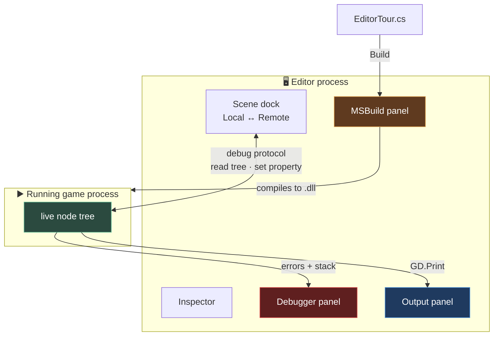

# Chapter 0.6 — The Godot Editor

🪜 **Scaffolding: 90 / 10.**

---

## 🎯 Goal

By the end you will have built a small interactive scene that **forces you to use every dock in the editor for a real purpose** — and you will have changed a running game's values live, which is the single most useful editor feature nobody tells beginners about.

---

## 🏃 Fast-Track Summary

*Path C: read this and the cheat sheet, do ⭐ P1 and ⭐ P2, move on.*

- This is **not a tour**. You build a cube that spins, a button that stops it, and a deliberate crash you read in the debugger.
- **Prerequisite:** the `Scratch` project from [0.2](Chapter_00.02_GodotAndDotNet.md), containing `testcube.glb` from [0.3](Chapter_00.03_Blender.md). If you skipped 0.3, add any `MeshInstance3D` with a `BoxMesh` instead.
- **Three panels, three failure types** — the distinction that saves the most time:

  | Panel | Catches |
  |---|---|
  | **MSBuild** | C# that did not compile. Nothing runs |
  | **Debugger** | Runtime errors — a stack trace and the offending line |
  | **Output** | `GD.Print`, engine warnings, your own logging |

- ⭐ **Remote scene tree:** while the game runs, the Scene dock gains **Remote**/**Local** buttons. Click **Remote**, select a node, and **edit its properties live in the running game**.
- Key bindings: `F5` run project · `F6` run current scene · `F8` stop · `F1` search help · `Ctrl+S` save · `Q W E R` select/move/rotate/scale.
- Break it: `GetNode<Label>("NoSuchNode")` in `_Ready`, then read the **Debugger** stack trace.
- Commit: `ch 0.6: editor tour by building something`

---

## 🧭 Before you start

| You need | From |
|---|---|
| The `Scratch` project | [0.2](Chapter_00.02_GodotAndDotNet.md) |
| `testcube.glb` in it | [0.3](Chapter_00.03_Blender.md) — or substitute a `BoxMesh` |
| C# building successfully | [0.2](Chapter_00.02_GodotAndDotNet.md) Step 7 |

> 📌 **Every menu path and panel name below is `[UNVERIFIED]`** — I cannot run the editor ([ADR-016](../meta/Decisions.md#adr-016)), and Godot's UI moves between versions. You are on `4.7.2.stable.mono`. Where a name differs, note it in [`toAgent/`](../../toAgent/) and I will correct the chapter.

---

## 🔨 Build

### Step 1 — A scene worth looking at

Open `Scratch`. `Scene → New Scene`, then in the Scene dock choose **3D Scene** — you get a `Node3D` root. Rename it `EditorTour` *(double-click the name, or `F2`)*.

Now add children. **`Ctrl+A`** opens Add Node; type to filter.

| Add | Then |
|---|---|
| `Camera3D` | Position `(0, 2, 5)`, Rotation X `-15°` |
| `DirectionalLight3D` | Rotation `(-45, -35, 0)` |
| Your `testcube.glb` | **Drag it from the FileSystem dock into the viewport** |

Save: `Ctrl+S` → `res://EditorTour.tscn`.

> 🐣 **Dock names.** The panel listing your nodes is the **Scene dock** (top left). The panel listing your files is the **FileSystem dock** (bottom left). The one showing a selected node's properties is the **Inspector** (right). Those three are where you will spend most of your life.

### Step 2 — The Inspector, used for something

Select the camera. In the **Inspector**, find **Fov** under `Camera3D`. Drag it from `75` down to `40` and back. Watch the viewport.

Now the useful part — **the Inspector's search box**. Type `fov` into **Filter Properties** at the top. Everything else disappears.

> 💡 **A `Camera3D` has over sixty properties across its inherited classes.** Scrolling for one is a waste of time; the filter is how you actually use the Inspector. Learn this now rather than in Module 6 when you are hunting a shader parameter.

Set Fov back to `75`.

### Step 3 — A script, and the Output panel

Select the root `EditorTour`. Click **Attach Script** *(the scroll-with-a-`+` icon in the Scene dock toolbar)*. Language **C#**, path `res://EditorTour.cs`. Create.

```csharp
using Godot;

public partial class EditorTour : Node3D
{
    [Export] public float DegreesPerSecond { get; set; } = 60f;
    [Export] public bool Spinning { get; set; } = true;

    private Node3D _cube;

    public override void _Ready()
    {
        _cube = GetNode<Node3D>("testcube");
        GD.Print($"EditorTour ready. Spinning at {DegreesPerSecond}°/s.");
    }

    public override void _Process(double delta)
    {
        if (Spinning)
            _cube.RotateY(Mathf.DegToRad(DegreesPerSecond) * (float)delta);
    }
}
```

⚠️ **`GetNode<Node3D>("testcube")` must match your node's name exactly.** Check the Scene dock. If yours is called something else, change the string.

Press **Build** *(hammer, top right)*, then **F6** — *run the current scene*, as distinct from `F5` which runs the project's main scene.

The cube spins, and the **Output** panel at the bottom prints your line.

### Step 4 — A button, and the Node dock's Signals tab ⭐

This is the dock people never find.

1. Add a `CanvasLayer` to the root. *(UI must live under a `CanvasLayer` to stay put while the 3D camera moves.)*
2. Under it, add a `Button`. In the Inspector set **Text** to `Toggle spin`.
3. Position it: in the viewport toolbar choose **Layout → Top Left**, then nudge it inward.

Now connect it **without writing a path**:

4. With the `Button` selected, open the **Node dock** — it shares the right-hand panel with the Inspector; look for a **Node** tab next to **Inspector**.
5. You are on the **Signals** list. Find **`pressed()`** at the top.
6. **Double-click `pressed()`.** A dialog opens.
7. Set the receiver to your root `EditorTour` node. The method name defaults to `_on_button_pressed` — **change it to `OnTogglePressed`** to match C# convention.
8. Click **Connect**.

Godot writes a stub into `EditorTour.cs`. Fill it in:

```csharp
    private void OnTogglePressed()
    {
        Spinning = !Spinning;
        GD.Print($"Spinning is now {Spinning}.");
    }
```

Build, `F6`, click the button. The cube stops and starts, and Output narrates it.

> 💡 **Look at the `Button` in the Scene dock now** — it has a small green "connected" icon. Signals are visible in the editor, which is why they are preferred over hunting through code for who calls what.

### Step 5 — ⭐ The Remote scene tree: edit a running game

**This is the most valuable thing in the chapter.**

1. Run the scene (`F6`) and **leave it running**.
2. Look at the top of the **Scene dock**. Two buttons have appeared: **Remote** and **Local**.
3. Click **Remote**. The tree now shows the **live, running game's** nodes rather than your saved scene.
4. Select `EditorTour` in that remote tree.
5. In the Inspector, change **Degrees Per Second** to `500`.

**The running game changes immediately.**

6. Try `-200`. Try `0`. Untick **Spinning**.

> 🚨 **Remote edits are not saved.** Stop the game and your scene is exactly as you left it. This is a *tuning* tool, not an editing tool — and that is precisely what makes it safe to experiment with.

> 💡 **Why this matters for the rest of the course.** From Module 2 onward you will tune jump heights, camera damping, shader parameters and enemy timings. Doing that by edit → build → run → judge → repeat is agonising. Doing it live, **while playing**, with the value under your finger, is how game feel actually gets found. You will use this in almost every chapter.

Press `F8` to stop.

### Step 6 — Three panels, three kinds of failure

Now deliberately produce each kind, one at a time. **Note which panel reports it.**

**A — a compile error.** In `EditorTour.cs`, delete the semicolon after `Spinning = !Spinning`. Press **Build**.

**B — a runtime error.** Restore the semicolon. Change `_Ready` to:

```csharp
    public override void _Ready()
    {
        _cube = GetNode<Node3D>("testcube");
        var missing = GetNode<Label>("NoSuchNode");   // ← this node does not exist
        GD.Print("You will never see this.");
    }
```

Build (it compiles fine), then `F6`.

**C — a print.** Restore `_Ready`. Build and run. Watch Output.

Note where each appeared before reading Diagnose.

### Step 7 — Two shortcuts you will use every day

- **`F1`** — Search Help. Type `RotateY`. You get the class reference **inside the editor**, for the C# API, offline. Faster than a browser and always matches your version.
- **`Ctrl+Shift+F`** — Find in Files. Search your whole project's text.

Try both now.

### Step 8 — Commit

```bash
git add .
git commit -m "ch 0.6: editor tour by building something"
git push
```

---

## ▶️ Run it

- [ ] The cube spins when you press `F6`
- [ ] The button toggles it, and Output narrates each press
- [ ] **Remote** scene tree changes `DegreesPerSecond` in the *running* game
- [ ] You produced a compile error, a runtime error and a print, and know which panel showed each
- [ ] `F1` finds `RotateY` in the built-in docs

---

## 👀 Observe

You just used seven parts of the editor and never read a tour: Scene dock, FileSystem dock, Inspector (with its filter), Node dock's Signals tab, Output, Debugger, MSBuild — plus the remote tree.

Notice which one surprised you. For most people it is the **Remote** tree, because nothing in the interface advertises it: two small buttons that only exist while the game runs.

Notice too that the button needed **no path string**. You double-clicked a signal and picked a node. Compare that with `GetNode<Node3D>("testcube")` in your `_Ready` — a string that breaks silently if anyone renames the node. Chapter [1.26](../TableOfContents.md) is about that difference.

---

## 🧠 Why it works

### Three panels because there are three moments a thing can fail

| Panel | Moment | Example |
|---|---|---|
| **MSBuild** | Compile time | Missing semicolon, wrong type, missing `using` |
| **Debugger** | Run time | Null node, index out of range, divide by zero |
| **Output** | Any time | `GD.Print`, engine warnings, shader compile notices |

This is not arbitrary UI design — it maps onto **when** the failure happened, which is the first thing you need to know.

**A C# specific worth internalising:** GDScript users only ever see two of these. Your code passes through a **compiler** first, so you have an extra panel and an extra failure stage. When something "does not work", *the panel that speaks tells you which stage you are in*, and that alone eliminates most of the search space.

> 🔬 **Deep dive — why the Debugger shows a stack trace and Output does not.** When an error is thrown, the engine can walk the call stack and report every frame that led there. `GD.Print` has no such context — it is one line of text with no idea how it was reached. That is why a stack trace is worth far more than a print, and why chapter [2.2](../TableOfContents.md) is about breakpoints rather than more printing.

### Why the remote tree can exist at all

Godot's editor and your running game are **separate processes**, connected by a debug protocol over a local socket. The editor asks the game for its node tree; the game answers; you change a property and the editor sends a *set-property* message.

That architecture explains both halves of its behaviour: it works at all because there is a live channel, and **edits do not persist** because you are talking to the game's memory, not to the `.tscn` file on disk.

---

## 🗺️ Mental model



---

## 💥 Break it

You already produced all three failures in Step 6. Now make a fourth, which behaves differently from all of them:

Rename the `testcube` node in the Scene dock to `cube`. **Do not change the script.** Build and run.

---

## 🔎 Diagnose

**Which panel reported each of the four, and why did the last one behave differently from a compile error? Answer before opening.**

<details>
<summary>Answer</summary>

| Failure | Panel | Stage |
|---|---|---|
| A — missing semicolon | **MSBuild** | Compile. Nothing ran at all |
| B — `GetNode<Label>("NoSuchNode")` | **Debugger**, with a stack trace | Runtime |
| C — `GD.Print` | **Output** | Runtime, not an error |
| D — renamed node | **Debugger** | Runtime |

**Why D is the interesting one.** `GetNode<Node3D>("testcube")` is a **string**. The compiler has no idea whether a node called `testcube` exists — that is a runtime question about a scene file, not a compile-time question about types. So the build succeeds cleanly and the failure arrives later, at `_Ready`.

**That is the whole cost of path-based node access**, and it is why:

- The button's signal was connected through the **editor** rather than by writing a path — rename the button and the connection follows it.
- Chapter [1.26](../TableOfContents.md) covers `[Export] NodePath` and groups, which move this failure from runtime back toward edit time.
- [ADR-031](../meta/Decisions.md#adr-031) prefers C#-native libraries: every `Call("some_method")` into a GDScript addon is exactly this same trade, made again.

**The transferable habit:** when something fails, **ask which panel spoke before you ask what is wrong.** MSBuild means you never ran. Debugger means you ran and hit a wall — and there is a stack trace naming the line. Silence in all three, with wrong behaviour, means your logic is wrong and nothing is broken, which is a fourth and quite different situation.

</details>

---

## 🏋️ Practicals

**⭐ P1 — Tune something live.** Run the scene, switch to **Remote**, and find a `DegreesPerSecond` that looks good rather than one that sounds good. Then stop, set that value in the **Local** tree, and save. Note how much faster that was than edit → build → run.

**⭐ P2 — Connect a second signal.** Add a `HSlider` under the `CanvasLayer`. Connect its `value_changed` signal to a new method that sets `DegreesPerSecond`. Set the slider's **Min** `0`, **Max** `720`, **Value** `60`. Now you are tuning while playing, with a slider.

**P3 — Read the docs in-editor.** With `F1`, find `Node3D.RotateY` and read what units it takes. Then find `Mathf.DegToRad` and explain to yourself why the script needs it.

**🔬 P4 — Find three panels you have not opened.** The bottom bar has more tabs than you have used. Open **Audio**, **Animation** and **Shader Editor**. You need none of them today; you will need all three by Module 6.

---

## ✅ Check yourself

1. Name the three panels that report failures, and which stage each corresponds to.
2. What does the **Remote** scene tree let you do, and why do the changes not persist?
3. Why did renaming a node produce a *runtime* error rather than a compile error?
4. Why must a `Button` live under a `CanvasLayer` in a 3D scene?
5. What does `F6` do that `F5` does not?

<details>
<summary>Answers</summary>

1. **MSBuild** — compile time; your code never ran. **Debugger** — runtime errors, with a stack trace naming the line. **Output** — `GD.Print` and engine warnings, at any time. Asking *which panel spoke* eliminates most of the search space before you read a single word of the message.
2. It shows the **live running game's** node tree and lets you edit properties **while it plays** — invaluable for tuning feel. Changes do not persist because the editor and the game are **separate processes**, and you are modifying the game's memory over a debug socket, not the `.tscn` on disk.
3. Because `GetNode<Node3D>("testcube")` takes a **string**. Whether a node of that name exists is a question about a scene file at runtime, not about types at compile time. The compiler cannot check it, so the failure is deferred to `_Ready`.
4. A `CanvasLayer` draws in **screen space**, independent of the 3D camera. Without it the button would be positioned in the 3D world and would move, scale and disappear as the camera moves.
5. `F6` runs the **currently open scene**. `F5` runs the **project's main scene**, whatever that is set to. While building one scene, `F6` saves you from setting and unsetting the main scene constantly.

</details>

---

## 📎 Cheat sheet

| Key | Does |
|---|---|
| `F5` / `F6` / `F8` | Run project · run current scene · stop |
| `F1` | **Search Help** — class reference, offline, C# signatures |
| `Ctrl+Shift+F` | Find in Files |
| `Ctrl+A` | Add Node |
| `Ctrl+S` | Save scene |
| `F2` | Rename selected node |
| `Q` `W` `E` `R` | Select · Move · Rotate · Scale gizmo |

| Dock | For |
|---|---|
| **Scene** | The node tree. **Local ↔ Remote toggle appears while running** |
| **FileSystem** | Project files. Drag assets into the viewport from here |
| **Inspector** | Properties of the selected node. **Use Filter Properties** |
| **Node → Signals** | Connect events without writing paths |
| **Import** | Per-file import settings (Module 3) |

| Panel | Reports |
|---|---|
| **MSBuild** | C# compile errors — nothing ran |
| **Debugger** | Runtime errors, with a stack trace |
| **Output** | `GD.Print`, warnings |

---

## 🔗 Further reading

- [Godot editor introduction](https://docs.godotengine.org/en/stable/getting_started/introduction/index.html)
- [Using signals](https://docs.godotengine.org/en/stable/getting_started/step_by_step/signals.html)
- [Debugger panel](https://docs.godotengine.org/en/stable/tutorials/scripting/debug/debugger_panel.html)
- [ADR-031](../meta/Decisions.md#adr-031) — why path strings and `Call()` share a weakness

---

## 💾 Commit

```text
ch 0.6: editor tour by building something
```

---

## ➡️ What's next

**[0.7 — Git for game projects: the Godot `.gitignore`, Git LFS, first commit](Chapter_00.07_GitForGameProjects.md).** You have made files worth keeping. Next you learn which of them belong in version control — and prove it, rather than trusting a `.gitignore` someone handed you.

---

## 🪞 Reflection

In two sentences: **why are there three failure panels rather than one, and what does knowing which one spoke buy you?**

---

## 📝 Chapter changelog

| Version | Date | Change |
|---|---|---|
| 1.0 | 2026-09-02 | First published. All menu paths, dock names and panel names `[UNVERIFIED]` — GUI procedures are unverifiable from the authoring environment ([D-014](../meta/Doubts.md#d-014)). |
