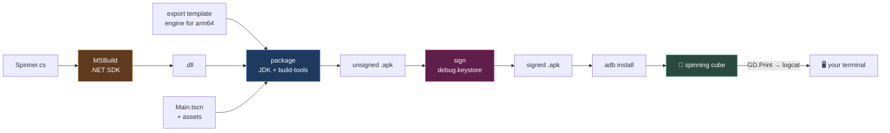

# Chapter 0.8 — Project 00: Hello Phone ⭐

🪜 **Scaffolding: 90 / 10.**

> 🏆 **This is the Module 0 milestone.** Everything in chapters 0.1–0.7 existed to make this chapter possible.

---

## 🎯 Goal

By the end, **an app you built is installed and running on your own phone** — signed, deployed, and printing to a log you can read from your desk.

---

## 🏃 Fast-Track Summary

*Path C: read this and the cheat sheet, do the whole Build — there is no shortcut through a milestone.*

- **New project** at `projects/P00_HelloPhone/` inside this course repo. Renderer **Mobile** ([ADR-010](../meta/Decisions.md#adr-010)).
- Scene: `Node3D` root `Main` · `MeshInstance3D` with a `BoxMesh` · `Camera3D` at `(0,2,4)` · `DirectionalLight3D`.
- `Spinner.cs` on the box — `RotateY(Mathf.DegToRad(DegreesPerSecond) * (float)delta)` in `_Process`.
- **Build** (hammer) → `F5` on desktop first. **Never debug two layers at once.**
- `Project → Project Settings → Application → Run → Main Scene` = your scene.
- `Project → Export… → Add… → Android`. Set **Unique Name** `com.<you>.hellophone` — must contain a dot, no segment starting with a digit.
- Architectures: keep **`arm64-v8a`**, turn the rest off. Smaller APK, and every modern phone is arm64.
- With the phone connected, press the **one-click deploy** button (phone icon, top right).
- Watch it: `adb logcat --pid=$(adb shell pidof -s com.<you>.hellophone)`.
- ⭐ Then **break it three ways** — missing keystore, missing templates, bad package name — and record the exact errors in [`Troubleshooting.md`](../reference/Troubleshooting.md).
- Commit: `P00: hello phone — spinning cube on device`

---

## 🧭 Before you start

Run this checklist. **If any line fails, fix it before continuing** — this chapter is where six tools must cooperate, and a milestone is a bad place to discover one of them is broken.

```bash
godot --version          # 0.2 — the .NET/mono build
dotnet --list-sdks       # 0.2 — at least one SDK
java -version            # 0.4 — 17.x
adb devices              # 0.5 — your phone, state "device"
git --version            # 0.7
```

Plus, in Godot: `Editor → Manage Export Templates` shows templates installed for **your exact version** ([0.2](Chapter_00.02_GodotAndDotNet.md)), and `Editor → Editor Settings → Export → Android` has all four fields filled ([0.4](Chapter_00.04_AndroidToolchain.md)).

---

## 🔨 Build

### Step 1 — Create the project in the right place

```bash
cd ~/godot-zero-to-hero                  # 🐧
```
```powershell
cd $env:USERPROFILE\godot-zero-to-hero   # 🪟
```

In Godot's Project Manager: **New Project**.

| Field | Value |
|---|---|
| Project Name | `P00 Hello Phone` |
| Project Path | `<course repo>/projects/P00_HelloPhone` |
| Renderer | **Mobile** |
| Version Control | None *(the course repo already has git)* |

> 📱 **Mobile, from the first project.** You ship on it, so you develop on it ([ADR-010](../meta/Decisions.md#adr-010)). Starting on Forward+ and "switching later" manufactures a migration that finds problems late. Chapter [5.13](../TableOfContents.md) prices the alternatives; it is a comparison, not a port.

### Step 2 — The scene

`Scene → New Scene` → **3D Scene**. Rename the root to `Main` (`F2`).

Add children with `Ctrl+A`:

| Node | Settings |
|---|---|
| `MeshInstance3D` | Rename `Cube`. Inspector → **Mesh** → **New BoxMesh** |
| `Camera3D` | Position `(0, 2, 4)`, Rotation X `-25°` |
| `DirectionalLight3D` | Rotation `(-50, -35, 0)` |

Save as `res://Main.tscn` (`Ctrl+S`).

### Step 3 — The script

Select `Cube` → **Attach Script** → C# → `res://Spinner.cs`.

```csharp
using Godot;

public partial class Spinner : Node3D
{
    [Export] public float DegreesPerSecond { get; set; } = 90f;

    public override void _Ready()
    {
        GD.Print($"Hello Phone — running on {OS.GetName()}, {Engine.GetVersionInfo()["string"]}");
        GD.Print($"Spinning at {DegreesPerSecond}°/s.");
    }

    public override void _Process(double delta)
    {
        RotateY(Mathf.DegToRad(DegreesPerSecond) * (float)delta);
    }
}
```

> 💡 **`OS.GetName()` earns its place.** On the desktop it prints `Windows` or `Linux`; on the phone, `Android`. **That one line is your proof the code is running where you think it is** — which matters more than it sounds when a deploy silently fails and you are looking at yesterday's build.

Press **Build** (hammer).

### Step 4 — Desktop first, always

`Project → Project Settings → Application → Run → Main Scene` → select `res://Main.tscn`.

Press **F5**. The cube spins; Output prints two lines including `Windows` or `Linux`.

> 🚨 **Do not skip this.** If the desktop run fails, the problem is your code. If the desktop run works and the phone does not, the problem is the export chain. **Debugging both at once is the single most avoidable way to lose an evening**, and it is the habit chapter [2.2](../TableOfContents.md) formalises.

### Step 5 — The export preset

`Project → Export…` → **Add…** → **Android**.

| Section | Field | Value |
|---|---|---|
| Options → **Package** | **Unique Name** | `com.<yourname>.hellophone` |
| Options → **Package** | Name | `Hello Phone` |
| Options → **Architectures** | `arm64-v8a` | ✅ **on** |
| Options → **Architectures** | `armeabi-v7a`, `x86_64`, `x86` | ❌ off |

> ⚠️ **The Unique Name has rules.** It must contain **at least one dot**, no segment may **start with a digit**, and no segment may be a Java reserved word. `hellophone` fails. `com.1games.test` fails. `com.tyrostir.hellophone` is fine. Godot refuses to export and tells you — you will trigger this deliberately in Break it.

> 💡 **Why turn architectures off.** Each one adds a full copy of the engine to your APK. **Every phone made in the last several years is `arm64-v8a`**, so the rest are dead weight. You will measure exactly how much in [P1](#-practicals).

Look at the bottom of the export dialog. If there is a red message about missing export templates, go back to [0.2](Chapter_00.02_GodotAndDotNet.md) Step 5.

`[UNVERIFIED]` — the exact export-dialog layout in Godot 4.7.2, and whether a C#/.NET Android export requires any additional option to be set. If you see a message mentioning .NET, Gradle or a missing runtime, **paste it into [`toAgent/`](../../toAgent/)** — that is the highest-value verification in this module.

### Step 6 — Deploy ⭐

1. Confirm the phone is there: `adb devices` → state `device`.
2. In Godot, look at the **top-right toolbar**. With a device connected, a **phone-shaped one-click deploy** button appears.
3. Press it.

Godot builds, packages, signs and installs. Watch the bottom panel for progress.

**The cube spins on your phone.** 🎉

<details>
<summary>If the one-click button is missing or greyed out</summary>

Export manually instead — slower, but it shows you every stage:

```bash
# from the project folder
godot --headless --export-debug "Android" ./build/hellophone.apk
adb install -r ./build/hellophone.apk
adb shell monkey -p com.<you>.hellophone -c android.intent.category.LAUNCHER 1
```

`[UNVERIFIED]` — exact CLI flags for your version; check `godot --help`.

If the button is absent, the usual causes are: no device in `adb devices`, an incomplete export preset, or Editor Settings → Export → Android missing a path.

</details>

### Step 7 — Read it from your desk

```bash
adb logcat -c
adb logcat --pid=$(adb shell pidof -s com.<you>.hellophone)          # 🐧
```
```powershell
$appPid = (adb shell pidof -s com.<you>.hellophone).Trim()
adb logcat --pid=$appPid                                              # 🪟
```

You should see your two `GD.Print` lines — and the first should say **`Android`**.

> 🚨 **That word is the whole milestone.** Your C#, compiled on your desktop, is executing on your phone and reporting back. Every remaining chapter in this course builds on that loop.

### Step 8 — Prove it is really yours

On the phone: `Settings → Apps` → find **Hello Phone**. It has your package name. Uninstall and redeploy to confirm the whole cycle.

Then change `DegreesPerSecond` to `360` in the Inspector, redeploy, and confirm the phone shows the change.

### Step 9 — Commit

```bash
cd ~/godot-zero-to-hero
git status --short          # check .godot/, bin/, obj/ are absent — 0.7 earned this
git add projects/P00_HelloPhone
git commit -m "P00: hello phone — spinning cube on device"
git push
```

---

## ▶️ Run it — P00 done-criteria

From [`projects/README.md`](../../projects/README.md). **Every box on the actual device, not in the editor.**

- [ ] The **Build** button succeeds with no errors
- [ ] It runs on the desktop with `F5`
- [ ] `adb devices` lists your phone
- [ ] **The APK installs and the cube spins on the phone**
- [ ] `logcat` shows `OS.GetName()` returning **`Android`**
- [ ] You changed `DegreesPerSecond` in the Inspector and saw it take effect on the phone
- [ ] `git log` shows the commit

---

## 👀 Observe

Count what just cooperated: Godot editor · .NET SDK and MSBuild · Godot export templates · JDK · Android build-tools · your debug keystore · adb · your phone's USB or Wi-Fi stack. **Eight things**, each maintained by a different organisation, each versioning independently.

Note the total time from pressing deploy to seeing the cube. Write it in [`Journal.md`](../meta/Journal.md). **That number is your iteration cost**, and you will pay it thousands of times — which is why chapter [0.5](Chapter_00.05_ConnectingYourPhone.md) pushed you to set up wireless deployment.

---

## 🧠 Why it works

### The chain, now that you have run it

```text
Spinner.cs
  → MSBuild (.NET SDK) → Spinner.dll
      → Godot export template (the engine, precompiled for arm64 Android)
          → aapt2 + zipalign (Android build-tools) → unsigned .apk
              → apksigner + debug.keystore → signed .apk
                  → adb install → running on device
```

**Every stage can fail independently, and each has its own dialect of error message.** That is why [ADR-005](../meta/Decisions.md#adr-005) put this chapter at the start of the course rather than the end: with one cube and no game logic, any failure is *definitely* the pipeline. From here on, when something breaks, you know the chain works — so it is your code.

### Why `arm64-v8a` alone is the right default

An APK contains a full copy of the engine **per architecture**. Ticking four boxes ships four engines to a phone that can use one.

`arm64-v8a` covers essentially every Android phone sold in recent years. `armeabi-v7a` is 32-bit ARM — genuinely old devices. `x86`/`x86_64` are emulators and a handful of Chromebooks. Chapter [11.15](../TableOfContents.md) revisits this when app size becomes a shipping concern; the habit starts now.

> 🔬 **Deep dive — why the debug keystore's password is public.** Signing proves *continuity of publisher*, not identity: Android checks that an update is signed with the same key as the installed app. A debug key is never used for an update anyone depends on, so its secrecy buys nothing, and shared well-known credentials make tooling simpler. **Your release key in [11.13](../TableOfContents.md) is the opposite** — it *is* the identity of a published app, and losing it means that listing can never be updated again.

---

## 🗺️ Mental model



---

## 💥 Break it — ⭐ exercise C0.1

**This is not optional.** You are about to meet the three most common Android export failures under controlled conditions, while you know everything else works. Later, in the middle of real work, you will recognise them instantly.

Do each **one at a time**, restoring before the next. **Record the exact error text** for each.

1. **Missing keystore.** Rename `debug.keystore` to `debug.keystore.bak`. Deploy.
2. **Missing templates.** `Editor → Manage Export Templates → Uninstall`. Deploy. *(Reinstalling is a ~1 GB download — do this one last if your connection is slow.)*
3. **Invalid package name.** Set Unique Name to `hellophone` — no dot. Try to export.

---

## 🔎 Diagnose

**For each: at which stage of the chain did it fail, and did the message name the real cause? Answer before opening.**

<details>
<summary>Answer</summary>

| # | Stage | Message names the cause? |
|---|---|---|
| 1 Keystore | **Signing** — after packaging succeeded | ⚠️ Usually, but sometimes as a Java/apksigner error about an unreadable file |
| 2 Templates | **Packaging** — before anything was built | ✅ Yes, and it names the version it wanted |
| 3 Package name | **Validation** — before any work started | ✅ Yes, immediately, in the dialog |

`[UNVERIFIED]` — the exact wording of all three. **Record what you actually see in [`Troubleshooting.md`](../reference/Troubleshooting.md)** — that file becomes searchable when one of these recurs in eight months, and these three are the ones that will.

**The transferable insight is the ordering.** The three failures happen at three different points, and *how far the process got* tells you where to look before you read a word:

- **Fails instantly, in the dialog** → validation. Something about your *settings* is wrong.
- **Fails after a pause but before packaging** → a missing *prerequisite*: templates, SDK, JDK.
- **Fails after packaging, near the end** → *signing* or *installation*: keystore, device, permissions.

This is the same skill as chapter [0.6](Chapter_00.06_TheGodotEditor.md)'s "which panel spoke", applied to a longer pipeline. **Ask how far it got before asking what went wrong.**

</details>

---

## 🏋️ Practicals

**⭐ P1 — Measure your APK.** Note the file size with only `arm64-v8a`. Now tick `armeabi-v7a` too, export, and compare. Record both in [`Machines.md`](../meta/Machines.md). You have just measured what an architecture costs, and you will care about it in [11.15](../TableOfContents.md).

**⭐ P2 — Record the three failures.** Write all three exact error messages into [`Troubleshooting.md`](../reference/Troubleshooting.md), each with its cause and fix. This is [T-010](../meta/ToDos.md).

**P3 — Time the loop.** Time a full change → deploy → see-it-on-device cycle. Do it over USB and over Wi-Fi. Write both numbers in [`Journal.md`](../meta/Journal.md). If the number is unpleasant, fix the *process*, not your typing speed.

**🔬 P4 — Look inside the APK.** An `.apk` is a zip. `unzip -l hellophone.apk` (🐧) or `Expand-Archive` (🪟). Find `lib/arm64-v8a/`. That is the engine. Find your `.dll`. That is your code.

---

## ✅ Check yourself

1. Name the eight independent tools that had to cooperate for the cube to appear.
2. Why run on the desktop before deploying, every time?
3. What does `OS.GetName()` printing `Android` prove that a spinning cube does not?
4. Why ship only `arm64-v8a`, and what does adding one more cost?
5. Three export failures happen at three different points. What does *how far it got* tell you?

<details>
<summary>Answers</summary>

1. Godot editor · .NET SDK/MSBuild · Godot export templates · JDK · Android build-tools · the debug keystore · adb · the phone's USB/Wi-Fi stack. Each versions independently and fails in its own dialect.
2. Because it **separates two classes of failure**. Desktop fails → your code. Desktop works, phone does not → the export chain. Debugging both simultaneously is the most avoidable way to lose an evening.
3. That **the code is executing where you think it is.** A cube can spin because you are looking at a stale build, a desktop window you forgot about, or a previously installed APK. `Android` in the log is evidence; a spinning cube is an impression.
4. Every phone sold in recent years is `arm64-v8a`; the others are old 32-bit devices, emulators and a few Chromebooks. **Each architecture adds a complete copy of the engine to the APK** — measured in P1.
5. **Fails instantly in the dialog** → validation, so your *settings* are wrong. **Fails before packaging** → a missing *prerequisite* (templates, SDK, JDK). **Fails after packaging** → *signing or install* (keystore, device, permissions). Ask how far it got before asking what went wrong.

</details>

---

## 📎 Cheat sheet

| Step | Where |
|---|---|
| Main scene | `Project → Project Settings → Application → Run → Main Scene` |
| Export preset | `Project → Export… → Add… → Android` |
| Package name | Options → Package → **Unique Name** — needs a dot, no leading digits |
| Architectures | Options → Architectures — **`arm64-v8a` only** |
| Deploy | The phone icon, top-right toolbar |

| Command | Does |
|---|---|
| `adb shell pidof -s <package>` | Your app's process id |
| `adb logcat --pid=<pid>` | ⭐ Only your app's log |
| `adb install -r <apk>` | Install, replacing an existing copy |
| `adb uninstall <package>` | Remove it |
| `adb shell monkey -p <package> -c android.intent.category.LAUNCHER 1` | Launch it from the terminal |

| Failure point | Look at |
|---|---|
| Instantly, in the dialog | Export settings — package name, preset |
| Before packaging | Export templates, SDK, JDK paths |
| After packaging | Keystore, device connection, install permissions |

---

## 🔗 Further reading

- [Exporting for Android](https://docs.godotengine.org/en/stable/tutorials/export/exporting_for_android.html)
- [One-click deploy](https://docs.godotengine.org/en/stable/tutorials/export/one-click_deploy.html)
- [`projects/README.md`](../../projects/README.md) — P00's brief and full done-criteria
- [ADR-005](../meta/Decisions.md#adr-005) — why the device comes first

---

## 💾 Commit

```text
P00: hello phone — spinning cube on device
```

---

## ➡️ What's next

**[0.9 — Reading errors: the output panel, the debugger, and `adb logcat`](Chapter_00.09_ReadingErrors.md).** You have a working pipeline. Next you learn to read it when it stops working — including how to get a **stack trace from code running on the phone**.

---

## 🪞 Reflection

In two sentences: **why did this chapter come at the start of Module 0 rather than the end, and what does that buy you for the next 350 chapters?**

---

## 📝 Chapter changelog

| Version | Date | Change |
|---|---|---|
| 1.0 | 2026-09-02 | First published. `[UNVERIFIED]` on export-dialog layout, C#-specific Android export requirements, CLI flags and all three failure messages. |
