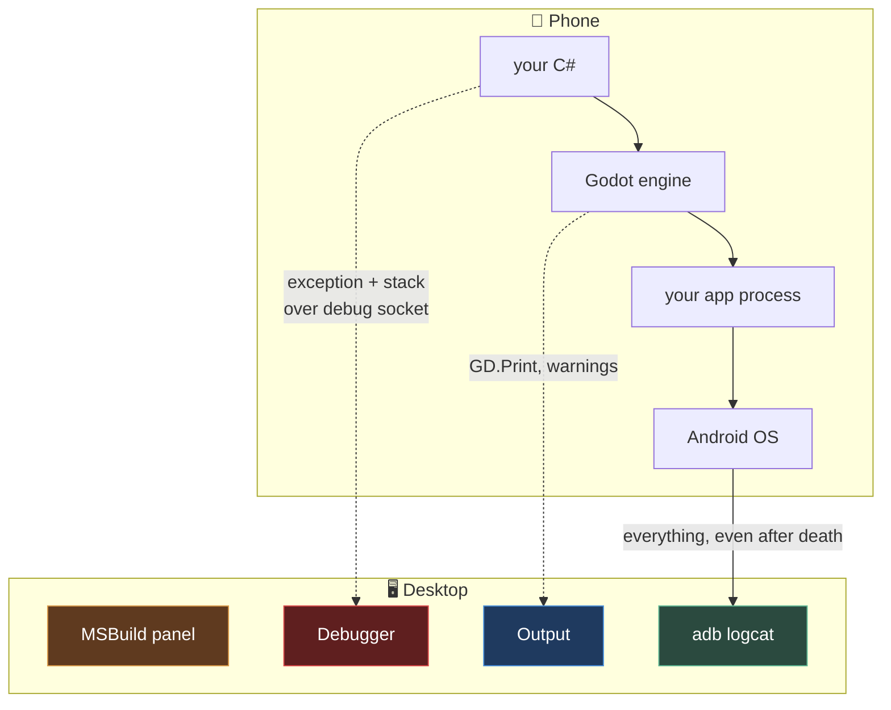

# Chapter 0.9 — Reading Errors

🪜 **Scaffolding: 90 / 10.**

---

## 🎯 Goal

By the end you will have crashed your app **on the phone** and read the same failure three different ways — including a **stack trace from device code, in your desktop editor** — and you will know which tool to reach for first.

---

## 🏃 Fast-Track Summary

*Path C: read this and the cheat sheet, do ⭐ P1, move on.*

- Four places a failure can surface, in the order you should check them:

  | Tool | Shows | Reach for it when |
  |---|---|---|
  | **MSBuild panel** | Compile errors | Nothing ran |
  | **Godot Debugger** | ⭐ Stack traces — **including from the device** | It ran and threw |
  | **Godot Output** | `GD.Print`, engine warnings | You want to trace flow |
  | **`adb logcat`** | *Everything* the phone did, including native crashes | Godot itself died, or the app never started |

- ⭐ **Deploy with one-click and the editor's Debugger stays attached to the phone.** A C# exception on the device produces a stack trace in your desktop editor, with clickable lines.
- `logcat` filtering, in increasing usefulness:
  ```bash
  adb logcat *:E                                     # errors and worse, everything
  adb logcat --pid=$(adb shell pidof -s com.you.app) # ⭐ only your app
  adb logcat -d > crash.txt                          # dump and exit, for pasting
  ```
- **`adb logcat -c` before reproducing.** A clean buffer is worth more than a clever filter.
- Godot errors are usually **`E godot`**-tagged; a native crash shows as **`F DEBUG`** with a backtrace and no Godot involvement at all.
- Commit: `ch 0.9: reading errors on desktop and device`

---

## 🧭 Before you start

| You need | From |
|---|---|
| P00 installed and running on the phone | [0.8](Chapter_00.08_P00HelloPhone.md) |
| `adb logcat` streaming | [0.5](Chapter_00.05_ConnectingYourPhone.md) |
| The three-panel distinction | [0.6](Chapter_00.06_TheGodotEditor.md) Step 6 |

---

## 🔨 Build

You are going to break P00 four times, deliberately, and read each failure with the right tool.

### Step 1 — Set up a clean log

```bash
adb logcat -c
```

> 💡 **Do this before every reproduction.** Ninety per cent of "I cannot find the error in logcat" is a buffer full of the last twenty minutes. **A clean buffer beats a clever filter**, every time.

Now open a second terminal and leave this running:

```bash
adb logcat --pid=$(adb shell pidof -s com.<you>.hellophone)          # 🐧
```
```powershell
adb logcat --pid=(adb shell pidof -s com.<you>.hellophone).Trim()    # 🪟
```

### Step 2 — Failure 1: a null reference, on the device ⭐

In `Spinner.cs`:

```csharp
    public override void _Ready()
    {
        GD.Print($"Hello Phone — running on {OS.GetName()}");

        // deliberately wrong: there is no node called "Nope"
        Node3D missing = GetNode<Node3D>("Nope");
        GD.Print(missing.Name);
    }
```

Build, then **deploy with one-click** (not `F5`).

Now look in **three places** and note what each shows:

1. Your desktop **Godot Debugger** panel
2. Your desktop **Godot Output** panel
3. The **`adb logcat`** terminal

> 🚨 **The important discovery:** the editor's debugger **stays connected to the phone** after a one-click deploy. Code running on an ARM device, several metres away, is producing a stack trace in a panel on your desk — with lines you can click to jump to.

`[UNVERIFIED]` — the exact stack-trace formatting, and whether your Godot version shows a C# trace or an engine-level one.

### Step 3 — Failure 2: a crash that Godot never sees

Restore `_Ready`. Now cause the *app* to die rather than a script to throw. In `_Process`:

```csharp
    public override void _Process(double delta)
    {
        RotateY(Mathf.DegToRad(DegreesPerSecond) * (float)delta);

        // exhaust memory — the OS will kill the process
        var hog = new System.Collections.Generic.List<byte[]>();
        while (true) hog.Add(new byte[64 * 1024 * 1024]);
    }
```

> ⚠️ **This will make the phone unresponsive for a few seconds.** That is the point — you are producing a failure mode that no in-editor test reproduces. Deploy, watch, then restore the file immediately.

Deploy and watch `logcat`. The app vanishes.

**Look for what Godot's Debugger shows** *(likely: the connection simply dropped)* **versus what `logcat` shows**.

### Step 4 — Failure 3: the app that never starts

Restore `_Process`. Now break the *packaging* rather than the code — set an invalid main scene:

`Project → Project Settings → Application → Run → Main Scene` → point it at a file that does not exist, e.g. `res://Nothing.tscn`.

Deploy. The app installs and immediately closes.

```bash
adb logcat -c
adb shell monkey -p com.<you>.hellophone -c android.intent.category.LAUNCHER 1
adb logcat -d | grep -iE "godot|fatal|error"          # 🐧
adb logcat -d | Select-String -Pattern "godot|fatal|error"   # 🪟
```

> 💡 **`-d` dumps the buffer and exits** rather than streaming. It is what you want when the thing you are debugging is over in half a second.

Restore the main scene.

### Step 5 — Failure 4: warnings, which are not errors

Restore everything. Add this to `_Ready`:

```csharp
        GD.PushWarning("This is a warning, not an error.");
        GD.PushError("This is an error I raised on purpose.");
        GD.Print("And this is just a print.");
```

Deploy and compare all three in Output, in the Debugger, and in `logcat`.

> 🐣 **`GD.PushError` versus `throw`.** `PushError` reports a problem and **keeps running**; `throw` stops execution and unwinds. Use `PushError` for "this asset is missing but the game can continue", and exceptions for "this cannot proceed".

### Step 6 — Learn three logcat filters properly

```bash
# 1. Priority — errors and worse, from every process
adb logcat *:E

# 2. ⭐ Your app only — the one you will use most
adb logcat --pid=$(adb shell pidof -s com.<you>.hellophone)

# 3. Tag-based — Godot's own messages
adb logcat -s godot
```

Then capture one for pasting:

```bash
adb logcat -c
# ... reproduce the problem ...
adb logcat -d > crash.txt
```

> 📌 **`crash.txt` is what goes into [`toAgent/`](../../toAgent/)** when you ask me about a device problem. Paste the whole thing, not the line you think matters — [`toAgent/README.md`](../../toAgent/README.md) explains why.

### Step 7 — Write down what you learned

Add each of the four failures to [`Troubleshooting.md`](../reference/Troubleshooting.md) with its **exact** message, which tool showed it, and the fix.

### Step 8 — Commit

```bash
git add .
git commit -m "ch 0.9: reading errors on desktop and device"
git push
```

---

## ▶️ Run it

- [ ] A null reference on the device produced a **stack trace in the desktop Debugger**
- [ ] A process kill appeared in `logcat` but **not** meaningfully in the Debugger
- [ ] A failed startup was diagnosed with `adb logcat -d`
- [ ] `PushWarning`, `PushError` and `Print` are visibly different
- [ ] You can filter logcat three ways and dump to a file
- [ ] All four recorded in `Troubleshooting.md`

---

## 👀 Observe

Line up what each tool told you about each failure. You should see a pattern: **the closer a failure is to your C#, the better the Godot tools are; the closer it is to the operating system, the more you need `logcat`.**

Notice which failure was hardest. For most people it is #3 — the app that installs and immediately closes — because **the tool that usually helps you is not running long enough to say anything.** That is exactly why `-d` exists.

---

## 🧠 Why it works

### Four tools because a failure has a distance

| Distance from your code | Tool | Why it can see it |
|---|---|---|
| **Never compiled** | MSBuild panel | The compiler is a desktop process; nothing else exists yet |
| **Threw inside your C#** | Godot Debugger | The engine catches it, walks the call stack, sends it over the debug socket |
| **Engine-level problem** | Godot Output | The engine noticed and reported, but no exception unwound |
| **Process died / never started** | `adb logcat` | Only the **OS** was still watching |

The last row is the one people are missing when they say *"it just closes and I have no idea why."* When the process is gone, so is every tool that lived inside it. **`logcat` is outside**, which is what makes it the tool of last resort and the tool of first resort simultaneously.

### Why a stack trace from the phone is possible

From [0.6](Chapter_00.06_TheGodotEditor.md): the editor and the game are separate processes joined by a debug protocol. **A one-click deploy passes the desktop's address to the app**, so the game on the phone connects *back* over the network to your editor.

That is why: the Debugger panel works on device; it works over Wi-Fi as well as USB; and it **stops working the instant the process dies** — the socket dies with it. Understanding that one fact tells you when to stop trusting the Debugger and reach for `logcat`.

> 🔬 **Deep dive — logcat's priority letters.** Each line carries a priority: `V` verbose, `D` debug, `I` info, `W` warning, `E` error, `F` fatal. `adb logcat *:E` means *"every tag, at error and above"*. A **native crash** appears as `F DEBUG` with a backtrace of memory addresses — and if you ever see that from your game, the problem is below C#: the engine, a GDExtension, or a driver. Chapter [10.2](../TableOfContents.md) returns to this when you write native code.

---

## 🗺️ Mental model



The dotted arrows need a **living process**. The solid one does not. That is the whole chapter in one picture.

---

## 💥 Break it

Make a failure that **none** of the desktop tools will explain.

1. Restore P00 to working order and deploy it. Confirm the cube spins.
2. Now, **on the phone**, go to `Settings → Apps → Hello Phone → Permissions` and revoke everything available. Force-stop the app.
3. Relaunch it from the phone's launcher — **not** from Godot.
4. Try to find out what happened using the **Godot Debugger** alone.
5. Then try `adb logcat`.

---

## 🔎 Diagnose

**Why could the Debugger tell you nothing, and what general rule follows? Answer before opening.**

<details>
<summary>Answer</summary>

**The Debugger showed nothing because it was never connected.**

The editor's debug link is established when *Godot* launches the app and hands it the desktop's address. Launching from the phone's own launcher skips that entirely — the app has no idea an editor exists. There is no error, no warning, and no indication anything is missing. **The panel is simply empty, which looks identical to "no problems".**

`logcat`, by contrast, does not care how the app started. It is the OS's log, and the app is a process on that OS.

**The general rule, and it is the most useful thing in this chapter:**

> **Godot's tools only see a game that Godot started and that is still alive.
> `logcat` sees everything the phone did, however it started and however it ended.**

Three consequences you will use for the rest of the course:

1. **A player's crash never reaches your Debugger** — they did not launch from your editor. That is why crash reporting exists as a separate discipline ([11.21](../TableOfContents.md)).
2. **"It works when I deploy but not when I open it from the launcher"** is a real category of bug, and only `logcat` can investigate it.
3. **An empty Debugger panel is not evidence of anything.** Check whether it is connected before concluding there was no error.

</details>

---

## 🏋️ Practicals

**⭐ P1 — Build a reproduction script.** Write `capture.sh` / `capture.ps1` that clears the log, launches your app from the shell, waits five seconds, and dumps to a timestamped file. You will run it every time you hit a device bug, and it removes four chances to get the sequence wrong.

**P2 — Find the boot sequence.** Clear the log, launch P00, and read the output from the top **without filtering**. Find where Godot announces its version and renderer — the same banner you saw on the desktop in [0.2](Chapter_00.02_GodotAndDotNet.md). Confirm it says **Forward Mobile**.

**P3 — Break something silently.** Introduce a bug that produces **no error at all** — for example set `DegreesPerSecond` to `0`. Note that all four tools are silent and the behaviour is still wrong. **This is the fourth category**, and the only tool for it is a breakpoint ([2.2](../TableOfContents.md)).

**🔬 P4 — Watch a real crash.** Search `logcat` for `F DEBUG` while doing something unusual on the phone (not necessarily your app). Read a native backtrace. You will not understand it yet; recognising the shape is the point.

---

## ✅ Check yourself

1. Name the four tools and the kind of failure each is best at.
2. Why can the desktop Debugger show a stack trace from code running on the phone?
3. Why does it show nothing when you launch the app from the phone's launcher?
4. What does `adb logcat -c` do, and why before rather than after?
5. Your app installs and closes immediately. Which command do you run first, and why that one?

<details>
<summary>Answers</summary>

1. **MSBuild** — compile errors, nothing ran. **Godot Debugger** — exceptions in your C#, with a stack trace, including from the device. **Godot Output** — `GD.Print`, warnings, engine notices. **`adb logcat`** — everything the OS saw, including processes that died or never started.
2. A one-click deploy **passes the desktop's address to the app**, and the game connects back over a debug socket — USB or Wi-Fi. Editor and game are separate processes joined by a network link, so physical distance is irrelevant.
3. Because that link is only established when **Godot** launches the app. Started from the launcher, the app has no idea an editor exists. **The panel being empty looks exactly like "no problems", which is why it is a trap.**
4. It **clears the log buffer**. Before, because the buffer holds the last several minutes of everything the phone did; hunting your five lines inside twenty minutes of noise is the commonest reason people say logcat is useless. **A clean buffer beats a clever filter.**
5. `adb logcat -d` — dump and exit. The app is dead in under a second, so a *streaming* command would attach after the interesting part is over, and every Godot-side tool needs a living process it no longer has.

</details>

---

## 📎 Cheat sheet

| Tool | Best at | Fails when |
|---|---|---|
| MSBuild panel | Compile errors | Code compiled fine |
| Godot **Debugger** | Stack traces, on desktop **and device** | Process died, or Godot did not launch it |
| Godot **Output** | `GD.Print`, warnings | You need a call stack |
| **`adb logcat`** | Everything, including death | Nothing — but it is noisy |

| Command | Does |
|---|---|
| `adb logcat -c` | ⭐ **Clear the buffer. Do this first, every time** |
| `adb logcat -d` | Dump and exit — for failures that are over instantly |
| `adb logcat *:E` | Errors and worse, all processes |
| `adb logcat --pid=$(adb shell pidof -s <pkg>)` | ⭐ Your app only |
| `adb logcat -s godot` | Godot-tagged messages only |
| `adb logcat -d > crash.txt` | Capture for [`toAgent/`](../../toAgent/) |

| Priority | Means |
|---|---|
| `V D I` | Verbose, Debug, Info |
| `W` | Warning — `GD.PushWarning` |
| `E` | Error — `GD.PushError`, exceptions |
| `F` | **Fatal** — native crash, with a backtrace. Below C# |

---

## 🔗 Further reading

- [logcat command-line tool](https://developer.android.com/tools/logcat)
- [Godot debugger panel](https://docs.godotengine.org/en/stable/tutorials/scripting/debug/debugger_panel.html)
- [`Troubleshooting.md`](../reference/Troubleshooting.md) — where your four findings go
- [`toAgent/README.md`](../../toAgent/README.md) — how to send me a log

---

## 💾 Commit

```text
ch 0.9: reading errors on desktop and device
```

---

## ➡️ What's next

**[0.10 — GDScript first contact](../TableOfContents.md).** Module 0's block **0A** is complete: every tool installed, an app on your phone, and the ability to read it when it breaks. Block **0B** begins — the four languages you will write, measured on your own hardware rather than described to you.

---

## 🪞 Reflection

In two sentences: **what can `logcat` see that the Godot Debugger cannot, and why?**

---

## 📝 Chapter changelog

| Version | Date | Change |
|---|---|---|
| 1.0 | 2026-09-02 | First published. `[UNVERIFIED]` on stack-trace formatting, logcat output shapes and whether the debugger reports a C# or engine-level trace. |
