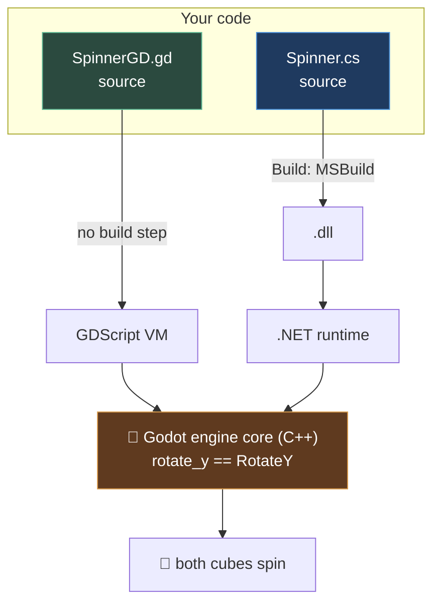

# Chapter 0.10 — GDScript First Contact

🪜 **Scaffolding: 90 / 10.**

---

## 🎯 Goal

By the end, two cubes spin side by side in the same scene — one driven by C#, one by GDScript — and you will have **timed the difference between editing each of them**.

---

## 🏃 Fast-Track Summary

*Path C: read this and the cheat sheet, do ⭐ P1, move on.*

- Add a second `MeshInstance3D` to P00 and attach **`SpinnerGD.gd`**:
  ```gdscript
  extends Node3D

  @export var degrees_per_second: float = 90.0

  func _process(delta: float) -> void:
      rotate_y(deg_to_rad(degrees_per_second) * delta)
  ```
- **Six lines, and no Build button.** Save, press `F6`, it runs.
- Naming: GDScript is `snake_case` for members and files; C# is `PascalCase`. **The engine API is the same object under both** — `rotate_y` is `RotateY`.
- ⭐ **Time it.** Edit the value, run, see the change. Do the same in C#. The gap is the build step, and you will quantify it in [0.12](Chapter_00.12_MeasuredTwoLanguages.md).
- **`@export` ≈ `[Export]`** · `func _process(delta)` ≈ `_Process(double delta)` · `extends` ≈ `:`.
- Break it: typo a property name. **GDScript does not notice until that line runs** — which is the trade.
- Commit: `ch 0.10: gdscript first contact`

---

## 🧭 Before you start

| You need | From |
|---|---|
| P00 open, with `Main.tscn` and `Spinner.cs` | [0.8](Chapter_00.08_P00HelloPhone.md) |
| A stopwatch — your phone's is fine | You are timing yourself in Step 5 |

> 📌 **You are not switching languages.** C# stays primary for this course ([ADR-001](../meta/Decisions.md#adr-001)). GDScript earns eight chapters where it is genuinely the better tool — `@tool` editor scripts, editor plugins, and reading the addon ecosystem, which is overwhelmingly GDScript ([ADR-031](../meta/Decisions.md#adr-031)). Today you learn to read it.

---

## 🔨 Build

### Step 1 — A second cube

Open P00's `Main.tscn`.

1. Select the root `Main`, press `Ctrl+A`, add a **`MeshInstance3D`**.
2. Rename it `CubeGD` (`F2`).
3. Inspector → **Mesh** → **New BoxMesh**.
4. Set its **Position** to `(2, 0, 0)` so it sits beside the original.
5. Select the original `Cube` and set its Position to `(-2, 0, 0)`.

You now have two identical cubes. Only one of them spins.

### Step 2 — Attach a GDScript

Select `CubeGD` → **Attach Script**.

| Field | Value |
|---|---|
| Language | **GDScript** |
| Path | `res://SpinnerGD.gd` |

Notice the extension changed from `.cs` to `.gd`, and there is **no class-name rule** — GDScript does not care what the file is called.

Replace the template with exactly this:

```gdscript
extends Node3D

@export var degrees_per_second: float = 90.0

func _ready() -> void:
	print("GDScript alive on ", OS.get_name())

func _process(delta: float) -> void:
	rotate_y(deg_to_rad(degrees_per_second) * delta)
```

> ⚠️ **GDScript uses indentation for blocks, like Python.** Use **tabs** — Godot's editor inserts them by default. Mixing tabs and spaces produces a parse error that looks like nonsense.

### Step 3 — Run it, and notice what you did not do

Press **`F6`**.

**Both cubes spin.** You did not press the Build hammer.

> 🚨 **That is the entire headline of this chapter.** GDScript is *interpreted* — the engine reads your source and executes it. There is no compile step, so there is nothing to wait for.

### Step 4 — Read the two files side by side

Open `Spinner.cs` and `SpinnerGD.gd` together. They do the same thing.

| C# | GDScript | Note |
|---|---|---|
| `public partial class Spinner : Node3D` | `extends Node3D` | GDScript infers the class from the file |
| `[Export] public float DegreesPerSecond { get; set; } = 90f;` | `@export var degrees_per_second: float = 90.0` | Both appear in the Inspector |
| `public override void _Ready()` | `func _ready() -> void:` | Same engine callback |
| `_Process(double delta)` | `_process(delta: float)` | ⚠️ **`double` in C#, `float` in GDScript** |
| `RotateY(...)` | `rotate_y(...)` | **The same engine method** |
| `Mathf.DegToRad(x)` | `deg_to_rad(x)` | Same function |
| `GD.Print(...)` | `print(...)` | |

> 💡 **The naming difference is mechanical, not conceptual.** Godot's API is defined once, in the engine, and each language binding presents it in that language's convention: `snake_case` for GDScript, `PascalCase` for C#. **When you read an addon's GDScript and need it in C#, convert the case and you usually have it.** That is the single most useful thing to take from this chapter, because you will read a lot of GDScript addons ([ADR-031](../meta/Decisions.md#adr-031)).

### Step 5 — ⭐ Time the loop

The stopwatch matters. Do this properly — you will use the numbers in [0.12](Chapter_00.12_MeasuredTwoLanguages.md).

**GDScript, three times:**

1. Start the stopwatch.
2. Change `degrees_per_second` to a different value in the `.gd` file.
3. Save (`Ctrl+S`), press `F6`, and stop the watch **the moment the cube visibly changes speed**.
4. Note the time. Repeat twice more.

**C#, three times:** the same, editing `DegreesPerSecond` in `Spinner.cs`, remembering the **Build** step.

Write all six numbers in [`Journal.md`](../meta/Journal.md).

> 📌 **Do not draw conclusions yet.** Six samples is not an experiment; [0.12](Chapter_00.12_MeasuredTwoLanguages.md) turns this into one. Just record.

### Step 6 — On the phone

Deploy with one-click. Both cubes spin. Check `logcat`:

```bash
adb logcat -c
# redeploy, then:
adb logcat --pid=$(adb shell pidof -s com.<you>.hellophone) | grep -iE "alive|Hello"
```

**Both languages print, from the same process.** They are not alternatives running in different modes — they are two scripting layers on one engine, in one app.

### Step 7 — Commit

```bash
git add .
git commit -m "ch 0.10: gdscript first contact"
git push
```

---

## ▶️ Run it

- [ ] Two cubes spin side by side
- [ ] The GDScript one required **no Build press**
- [ ] Both `@export`/`[Export]` values appear in the Inspector
- [ ] Both print to the log, on desktop and on device
- [ ] Six timing samples recorded in `Journal.md`

---

## 👀 Observe

Two things.

**First, the edit loop felt different.** Not by a huge amount on a project this size — but P00 has one script. In Module 5 you will have dozens, and the gap grows with the project.

**Second, and more interesting:** you wrote GDScript without being taught GDScript. The table in Step 4 was enough, because **the engine API is identical** — only the spelling changed. That is why the eight GDScript chapters later in this course are short: you are not learning a language, you are learning a *dialect* of an API you already know.

---

## 🧠 Why it works

### Interpreted versus compiled, concretely

| | GDScript | C# |
|---|---|---|
| What the engine loads | Your **source**, parsed to bytecode at load | A compiled **`.dll`** |
| When errors surface | **When that line runs** | Type errors at build; the rest at runtime |
| Edit loop | save → run | save → **build** → run |
| Tooling | Godot's editor | Full IDE: refactoring, find-references, real autocomplete |
| Ecosystem | The Asset Library | The Asset Library **plus NuGet** |

Neither is better. They are different points on one trade-off, and [0.14](Chapter_00.14_LanguageDecisionTable.md) is where you decide which point suits which job.

### Why GDScript exists at all

It is a language designed for **one engine**. That lets it drop everything the engine does not need — no namespaces, no separate build system, no generics — and add things the engine does need directly into the syntax: `@export`, `@onready`, `signal`, node paths as first-class values.

The result is a language with a very small surface area that fits Godot's object model exactly. **That is precisely why editor tooling is written in it** — a `@tool` script that reloads instantly is worth more than one that is type-safe but needs a rebuild for every keystroke. You will feel that yourself in [4.2b](../TableOfContents.md).

> 🔬 **Deep dive — how both languages reach the same engine.** Godot's classes are registered once in C++ with full type metadata. GDScript reads that registry directly. C# generates binding code from it. So `rotate_y` and `RotateY` are not two implementations — they are two names for **one C++ function**, reached through two different marshalling paths. This is also why crossing between the languages costs something ([10.1b](../TableOfContents.md)): each call converts through the engine's `Variant` type.

---

## 🗺️ Mental model



Two paths in, one engine, one result. The left path is shorter — that is the whole difference.

---

## 💥 Break it

Two sabotages. Restore after each.

1. In `SpinnerGD.gd`, change `rotate_y` to `rotate_yy`. **Save. Do not run yet — look at the editor.** Then run.
2. Restore. In `Spinner.cs`, change `RotateY` to `RotateYY`. **Press Build.**

---

## 🔎 Diagnose

**When did each error appear, and what did it cost you to find out? Answer before opening.**

<details>
<summary>Answer</summary>

**C# (`RotateYY`)** fails at **build time**, in the MSBuild panel, naming the method and the line. **The program never ran.** You knew within a second or two of pressing Build, and you were told exactly where.

**GDScript (`rotate_yy`)** may show a warning in the editor, but it **fails when `_process` first executes** — at runtime, in the Debugger. `[UNVERIFIED]` — whether your version's parser flags it beforehand.

**Why that difference exists.** C# is statically typed and compiled: the compiler knows `Node3D` has no `RotateYY` before anything runs. GDScript resolves method names **against the actual object, at the moment of the call**. Until that line executes, nobody has asked the question.

**Why this matters more than it looks.** `_process` runs every frame, so you found it immediately. But put the same typo inside:

```gdscript
func _on_boss_defeated() -> void:
	player.grant_reward()      # typo here
```

…and it surfaces the first time somebody beats the boss. **The error's distance from your keystroke is the real cost**, and it grows with how rarely the code path runs.

**Which is the argument for C# as this course's primary language** ([ADR-001](../meta/Decisions.md#adr-001)) — across 359 chapters and a released game, moving errors from *runtime* to *build time* compounds. And it is equally the argument for GDScript in `@tool` scripts, where the code runs constantly in the editor and instant reload is worth more than a compiler.

**The general skill:** ask *"at what point could this have been caught?"* Build time beats first-run beats rare-path beats a player's device. Every language choice, every `[Export]` versus a magic string, and every wrapper around a GDScript addon ([10.6b](../TableOfContents.md)) is a move along that scale.

</details>

---

## 🏋️ Practicals

**⭐ P1 — Translate a real addon snippet.** Find any GDScript example in [Godot's docs](https://docs.godotengine.org/) — a `_input` handler, a signal connection — and rewrite it in C# using only the case-conversion rule. Confirm it compiles. This is the skill that makes the whole addon ecosystem available to you.

**P2 — Make them talk.** Give `SpinnerGD.gd` a `signal spun_once` emitted every full rotation, and have `Spinner.cs` connect to it. `[UNVERIFIED]` — the exact C# connection syntax in your version; find it with `F1`. **This is your first cross-language boundary**, the thing [10.1b](../TableOfContents.md) is entirely about.

**🔬 P3 — Read the class reference in both.** Press `F1`, find `Node3D.rotate_y`, and switch the docs' language selector between GDScript and C#. Note that the *page* is the same and only the signatures change.

---

## ✅ Check yourself

1. What did you not have to press to run the GDScript cube, and why?
2. `rotate_y` and `RotateY` — are these two functions or one?
3. Why did the C# typo fail at build time and the GDScript typo at runtime?
4. Give one job where GDScript is clearly the better choice, and say why.
5. What is the practical rule for converting a GDScript snippet to C#?

<details>
<summary>Answers</summary>

1. **Build.** GDScript is interpreted — the engine parses and executes your source directly, so there is no compilation step to wait for.
2. **One.** Godot's engine core registers each class once in C++; GDScript reads that registry and C# generates bindings from it. Both names reach the same C++ function through different marshalling paths.
3. C# is **statically typed and compiled** — the compiler knows `Node3D` has no `RotateYY` before anything runs. GDScript **resolves method names against the object at call time**, so nobody asks the question until that line executes. The cost of a late error grows with how rarely the code path runs.
4. **`@tool` editor scripts and editor plugins** — they run constantly while you work, and instant reload without a rebuild is worth more than compile-time checking. Also **reading and patching addons**, since the ecosystem is overwhelmingly GDScript.
5. **Convert the case:** `snake_case` → `PascalCase` for methods and properties. The API is identical underneath, so the conversion is usually mechanical.

</details>

---

## 📎 Cheat sheet

| C# | GDScript |
|---|---|
| `public partial class X : Node3D` | `extends Node3D` |
| `[Export] public float Speed { get; set; } = 90f;` | `@export var speed: float = 90.0` |
| `public override void _Ready()` | `func _ready() -> void:` |
| `public override void _Process(double delta)` | `func _process(delta: float) -> void:` |
| `GD.Print(x)` | `print(x)` |
| `RotateY(x)` · `Mathf.DegToRad(x)` | `rotate_y(x)` · `deg_to_rad(x)` |
| `GetNode<Node3D>("Path")` | `$Path` or `get_node("Path")` |
| Braces | **Tabs** for indentation |
| Needs **Build** | Save and run |

| Trade | GDScript | C# |
|---|---|---|
| Errors caught | At the line, when it runs | Type errors at **build** |
| Loop | save → run | save → build → run |
| Best for | `@tool` scripts, plugins, reading addons | Systems, architecture, data, tests |

---

## 🔗 Further reading

- [GDScript basics](https://docs.godotengine.org/en/stable/tutorials/scripting/gdscript/gdscript_basics.html)
- [C# and GDScript differences](https://docs.godotengine.org/en/stable/tutorials/scripting/c_sharp/c_sharp_differences.html)
- [`Languages.md`](../Languages.md) — where each language is used across the course
- [ADR-031](../meta/Decisions.md#adr-031) — polyglot by design

---

## 💾 Commit

```text
ch 0.10: gdscript first contact
```

---

## ➡️ What's next

**[0.11 — C# first contact](Chapter_00.11_CSharpFirstContact.md).** You have written C# already. Next you meet the parts of it that are *not* obvious to someone arriving from C or C++ — properties, attributes, `partial` — and find out what the build step actually buys.

---

## 🪞 Reflection

In two sentences: **why is `rotate_y` the same function as `RotateY`, and what does that fact let you do with a GDScript addon?**

---

## 📝 Chapter changelog

| Version | Date | Change |
|---|---|---|
| 1.0 | 2026-09-02 | First published. `[UNVERIFIED]` on parser-warning behaviour and C# signal-connection syntax. |
