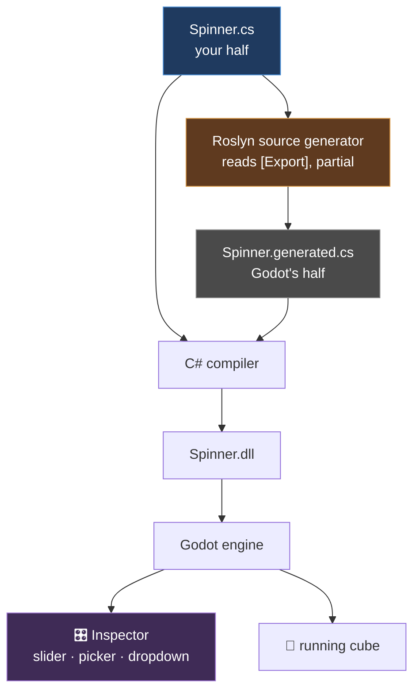

# Chapter 0.11 — C# First Contact

🪜 **Scaffolding: 90 / 10.**

---

## 🎯 Goal

By the end you will understand the four C# constructs Godot actually requires — **`partial`, properties, attributes, and the filename rule** — by making each of them fail on purpose and seeing exactly what breaks.

---

## 🏃 Fast-Track Summary

*Path C: read this and the cheat sheet, do ⭐ P1, move on.*

- You have written C# since [0.2](Chapter_00.02_GodotAndDotNet.md). This chapter is about the parts that are **not obvious coming from C or C++**.
- **`[Export]` needs a *property*, not a field.** `public float Speed;` does not appear in the Inspector; `public float Speed { get; set; }` does. `[UNVERIFIED]`
- **`partial` exists because Godot's source generator writes a second half of your class** — signal plumbing and property metadata.
- **Filename must match the class name.** Godot finds the type by filename, and a mismatch fails *silently at attach time*, not at build.
- Export hints give you real UI:
  ```csharp
  [Export(PropertyHint.Range, "0,720,5")] public float DegreesPerSecond { get; set; } = 90f;
  [Export] public Color Tint { get; set; } = Colors.White;
  [Export] public NodePath Target { get; set; }
  ```
- **`_Process` takes `double`, `RotateY` takes `float`.** The cast is not noise — see Why it works.
- Break it four ways: field instead of property · remove `partial` · rename the class · drop the cast.
- Commit: `ch 0.11: c# first contact`

---

## 🧭 Before you start

| You need | From |
|---|---|
| Both cubes spinning | [0.10](Chapter_00.10_GDScriptFirstContact.md) |
| The MSBuild / Debugger / Output distinction | [0.6](Chapter_00.06_TheGodotEditor.md) |

> 🐣 **Coming from C or C++?** The unfamiliar things here are **properties** (methods that look like fields), **attributes** (`[Export]` — metadata the tooling reads), **`partial`** (one class split across files), and **garbage collection**. Nothing about pointers or memory management transfers; nothing about types and control flow needs to.

---

## 🔨 Build

### Step 1 — Give `Spinner.cs` a real inspector

Replace `Spinner.cs` with this. Read the comments — each one marks something Godot requires.

```csharp
using Godot;

// 1. public   — Godot must see the type from outside the assembly
// 2. partial  — the source generator writes a second half of this class
// 3. : Node3D — must derive from a Godot type to be attachable
// 4. The file MUST be named Spinner.cs
public partial class Spinner : Node3D
{
    // A slider, not a text box, because of the hint
    [Export(PropertyHint.Range, "0,720,5")]
    public float DegreesPerSecond { get; set; } = 90f;

    // A colour picker
    [Export] public Color Tint { get; set; } = Colors.White;

    // A dropdown of the exact strings you list
    [Export(PropertyHint.Enum, "Clockwise,Anticlockwise")]
    public string Direction { get; set; } = "Clockwise";

    // Grouping — everything after this appears under a "Debug" header
    [ExportGroup("Debug")]
    [Export] public bool LogEveryRotation { get; set; } = false;

    private float _accumulated;

    public override void _Ready()
    {
        // Tint the cube, proving the exported Color reached the material
        var mesh = GetNode<MeshInstance3D>(".");
        var mat = new StandardMaterial3D { AlbedoColor = Tint };
        mesh.MaterialOverride = mat;

        GD.Print($"Spinner ready on {OS.GetName()} — {DegreesPerSecond}°/s {Direction}");
    }

    public override void _Process(double delta)
    {
        float sign = Direction == "Clockwise" ? 1f : -1f;
        float step = Mathf.DegToRad(DegreesPerSecond) * (float)delta * sign;

        RotateY(step);

        _accumulated += Mathf.RadToDeg(Mathf.Abs(step));
        if (LogEveryRotation && _accumulated >= 360f)
        {
            _accumulated -= 360f;
            GD.Print("One full rotation.");
        }
    }
}
```

Press **Build**, then `F6`.

### Step 2 — Look at what the attributes bought you

Select `Cube` and look at the Inspector.

| You wrote | Inspector shows |
|---|---|
| `PropertyHint.Range, "0,720,5"` | A **slider**, 0–720, stepping by 5 |
| `Color` | A **colour picker** |
| `PropertyHint.Enum, "Clockwise,Anticlockwise"` | A **dropdown** with exactly those two |
| `[ExportGroup("Debug")]` | A collapsible **Debug** section |

`[UNVERIFIED]` — exact widget appearance in Godot 4.7.2.

Drag the slider while the scene runs (**Remote** tree, [0.6](Chapter_00.06_TheGodotEditor.md) Step 5). Change the colour. Flip the dropdown.

> 💡 **You wrote no UI code.** An attribute is *metadata* attached to a declaration; Godot's source generator reads it at build time and tells the editor what widget to draw. This is the mechanism behind every tunable value in this course — and the reason chapter [1.5](../TableOfContents.md) insists gameplay numbers are exported rather than hard-coded.

### Step 3 — Find the generated half

`partial` claims Godot writes part of your class. Prove it.

```bash
# from the P00 project folder
find . -name "*.generated.cs" | head          # 🐧
```
```powershell
Get-ChildItem -Recurse -Filter "*.generated.cs" | Select-Object -First 5 FullName   # 🪟
```

Open one. `[UNVERIFIED]` — the exact path and filename; look under `obj/` or `.godot/mono/`.

You will find code you did not write: property-name constants, a `GetGodotPropertyList`, signal plumbing. **That is the other half of your `partial` class.**

### Step 4 — Meet the `double`/`float` boundary

Note this line:

```csharp
float step = Mathf.DegToRad(DegreesPerSecond) * (float)delta * sign;
```

`_Process` hands you a **`double`**. `RotateY` wants a **`float`**. C# will not narrow implicitly, so the cast is mandatory.

Delete `(float)` and press Build. Read the error. Put it back.

> 🐣 **Why C# refuses.** Going `float` → `double` is lossless and implicit. Going `double` → `float` **loses precision**, so C# makes you say so explicitly. C would silently do it; C# will not. That is a deliberate design choice about which mistakes are worth interrupting you for.

### Step 5 — Deploy and confirm on device

One-click deploy. Both cubes still spin; the C# one is tinted and obeys its dropdown.

```bash
adb logcat -c
adb logcat --pid=$(adb shell pidof -s com.<you>.hellophone) | grep -i spinner
```

### Step 6 — Commit

```bash
git add .
git commit -m "ch 0.11: c# first contact"
git push
```

---

## ▶️ Run it

- [ ] The Inspector shows a slider, a colour picker, a dropdown and a **Debug** group
- [ ] Changing `Tint` changes the cube's colour after a rerun
- [ ] `Direction` reverses the spin
- [ ] You found a `*.generated.cs` file containing code you did not write
- [ ] The tinted cube runs on the phone

---

## 👀 Observe

Look at how much Inspector UI came from **four attributes and zero UI code**.

Then look at what the four Godot requirements have in common: `public`, `partial`, deriving from a Godot type, and the filename rule. **Every one exists so that something outside your code can find and extend your class** — the source generator, the editor, the engine's type registry.

That is the shape of the whole C#-in-Godot relationship. You are not writing a standalone program; you are writing a class that several tools will inspect, extend and instantiate.

---

## 🧠 Why it works

### The four requirements, and what each one is for

| Requirement | Who needs it | If you omit it |
|---|---|---|
| `public` | The engine, loading your type from the assembly | Type not found |
| `partial` | The **source generator**, which writes a second half | **Build error** — duplicate type |
| `: Node3D` (or another Godot type) | The editor, to allow attaching | Cannot attach |
| **Filename = class name** | Godot's type lookup | ⚠️ **Silent failure at attach time** |

The fourth is the dangerous one, precisely because it is the only one that does not produce an error.

### Properties versus fields, and why `[Export]` cares

A **field** is storage. A **property** is a pair of methods (`get`/`set`) that *look* like storage.

Godot's editor does not just read your value — it must be **notified when the value changes**, so it can redraw, mark the scene dirty, and serialise. A property gives it a `set` method to hook. A bare field gives it nothing.

> 🔬 **Deep dive — what the source generator actually does.** At build time, a Roslyn source generator scans for `[Export]` on your `partial` class and emits a second partial containing `_GetPropertyListCore`, `_SetCore`, `_GetCore` and cached `StringName` constants. That generated code is what bridges the engine's dynamic property system to your statically-typed members — and it is why removing `partial` is a hard error rather than a warning: the generator has produced a second declaration of a class that is no longer allowed to have one.

### Why attributes rather than a configuration file

`[Export(PropertyHint.Range, "0,720,5")]` sits **on the declaration it describes**. Rename the property and the metadata moves with it. Delete it and the metadata goes too. A separate file describing your properties would drift out of sync the first time anyone refactored.

That principle recurs: it is why signals are connected in the editor ([0.6](Chapter_00.06_TheGodotEditor.md)) rather than by string lookup, and why [9.5](../TableOfContents.md) uses typed `Resource` classes rather than loose config.

---

## 🗺️ Mental model



`partial` is the seam where the two halves meet.

---

## 💥 Break it

Four sabotages, one at a time, restoring between. **Predict the panel before you press Build.**

1. Change `public float DegreesPerSecond { get; set; } = 90f;` to a **field**: `public float DegreesPerSecond = 90f;` *(keep `[Export]`)*. Build. **Look at the Inspector.**
2. Restore. Remove the word `partial`. Build.
3. Restore. Rename the class to `Spinner2` **without renaming the file**. Build, then run.
4. Restore. Remove `public`, leaving `partial class Spinner : Node3D`. Build, then run.

---

## 🔎 Diagnose

**For each: which panel spoke, and could the compiler have known? Answer before opening.**

<details>
<summary>Answer</summary>

| # | Panel | Compiler could know? |
|---|---|---|
| 1 Field not property | **None** — builds fine, property missing from Inspector | It is valid C#; only Godot's convention was broken |
| 2 No `partial` | **MSBuild** — duplicate type definition | ✅ Yes, immediately |
| 3 Class ≠ filename | **None at build.** Fails at attach/run | Filenames are not a C# concept |
| 4 Not `public` | **MSBuild or attach failure**, version-dependent | Partially |

`[UNVERIFIED]` — the exact messages.

**Two of these four produce no compiler error**, and they are the two that will cost you real time.

**#1 is the subtlest.** Everything builds, the game runs, and the property simply is not in the Inspector. If you were mid-way through a task you would likely conclude the Inspector was broken, or that you had saved the wrong file. **The failure is an absence, and absences are hard to notice.**

**#3 you already met in [0.2](Chapter_00.02_GodotAndDotNet.md)** — but it is worth meeting twice, because it is the single most common "my script does nothing" cause and it produces total silence.

**The pattern across all four:** C# checks *types*; Godot checks *conventions*. The compiler enforces `partial` because that is a language rule. It cannot enforce the filename rule or the property rule, because neither is expressible in C# — they are agreements between you and the engine.

**So the diagnostic question is: *is this a language rule or a Godot rule?*** Language rules fail loudly at build. **Godot rules fail quietly, later.** When something builds cleanly and still does not work, you are almost always looking at a broken convention — and the four in this chapter cover most of them.

</details>

---

## 🏋️ Practicals

**⭐ P1 — Export five more types.** Add exported properties for `Vector3`, `int` with a `Range` hint, `bool`, `NodePath`, and `PackedScene`. Note which widget each produces. You will use all five constantly from Module 1.

**P2 — Group and reorder.** Use `[ExportGroup]` and `[ExportSubgroup]` to organise the Inspector into `Motion` and `Debug`. Confirm the ordering follows declaration order.

**P3 — Prove the property rule.** Give a property a `set` that clamps: `set => _speed = Mathf.Clamp(value, 0f, 720f);` with a backing field. Set 5000 in the Inspector and watch it clamp. **A field could not do that** — which is the whole reason `[Export]` wants a property.

**🔬 P4 — Read the generated code properly.** Open the `*.generated.cs` for `Spinner` and find where `DegreesPerSecond` is referenced. Note the cached `StringName`. That caching is a performance decision you will meet again in [10.2](../TableOfContents.md).

---

## ✅ Check yourself

1. What are the four things Godot requires of a C# class, and which one fails silently?
2. Why does `[Export]` need a property rather than a field?
3. What does `partial` allow, and who writes the other part?
4. Why must you write `(float)delta` when `_Process` gives you a `double`?
5. Something builds cleanly but does not work. What class of problem is it likely to be?

<details>
<summary>Answers</summary>

1. `public` · `partial` · derives from a Godot type · **filename matches the class name**. The **filename rule** fails silently — no build error, no runtime error, the script simply does not attach.
2. Because the editor must be **notified when a value changes**, so it can redraw, mark the scene dirty and serialise. A property's `set` method gives it something to hook; a bare field gives it nothing. It also lets you validate or clamp on assignment (P3).
3. It lets **one class be assembled from multiple files**. Godot's **Roslyn source generator** writes the other part at build time — property metadata, cached `StringName`s and signal plumbing. Without `partial` the compiler sees two declarations of one type and refuses.
4. `_Process` supplies `double`; `RotateY` takes `float`. Narrowing **loses precision**, so C# requires you to say so explicitly rather than doing it silently as C would.
5. **A broken Godot convention rather than a broken language rule.** The compiler enforces C#'s rules loudly; Godot's conventions — filename, property-not-field, node names in path strings — are invisible to it and fail quietly, later.

</details>

---

## 📎 Cheat sheet

| Godot requires | Failure if omitted |
|---|---|
| `public` | Type not found |
| `partial` | **Build error** — duplicate type |
| `: Node3D` etc. | Cannot attach |
| **Filename = class name** | ⚠️ **Silent** |

| Export | Produces |
|---|---|
| `[Export] public float X { get; set; }` | Text box |
| `[Export(PropertyHint.Range, "0,720,5")]` | Slider |
| `[Export(PropertyHint.Enum, "A,B,C")]` | Dropdown |
| `[Export] public Color C { get; set; }` | Colour picker |
| `[Export] public NodePath P { get; set; }` | Node picker |
| `[Export] public PackedScene S { get; set; }` | Scene slot |
| `[ExportGroup("Name")]` | Collapsible header |

| C# fact | Note |
|---|---|
| `_Process(double delta)` | Cast to `float` for most engine calls |
| Property = `get`/`set` methods | Fields are storage; `[Export]` needs the methods |
| Attribute = metadata on a declaration | Read at build time by the generator |

---

## 🔗 Further reading

- [C# features in Godot](https://docs.godotengine.org/en/stable/tutorials/scripting/c_sharp/c_sharp_features.html)
- [C# exports](https://docs.godotengine.org/en/stable/tutorials/scripting/c_sharp/c_sharp_exports.html)
- [`Languages.md`](../Languages.md)
- [ADR-001](../meta/Decisions.md#adr-001) — why C# is primary

---

## 💾 Commit

```text
ch 0.11: c# first contact
```

---

## ➡️ What's next

**[0.12 — Measured: two languages, one cube](Chapter_00.12_MeasuredTwoLanguages.md).** You have written the same cube twice and felt the difference. Next you **measure** it — properly, with repetition — and write down numbers you will use for the rest of the course.

---

## 🪞 Reflection

In two sentences: **which of Godot's four C# requirements fails silently, and what general rule does that suggest when something builds but does not work?**

---

## 📝 Chapter changelog

| Version | Date | Change |
|---|---|---|
| 1.0 | 2026-09-02 | First published. `[UNVERIFIED]` on Inspector widget appearance, generated-file paths and all four failure messages. |
