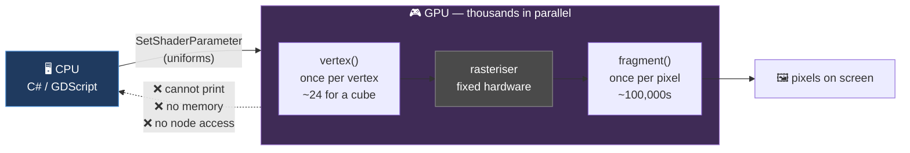

# Chapter 0.13 — GDShader: The Fourth Language

🪜 **Scaffolding: 90 / 10.**

---

## 🎯 Goal

By the end your cube will be coloured by a shader you wrote, driven by a value your C# sets — and you will understand why this language cannot do anything the other three can.

---

## 🏃 Fast-Track Summary

*Path C: read this and the cheat sheet, do ⭐ P1, move on.*

- A shader is **not game logic**. It runs on the **GPU**, thousands of times per frame, and cannot read a variable, call your code, or remember anything between frames.
- Create a `ShaderMaterial` on the cube, then a new **Shader** resource:
  ```glsl
  shader_type spatial;

  uniform vec3 tint : source_color = vec3(1.0, 0.4, 0.2);
  uniform float pulse_speed = 2.0;

  void fragment() {
      float pulse = 0.5 + 0.5 * sin(TIME * pulse_speed);
      ALBEDO = tint * pulse;
  }
  ```
- ⭐ **`uniform` is the bridge.** Set it from C#:
  ```csharp
  var mat = (ShaderMaterial)GetActiveMaterial(0);
  mat.SetShaderParameter("tint", new Vector3(0f, 1f, 0.5f));
  ```
- `vertex()` runs **once per vertex** · `fragment()` runs **once per pixel** · `TIME` is free · there are **no loops over the scene** and **no `print`**.
- `: source_color` on a colour uniform gives you a colour picker and correct colour-space handling.
- Break it: use a `fragment`-only built-in inside `vertex()`. The compiler refuses — and the reason is the whole chapter.
- Commit: `ch 0.13: gdshader first contact`

---

## 🧭 Before you start

| You need | From |
|---|---|
| P00 with `Spinner.cs` on the cube | [0.11](Chapter_00.11_CSharpFirstContact.md) |
| The Remote scene tree | [0.6](Chapter_00.06_TheGodotEditor.md) Step 5 — you will tune live |

> 📌 **This is a first taste, not the shader module.** Module 6 is twelve chapters of GDShader and six shaders you write by hand. Today's job is only to establish that it is a **different kind of thing** — so that when it arrives properly, it is not a surprise.

---

## 🔨 Build

### Step 1 — Give the cube a shader material

1. Select `Cube` in `Main.tscn`.
2. Inspector → `MeshInstance3D` → **Material Override** → **New ShaderMaterial**.
3. Click the new material to expand it → **Shader** → **New Shader**.
4. Name it `res://CubeShader.gdshader`. Create, then double-click it.

The **Shader Editor** opens in the bottom panel — a fourth place code lives, alongside Output, Debugger and MSBuild.

> ⚠️ **`Spinner.cs` sets `MaterialOverride` in `_Ready` from [0.11](Chapter_00.11_CSharpFirstContact.md).** Comment out those three lines, or your C# will replace this material at runtime and you will see nothing.

### Step 2 — The smallest possible shader

Replace everything in the editor with:

```glsl
shader_type spatial;

void fragment() {
    ALBEDO = vec3(1.0, 0.0, 0.0);
}
```

**Save.** The cube turns red **immediately** — no Build, and no need to run the scene.

> 🚨 **Note what just happened.** You did not press Build. You did not press `F6`. The change appeared in the *editor viewport*, because shaders are compiled by the GPU driver and applied live. **This is a third iteration model**, different from both C# and GDScript.

### Step 3 — Something that moves without any code running

```glsl
shader_type spatial;

void fragment() {
    float pulse = 0.5 + 0.5 * sin(TIME * 2.0);
    ALBEDO = vec3(pulse, 0.2, 0.4);
}
```

Save. **The cube pulses** — in the editor, with the game not running.

`TIME` is a built-in the engine supplies to every shader. There is no `_Process`, no update loop and no script. **The GPU is simply re-evaluating this function every frame, for every pixel of the cube.**

### Step 4 — Uniforms: the only way in ⭐

A shader cannot read your C# variables. The bridge is a `uniform`.

```glsl
shader_type spatial;

uniform vec3 tint : source_color = vec3(1.0, 0.4, 0.2);
uniform float pulse_speed = 2.0;
uniform float metallic_amount : hint_range(0.0, 1.0) = 0.0;

void fragment() {
    float pulse = 0.5 + 0.5 * sin(TIME * pulse_speed);
    ALBEDO = tint * pulse;
    METALLIC = metallic_amount;
    ROUGHNESS = 0.3;
}
```

Save, then look at the **Inspector** under the material's **Shader Parameters**:

- `tint` is a **colour picker** — because of `: source_color`
- `pulse_speed` is a number box
- `metallic_amount` is a **slider** 0–1 — because of `: hint_range`

> 💡 **Those hints are the same idea as `[Export(PropertyHint.Range, ...)]` in [0.11](Chapter_00.11_CSharpFirstContact.md)** — metadata on a declaration, read by the editor to choose a widget. Different language, identical principle.

Run the scene and change `tint` from the **Remote** tree while it plays.

### Step 5 — Drive it from C# ⭐

Add to `Spinner.cs`:

```csharp
    [Export] public Color ShaderTint { get; set; } = new Color(0f, 1f, 0.5f);

    public override void _Ready()
    {
        // ... existing GD.Print ...
        var mesh = GetNode<MeshInstance3D>(".");
        if (mesh.MaterialOverride is ShaderMaterial shaderMat)
        {
            shaderMat.SetShaderParameter("tint",
                new Vector3(ShaderTint.R, ShaderTint.G, ShaderTint.B));
            GD.Print($"Shader tint set to {ShaderTint}");
        }
    }
```

Build, `F6`. The cube takes the colour your **C#** chose.

> 🚨 **The parameter name is a string.** `"tint"` must match the uniform exactly. Misspell it and **nothing happens** — no error, no warning, in any panel. Same failure shape as the node-path strings in [0.6](Chapter_00.06_TheGodotEditor.md) and [0.11](Chapter_00.11_CSharpFirstContact.md), and the same reason [10.6b](../TableOfContents.md) wraps such things behind typed interfaces.

### Step 6 — `vertex()` versus `fragment()`

Add a vertex function:

```glsl
void vertex() {
    VERTEX.y += sin(TIME * 3.0 + VERTEX.x * 2.0) * 0.1;
}
```

Save. The cube's surface **ripples** — the geometry itself is being moved, not just coloured.

> 🐣 **The difference in one line.** `vertex()` runs **once per vertex** — a cube has 24. `fragment()` runs **once per pixel the cube covers** — potentially hundreds of thousands. **That ratio is the entire economics of shader writing**, and Module 6 is largely about exploiting it.

### Step 7 — On the phone

One-click deploy. Confirm the pulse and ripple work on device.

> 📱 **This is not a formality.** Shaders are compiled by the **GPU driver on the target device**, and a shader that compiles on an NVIDIA desktop driver can fail on a Mali or Adreno mobile driver. Checking on device from the first shader is a habit worth having early — chapter [6.12](../TableOfContents.md) is about the consequences.

### Step 8 — Commit

```bash
git add .
git commit -m "ch 0.13: gdshader first contact"
git push
```

---

## ▶️ Run it

- [ ] Cube turns red from a two-line shader, with **no Build press**
- [ ] It pulses with `TIME`, in the **editor**, game not running
- [ ] Three uniforms appear in the Inspector with the right widgets
- [ ] C# sets `tint` and the cube obeys
- [ ] `vertex()` ripples the geometry
- [ ] All of it works **on the phone**

---

## 👀 Observe

Three things this language did that neither C# nor GDScript can.

**It updated without a build and without running the game.** A third iteration model — save and it is live, in the editor.

**It animated with no update loop.** No `_Process`, no timer, no script. Just a function of `TIME` that the GPU re-evaluates every frame.

**And notice what you could not do.** You could not print anything. You could not store a value from last frame. You could not read another node. **A shader is a pure function from inputs to a colour and a position** — and Module 6 is largely about what that constraint forces you to invent.

---

## 🧠 Why it works

### Why it is not like the other three

| | C# / GDScript | GDShader |
|---|---|---|
| Runs on | CPU | **GPU** |
| How often | Once per frame, per object | **Per vertex, then per pixel** — thousands of times |
| Can it print? | Yes | **No** |
| Remember last frame? | Yes | **No** — no state at all |
| Read other nodes? | Yes | **No** — only uniforms and built-ins |
| Iteration | build/save → run | **save → live in the editor** |

The GPU runs **thousands of copies of your function in parallel**, each on a different vertex or pixel, with no communication between them. Nearly every restriction above follows from that one fact: parallel instances cannot share state, cannot take turns writing to a console, and cannot wait for each other.

### Uniforms, and why they are the only door

A `uniform` is a value that is **the same for every one of those parallel invocations** — hence the name. Setting one is a message from the CPU to the GPU, sent once per frame at most.

That is why there is no other way in. Reading a node from inside a shader would require every parallel invocation to reach back across the bus into engine memory, which would erase the parallelism that makes the GPU worth using at all.

> 🔬 **Deep dive — where the pipeline stages come from.** `vertex()` and `fragment()` are not arbitrary. The GPU runs a fixed pipeline: vertices are transformed → assembled into triangles → **rasterised** into pixels → each pixel shaded. Your `vertex()` hooks the first stage and your `fragment()` the last. You cannot write a stage in between because the rasteriser is fixed-function hardware. **In Module 6 that pipeline stops being trivia and becomes the thing you optimise against** — because moving work from `fragment()` to `vertex()` can be a hundredfold saving.

---

## 🗺️ Mental model



One arrow in. No arrow out. That asymmetry is the language.

---

## 💥 Break it

Three sabotages, restoring after each.

1. In `vertex()`, try to use a fragment-stage built-in:
   ```glsl
   void vertex() {
       ALBEDO = vec3(1.0, 0.0, 0.0);   // ALBEDO belongs to fragment()
   }
   ```
2. Restore. In C#, misspell the uniform: `SetShaderParameter("tintt", ...)`. Build and run.
3. Restore. Delete the first line, `shader_type spatial;`. Save.

---

## 🔎 Diagnose

**Which of the three produced no error at all, and why is that the dangerous one? Answer before opening.**

<details>
<summary>Answer</summary>

**1 — `ALBEDO` in `vertex()`** fails at **shader compile**, in the Shader Editor, immediately on save. `[UNVERIFIED]` — the exact message, but expect something about an unknown or unavailable identifier.

The reason is structural rather than stylistic: **at the vertex stage no pixel exists yet.** `ALBEDO` is the colour of a pixel, and the rasteriser has not run. You are not being told off for style; you are asking for something that does not exist at that point in the pipeline.

**3 — missing `shader_type`** also fails immediately. The engine cannot know whether this is a 3D (`spatial`), 2D (`canvas_item`), particle or sky shader, and the available built-ins differ for each. It is the first line for a reason.

**2 — the misspelled uniform does nothing at all.** No compile error, no runtime error, no warning in any of the four panels. The cube keeps its default colour and everything appears to work.

**Why that is the dangerous one.** `SetShaderParameter` takes a **string**, and setting a parameter that does not exist is *not an error* — a shader may legitimately be swapped for another with different uniforms. So the engine cannot distinguish your typo from a deliberate no-op.

**This is now the third time you have met the same failure shape:**

| Chapter | The string | Symptom |
|---|---|---|
| [0.6](Chapter_00.06_TheGodotEditor.md) | `GetNode("NoSuchNode")` | Runtime error — at least it complains |
| [0.11](Chapter_00.11_CSharpFirstContact.md) | Filename ≠ class name | **Silence** |
| **0.13** | `SetShaderParameter("tintt", …)` | **Silence** |

**The general rule: a string that names something is a check the compiler cannot make.** Every one you write is a defect deferred to runtime — and sometimes not even to runtime, but to *nothing at all*.

Which is exactly why the course keeps returning to it: `[Export] NodePath` over path strings ([1.26](../TableOfContents.md)), typed wrappers over `Call()` into GDScript addons ([10.6b](../TableOfContents.md)), and cached `StringName` constants for shader parameters ([6.3](../TableOfContents.md)). **All the same fix: turn a string into something the compiler can see.**

</details>

---

## 🏋️ Practicals

**⭐ P1 — Make it yours.** Change the shader so the cube's colour depends on its **world position** rather than time. `[UNVERIFIED]` — find the right built-in with `F1`, searching the shader reference. Getting there yourself is the exercise.

**P2 — Feel the vertex/fragment cost.** Move the `sin()` calculation from `fragment()` into `vertex()`, passing the result with a `varying`. The look changes subtly. **That change is the hundredfold saving** Module 6 is built on — find out what it looks like now.

**P3 — Break it on the phone.** Deploy each of your shader variants and confirm they render identically to the desktop. If any differs, **that is a finding** — record it in [`Troubleshooting.md`](../reference/Troubleshooting.md), because mobile GPU drivers are a real source of surprises.

**🔬 P4 — Read a real one.** Open [godotshaders.com](https://godotshaders.com/), find a simple spatial shader, and read it. You will not follow all of it. Identify the `uniform`s and which function each line lives in — that is enough for today.

---

## ✅ Check yourself

1. Why can a shader not print anything?
2. What is a `uniform`, and why is it the only way to send data in?
3. How many times does `fragment()` run compared with `vertex()`, and why does it matter?
4. Why is `shader_type` the first line?
5. Why did the misspelled parameter produce no error, and which two earlier chapters showed the same shape?

<details>
<summary>Answers</summary>

1. Because **thousands of copies run in parallel** on the GPU, each on a different vertex or pixel, with no communication and no shared output stream. A console needs somewhere ordered to write; a shader has no such place.
2. A value that is **the same for every parallel invocation** — hence "uniform". It is set from the CPU, at most once per frame. It is the only door because reading engine memory from inside a shader would destroy the parallelism that makes the GPU worth using.
3. `vertex()` runs **once per vertex** (24 for a cube); `fragment()` runs **once per pixel covered** (potentially hundreds of thousands). Moving work from fragment to vertex can be a hundredfold saving — the economics Module 6 is built on.
4. Because the available built-ins **differ by shader type** — `spatial`, `canvas_item`, `particles`, `sky`. The engine cannot compile anything until it knows which set applies.
5. `SetShaderParameter` takes a **string**, and setting a non-existent parameter is legitimately a no-op, so the engine cannot tell a typo from intent. Same shape as `GetNode("NoSuchNode")` in [0.6](Chapter_00.06_TheGodotEditor.md) and the filename rule in [0.11](Chapter_00.11_CSharpFirstContact.md). **A string that names something is a check the compiler cannot make.**

</details>

---

## 📎 Cheat sheet

| GDShader | Means |
|---|---|
| `shader_type spatial;` | **Required first line.** 3D. Others: `canvas_item`, `particles`, `sky` |
| `void vertex() { }` | Per vertex — move geometry |
| `void fragment() { }` | Per pixel — decide colour |
| `uniform vec3 c : source_color;` | Colour picker in Inspector |
| `uniform float x : hint_range(0,1);` | Slider |
| `TIME` | Seconds since start — free animation |
| `VERTEX` | Position, in `vertex()` |
| `ALBEDO` `METALLIC` `ROUGHNESS` | Outputs, in `fragment()` |
| `varying` | Pass a value vertex → fragment |

| From C# | |
|---|---|
| `(ShaderMaterial)mesh.MaterialOverride` | Get the material |
| `mat.SetShaderParameter("name", value)` | ⚠️ **String — a typo is silent** |

| Cannot | |
|---|---|
| Print · remember state · read nodes · call your code | All follow from massive parallelism |

---

## 🔗 Further reading

- [Shading language reference](https://docs.godotengine.org/en/stable/tutorials/shaders/shader_reference/shading_language.html)
- [Your first 3D shader](https://docs.godotengine.org/en/stable/tutorials/shaders/your_first_shader/your_first_3d_shader.html)
- [godotshaders.com](https://godotshaders.com/) — read them, do not just paste them
- [`Languages.md`](../Languages.md) — GDShader's place in the course

---

## 💾 Commit

```text
ch 0.13: gdshader first contact
```

---

## ➡️ What's next

**[0.14 — The language decision table](Chapter_00.14_LanguageDecisionTable.md).** You have now written all four languages this course uses, or seen where the fourth will arrive. Next you turn your own measurements into a rule you will apply for the next 300 chapters.

---

## 🪞 Reflection

In two sentences: **why can a shader not print, and what single fact explains that along with every other restriction?**

---

## 📝 Chapter changelog

| Version | Date | Change |
|---|---|---|
| 1.0 | 2026-09-02 | First published. `[UNVERIFIED]` on shader-compile error text, Shader Editor layout and mobile driver behaviour. |
