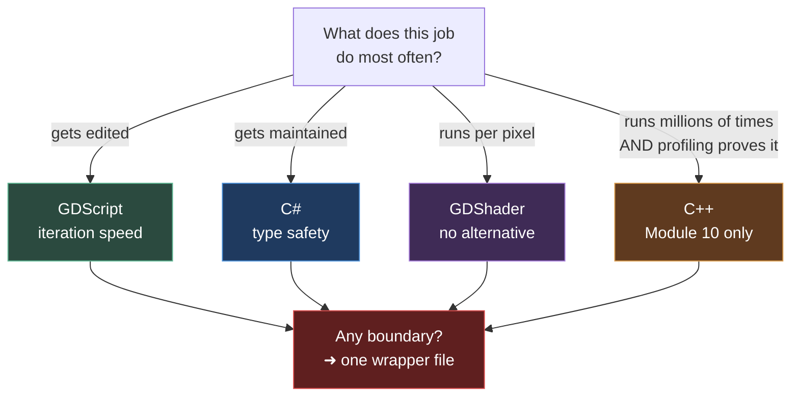

# Chapter 0.14 — The Language Decision Table

🪜 **Scaffolding: 80 / 20.** The format is given; the content is yours.

---

## 🎯 Goal

By the end, a **decision table written by you, from your own measurements**, exists in the repository — and you will have tested it against five real scenarios and felt one wrong answer deliberately.

---

## 🏃 Fast-Track Summary

*Path C: read this and the cheat sheet, do ⭐ P1 and ⭐ P2, move on.*

- Create `docs/meta/LanguageChoice.md` from the template in Step 2. **Fill it with your numbers from [0.12](Chapter_00.12_MeasuredTwoLanguages.md)**, not mine.
- The starting rule, which you may amend:

  | Job | Language |
  |---|---|
  | Gameplay systems, data, saves, tests | **C#** |
  | `@tool` editor scripts, plugins, reading addons | **GDScript** |
  | Anything on the GPU | **GDShader** |
  | A hot path you have **measured** | **C++** — Module 10 only |
  | A boundary between any two | **one wrapper file** |

- ⭐ **Test it on five scenarios** in Step 3 before you trust it.
- ⭐ **Break it deliberately:** write a `@tool` script in C# and feel the rebuild-per-edit friction. **That is why GDScript keeps eight chapters.**
- The C++ row stays **`?` until Module 10** — you have no measurement, so you have no business filling it in.
- Commit: `ch 0.14: my language decision table`

---

## 🧭 Before you start

| You need | From |
|---|---|
| Your measurements in `Machines.md` | [0.12](Chapter_00.12_MeasuredTwoLanguages.md) |
| Having written GDScript and GDShader | [0.10](Chapter_00.10_GDScriptFirstContact.md), [0.13](Chapter_00.13_GDShaderFirstContact.md) |

> 📌 **This chapter produces a document you will actually consult.** Not a summary of what you read — a rule you wrote, from evidence you gathered, that answers *"which language should this be?"* for the next 300 chapters.

---

## 🔨 Build

### Step 1 — Assemble your evidence

Open [`Machines.md`](../meta/Machines.md) and copy out what you measured:

| Fact | Yours |
|---|---|
| C# iteration, median | |
| GDScript iteration, median | |
| Difference | |
| APK cost of the .NET runtime | |
| Shader iteration | *(instant — no build, no run)* |

Then add what you **observed** rather than measured:

| Observation | Chapter |
|---|---|
| C# catches typos at build; GDScript catches them when the line runs | [0.10](Chapter_00.10_GDScriptFirstContact.md) |
| `rotate_y` and `RotateY` are one function — case conversion is enough | [0.10](Chapter_00.10_GDScriptFirstContact.md) |
| Godot's conventions (filename, property-not-field) fail **silently** | [0.11](Chapter_00.11_CSharpFirstContact.md) |
| A shader cannot print, remember, or read nodes | [0.13](Chapter_00.13_GDShaderFirstContact.md) |
| Parameter and path **strings** are checks the compiler cannot make | [0.6](Chapter_00.06_TheGodotEditor.md), [0.11](Chapter_00.11_CSharpFirstContact.md), [0.13](Chapter_00.13_GDShaderFirstContact.md) |

### Step 2 — Write the table ⭐

Create **`docs/meta/LanguageChoice.md`**:

```markdown
---
title: "Language Choice — my decision table"
document_id: LANGCHOICE
version: 1.0
status: Active
created: <date>
last_updated: <date>
update_trigger: "When a measurement changes my mind, or a chapter proves a rule wrong"
---

# 🗣️ My Language Decision Table

Written in chapter 0.14 from my own measurements. **Amend it when evidence says so** —
and record *why* underneath, because a rule you cannot justify is a rule you will
abandon under pressure.

## My numbers (0.12)

| | C# | GDScript | GDShader | C++ |
|---|---|---|---|---|
| Iteration (median) | s | s | instant | ? — Module 10 |
| Ships in the APK | + MB (fixed) | baseline | baseline | ? |
| Errors caught at | build | when the line runs | shader compile | ? |

## The rule

| The job | Language | Because (in my words) |
|---|---|---|
| Gameplay systems, state machines, combat | | |
| Data, save files, serialisation | | |
| Unit tests | | |
| A `@tool` script that runs in the editor | | |
| An editor plugin or dock | | |
| Reading or patching a community addon | | |
| Quick prototype of an idea | | |
| Anything per-pixel or per-vertex | | |
| A hot path I have **measured** | **C++ — not before Module 10** | No measurement yet, so no opinion |
| A boundary between two of the above | **One wrapper file** | Boundary bugs fail at runtime |

## Amendments

| Date | Changed | Evidence |
|---|---|---|
| | | |
```

**Fill in every "Because" cell in your own words.** If you cannot justify a row, you have not decided it — you have copied it.

### Step 3 — ⭐ Test it against five scenarios

For each, write down your answer **and your reason**, then check against the collapsed answer. **You are testing your table, not yourself** — a disagreement means one of you needs amending.

1. A script that draws a warning gizmo in the **editor viewport** when a level designer places a light with zero energy.
2. A save system that serialises player progress to JSON and migrates old files.
3. Making an enemy dissolve into embers when it dies.
4. You found an addon that does exactly the pathfinding you need. It is 800 lines of GDScript.
5. Profiling shows one function taking **4 ms per frame** of your 16.6 ms budget.

<details>
<summary>Answers — compare with yours</summary>

1. **GDScript.** A `@tool` script runs continuously while the designer works, and instant reload beats compile-time checking here. Rebuilding on every keystroke is the friction you are about to feel in Break it. → chapter [5.9b](../TableOfContents.md)
2. **C#.** Typed, testable, refactorable, and NuGet has the serialisers. This is the archetypal C# job. → [1.33](../TableOfContents.md), [10.7](../TableOfContents.md)
3. **GDShader**, with C# driving a uniform. The dissolve is per-pixel — nothing else can do it. → [6.4](../TableOfContents.md)
4. **Use it as GDScript**, then decide. Three options in increasing cost: use it directly and accept the friction · **wrap it behind a C# interface** (usually an hour) · read it and reimplement the 200 lines you need. **Do not reimplement 800 lines because it is not C#.** → [10.6b](../TableOfContents.md)
5. **Not C++ yet.** 4 ms is a lot, but first find out *why*: an allocation per frame, an O(n²) loop, an unnecessary physics query. **C++ is the answer only after profiling shows the algorithm is right and the language is the limit** — which is Module 10's [10.1e](../TableOfContents.md), the measured rewrite.

If you disagreed on 5, that is the most interesting one. Reaching for a faster language before checking the algorithm is the commonest performance mistake there is.

</details>

### Step 4 — ⭐ Break it: use the wrong language on purpose

Feel a wrong answer rather than being told about it.

Write a `@tool` script **in C#**. In your P00 project, create `GizmoWarn.cs`:

```csharp
using Godot;

[Tool]
public partial class GizmoWarn : Node3D
{
    [Export] public string Message { get; set; } = "hello from the editor";

    public override void _Ready()
    {
        if (Engine.IsEditorHint())
            GD.Print($"[tool] {Message}");
    }
}
```

Attach it to a new `Node3D` in your scene. Now **iterate on it** — change the message five times, and each time make the editor reflect the change.

`[UNVERIFIED]` — exactly what your version requires to reload a `[Tool]` C# script after an edit. **That uncertainty is itself the lesson.**

---

## 🔎 Diagnose

**What did each edit cost, and what does that tell you about the GDScript row in your table? Answer before opening.**

<details>
<summary>Answer</summary>

Each edit required a **Build**, and probably more — reloading a `[Tool]` C# script often means the editor must reload the assembly, and in some versions that means **restarting the editor**. `[UNVERIFIED]`

Compare with a `@tool` GDScript: save the file, and the editor re-runs it immediately.

**Now put numbers on it.** Take your C# iteration median from [0.12](Chapter_00.12_MeasuredTwoLanguages.md) — call it *n* seconds. A tool script is edited *while you use it*, so a realistic session is dozens of edits. **Dozens of *n*-second waits, versus dozens of instant ones.**

That is not a small preference. It is the difference between a tool you keep improving and a tool you write once and resent.

**This is the entire justification for GDScript's eight chapters** ([`Languages.md`](../Languages.md)). Not "GDScript is nice", not "some people prefer it" — **a measured, structural mismatch between C#'s compile step and the way editor tooling is actually written.**

**And notice the shape of the argument, because you will reuse it.** The right question was never *"which language is better?"* It was *"what does this particular job do most often?"*

- A **tool script** is *edited* constantly → optimise for edit speed → GDScript.
- A **save system** is *maintained* for years → optimise for type safety and refactoring → C#.
- A **shader** runs *per pixel* → only one language can → GDShader.
- A **hot path** is *executed* millions of times → optimise for speed → C++, **but only after profiling proves the algorithm is already right.**

**Match the language to the dominant verb of the job.** That single sentence is what your table is really encoding, and it is worth writing at the top of it.

</details>

### Step 5 — Amend and commit

Go back to `LanguageChoice.md`. **Change anything the scenarios or the Break-it proved wrong**, and record the amendment with its evidence.

```bash
git add docs/meta/LanguageChoice.md docs/meta/Machines.md
git commit -m "ch 0.14: my language decision table"
git push
```

---

## ▶️ Run it

- [ ] `docs/meta/LanguageChoice.md` exists, with **your** numbers
- [ ] Every "Because" cell is in your own words
- [ ] Five scenarios answered before checking
- [ ] The C++ row still says `?`
- [ ] You wrote a `[Tool]` C# script and felt the loop
- [ ] At least one amendment recorded with its evidence

---

## 👀 Observe

Look at your table. Almost every row says **C#** — and that is correct, because most of this course is gameplay systems and architecture.

But the exceptions are not decoration. Each one exists because a **specific measured property** of that job made a different language better. That is the difference between a polyglot codebase and a messy one: **each language present has a reason you can state in one sentence.**

Now look at the C++ row still holding a `?`. You have written three languages and measured two, and you are declining to have an opinion on the fourth because you have no evidence. **That restraint is the actual skill this block was teaching.**

---

## 🧠 Why it works

### Match the language to the dominant verb

| The job is mostly… | Optimise for | Language |
|---|---|---|
| **Edited** (tool scripts, prototypes) | Iteration speed | GDScript |
| **Maintained** (systems, data, tests) | Type safety, refactoring | C# |
| **Executed per pixel** | Nothing else can | GDShader |
| **Executed millions of times** | Raw speed — after profiling | C++ |

Almost every language argument you will ever read is really an argument about *which verb matters*, conducted by people who have not noticed they are answering different questions.

### Why the boundaries need a rule of their own

Cross-language calls fail at **runtime**, not compile time ([ADR-031](../meta/Decisions.md#adr-031)). You have now met that failure three times in three different disguises — node paths, the filename rule, shader parameter names — and all three were strings the compiler could not check.

Hence: **one wrapper file per boundary.** Not because wrappers are elegant, but because they **confine an unavoidable class of runtime failure to one file you can test**, instead of scattering it through a codebase.

> 🔬 **Deep dive — why the C++ row must stay empty.** You could fill it in now from received wisdom: *"C++ is faster."* It is true and it is useless, because it does not tell you **when the difference matters**. In [10.1e](../TableOfContents.md) you take one profiled hot path through GDScript → C# → C++, benchmarking on the phone at each step, and find out where the curve actually flattens for your code on your hardware. **An empty cell that you will fill with a measurement is worth more than a full one you copied** — which is the same argument as [0.12](Chapter_00.12_MeasuredTwoLanguages.md), applied to a decision instead of a number.

---

## 🗺️ Mental model



---

## 🏋️ Practicals

**⭐ P1 — Finish the table.** Every row, every "Because", in your words. Committed.

**⭐ P2 — Add a sixth scenario of your own.** Something from a game you have played. Answer it with your table. If the table cannot answer it, **that is a missing row** — add it.

**P3 — Predict Module 10.** Write one sentence predicting what the C++ row will say once you have measured it. Date it, and do not edit it. You will check in [10.1e](../TableOfContents.md); being wrong is more instructive than being right.

**🔬 P4 — Find a counter-example.** Search for a Godot project that made the *opposite* choice to one of your rows — an entire game in GDScript, or tooling written in C#. Read their reasoning. **Either you learn something or your justification gets stronger.**

---

## ✅ Check yourself

1. What is the one question that decides which language a job gets?
2. Why does the C++ row still say `?`
3. You need an addon that is 800 lines of GDScript. What are your three options, in order of cost?
4. Why does every language boundary get its own wrapper file?
5. Why is 4 ms per frame not sufficient reason to reach for C++?

<details>
<summary>Answers</summary>

1. **What does this job do most often?** Edited → GDScript. Maintained → C#. Runs per pixel → GDShader. Executed millions of times *and profiled* → C++. Match the language to the dominant verb.
2. Because **you have no measurement**, and therefore no business having an opinion. It gets filled in at [10.1e](../TableOfContents.md), after taking one hot path through all three and benchmarking on the phone.
3. Use it directly from C# and accept the friction · **wrap it behind a C# interface** (usually an hour) · read it and reimplement only the part you need. **Never reimplement 800 lines merely because it is not C#.**
4. Because cross-language calls fail at **runtime**, not compile time. A wrapper **confines an unavoidable class of failure to one testable file** rather than scattering it through the codebase.
5. Because it does not tell you **why**. It could be an allocation per frame, an O(n²) loop, or a redundant physics query — all of which C++ would make *faster while still wrong*. C++ is the answer only once profiling shows the algorithm is right and the language is the limit.

</details>

---

## 📎 Cheat sheet

| Job | Language |
|---|---|
| Gameplay, data, saves, tests | **C#** |
| `@tool` scripts, editor plugins, reading addons | **GDScript** |
| Anything per-pixel or per-vertex | **GDShader** |
| A **measured** hot path | **C++** — Module 10 |
| Any boundary | **One wrapper file** |

| Principle | |
|---|---|
| **Match the language to the dominant verb** | Edited · maintained · per pixel · millions of times |
| **No measurement, no opinion** | The C++ row stays `?` |
| **Strings are checks the compiler cannot make** | Paths, filenames, shader params |
| **Boundaries fail at runtime** | Confine them to one file |

---

## 🔗 Further reading

- [`Languages.md`](../Languages.md) — where each language is used across all 359 chapters
- [`Toolchain.md` §4b–4c](../Toolchain.md) — the three-way library comparison
- [ADR-001](../meta/Decisions.md#adr-001) · [ADR-031](../meta/Decisions.md#adr-031)

---

## 💾 Commit

```text
ch 0.14: my language decision table
```

---

## ➡️ What's next

**[0.15 — The Asset Library, and how to evaluate a dependency](../TableOfContents.md).** Block **0B** is complete — you have written every language this course uses and decided, from evidence, which job each one gets. Block **0C** turns the same scepticism on other people's code.

---

## 🪞 Reflection

In two sentences: **what is the one question your table really encodes, and why is the C++ row still empty?**

---

## 📝 Chapter changelog

| Version | Date | Change |
|---|---|---|
| 1.0 | 2026-09-02 | First published. `[UNVERIFIED]` on `[Tool]` C# reload behaviour — which is itself the point of the Break-it. |
