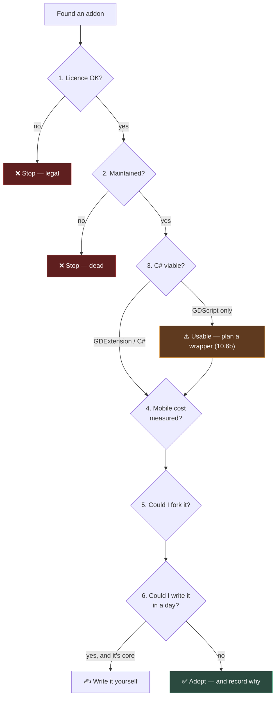

# Chapter 0.15 — The Asset Library, and How to Evaluate a Dependency

🪜 **Scaffolding: 85 / 15.** The method is given; the verdicts are yours.

---

## 🎯 Goal

By the end you will have installed a real addon, used it in P00, and **written dated evaluations of three dependencies** into the repository — including at least one **rejection**.

---

## 🏃 Fast-Track Summary

*Path C: read this and the cheat sheet, do ⭐ P1, move on.*

- **The six questions** ([ADR-029](../meta/Decisions.md#adr-029)), in the order that eliminates fastest:

  | # | Question | Kills it if |
  |---|---|---|
  | 1 | **Licence?** | GPL in shipped code, or unstated |
  | 2 | **Maintained?** | No commit since Godot 3, or open issues nobody answers |
  | 3 | **Works from C#?** | GDScript-only *and* you need it in a hot path |
  | 4 | **Mobile cost?** | Unmeasured — go and measure it |
  | 5 | **If abandoned?** | 50,000 lines you could never fork |
  | 6 | **Could I write it in a day?** | Yes, and it is core to your game |

- Install **Debug Draw 3D** (GDExtension → proper C# classes) and draw a line from `Spinner.cs`.
- ⭐ **Record every verdict in [`DecisionsLog.md`](../meta/DecisionsLog.md)** as a dated `🔍 VERIFIED` entry — this is [T-023](../meta/ToDos.md), and over the course it becomes a real evidence base for the Godot **C#** ecosystem, which barely exists in public.
- **A rejection is as valuable as an adoption.** Write down at least one.
- Addons live in `res://addons/`. **Commit them** — a project that does not build after `git clone` is broken.
- Commit: `ch 0.15: evaluated three dependencies`

---

## 🧭 Before you start

| You need | From |
|---|---|
| P00 with `Spinner.cs` | [0.11](Chapter_00.11_CSharpFirstContact.md) |
| Your language decision table | [0.14](Chapter_00.14_LanguageDecisionTable.md) |
| The repo committed and clean | [0.7](Chapter_00.07_GitForGameProjects.md) |

> 📌 **You have never installed an addon.** That is deliberate — [ADR-028](../meta/Decisions.md#adr-028) says hand-build first, then adopt. You have now written four languages and a working game loop, so you can judge an addon rather than depend on it.

---

## 🔨 Build

### Step 1 — Look at the Asset Library

In Godot: the **AssetLib** tab at the top, beside 2D / 3D / Script.

Search for `Debug Draw`. Before installing anything, **notice what the listing does not tell you**: no licence on the card, no last-commit date, no indication whether it works from C#, no size.

> 💡 **That is the whole reason this chapter exists.** The Asset Library is a *download index*, not a review site. Every judgement is yours to make, and the six questions are how you make it in five minutes rather than five hours.

### Step 2 — Evaluate before installing ⭐

Open the addon's repository — the listing links it. Work the six questions **in order**, because each can end the evaluation.

**1 — Licence.** Find `LICENSE`. MIT, Apache-2.0, BSD, CC0 → fine. **GPL/AGPL → stop and think**: it can oblige you to release your game's source ([ADR-008](../meta/Decisions.md#adr-008)). No licence file at all → **you have no right to use it**, regardless of how public it is.

**2 — Maintained.** Last commit date. Open issues, and whether anyone answers them. Does it declare a Godot 4 version?

> ⚠️ **The Godot 3 → 4 break orphaned a great many addons.** An addon whose last commit predates Godot 4 is not "stable"; it is dead.

**3 — Works from C#?** The decisive question for you, and the listing never answers it.

| What you find | Means |
|---|---|
| **GDExtension** (C++, ships `.gdextension`) | ✅ Registers as an engine class — proper C# types |
| **GDScript addon** | ⚠️ Usable from C#, but through nodes and `Call()` — no compile-time checking |
| **C# addon** | ✅ Rare and ideal |

**4 — Mobile cost.** Almost never stated. You measure it in Step 5.

**5 — If abandoned?** Could you fork and maintain it? 500 lines, yes. 50,000, no.

**6 — Could I write it in a day?** If yes *and* it is core to your game, write it. Dependencies have carrying cost.

Write your six answers down now, before you install.

### Step 3 — Install it

`AssetLib` → **Debug Draw 3D** → Download → Install. `[UNVERIFIED]` — exact availability and naming in your version; if it is absent, install from its GitHub releases into `res://addons/`.

Then `Project → Project Settings → Plugins` → **enable** it. Godot will likely ask to restart.

```bash
ls addons/          # 🐧
```
```powershell
Get-ChildItem addons\    # 🪟
```

> 🚨 **`addons/` is committed, not ignored.** A project that does not build after `git clone` is broken. Check your `.gitignore` does not exclude it — [0.7](Chapter_00.07_GitForGameProjects.md)'s `git check-ignore -v addons/` should print **nothing**.

### Step 4 — Actually use it

In `Spinner.cs`, add to `_Process`:

```csharp
        // draw a line showing which way the cube is facing
        DebugDraw3D.DrawLine(GlobalPosition,
                             GlobalPosition - GlobalTransform.Basis.Z * 2f,
                             Colors.Yellow);
```

`[UNVERIFIED]` — the exact C# API surface of your version. Use `F1` and the addon's README.

Build, `F6`. A yellow line points out of the cube's forward face and swings as it spins.

> 💡 **Notice what you just got for free:** a typed C# class, autocomplete, and a compile error if you misspell it. That is question 3 paying off. A GDScript addon would have been `Call("draw_line", ...)` with none of it.

### Step 5 — Measure question 4

Export an APK with the addon, and one without *(disable the plugin, rebuild, export)*.

| APK | MB |
|---|---|
| With Debug Draw 3D | |
| Without | |
| **Cost** | |

Use the method from [0.12](Chapter_00.12_MeasuredTwoLanguages.md) — this is exactly that skill applied to a dependency.

> ⚠️ **Debug-only addons should not ship.** Once you know the cost, the right answer is usually to strip it from release builds. Chapter [11.16](../TableOfContents.md) covers how; knowing that you *should* is today's lesson.

### Step 6 — Evaluate two more, and reject one ⭐

Pick two others from the Asset Library. Suggested, because they recur later in this course:

- **Phantom Camera** — a camera rig system ([2.24b](../TableOfContents.md))
- **Dialogic 2** or **Dialogue Manager** — dialogue systems ([8.10b](../TableOfContents.md))
- **Beehave** — behaviour trees ([11.6b](../TableOfContents.md))

Run the six questions on each. **Do not install them** — you have no problem for them to solve yet, and [ADR-028](../meta/Decisions.md#adr-028) says the hand-built version comes first.

**At least one verdict must be "not now", with a reason.**

### Step 7 — Record the verdicts ⭐

Append to [`docs/meta/DecisionsLog.md`](../meta/DecisionsLog.md):

```markdown
### 🔍 VERIFIED — dependency evaluations (chapter 0.15, <date>)

| Addon | Licence | Last commit | C# story | Mobile cost | Verdict |
|---|---|---|---|---|---|
| Debug Draw 3D | | | GDExtension → typed | MB | ✅ Adopted — debug builds only |
| <second> | | | | | ⏸️ Not now — <reason> |
| <third> | | | | | |
```

> 📌 **This is [T-023](../meta/ToDos.md), and it compounds.** Over 359 chapters these entries become an evidence base for the Godot **C#** ecosystem — something that barely exists publicly, because almost every addon review is written by a GDScript user.

### Step 8 — Commit

```bash
git add .
git commit -m "ch 0.15: evaluated three dependencies"
git push
```

---

## ▶️ Run it

- [ ] Six questions answered **before** installing
- [ ] Debug Draw 3D installed, enabled, and drawing from C#
- [ ] `addons/` is committed, not ignored
- [ ] APK cost measured
- [ ] Three evaluations in `DecisionsLog.md`, **at least one a rejection**

---

## 👀 Observe

You spent longer evaluating than installing. That ratio is correct and it will feel wrong for a while.

Notice which question nearly ended it. For most people it is **2 (maintained)** or **3 (C#)** — and both are invisible on the Asset Library card. The listing shows you a name, an icon and a download button; **everything that determines whether it is a good idea lives somewhere else.**

---

## 🧠 Why it works

### Why the questions are in that order

Each is cheaper than the next and can end the evaluation.

| Order | Cost to answer | Why here |
|---|---|---|
| 1 Licence | Seconds | A legal blocker makes everything else irrelevant |
| 2 Maintained | A minute | A dead addon fails no matter how good |
| 3 C# viability | Minutes | Decides *how* you would use it, not whether |
| 4 Mobile cost | An export | Only worth measuring if 1–3 passed |
| 5 Abandonment | Judgement | Needs 2 and 3 first |
| 6 Write it yourself? | Judgement | The final sanity check |

Answering them out of order is how people spend an afternoon benchmarking something they cannot legally ship.

### The real cost of a dependency

Installation is the cheapest moment of a dependency's life. Afterwards you own: **upgrade friction** every time Godot updates · **debugging through someone else's code** · **a bus factor you do not control** · and **onboarding cost** for anyone who joins.

Which is what question 6 is really asking. Not *"am I clever enough?"* but *"is the carrying cost lower than the writing cost?"* For a camera rig you use everywhere, a good library wins easily. For 200 lines of maths at the heart of your game, it usually does not.

> 🔬 **Deep dive — why GDExtension addons have the better C# story.** A GDExtension registers real classes with the engine's ClassDB, complete with type metadata. Godot's C# bindings generate strongly-typed wrappers from that registry — so `DebugDraw3D.DrawLine(...)` is a normal method call with compile-time checking. A GDScript addon registers no such class; it is a script attached to a node, so from C# you reach it via `GetNode` and `Call("method_name", args)` — strings again, and [0.13](Chapter_00.13_GDShaderFirstContact.md) already told you what strings cost. That single architectural difference is why [ADR-029](../meta/Decisions.md#adr-029) prefers GDExtension and C#-native libraries, and why [10.6b](../TableOfContents.md) exists to wrap the rest.

---

## 🗺️ Mental model



---

## 💥 Break it

Adopt something badly on purpose.

1. Find any Asset Library addon **whose last release predates Godot 4** — search and sort by oldest, or look for one advertising 3.x.
2. Download and install it.
3. Enable it in Project Settings.
4. Observe.

Then remove it: disable the plugin, delete its folder from `addons/`, and check `git status`.

---

## 🔎 Diagnose

**What failed, at which stage, and which of the six questions would have prevented it? Answer before opening.**

<details>
<summary>Answer</summary>

Most Godot 3 addons fail **on enable**, with parse errors in the Output panel — GDScript's syntax changed between 3 and 4 (`export var` → `@export var`, `onready` → `@onready`, changed node names, removed methods). `[UNVERIFIED]` — your exact errors.

**Question 2 would have prevented it in about thirty seconds.** One glance at the last commit date.

**The subtler damage is worth noting.** You now have files in `addons/`, an entry in `project.godot`'s enabled-plugins list, and possibly a modified `.godot/` cache. Removing an addon is not always as clean as installing one — which is another reason to evaluate first.

**And the failure mode that is genuinely dangerous is not this one.** A Godot 3 addon fails *loudly*, immediately, and you know within a minute. The expensive version is the addon that:

- **installs cleanly and works** — so you build three modules of your game on it, and
- **is unmaintained** — so when Godot updates, it breaks, and
- **is 40,000 lines** — so you cannot fix it, and
- **is GPL** — so you discover at release that you must publish your source.

Every one of those is invisible at install time and each is answered by a question you can ask in under a minute. **The six questions are not bureaucracy; they are the cheapest possible insurance against a class of problem whose cost arrives months later.**

That is also why [ADR-028](../meta/Decisions.md#adr-028) requires a **recorded rationale** rather than just a decision. In six months, "why is this in our project?" needs an answer better than *"a tutorial used it."*

</details>

---

## 🏋️ Practicals

**⭐ P1 — Three evaluations, one rejection**, in `DecisionsLog.md`, dated, with all six answers.

**P2 — Evaluate something you cannot use.** Find a genuinely good addon that fails question 1 or 3 for you. Record *why* — knowing what you have ruled out is as useful as knowing what you have adopted.

**P3 — Read the source.** Open Debug Draw 3D's repository and read one file. You do not need to understand it all. **You are checking whether you *could* maintain it** — which is question 5, and it cannot be answered from a README.

**🔬 P4 — Check the transitive cost.** Does the addon pull in anything else? Godot addons rarely do; NuGet packages ([0.16](Chapter_00.16_NuGet.md)) very often do, and you are about to meet that.

---

## ✅ Check yourself

1. Name the six questions in order, and say why the order matters.
2. Why is a GDExtension addon better for you than a GDScript one?
3. Why is `addons/` committed rather than ignored?
4. Which failure mode is more dangerous — an addon that fails on enable, or one that installs and works? Why?
5. What is question 6 really asking?

<details>
<summary>Answers</summary>

1. Licence · maintained · works from C# · mobile cost · abandonment risk · could I write it in a day. **Each is cheaper than the next and can end the evaluation** — so the order stops you benchmarking something you cannot legally ship.
2. A GDExtension **registers real classes in the engine's ClassDB with type metadata**, so Godot's C# bindings generate strongly-typed wrappers — normal method calls, compile-time checking, autocomplete. A GDScript addon is a script on a node, reached from C# via `GetNode` and `Call("name", args)` — strings, and no checking.
3. Because **a project that does not build after `git clone` is broken.** Addons are part of the project's source, not derived output.
4. **The one that installs and works.** A Godot 3 addon fails loudly within a minute. The expensive failure is one that works now, is unmaintained, is too large to fork, and turns out to be GPL — all invisible at install time, all answerable in under a minute, and all arriving months later.
5. **Is the carrying cost lower than the writing cost?** Not "am I capable of writing it" — a dependency also brings upgrade friction, debugging through someone else's code, a bus factor you do not control, and onboarding cost.

</details>

---

## 📎 Cheat sheet

| # | Question | Red flag |
|---|---|---|
| 1 | Licence? | GPL in shipped code · **no licence file at all** |
| 2 | Maintained? | Last commit predates Godot 4 |
| 3 | Works from C#? | GDScript-only in a hot path |
| 4 | Mobile cost? | Unmeasured |
| 5 | If abandoned? | Too large to fork |
| 6 | Write it in a day? | Yes, **and** it is core |

| Fact | |
|---|---|
| Addons live in | `res://addons/` — **committed** |
| Enable at | `Project Settings → Plugins` |
| GDExtension | ✅ Typed C# classes |
| GDScript addon | ⚠️ `Call("name", …)` — wrap it ([10.6b](../TableOfContents.md)) |
| Record verdicts in | [`DecisionsLog.md`](../meta/DecisionsLog.md) — [T-023](../meta/ToDos.md) |

---

## 🔗 Further reading

- [Godot Asset Library](https://godotengine.org/asset-library/asset)
- [`Toolchain.md`](../Toolchain.md) — every library this course adopts, and the rejections
- [ADR-028](../meta/Decisions.md#adr-028) · [ADR-029](../meta/Decisions.md#adr-029)

---

## 💾 Commit

```text
ch 0.15: evaluated three dependencies
```

---

## ➡️ What's next

**[0.16 — NuGet](Chapter_00.16_NuGet.md).** You have judged the ecosystem Godot offers. Next: the far larger one C# gives you, and the fact that every package you add **ships inside your APK**.

---

## 🪞 Reflection

In two sentences: **which of the six questions is invisible on the Asset Library page, and which failure mode is more expensive than an addon that refuses to load?**

---

## 📝 Chapter changelog

| Version | Date | Change |
|---|---|---|
| 1.0 | 2026-09-02 | First published. `[UNVERIFIED]` on addon availability, C# API surface and Godot 3 failure text. |
