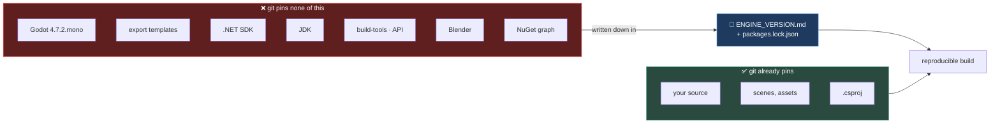

# Chapter 0.18 — The Version Matrix ⭐

🪜 **Scaffolding: 85 / 15.**

---

## 🎯 Goal

By the end, `ENGINE_VERSION.md` exists, every version is pinned, and **a script regenerates it in one command** — so that in six months you can reproduce today's build instead of guessing at it.

---

## 🏃 Fast-Track Summary

*Path C: read this and the cheat sheet, do ⭐ P1, move on.*

- 🚨 **"Latest" is not a version.** A build you cannot reproduce is not a release.
- Create `ENGINE_VERSION.md` at the repo root with **every** component: Godot · export templates · .NET SDK · TFM · JDK · Android build-tools · platform API · NDK if used · Blender · addons · NuGet packages · OS.
- ⭐ Write `tools/versions.sh` / `tools/versions.ps1` that **prints the matrix**, so it is never out of date by hand.
- Pin the NuGet graph: `<RestorePackagesWithLockFile>true</RestorePackagesWithLockFile>` and commit `packages.lock.json`.
- Record **exact** versions, not ranges. `4.7.2.stable.mono` — not "4.7-ish".
- Every version change goes in the **changelog table** with the date and what broke.
- Commit: `ch 0.18: version matrix pinned`

---

## 🧭 Before you start

| You need | From |
|---|---|
| A failed export from a version mismatch | [0.17](Chapter_00.17_DevLoopTools.md) Break it |
| `Machines.md` partly filled | [0.1](Chapter_00.01_MachinesAndTheirRoles.md)–[0.4](Chapter_00.04_AndroidToolchain.md) |

> 📌 **You already know why this matters.** In [0.17](Chapter_00.17_DevLoopTools.md) you produced a project that opened fine and could not ship, from a single unmatched version. This chapter is the systematic version of that lesson.

---

## 🔨 Build

### Step 1 — Collect every version, from the tools themselves

Never transcribe a version from memory or from a tutorial. **Ask the tool.**

> 🐧 **Linux**

```bash
godot --version
dotnet --version && dotnet --list-sdks
java -version 2>&1 | head -1
adb version | head -1
blender --version | head -1
ls "$ANDROID_HOME/build-tools" "$ANDROID_HOME/platforms"
git --version
uname -a
```

> 🪟 **Windows (PowerShell)**

```powershell
godot --version                      # or the full path to the .exe
dotnet --version; dotnet --list-sdks
java -version 2>&1 | Select-Object -First 1
adb version | Select-Object -First 1
blender --version | Select-Object -First 1
Get-ChildItem "$env:ANDROID_HOME\build-tools", "$env:ANDROID_HOME\platforms" -Name
git --version
Get-ComputerInfo -Property OsName,OsVersion,OsBuildNumber
```

Also collect, from files rather than commands:

| Version | Where |
|---|---|
| **Target framework** | `<TargetFramework>` in your `.csproj` |
| **Export templates** | `Editor → Manage Export Templates`, or the templates folder name |
| **NuGet packages** | `dotnet list package --include-transitive` |
| **Addons** | Each addon's `plugin.cfg` |

### Step 2 — Write `ENGINE_VERSION.md`

At the **repo root**, not in `docs/` — it is a build artefact description, and people look for it at the top.

```markdown
# ENGINE_VERSION

The exact toolchain that builds this project.
**"Latest" is not a version.** A build that cannot be reproduced is not a release.

Regenerate the raw data with `tools/versions.sh` (🐧) or `tools/versions.ps1` (🪟).

Last verified: <date> · Workshop: <Config A Windows 11 / Config B Linux>

## Engine and runtime

| Component | Exact version | Notes |
|---|---|---|
| Godot editor | `4.7.2.stable.mono.official` | ⚠️ **must** be the .NET/mono build |
| Godot export templates | `4.7.2.stable.mono` | ⚠️ **must match the editor exactly** |
| .NET SDK | | `dotnet --version` |
| Target framework | | from `.csproj` |

## Android

| Component | Exact version | Notes |
|---|---|---|
| JDK | | |
| Android build-tools | | |
| Android platform (API) | | |
| platform-tools (adb) | | |
| NDK | *(not used yet)* | Needed from **10.1c2** |

## Content tools

| Component | Exact version |
|---|---|
| Blender | |

## Dependencies

| Kind | Name | Version | Licence |
|---|---|---|---|
| Godot addon | Debug Draw 3D | | MIT |
| NuGet | Humanizer.Core | | MIT |

*Full transitive graph is pinned in `packages.lock.json`.*

## Host

| | |
|---|---|
| OS | |
| Git | |

## Changelog — every version change, with what broke

| Date | Component | From → To | Why | What broke |
|---|---|---|---|---|
| <date> | — | initial pin | Module 0 | — |
```

Fill it from Step 1.

### Step 3 — ⭐ Automate it

A hand-maintained matrix is wrong within a fortnight. Write a script.

> 🐧 `tools/versions.sh`

```bash
#!/usr/bin/env bash
echo "# Version matrix — generated $(date -I)"
echo
printf "godot            : %s\n" "$(godot --version 2>/dev/null)"
printf "dotnet sdk       : %s\n" "$(dotnet --version 2>/dev/null)"
printf "jdk              : %s\n" "$(java -version 2>&1 | head -1)"
printf "adb              : %s\n" "$(adb version 2>/dev/null | head -1)"
printf "blender          : %s\n" "$(blender --version 2>/dev/null | head -1)"
printf "build-tools      : %s\n" "$(ls "$ANDROID_HOME/build-tools" 2>/dev/null | tr '\n' ' ')"
printf "platforms        : %s\n" "$(ls "$ANDROID_HOME/platforms" 2>/dev/null | tr '\n' ' ')"
printf "git              : %s\n" "$(git --version)"
printf "os               : %s\n" "$(uname -sr)"
```

```bash
chmod +x tools/versions.sh && ./tools/versions.sh
```

> 🪟 `tools/versions.ps1`

```powershell
"# Version matrix — generated $(Get-Date -Format yyyy-MM-dd)`n"
"godot       : $(godot --version 2>$null)"
"dotnet sdk  : $(dotnet --version)"
"jdk         : $((java -version 2>&1)[0])"
"adb         : $((adb version)[0])"
"blender     : $((blender --version 2>$null)[0])"
"build-tools : $((Get-ChildItem "$env:ANDROID_HOME\build-tools" -Name) -join ' ')"
"platforms   : $((Get-ChildItem "$env:ANDROID_HOME\platforms" -Name) -join ' ')"
"git         : $(git --version)"
"os          : $((Get-ComputerInfo -Property OsName,OsBuildNumber | Out-String).Trim())"
```

`[UNVERIFIED]` — output shapes vary; adjust until it produces something you would paste into the matrix.

> 💡 **This is the first tool you have written for yourself in this course.** Run it whenever something breaks after an update, and paste its output when reporting a problem in [`toAgent/`](../../toAgent/) — half the diagnostic work is already done.

### Step 4 — Pin the NuGet graph

```bash
# add to your .csproj inside <PropertyGroup>
#   <RestorePackagesWithLockFile>true</RestorePackagesWithLockFile>
dotnet restore
ls packages.lock.json
git add packages.lock.json
```

Now `dotnet restore` resolves to **exactly** the versions recorded, not merely compatible ones.

> 🚨 **Compatible is not identical.** Without a lock file, a package specified as `1.2.0` can resolve to `1.2.7` on a different machine or a later day. Usually harmless. Occasionally the reason a build works on your machine and fails in CI ([11.16](../TableOfContents.md)).

### Step 5 — Commit

```bash
git add ENGINE_VERSION.md tools/ packages.lock.json
git commit -m "ch 0.18: version matrix pinned"
git push
```

---

## ▶️ Run it

- [ ] `ENGINE_VERSION.md` at the repo root, **every** row filled or explicitly marked *not used*
- [ ] Every version is **exact** — no "latest", no ranges
- [ ] `tools/versions.*` runs and prints the matrix
- [ ] `packages.lock.json` exists and is committed
- [ ] The changelog table has its first row

---

## 👀 Observe

Count the components. Ten or more independent versions, each from a different vendor, each on its own release schedule, and **every one of them can break your build**.

Now consider that you assembled this over four chapters and could still list most of it from memory. **In six months you will not.** That is not a failure of memory — it is why the file exists.

Look at the changelog table's empty rows. Those will be the most valuable part within a month, because *"what changed just before it broke?"* is the first question of every upgrade problem.

---

## 🧠 Why it works

### Reproducibility is a property you have or you do not

Six months from now a player reports a crash in v1.0. You need to build **exactly** v1.0 to debug it. That requires:

1. The **source** at that tag — git gives you this free.
2. The **toolchain** at that time — git gives you nothing, unless you wrote it down.

Without part 2 you rebuild with a newer Godot, a newer SDK and newer packages, and you get a *different binary*. It might not reproduce the crash. It might introduce a new one. **You cannot debug what you cannot rebuild.**

That is not a distant concern: [11.19d](../TableOfContents.md) is an entire chapter on upgrading Godot mid-project, and it starts from this file.

### Why "latest" is a bug

`latest` means *"whatever exists when someone runs this."* Two people running the same instructions a month apart get different toolchains — and when one build fails, the difference is invisible because both followed identical steps.

Which is why this course marks version-sensitive claims `[UNVERIFIED]` and links the official page ([ADR-016](../meta/Decisions.md#adr-016)) rather than hard-coding a number that will rot. **The instructions say where to look; your matrix records what you found.**

> 🔬 **Deep dive — reproducibility versus determinism.** Recording versions gives you **reproducibility**: the same inputs produce a build that behaves the same. It does not give **determinism** — a byte-identical binary — because compilers embed timestamps, paths and build ids. Fully deterministic builds are achievable and are a specialist discipline. **For a solo game, reproducibility is the property that matters**, and a version matrix plus a lock file gets you there for a few minutes of work.

---

## 🗺️ Mental model



Git covers the left box completely and the right box not at all. **The matrix is that gap.**

---

## 💥 Break it

Simulate the six-months-later problem.

1. Commit and tag your current state: `git tag v0.1-module0`
2. Open `ENGINE_VERSION.md` and **delete the Godot and export-template rows**. Commit that.
3. Now imagine you are returning after a Godot upgrade. **Using only what is in the repository**, determine which Godot version built the tagged commit.
4. Try `git log`, `git show v0.1-module0`, and searching the project files.

---

## 🔎 Diagnose

**Could you recover the version? From where — and how reliable was it? Answer before opening.**

<details>
<summary>Answer</summary>

**You can probably get close, and "close" is the problem.**

Places a version leaks into a repository:

| Source | Reliability |
|---|---|
| `project.godot` has a `config_version` and often a features array | ⚠️ Coarse — tells you the major line, not `4.7.2` |
| `.godot/` cache | ❌ Not committed ([0.7](Chapter_00.07_GitForGameProjects.md)) |
| Commit dates versus release dates | ⚠️ Inference, not a record |
| `.csproj` TFM | ⚠️ .NET version, not Godot's |
| `packages.lock.json` | ✅ Exact — **for NuGet only** |

So you might narrow it to a few candidates, and **you cannot tell `4.7.1` from `4.7.2`** — which is precisely the granularity that matters, because export templates must match *exactly* ([0.17](Chapter_00.17_DevLoopTools.md)).

**The general lesson, and it is bigger than versions.** Git records your *decisions* — what you wrote. It does not record your *environment* — what you wrote it with. Anything in the second category has to be written down deliberately or it is gone.

Everything in that category, for this project:

- Tool versions → **`ENGINE_VERSION.md`** (this chapter)
- Package graph → **`packages.lock.json`** ([0.16](Chapter_00.16_NuGet.md))
- Hardware and device specs → **`Machines.md`** ([0.1](Chapter_00.01_MachinesAndTheirRoles.md))
- Why a dependency is present → **`DecisionsLog.md`** ([0.15](Chapter_00.15_EvaluatingADependency.md))
- Why the course is shaped this way → **the ADRs**

**Each of those exists because git structurally cannot hold it.** That is the actual reason this repository has a `docs/meta/` directory at all, and it is worth noticing that you have now built four of the five yourself.

Restore the rows: `git revert` the deletion, or re-add them from `tools/versions.*`.

</details>

---

## 🏋️ Practicals

**⭐ P1 — Fill it completely.** Every row of `ENGINE_VERSION.md`, exact, or explicitly marked *not used yet* (the NDK row is legitimately that until [10.1c2](../TableOfContents.md)).

**P2 — Make the script better.** Have it emit **Markdown table rows** you can paste directly into the matrix, rather than plain text.

**P3 — Test the promise.** On a clean clone in a temporary folder, follow `ENGINE_VERSION.md` and confirm you could rebuild. **Note anything missing** — that gap is the chapter's real output.

**🔬 P4 — Add a CI check.** Sketch a GitHub Actions step that fails if `ENGINE_VERSION.md` has not been touched in 90 days. You will build the real workflow in [11.16](../TableOfContents.md); today, just write the idea into [`ToDos.md`](../meta/ToDos.md).

---

## ✅ Check yourself

1. Why is "latest" a bug in a version matrix?
2. What does git pin, and what does it not?
3. Why must the export-template row be exact rather than approximate?
4. What does `packages.lock.json` add that a `<PackageReference>` does not?
5. Name four things this repository records **because git structurally cannot**.

<details>
<summary>Answers</summary>

1. It means *"whatever exists when someone runs this"* — so two people following identical instructions a month apart get different toolchains, and when one build fails **the difference is invisible** because the steps were the same.
2. Git pins **source, scenes, assets and `.csproj`** — your decisions. It pins **no part of your environment**: engine, templates, SDKs, JDK, build-tools, Blender or the resolved package graph.
3. Because **templates must match the editor exactly** — including the release suffix and the .NET variant. [0.17](Chapter_00.17_DevLoopTools.md)'s Break-it showed a project that opened fine and could not export from precisely that mismatch, and "4.7-ish" cannot distinguish `4.7.1` from `4.7.2`.
4. **Exactness.** A reference to `1.2.0` may resolve to `1.2.7` on another machine or a later day; a lock file records the **entire resolved graph**, so restore produces the same versions everywhere. It is a common cause of works-here-fails-in-CI.
5. Tool versions (`ENGINE_VERSION.md`) · the package graph (`packages.lock.json`) · hardware and device specs (`Machines.md`) · why a dependency is present (`DecisionsLog.md`) · why the course is shaped as it is (the ADRs). All environment and rationale, neither of which git holds.

</details>

---

## 📎 Cheat sheet

| Record | Where |
|---|---|
| Tool versions | **`ENGINE_VERSION.md`** (repo root) |
| Resolved package graph | `packages.lock.json` |
| Hardware and devices | `docs/meta/Machines.md` |
| Why a dependency exists | `docs/meta/DecisionsLog.md` |

| Command | Gets |
|---|---|
| `godot --version` | ⚠️ Must include `mono` |
| `dotnet --version` · `--list-sdks` | SDK |
| `java -version` | JDK |
| `adb version` | platform-tools |
| `blender --version` | Blender |
| `ls $ANDROID_HOME/build-tools` | build-tools |
| `dotnet list package --include-transitive` | Every package |
| `./tools/versions.sh` · `.\tools\versions.ps1` | ⭐ All of it |

> 🚨 **Changing any version = update the tool, update the matrix, run a test export.**

---

## 🔗 Further reading

- [`Machines.md`](../meta/Machines.md) · [`Platforms.md`](../reference/Platforms.md)
- [ADR-016](../meta/Decisions.md#adr-016) — why this course marks versions `[UNVERIFIED]` rather than hard-coding them
- [Chapter 11.19d](../TableOfContents.md) — upgrading Godot mid-project, which starts from this file

---

## 💾 Commit

```text
ch 0.18: version matrix pinned
```

---

## ➡️ What's next

**[0.19 — Module 0 self-check](Chapter_00.19_Module0SelfCheck.md).** Every tool is installed, pinned, evaluated and understood. Next you prove it — by rebuilding the whole loop from nothing, without the chapters.

---

## 🪞 Reflection

In two sentences: **what does git structurally fail to record, and what would it cost you six months from now?**

---

## 📝 Chapter changelog

| Version | Date | Change |
|---|---|---|
| 1.0 | 2026-09-02 | First published. `[UNVERIFIED]` on command output shapes across platforms. |
