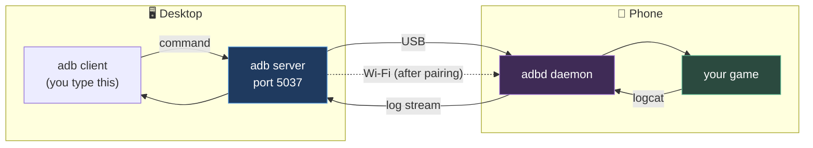

# Chapter 0.5 — Connecting Your Phone

🪜 **Scaffolding: 90 / 10.**

---

## 🎯 Goal

By the end, `adb devices` lists your phone over **both** USB and Wi-Fi, and you can read its live log stream from your desktop — the feedback channel every remaining chapter depends on.

---

## 🏃 Fast-Track Summary

*Path C: read this and the cheat sheet, do ⭐ P1, move on.*

**On the phone, first — nothing below works without these two:**
1. `Settings → About phone` → tap **Build number** **seven times**. Developer options unlocks.
2. `Settings → System → Developer options` → enable **USB debugging**. Also enable **Stay awake**.

**Then, plugged in over USB:**

```bash
adb devices          # accept the RSA prompt ON THE PHONE, tick "Always allow"
adb shell getprop ro.product.model
adb logcat -c        # clear the log
adb logcat | grep -i godot        # 🐧
adb logcat | Select-String -Pattern "godot"   # 🪟
```

**Then wireless — do this today, you will use it thousands of times:**

```bash
# Android 11+ : Developer options → Wireless debugging → Pair device with pairing code
adb pair <phone-ip>:<pairing-port>     # enter the 6-digit code it shows
adb connect <phone-ip>:<debug-port>    # the port on the Wireless debugging screen (different!)
```

- **`device` = working. `unauthorized` = you did not accept the prompt. Empty list = cable or driver.**
- 🪟 Windows: an empty list is usually the **USB driver** or a phone stuck in *"No data transfer"* mode.
- 🐧 Linux: `no permissions` means you need the **`udev` rule** — see Step 5b.
- Commit: `ch 0.5: phone connected over usb and wifi`

---

## 🧭 Before you start

| You need | From |
|---|---|
| `adb version` working | [0.4](0.4_AndroidToolchain.md) |
| A **data** cable | Verified in [0.1](0.1_MachinesAndTheirRoles.md) Step 5 |
| Your phone, unlocked, in your hand | You will tap through several menus |
| Desktop and phone on the **same Wi-Fi** | For the wireless half |

---

## 🔨 Build

### Step 1 — Unlock Developer options

On the **phone**:

1. `Settings → About phone`
2. Find **Build number**. Tap it **seven times**. It counts down at you.
3. Enter your PIN if asked. You get *"You are now a developer!"*

`[UNVERIFIED]` — the exact menu path, which varies by manufacturer. On Samsung it is `Settings → About phone → Software information → Build number`; on Xiaomi it is `Settings → About phone → MIUI version`. If you cannot find it, search your model plus "enable developer options".

> 🐣 **Why is this hidden?** Developer options expose settings that can break the phone or leak data if enabled by someone who does not understand them. The seven taps are a deliberate speed bump, not a security measure.

### Step 2 — Enable USB debugging

`Settings → System → Developer options` *(on some phones: `Settings → Additional settings → Developer options`)*.

Enable these three:

| Setting | Why |
|---|---|
| ⭐ **USB debugging** | The whole point. Lets `adb` talk to the device |
| **Stay awake** | Screen stays on while charging. You will thank yourself in [2.10](../../../TableOfContents.md) |
| **Wireless debugging** *(Android 11+)* | Needed in Step 6. Leave it off for now |

> ⚠️ **Turn USB debugging off again when you are done with the course**, or at least before handing the phone to anyone. It is a real attack surface — anyone with physical access and a cable can read your app data.

### Step 3 — Plug in and accept the prompt

1. Connect the phone with the **data cable you verified in 0.1**.
2. **Look at the phone.** A dialog appears: *"Allow USB debugging?"* with an RSA key fingerprint.
3. ✅ Tick **"Always allow from this computer"**, then **Allow**.

> 🚨 **If no dialog appears, do not skip ahead.** Unlock the screen and replug — the prompt is suppressed on a locked phone, which is the single most common reason this step appears to do nothing.

### Step 4 — The moment of truth

```bash
adb devices
```

You are looking for a serial number followed by the word **`device`**:

```text
List of devices attached
R58M12ABCDE     device
```

`[UNVERIFIED]` — your device's serial format.

**Anything else means something specific:**

| Output | Meaning | Fix |
|---|---|---|
| `<serial>  device` | ✅ Working | — |
| `<serial>  unauthorized` | Prompt not accepted, or screen was locked | Unlock, replug, accept. Still nothing? Developer options → **Revoke USB debugging authorisations**, then replug |
| `<serial>  offline` | Connection half-open, often after a cable jiggle | `adb kill-server` then `adb devices` |
| **Empty list** | The computer cannot see the device at all | Step 5 |
| 🐧 `no permissions` | Linux `udev` rule missing | Step 5b |

### Step 5 — 🪟 When the list is empty on Windows

Work through these in order — they are ordered by how often they are the answer.

1. **Change the USB mode on the phone.** Pull down the notification shade, tap the USB notification, and select **File Transfer / MTP**. Many phones do not expose ADB in *"No data transfer"* mode. **This is the most common fix.**
2. **Restart the adb server:**
   ```powershell
   adb kill-server
   adb start-server
   adb devices
   ```
3. **Try a different port** — prefer a port directly on the machine over a hub, and USB-A over USB-C if you have the choice.
4. **Install a driver.** Windows 11 handles most phones with its built-in driver, but not all.
   ```powershell
   sdkmanager "extras;google;usb_driver"
   ```
   That gets you the **Google USB Driver**, which covers Pixel and Nexus. For other manufacturers, search *"<your brand> USB driver"* on the manufacturer's own site.
   Then: `Device Manager` → find the phone (often under *Other devices* with a ⚠️) → right-click → **Update driver** → **Browse my computer** → point at `%ANDROID_HOME%\extras\google\usb_driver`.

   `[UNVERIFIED]` — whether your phone needs a driver at all, and the exact Device Manager wording.

### Step 5b — 🐧 When Linux says `no permissions`

Linux needs a `udev` rule granting your user access to the device. Without it, `adb` sees the phone but cannot open it.

```bash
lsusb        # find your phone; the vendor ID is the 4 hex digits before the colon in "ID 18d1:4ee7"
```

```bash
echo 'SUBSYSTEM=="usb", ATTR{idVendor}=="18d1", MODE="0666", GROUP="plugdev"' \
  | sudo tee /etc/udev/rules.d/51-android.rules
sudo udevadm control --reload-rules && sudo udevadm trigger
sudo usermod -aG plugdev "$USER"
```

Replace `18d1` with **your** vendor ID. **Log out and back in** for the group change to take effect, then replug.

> ⚠️ **Do not "fix" this with `sudo adb`.** It starts a second adb server owned by root, which then fights the one owned by you. Symptoms are bizarre and intermittent. Fix the permission properly.

### Step 6 — Wireless debugging ⭐

Set this up **today**. You will deploy thousands of times over this course, and doing it without hunting for a cable is worth the ten minutes.

**Android 11 and newer — the pairing method:**

1. Phone: `Developer options → Wireless debugging` → turn it **on**.
2. Tap **Pair device with pairing code**. A dialog shows an **IP:port** and a **six-digit code**.
3. On the desktop:
   ```bash
   adb pair 192.168.1.42:37123        # the IP:port from the PAIRING dialog
   ```
   Enter the six-digit code when asked.
4. Now go **back** to the Wireless debugging main screen. It shows a **different** IP:port. Connect to that one:
   ```bash
   adb connect 192.168.1.42:5555
   adb devices
   ```

> 🚨 **The two ports are different, and this trips up nearly everyone.** The *pairing* dialog's port is temporary and single-use. The *connect* port is on the main Wireless debugging screen. Using the pairing port for `adb connect` fails with a connection error that explains none of this.

**Android 10 and older — the tcpip method** *(requires USB first)*:

```bash
adb tcpip 5555
adb connect <phone-ip>:5555
```

Unplug the cable. `adb devices` should still list it.

> ⚠️ **Wireless connections drop** when the phone sleeps deeply, changes IP, or you switch networks. Re-run `adb connect`. Giving the phone a static DHCP lease on your router removes most of this.

### Step 7 — Read the phone's mind

This is the feedback channel every later chapter uses.

```bash
adb shell getprop ro.product.model      # confirm which device you are talking to
adb logcat -c                            # clear the backlog
```

Now stream it, filtered:

```bash
adb logcat | grep -i godot                     # 🐧
```
```powershell
adb logcat | Select-String -Pattern "godot"    # 🪟
```

Nothing will appear yet — you have not deployed a game. That happens in [0.8](../../../TableOfContents.md). **Leave this running** and note that it is live.

Press `Ctrl+C` to stop.

### Step 8 — Record and commit

Add to [`docs/meta/Machines.md`](../../../meta/Machines.md): the device serial, whether USB works, whether wireless works, and any driver or `udev` rule you needed.

```bash
git add docs/meta/Machines.md
git commit -m "ch 0.5: phone connected over usb and wifi"
git push
```

---

## ▶️ Run it

- [ ] `adb devices` shows your phone as `device` over **USB**
- [ ] `adb shell getprop ro.product.model` prints your model
- [ ] `adb devices` shows it as `device` over **Wi-Fi**, cable unplugged
- [ ] `adb logcat` streams, and `Ctrl+C` stops it
- [ ] Recorded in `Machines.md`

---

## 👀 Observe

You now have a **two-way** link. Until this chapter the phone was a thing you would eventually copy a file to. It is now a machine you can query, watch and instrument from your desk.

Notice which direction was harder to establish. Deploying is the easy half — the cable, the driver, the authorisation. **Reading back** — `logcat`, and later the profiler — is what makes the phone a *measuring instrument* rather than a delivery target, and it is the half people skip.

---

## 🧠 Why it works

### What `adb` actually is

Three parts, not one:

| Part | Where | Job |
|---|---|---|
| **Client** | Your desktop, every time you type `adb` | Sends one command and exits |
| **Server** | Your desktop, a background process on port 5037 | Owns the connection to every device; started automatically |
| **Daemon (`adbd`)** | On the phone | Executes what arrives |

That middle layer explains several otherwise-baffling behaviours: why `adb kill-server` fixes so much, why `sudo adb` on Linux causes chaos (a *second* server, owned by root, competing for the same devices), and why the first `adb` command after a reboot is slower than the rest.

### Why the RSA prompt exists

The first time a computer connects, the phone generates a **key pair** and shows you the host's public-key fingerprint. Ticking *"Always allow"* stores that key. Every later connection is authenticated against it silently.

This is why **`unauthorized` is a distinct state from "not connected"**: the phone can see you perfectly well and is refusing. And why *Revoke USB debugging authorisations* is the fix when the prompt stops appearing — it clears the stored keys so the phone asks again.

> 🔬 **Deep dive — why wireless needs pairing on Android 11+.** Over USB, physical possession of the cable is the security boundary; the RSA prompt is enough. Over Wi-Fi there is no such boundary — anyone on the network could attempt a connection. So Android 11 added a separate, code-based **pairing** step on a **temporary port**, establishing trust before the long-lived debug port will accept you at all. The two-port design is a security feature, not an oversight — even if the error message when you confuse them is unhelpful.

---

## 🗺️ Mental model



Note the arrows going **both** ways. Half of `adb`'s value is the return path.

---

## 💥 Break it

Two sabotages, restoring after each.

1. On the phone: `Developer options → Revoke USB debugging authorisations`. Then replug and run `adb devices` **without touching the phone**.
2. Restore by accepting the prompt. Now, with the phone connected over Wi-Fi, turn Wi-Fi **off** on the phone and run `adb devices`.

---

## 🔎 Diagnose

**For each: what state did `adb` report, and how is it different from "not connected"? Answer before opening.**

<details>
<summary>Answer</summary>

**1 — Revoked authorisation** reports `unauthorized`. The USB link is perfectly healthy: the phone can see your computer, has received the connection, and is **actively refusing** it because the stored key is gone. `[UNVERIFIED]` — the exact wording.

That is a completely different situation from an empty list, and it points at a completely different fix. **The list being non-empty tells you the physical layer works** — cable, port, driver, `udev` — and that only the trust step is missing.

**2 — Wi-Fi off** eventually reports `offline`, or the device disappears entirely. The desktop's adb *server* still holds a record of the connection; the transport underneath it is gone.

**The state table worth memorising:**

| State | Physical link | Trust | Fix lives in |
|---|---|---|---|
| Empty list | ❌ | — | Cable, port, USB mode, driver, `udev` |
| `unauthorized` | ✅ | ❌ | The phone's screen |
| `offline` | ⚠️ half-open | ✅ | `adb kill-server`, or reconnect |
| `device` | ✅ | ✅ | Nothing — you are working |

**The general skill:** read the *state*, not just "it did not work". Each state rules out whole categories of cause, and the four above cover nearly every connection problem you will meet in this course.

</details>

---

## 🏋️ Practicals

**⭐ P1 — Make wireless the default.** Get `adb devices` listing your phone with **no cable attached**, then write the exact reconnect command into `Machines.md`. You will paste it hundreds of times.

**P2 — Learn one logcat filter.** Run `adb logcat --help` and find how to filter by priority. Then produce a command that shows only errors and worse. You will want it in [2.7](../../../TableOfContents.md).

**🔬 P3 — Watch a real app.** With logcat streaming unfiltered, open and close any app on the phone. Watch the volume of output. That firehose is why filtering is a skill rather than a convenience.

---

## ✅ Check yourself

1. What are the three parts of `adb`, and which one does `adb kill-server` restart?
2. What does `unauthorized` tell you that an empty device list does not?
3. Why does Android 11+ require a pairing code for wireless but not for USB?
4. Why is `sudo adb` on Linux a bad idea?
5. Your phone is plugged in, the screen is on, and `adb devices` is empty. What is the most likely cause on Windows?

<details>
<summary>Answers</summary>

1. **Client** (the command you type, which exits immediately), **server** (a background process on your desktop, port 5037, owning all device connections), and **daemon `adbd`** (on the phone). `adb kill-server` restarts the **server** — the middle layer — which is why it fixes so many odd states.
2. That **the physical layer already works.** Cable, port, USB mode and driver are all fine, and the phone is actively refusing on trust grounds. The fix is on the phone's screen, not in your hardware. An empty list means the opposite: the trust question has not even been reached.
3. Over USB, **physical possession of the cable is the security boundary** — the RSA prompt is sufficient. Over Wi-Fi anyone on the network could attempt a connection, so a code-based pairing step on a temporary port establishes trust *before* the long-lived debug port will accept anything.
4. It starts a **second adb server owned by root**, competing with the one owned by your user for the same devices. The symptoms are intermittent and bizarre. Fix the `udev` permission instead.
5. The phone is in **"No data transfer"** USB mode. Pull down the notification shade, tap the USB notification, choose **File Transfer**. This is the most common cause by a wide margin — ahead of drivers.

</details>

---

## 📎 Cheat sheet

| Command | Does |
|---|---|
| `adb devices` | List devices and their **state** |
| `adb kill-server` / `adb start-server` | Restart the middle layer. Fixes `offline` and most oddities |
| `adb pair <ip>:<pairing-port>` | Android 11+ wireless pairing. ⚠️ **Pairing port ≠ connect port** |
| `adb connect <ip>:<port>` | Attach over Wi-Fi |
| `adb disconnect` | Detach all wireless devices |
| `adb tcpip 5555` | Android ≤10: switch to wireless (needs USB first) |
| `adb shell getprop ro.product.model` | Which phone am I talking to |
| `adb logcat -c` | Clear the log buffer |
| `adb logcat \| grep -i godot` 🐧 · `\| Select-String godot` 🪟 | Stream, filtered |
| `adb -s <serial> <cmd>` | Target one device when several are attached |

| State | Meaning |
|---|---|
| `device` | ✅ Working |
| `unauthorized` | Physical link fine; accept the prompt on the phone |
| `offline` | Half-open; `adb kill-server` |
| *(empty)* | Cable · USB mode · port · driver 🪟 · `udev` 🐧 |

---

## 🔗 Further reading

- [Android Debug Bridge documentation](https://developer.android.com/tools/adb)
- [Run apps on a hardware device](https://developer.android.com/studio/run/device)
- [Setup 04 §5–5b](../../../guides/Setup_04_Android_And_Device.md) — the reference version, including the `udev` rule
- [ADR-034](../../../meta/Decisions.md#adr-034) — why device testing is structural in this course

---

## 💾 Commit

```text
ch 0.5: phone connected over usb and wifi
```

---

## ➡️ What's next

**[0.6 — The Godot editor: docks, viewport, inspector, the node tree, the output panel](0.6_TheGodotEditor.md).** The toolchain is complete and the phone is listening. Next you learn the tool you will spend the most hours inside — by building something in it, not by reading a tour.

---

## 🪞 Reflection

In two sentences: **what does `unauthorized` rule out, and why does that make it good news?**

---

## 📝 Chapter changelog

| Version | Date | Change |
|---|---|---|
| 1.0 | 2026-09-02 | First published. `[UNVERIFIED]` on menu paths, serial format, driver need and adb state wording. |
