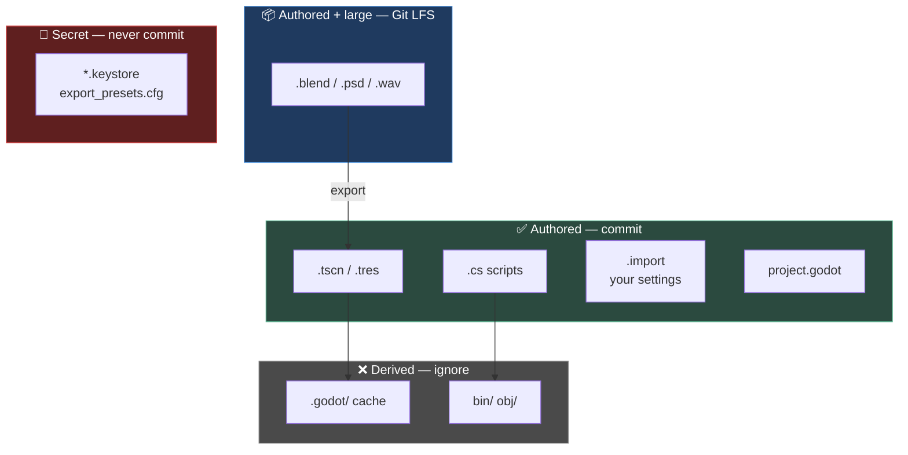

# Chapter 0.7 — Git for Game Projects

🪜 **Scaffolding: 90 / 10.**

---

## 🎯 Goal

By the end, your Godot project is under version control with a `.gitignore` you have **tested rather than trusted**, Git LFS handling binary assets, and a first commit that contains exactly what it should — proved, not assumed.

---

## 🏃 Fast-Track Summary

*Path C: read this and the cheat sheet, do ⭐ P1, move on.*

```bash
cd <your Scratch project>
git init -b main
# copy the .gitignore from this repo's root, then prove it works:
git status --short                  # should be quiet — no .godot/, bin/, obj/
git check-ignore -v .godot/         # names the exact rule that ignored it

sudo apt install git-lfs
git lfs install
git lfs track "*.blend" "*.psd" "*.wav" "*.fbx"
git add .gitattributes .gitignore
git commit -m "chore: gitignore and lfs tracking"

git add .
git commit -m "ch 0.7: scratch project under version control"
```

- ⭐ **`git check-ignore -v <path>`** is the whole chapter in one command: it tells you **which rule** ignored a file, so you stop guessing.
- **Commit `.import` files.** They hold your import settings; lose them and Godot re-imports everything with defaults.
- **Never commit** `.godot/` · `bin/` · `obj/` · `*.keystore` · `export_presets.cfg` *(it can hold keystore paths and passwords)*.
- **LFS is for big binaries** — `.blend`, `.psd`, `.wav`, large textures. Not for `.tscn`, `.tres` or source, which are text and diff well.
- 🪟 **Windows: set `core.autocrlf input`** or you will commit line endings that break on Android.
- Commit: `ch 0.7: scratch project under version control`

---

## 🧭 Before you start

| You need | From |
|---|---|
| The `Scratch` project with real content | [0.6](0.6_TheGodotEditor.md) |
| `git --version` working | [0.1](0.1_MachinesAndTheirRoles.md) |
| This course repo cloned | It contains the `.gitignore` you will copy |

> 📌 **Two repositories, do not confuse them.** The **course repo** (`godot-zero-to-hero`) holds chapters and notes. Your **Scratch project** is a *separate* repo you are about to create. From Module 1 the course's `projects/` folder holds your game projects, but Scratch stays standalone.

---

## 🔨 Build

### Step 1 — See the problem before applying the fix

```bash
cd <path to your Scratch project>       # the folder containing project.godot
git init -b main
git status --short | wc -l              # 🐧
```
```powershell
(git status --short | Measure-Object -Line).Lines    # 🪟
```

`[UNVERIFIED]` — your exact count. Expect **dozens to hundreds** of files.

Look at what is in there:

```bash
git status --short | head -30
```

You will see `.godot/` entries, and if you have built C#, `bin/` and `obj/` too. **None of that belongs in version control** — it is generated, it is large, it changes constantly, and it will produce merge conflicts in files no human wrote.

> 💡 **This is why the chapter starts here.** A `.gitignore` handed to you is a mystery; a `.gitignore` that visibly removes 200 files from your status is a tool you understand.

### Step 2 — Apply the `.gitignore`

Copy it from this course repo's root:

```bash
cp ~/godot-zero-to-hero/.gitignore .                                   # 🐧
```
```powershell
Copy-Item "$env:USERPROFILE\godot-zero-to-hero\.gitignore" .           # 🪟
```

Now look again:

```bash
git status --short
```

**The list should be short** — `project.godot`, your `.tscn` and `.cs` files, `icon.svg`, `testcube.glb`, and a set of `.import` files.

### Step 3 — ⭐ Prove it, do not trust it

This is the most useful command in the chapter.

```bash
git check-ignore -v .godot/
git check-ignore -v bin/
git check-ignore -v testcube.glb
```

For an ignored path it prints **the file, line number and rule** that ignored it. For a path that is *not* ignored it prints nothing and exits non-zero.

`[UNVERIFIED]` — the exact output format.

> 🚨 **`testcube.glb` must print nothing.** If a rule is ignoring your assets, you would commit a project that does not build for anyone else — and you would not find out until someone cloned it. **Check before you trust.**

Now check the four things that must never be committed:

```bash
git check-ignore -v .godot/ obj/ bin/ export_presets.cfg
```

All four should name a rule.

### Step 4 — Understand the four rules that matter

Open `.gitignore` and find these. The rest is detail.

| Pattern | Why |
|---|---|
| `.godot/` | Godot's import cache and editor state. **Regenerated from your source on first open.** Huge, churns constantly |
| `bin/` `obj/` | .NET build output. Regenerated by the hammer |
| `*.keystore` `*.jks` | 🚨 **Signing keys.** Committing one lets anyone sign as you |
| `export_presets.cfg` | Holds keystore **paths and sometimes passwords** |

**And the two that are NOT ignored, deliberately:**

| Kept | Why |
|---|---|
| `*.import` | ⭐ Your per-asset import settings. **Lose these and Godot re-imports everything with defaults** — compression, filters, LOD, collision generation, all reset |
| `*.tres` `*.tscn` | Your scenes and resources. They are **text**, and they diff and merge |

> ⚠️ **The `.import` rule surprises people.** They look like generated files, they sit next to generated files, and they are the one class of "generated-looking" file you must keep. In Module 3 you will spend hours setting import presets for an art kit; they live in `.import`.

### Step 5 — 🪟 Line endings

Windows writes `CRLF`; Linux, macOS and **Android** use `LF`. Committing CRLF into text assets causes problems that surface much later, on device.

```powershell
git config --global core.autocrlf input
```

> 🐣 **What `input` means:** convert CRLF → LF when committing, but leave your working files alone. Your editor stays happy; the repository stays clean. On Linux, `git config --global core.autocrlf input` is also correct and is effectively a no-op.

`[UNVERIFIED]` — whether your Git for Windows install already set `true` during setup. Check with `git config --global core.autocrlf`; if it says `true`, change it to `input`.

### Step 6 — Git LFS for binaries

Text files diff. Binary files do not — Git stores a **complete new copy** on every change. A 40 MB `.blend` edited fifty times is 2 GB of history.

```bash
git lfs install
git lfs track "*.blend" "*.blend1" "*.psd" "*.kra" "*.wav" "*.fbx" "*.mp4"
cat .gitattributes
```

That creates `.gitattributes`. **Commit it first, before adding any of those files** — LFS only catches files added *after* the rule exists.

```bash
git add .gitattributes .gitignore
git commit -m "chore: gitignore and lfs tracking"
```

> 💡 **Why not track `.glb` and `.png` too?** Judgement, not doctrine. LFS adds friction — collaborators need it installed, and some hosts limit LFS bandwidth. This course's rule of thumb: **LFS for source art you edit repeatedly** (`.blend`, `.psd`), plain git for exported assets that are regenerated rather than edited (`.glb`, exported textures). Revisit it in Module 3 when the Foundry Kit arrives.

### Step 7 — The first real commit

```bash
git add .
git status --short
```

**Read that list before committing.** Every file should be one you can justify. Then:

```bash
git commit -m "ch 0.7: scratch project under version control"
```

Verify what you actually stored:

```bash
git ls-files | wc -l                 # 🐧
git count-objects -vH                # repository size
```
```powershell
(git ls-files | Measure-Object -Line).Lines    # 🪟
git count-objects -vH
```

A Godot project at this stage should be **a few dozen files and well under 10 MB**. If it is hundreds of files or hundreds of megabytes, something is being committed that should not be — go back to Step 3.

### Step 8 — Prove the ignore actually protects you

Delete the generated folders and reopen the project.

```bash
git status --short          # clean
rm -rf .godot bin obj       # 🐧
```
```powershell
Remove-Item -Recurse -Force .godot, bin, obj -ErrorAction SilentlyContinue   # 🪟
```

Now open the project in Godot. It re-imports (briefly) and everything works. Press **Build**, then `F6`.

```bash
git status --short          # still clean
```

**Nothing was lost.** That is the proof that those folders are genuinely derived data.

---

## ▶️ Run it

- [ ] `git status --short` is short and every entry is justifiable
- [ ] `git check-ignore -v .godot/` names a rule; `git check-ignore -v testcube.glb` prints **nothing**
- [ ] `.gitattributes` exists and is committed
- [ ] 🪟 `git config --global core.autocrlf` says `input`
- [ ] `git count-objects -vH` shows a small repository
- [ ] You deleted `.godot/`, `bin/`, `obj/`, reopened, rebuilt, and lost nothing

---

## 👀 Observe

Compare your two numbers from Steps 1 and 7: files before the `.gitignore`, files committed after.

That ratio is worth remembering. Most of a Godot project on disk is **derived** — regenerable from a much smaller set of sources. Version control is for the sources.

Notice also which "generated-looking" file you kept: `.import`. It sits beside the cache, it is machine-written, and it is **not** derivable, because it encodes decisions *you* made.

---

## 🧠 Why it works

### Derived versus authored

Every file in a project is one or the other:

| | Examples | Version control |
|---|---|---|
| **Authored** | `.cs`, `.tscn`, `.tres`, `.blend`, `project.godot`, **`.import`** | ✅ Commit |
| **Derived** | `.godot/`, `bin/`, `obj/`, `.blend1`, export output | ❌ Ignore |

The test is: **if I delete it, can the tools regenerate it exactly?** `.godot/` — yes, that is Step 8. `.import` — no. It contains choices with no other source.

### Why binaries need LFS

Git stores each version of a file. For text it stores compact deltas — a one-line change costs bytes. **Binary formats have no meaningful delta**: change one vertex in a `.blend` and the compressed bytes reshuffle wholesale, so Git stores the whole file again.

LFS replaces the file in your repository with a small **pointer**, and stores the real bytes separately. Clone time and repository size stay sane.

> 🔬 **Deep dive — why `.tscn` being text is a design decision that matters.** Godot's scene format is human-readable text. That means scenes **diff** — you can see in a pull request that someone changed a light's energy — and they **merge**, mostly. Engines with binary scene formats cannot do either, and teams work around it by locking files so only one person may edit a scene at a time. You are inheriting a real advantage; Module 10's architecture chapters depend on it.

### 🚨 The keystore rule

`*.keystore`, `*.jks` and `export_presets.cfg` are ignored because **a signing key is your app's identity** ([0.4](0.4_AndroidToolchain.md)). Commit one to a public repository and anyone can publish updates that Android accepts as yours.

Your *debug* keystore is harmless — its credentials are public by design. **The release keystore you create in [11.13](../../../TableOfContents.md) is not**, and the habit has to exist before the dangerous file does.

---

## 🗺️ Mental model



---

## 💥 Break it

Force-commit a derived folder and measure the damage.

```bash
git add -f .godot/
git status --short | wc -l          # 🐧
git commit -m "temp: DO NOT KEEP"
git count-objects -vH               # compare with Step 7
```

Then undo it:

```bash
git reset --hard HEAD~1
git status --short
```

---

## 🔎 Diagnose

**How many files did `-f` add, what happened to the repository size, and why is `git reset --hard HEAD~1` a *complete* fix here but not in general? Answer before opening.**

<details>
<summary>Answer</summary>

**The file count jumps by hundreds** and the repository size grows noticeably — `.godot/` holds imported texture caches and shader caches, which are large and binary. `[UNVERIFIED]` — your exact figures.

**Why `-f` was needed at all:** `git add` silently skips ignored files. The `-f` flag says *"I know it is ignored, do it anyway."* That silence is deliberate — a `.gitignore` should not be something you defeat by accident.

**Why the reset is a complete fix here:** the commit was the **most recent** one and had **not been pushed**. `reset --hard HEAD~1` moves the branch back and discards it, and because nothing else ever referenced that commit, the objects become unreachable and are eventually garbage-collected.

**Why that does not generalise — the important half.** If you had **pushed**, or if anyone else had pulled, the commit exists elsewhere and your local reset changes nothing for them. Worse, for a *secret*, the bytes remain in the history of every clone. **This is exactly the situation with an accidentally-committed keystore, and there is no clean undo:**

1. The key must be treated as **compromised** — for a release key that means the app listing can never be updated again ([0.4](0.4_AndroidToolchain.md)).
2. Rewriting history (`filter-repo`, BFG) requires every collaborator to re-clone, and does not remove it from forks or caches.

**Which is the whole reason `*.keystore` sits in `.gitignore` from day one, before the dangerous file exists.** Prevention is the only real mitigation, and this is the class of mistake where "undo" is not available.

</details>

---

## 🏋️ Practicals

**⭐ P1 — Audit every committed file.** Run `git ls-files` and justify each entry in one clause. Anything you cannot justify either needs an ignore rule or does not belong.

**P2 — Test a rule you have not tested.** Create a file that *should* be ignored (`test.keystore`, `obj/junk.txt`). Confirm with `git check-ignore -v` and with `git status`. Delete them.

**P3 — Break and repair an ignore rule.** Comment out the `.godot/` line, run `git status`, watch the noise return, restore it. You now know what that rule earns you.

**🔬 P4 — Read your own history.** `git log --stat` on the Scratch repo. Then `git show --stat HEAD`. Getting comfortable reading history now makes `git bisect` in [2.3](../../../TableOfContents.md) straightforward instead of intimidating.

---

## ✅ Check yourself

1. What is the test for whether a file belongs in version control?
2. Why is `.import` committed when it looks generated?
3. Why does Git need LFS for `.blend` but not for `.tscn`?
4. What does `git check-ignore -v` tell you that `git status` does not?
5. You accidentally committed and **pushed** a release keystore. What is the recovery procedure?

<details>
<summary>Answers</summary>

1. **Can the tools regenerate it exactly if I delete it?** Yes → derived, ignore it (`.godot/`, `bin/`, `obj/`). No → authored, commit it.
2. Because it is **not derivable**. It encodes *your decisions* about how each asset is imported — compression, filters, LOD, collision generation. Delete it and Godot re-imports with defaults, silently undoing hours of Module 3's work.
3. `.tscn` is **text**, so Git stores compact deltas — a one-line change costs bytes. `.blend` is **binary**, and a small edit reshuffles the compressed bytes wholesale, so Git stores an entire new copy each time. Fifty edits of a 40 MB file is 2 GB of history. LFS stores a pointer instead.
4. **Which rule, in which file, on which line** did the ignoring. `git status` only shows you that a file is absent from the list, which is silence — and silence is the same for "correctly ignored" and "accidentally ignored".
5. **There is no clean recovery.** Treat the key as compromised; for a release key that means the Play listing can never be updated again. History rewriting (`filter-repo`, BFG) forces every collaborator to re-clone and still does not reach forks or caches. **This is why `*.keystore` is in `.gitignore` before you ever create one** — prevention is the only mitigation.

</details>

---

## 📎 Cheat sheet

| Command | Does |
|---|---|
| `git init -b main` | New repo on branch `main` |
| `git status --short` | Compact status. **Read it before every commit** |
| ⭐ `git check-ignore -v <path>` | **Names the rule** that ignored a path. Silence = not ignored |
| `git add -f <path>` | Add despite `.gitignore`. Rarely correct |
| `git ls-files` | Everything currently tracked |
| `git count-objects -vH` | Repository size |
| `git lfs install` / `git lfs track "*.blend"` | Set up LFS · add a rule |
| `git lfs ls-files` | What LFS is handling |
| `git config --global core.autocrlf input` | 🪟 Commit LF, keep CRLF locally |
| `git reset --hard HEAD~1` | Discard the last commit. **Only safe if unpushed** |

| Always commit | Never commit |
|---|---|
| `.cs` `.tscn` `.tres` `project.godot` | `.godot/` `bin/` `obj/` |
| ⭐ `*.import` | 🚨 `*.keystore` `*.jks` `export_presets.cfg` |
| `.gitignore` `.gitattributes` | `*.blend1` build output |

---

## 🔗 Further reading

- [Godot: version control systems](https://docs.godotengine.org/en/stable/tutorials/best_practices/version_control_systems.html)
- [Git LFS](https://git-lfs.com/)
- [`Conventions.md` §5](../../../reference/Conventions.md) — this course's commit-message format
- [ADR-018](../../../meta/Decisions.md#adr-018) — licensing of course content versus project code

---

## 💾 Commit

```text
ch 0.7: scratch project under version control
```

---

## ➡️ What's next

**[0.8 — Project 00: "Hello Phone"](../../../TableOfContents.md).** ⭐ Every tool is installed, the phone is listening, the editor is familiar, and your work is safely stored. Next you put a build of your own onto your phone — the milestone the whole module exists for.

---

## 🪞 Reflection

In two sentences: **what is the test for whether a file belongs in git, and which file in a Godot project most often fails that test in the wrong direction?**

---

## 📝 Chapter changelog

| Version | Date | Change |
|---|---|---|
| 1.0 | 2026-09-02 | First published. `[UNVERIFIED]` on file counts, output formats and the Git-for-Windows `autocrlf` default. |
