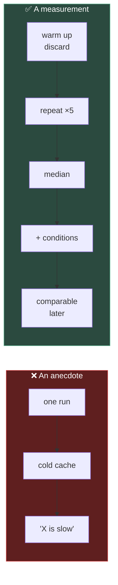

# Chapter 0.12 — Measured: Two Languages, One Cube ⭐

🪜 **Scaffolding: 85 / 15.** The protocol is given; the conclusions are yours.

---

## 🎯 Goal

By the end you will have **your own numbers** — iteration time, lines of code and APK size for both languages, measured properly — recorded in `Machines.md` and used for the next 300 chapters.

---

## 🏃 Fast-Track Summary

*Path C: read this and the cheat sheet, run the protocol, move on. There is no shortcut — the whole point is that the numbers are yours.*

- **Three measurements**, each repeated: **iteration time** (edit → see the change), **lines of code**, **APK size**.
- ⭐ **Discard the first run of everything.** The first build after opening the editor includes cold caches and is not representative. This one rule separates a measurement from an anecdote.
- **Five samples minimum**, and record the **median**, not the mean — one interrupted run should not move your answer.
- Change **one variable at a time.** Same machine, same project, same power state, nothing else building.
- Record everything in [`Machines.md`](../../../meta/Machines.md). You will refer back in [0.14](0.14_LanguageDecisionTable.md), [5.16](../../../TableOfContents.md) and [11.15](../../../TableOfContents.md).
- Break it: measure badly on purpose — one sample, cold cache — and see how different an answer you get.
- Commit: `ch 0.12: measured — iteration, size, LOC`

---

## 🧭 Before you start

| You need | From |
|---|---|
| Both cubes spinning in P00 | [0.10](0.10_GDScriptFirstContact.md), [0.11](0.11_CSharpFirstContact.md) |
| A stopwatch | Your phone's is fine |
| Nothing else running | Close browsers, other builds, backups |
| Laptop **plugged in** | Power saving changes CPU clocks and will skew everything |

> 📌 **This chapter produces data, not opinions.** Every claim in this course about "C# costs you a build step" is something you are about to check. If your numbers disagree with mine, **yours are right** — you measured your machine.

---

## 🔨 Build

### Step 1 — Warm up, then discard it

Open P00. Press **Build**. **Throw this measurement away** — do not even time it.

The first build after opening the editor populates caches, loads MSBuild, and JITs the toolchain. It is real, it is slow, and it is **not what your day feels like**.

> 🚨 **This single step is the difference between a measurement and an anecdote.** Nearly every "language X is slow" claim you will read online is a cold-cache first run, reported as typical.

### Step 2 — Measure C# iteration ⭐

The loop you are timing is **edit → see the change on screen**, because that is what actually costs you time.

Repeat **five times**:

1. Open `Spinner.cs`. Change `DegreesPerSecond`'s default to a new value.
2. **Start the stopwatch.**
3. `Ctrl+S` → **Build** → `F6`.
4. **Stop the stopwatch the moment the cube visibly changes speed.**
5. Record. Close the running game.

| Run | Seconds |
|---|---|
| 1 | |
| 2 | |
| 3 | |
| 4 | |
| 5 | |
| **Median** | |

### Step 3 — Measure GDScript iteration

Identical protocol, editing `degrees_per_second` in `SpinnerGD.gd`. **No Build press.**

| Run | Seconds |
|---|---|
| 1–5 | |
| **Median** | |

> 💡 **Use the median, not the average.** If one run was interrupted by a notification, the mean absorbs that noise and the median ignores it. With five samples the median is simply the third when sorted.

### Step 4 — Lines of code

```bash
wc -l Spinner.cs SpinnerGD.gd                                        # 🐧
```
```powershell
Get-ChildItem Spinner.cs, SpinnerGD.gd | ForEach-Object {
    "{0}: {1}" -f $_.Name, (Get-Content $_).Count }                  # 🪟
```

> ⚠️ **Do not over-read this number.** `Spinner.cs` grew in [0.11](0.11_CSharpFirstContact.md) with exports and features that `SpinnerGD.gd` does not have. **Compare like with like**: count only the lines that do the spinning. That distinction — *what am I actually comparing?* — matters more than the count.

### Step 5 — APK size, the real comparison ⭐

This is the measurement with consequences, because it ships.

**Export A — as it is now** *(both languages present)*:

`Project → Export…` → Android preset → **Export Project** → `build/both.apk`. Uncheck "Export With Debug" for a realistic size. `[UNVERIFIED]` — the exact dialog wording.

**Export B — GDScript only:** delete `Spinner.cs`, attach `SpinnerGD.gd` to *both* cubes, Build, export to `build/gdscript-only.apk`.

**Export C — restore**, then measure again as a sanity check.

```bash
ls -lh build/*.apk                                                    # 🐧
```
```powershell
Get-ChildItem build\*.apk | Select-Object Name,
    @{n='MB';e={[math]::Round($_.Length/1MB,1)}}                      # 🪟
```

| APK | MB |
|---|---|
| Both languages | |
| GDScript only | |
| **Difference** | |

> 💡 **That difference is roughly what the .NET runtime costs you.** It is a fixed cost, not a per-script one — a project with two hundred C# files pays about the same as one with two. Worth remembering in [11.15](../../../TableOfContents.md) when app size becomes a shipping concern, and worth *not* panicking about now.

### Step 6 — Record it

Add a section to [`Machines.md`](../../../meta/Machines.md):

```markdown
## Language measurements *(chapter 0.12, <date>)*

| Measurement | C# | GDScript |
|---|---|---|
| Iteration, median of 5 | s | s |
| Lines (spin logic only) | | |
| APK contribution | MB | baseline |

Machine: <from the Workshop table above>
Conditions: plugged in, nothing else running, first build discarded
```

> 📌 **Record the conditions, not just the numbers.** A measurement without its conditions cannot be compared with anything later — including your own future measurements on a faster machine.

### Step 7 — Commit

```bash
git add .
git commit -m "ch 0.12: measured — iteration, size, LOC"
git push
```

---

## ▶️ Run it

- [ ] First build discarded, not recorded
- [ ] Five C# samples, median calculated
- [ ] Five GDScript samples, median calculated
- [ ] Lines compared **like with like**
- [ ] Two APKs exported and measured
- [ ] All of it, **with conditions**, in `Machines.md`

---

## 👀 Observe

Look at your iteration medians. Is the difference large enough to change how you work, or small enough to ignore?

**There is no correct answer, and that is the point.** On a fast machine with a small project the gap is often a couple of seconds — irrelevant. In Module 6, with dozens of scripts and shader compilation, it grows. Your numbers today are a *baseline*; the interesting measurement is the same one repeated at chapter [6.12](../../../TableOfContents.md).

Now look at the APK difference and ask: **is that a price worth paying for static typing, refactoring and NuGet?** You committed to C# in [ADR-001](../../../meta/Decisions.md#adr-001) before you had this number. Now you have it, and you can hold the decision on evidence instead of on someone's assertion — mine included.

---

## 🧠 Why it works

### What makes a measurement worth keeping

| Rule | Why |
|---|---|
| **Discard the first run** | Cold caches, MSBuild startup, JIT. Real, but not typical |
| **Repeat at least five times** | One sample is an anecdote |
| **Report the median** | Immune to a single interrupted run |
| **Change one variable** | Otherwise you cannot attribute the difference |
| **Record the conditions** | A number without conditions cannot be compared later |
| **Measure what you feel** | Edit → *see it*, not build time in isolation |

That last one is the most commonly broken. Build time is easy to measure and is **not** the thing that costs you: the full loop includes saving, the engine reloading, and the scene restarting.

### Why the APK difference is fixed, not proportional

Adding C# to a Godot Android export ships the **.NET runtime** — a fixed payload that exists whether you have one script or five hundred. Your compiled `.dll` is small by comparison.

So the honest framing is not *"C# makes my app bigger"* but *"C# has an entry fee."* Once paid, additional C# is nearly free. **That is a very different shape of cost**, and it is why [11.15](../../../TableOfContents.md) treats app size as a one-time architectural decision rather than an ongoing tax.

> 🔬 **Deep dive — why measure at all when the answer seems obvious?** Because "obvious" answers about performance are wrong often enough to be dangerous, and the discipline transfers. In [6.17](../../../TableOfContents.md) you will profile a scene on the phone, and the whole method is this chapter's: warm up, repeat, take the median, change one thing, record conditions. **A developer who guesses at language overhead will also guess at frame budgets** — and there the guesses cost you a shipped game that runs at 22fps.

---

## 🗺️ Mental model



---

## 💥 Break it

Produce a bad measurement on purpose, and see how convincing it looks.

1. **Close Godot completely.** Reopen it, open P00.
2. Time **one** C# iteration — the very first, cold.
3. Now, **without closing anything**, time one GDScript iteration.
4. Write down the ratio between the two as if it were your result.

---

## 🔎 Diagnose

**How does that ratio compare with your medians, and name every way the comparison was unfair. Answer before opening.**

<details>
<summary>Answer</summary>

The cold C# number is typically **several times** the median, so the ratio looks dramatic. `[UNVERIFIED]` — your figures.

**Four separate unfairnesses, all in the same direction:**

1. **Cold versus warm.** The C# run paid for MSBuild startup and cache population; the GDScript run, taken afterwards, benefited from an editor that was already warm.
2. **Order effects.** Whichever runs second is advantaged by everything the first one loaded.
3. **One sample each.** No way to know whether either was typical.
4. **A conclusion drawn from a ratio of two unrepeated numbers**, which has no error bar and cannot be reproduced — not even by you, tomorrow.

**Why this matters far beyond language choice.** That is precisely the shape of most performance claims you will encounter — in forum posts, in benchmark blogs, and in your own head at 1 a.m. when something feels slow. **A number that confirms what you already believed is the one that most deserves a second measurement.**

**The habit to keep**, and you will use it in [2.15](../../../TableOfContents.md), [6.17](../../../TableOfContents.md) and [11.11](../../../TableOfContents.md):

> **Warm up. Repeat. Median. One variable. Record conditions.**

And the corollary that catches people even when they follow all five: **measure the thing you actually feel.** Timing `dotnet build` in isolation would have given you a real, repeatable, carefully-collected number that answers the wrong question — because your day is edit → *see it*, not edit → compile.

</details>

---

## 🏋️ Practicals

**⭐ P1 — Fill in `Machines.md`.** Both medians, both line counts, both APK sizes, and the conditions. This is the deliverable; everything else in the chapter serves it.

**P2 — Predict, then check.** Before opening the file, predict how long a **clean** build takes (delete `.godot/`, `bin/`, `obj/` first). Write the prediction down, then measure. Note the direction and size of your error — that gap is calibration, and it is worth more than the number.

**P3 — Measure the deploy loop.** Repeat Step 2 but ending at **the cube changing speed on the phone**, over Wi-Fi. That is your real iteration cost from [Module 1](../../../TableOfContents.md) onward, and it is the number worth optimising.

**🔬 P4 — Find where the APK's bulk is.** An `.apk` is a zip. List its contents sorted by size and identify the largest entries. `[UNVERIFIED]` — expect the engine binary under `lib/arm64-v8a/` to dominate. Compare between your two exports.

---

## ✅ Check yourself

1. Why discard the first build?
2. Why the median rather than the mean?
3. Why measure edit → *see it* rather than build time alone?
4. Is C#'s APK cost proportional to how much C# you write? What follows?
5. Name every way the Break-it comparison was unfair.

<details>
<summary>Answers</summary>

1. It includes **cold caches, MSBuild startup and JIT** — real costs, but paid once per session rather than per edit. Reporting it as typical is how most "language X is slow" claims are manufactured.
2. The median **ignores a single outlier**; the mean absorbs it. One run interrupted by a notification should not move your answer.
3. Because **that is the loop you actually pay for**. Build time in isolation is easy to measure and answers the wrong question — it omits saving, engine reload and scene restart.
4. **No — it is a fixed entry fee**, the .NET runtime, paid whether you have one script or five hundred. So it is an architectural decision made once, not an ongoing tax, which is why [11.15](../../../TableOfContents.md) treats it that way.
5. Cold versus warm · order effects favouring whichever ran second · one sample each · a ratio of two unrepeated numbers with no error bar and no reproducibility.

</details>

---

## 📎 Cheat sheet

| Rule | Why |
|---|---|
| ⭐ **Discard the first run** | Cold caches are real but not typical |
| **≥5 samples** | One sample is an anecdote |
| **Median, not mean** | Immune to one bad run |
| **One variable** | Otherwise unattributable |
| **Record conditions** | Enables comparison later |
| **Measure what you feel** | Edit → *see it*, not build time alone |

| Command | Does |
|---|---|
| `wc -l <files>` 🐧 · `(Get-Content f).Count` 🪟 | Line counts |
| `ls -lh build/*.apk` 🐧 · `Get-ChildItem build\*.apk` 🪟 | APK sizes |
| `unzip -l app.apk \| sort -k1 -n` 🐧 | What is inside, by size |

---

## 🔗 Further reading

- [`Machines.md`](../../../meta/Machines.md) — where your numbers live
- [`Languages.md`](../../../Languages.md) — the course-wide language split
- [ADR-010](../../../meta/Decisions.md#adr-010) — mobile-first, and why measurement drives it

---

## 💾 Commit

```text
ch 0.12: measured — iteration, size, LOC
```

---

## ➡️ What's next

**[0.13 — GDShader: the fourth language](0.13_GDShaderFirstContact.md).** You have measured two languages that both run on the CPU. Next you meet one that does not run on the CPU at all — and cannot be measured the same way.

---

## 🪞 Reflection

In two sentences: **why is discarding the first run the most important rule, and what would your Break-it ratio have convinced you of?**

---

## 📝 Chapter changelog

| Version | Date | Change |
|---|---|---|
| 1.0 | 2026-09-02 | First published. All figures are the learner's to produce; `[UNVERIFIED]` on export-dialog wording and APK contents. |
