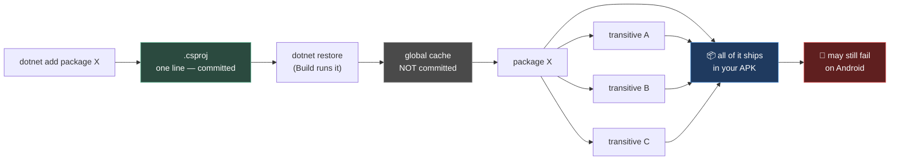

# Chapter 0.16 — NuGet

🪜 **Scaffolding: 85 / 15.**

---

## 🎯 Goal

By the end you will have added a NuGet package to P00, used it on your phone, **measured what it added to the APK**, and audited its transitive dependencies and licences.

---

## 🏃 Fast-Track Summary

*Path C: read this and the cheat sheet, do ⭐ P1 and ⭐ P2, move on.*

```bash
cd projects/P00_HelloPhone
dotnet add package Humanizer.Core          # small, MIT, visible effect
dotnet list package --include-transitive   # ⭐ what came with it
```
```csharp
using Humanizer;
GD.Print(TimeSpan.FromMinutes(90).Humanize());   // "1 hour"
```

- **This is the compensation for C#'s addon disadvantage** ([ADR-029](../../../meta/Decisions.md#adr-029)). NuGet has hundreds of thousands of packages; GDScript has no package ecosystem at all.
- 🚨 **Every package ships inside your APK.** Measure before and after, every time.
- ⭐ **`dotnet list package --include-transitive`** — one package can drag in a dozen. Godot addons rarely do; NuGet packages routinely do.
- **Not all packages work on Android.** Anything touching `System.Drawing`, Windows APIs, or native binaries may compile and then fail on device. **Test on the phone, not the desktop.**
- Apply [0.15](0.15_EvaluatingADependency.md)'s six questions — plus a seventh: **does it run on Android?**
- Commit: `ch 0.16: nuget package added and measured`

---

## 🧭 Before you start

| You need | From |
|---|---|
| P00 exporting to your phone | [0.8](../0A/0.8_P00HelloPhone.md) |
| A baseline APK size | [0.12](../0B/0.12_MeasuredTwoLanguages.md) |
| The six evaluation questions | [0.15](0.15_EvaluatingADependency.md) |

---

## 🔨 Build

### Step 1 — Baseline first

You cannot measure a cost without a before. Export P00 as it stands.

```bash
ls -lh build/*.apk        # 🐧
```
```powershell
Get-ChildItem build\*.apk | Select-Object Name, @{n='MB';e={[math]::Round($_.Length/1MB,2)}}    # 🪟
```

Record it. **Two decimal places** — you are about to look for a small difference.

### Step 2 — Add a package

```bash
cd projects/P00_HelloPhone
dotnet add package Humanizer.Core
```

`[UNVERIFIED]` — the exact output and version resolved.

Look at what changed:

```bash
git diff P00_Hello_Phone.csproj      # your .csproj name may differ
```

A single `<PackageReference>` line. **That line is the entire mechanism** — no vendored source, no `addons/` folder, no plugin to enable.

> 🐣 **What is NuGet?** The .NET package manager, like `npm` or `pip`. `dotnet add package` records a dependency in your `.csproj`; `dotnet restore` (which Build runs automatically) downloads it. The packages themselves live in a global cache, not in your repository — **which is why `.csproj` must be committed and the cache must not.**

### Step 3 — Use it

In `Spinner.cs`:

```csharp
using Godot;
using Humanizer;      // ← the package

public partial class Spinner : Node3D
{
    // ... existing members ...

    public override void _Ready()
    {
        // ... existing prints ...
        var uptime = TimeSpan.FromSeconds(Time.GetTicksMsec() / 1000.0);
        GD.Print($"Humanizer says: {uptime.Humanize()} since start");
        GD.Print($"And {90.ToWords()} degrees per second reads better than 90.");
    }
}
```

Build, `F6`. The Output shows humanised text — from a library you did not write and never downloaded by hand.

### Step 4 — ⭐ Audit what actually came with it

```bash
dotnet list package --include-transitive
```

`Humanizer.Core` is deliberately small. **Now look at something that is not:**

```bash
dotnet add package Serilog.Sinks.Console
dotnet list package --include-transitive
```

Count the transitive entries. `[UNVERIFIED]` — how many you get.

> 🚨 **This is the difference between NuGet and the Asset Library.** A Godot addon is usually one self-contained folder. A NuGet package is a **node in a dependency graph**, and adding one can pull in a dozen you never chose — each with its own licence, its own maintenance status, and its own size.

Then remove it again:

```bash
dotnet remove package Serilog.Sinks.Console
```

### Step 5 — ⭐ Measure the APK cost

Export again, with `Humanizer.Core` still in.

| APK | MB |
|---|---|
| Baseline (Step 1) | |
| With Humanizer.Core | |
| **Difference** | |

> 💡 **The number may be smaller than you expect.** The .NET toolchain can **trim** unused code from libraries when publishing. `[UNVERIFIED]` — whether Godot's Android export enables trimming in your version. That uncertainty is worth resolving, and it is the sort of thing a `[UNVERIFIED]` marker exists for.

### Step 6 — Test it where it counts

Deploy to the phone.

```bash
adb logcat -c
# redeploy
adb logcat --pid=$(adb shell pidof -s com.<you>.hellophone) | grep -i humanizer
```

> 🚨 **This step is not ceremony.** A NuGet package can compile perfectly on your desktop and fail on Android — anything using `System.Drawing`, Windows-only APIs, reflection-heavy code, or native binaries built for x64. **The desktop build proves nothing about the device.**

### Step 7 — Licence audit

Every package carries a licence, and it ships in your app.

```bash
dotnet list package --include-transitive
```

For each entry, check its page on <https://www.nuget.org>. MIT, Apache-2.0, BSD → fine. **Anything GPL-family → stop** ([ADR-008](../../../meta/Decisions.md#adr-008)).

Add the ones you keep to [`AssetLicenses.md`](../../../reference/AssetLicenses.md) — the ledger covers **code as well as art**.

### Step 8 — Commit

```bash
git add .
git commit -m "ch 0.16: nuget package added and measured"
git push
```

> ⚠️ **Commit `.csproj` and any `packages.lock.json`. Never commit the package cache.** [0.7](../0A/0.7_GitForGameProjects.md)'s rule applies: the `.csproj` is authored, the downloaded packages are derived.

---

## ▶️ Run it

- [ ] Baseline APK size recorded before adding anything
- [ ] `Humanizer.Core` added via `dotnet add package`
- [ ] Humanised output on desktop **and on the phone**
- [ ] `--include-transitive` run on both a small and a large package
- [ ] APK difference measured
- [ ] Licences checked and recorded

---

## 👀 Observe

One command, one line in a file, and you had a library. Compare that with [0.15](0.15_EvaluatingADependency.md): browse, download, extract to `addons/`, enable a plugin, restart the editor.

**NuGet's convenience is the danger.** It is so easy that the evaluation habit you built last chapter is the thing most likely to be skipped — and NuGet packages have transitive dependencies, which Godot addons usually do not.

Now look at your transitive list for `Serilog.Sinks.Console`. **You did not choose any of those.** Each one has a licence you now ship, a maintenance status you do not control, and bytes in your APK.

---

## 🧠 Why it works

### Why NuGet is the answer to C#'s addon disadvantage

[ADR-029](../../../meta/Decisions.md#adr-029) is blunt: most Godot addons are GDScript, and using them from C# costs ergonomics. NuGet is the other side of that ledger.

| | Godot Asset Library | NuGet |
|---|---|---|
| Size | A few thousand entries | **Hundreds of thousands** |
| Scope | Godot-specific | **General-purpose** — serialisation, testing, math, compression, logging |
| Available to GDScript? | Yes | **No — none of it** |
| Transitive deps | Rare | **Common** |
| Install | Browse, download, enable | One command |

So the honest framing is not "C# has fewer libraries". It is: **C# has fewer *Godot* libraries and vastly more *everything else* libraries.** Which of those matters depends on what you are building — [1.33b](../../../TableOfContents.md) uses `System.Text.Json` for saves, [10.9b](../../../TableOfContents.md) uses GdUnit4 and FluentAssertions for tests, and none of that exists on the other side.

### The seventh question

[0.15](0.15_EvaluatingADependency.md)'s six questions all apply. NuGet adds one:

> **7 — Does it run on Android, under Godot's .NET runtime?**

A package can compile and fail at runtime on device. The usual culprits are `System.Drawing`, Windows-only APIs, heavy reflection *(which trimming can break)*, and native binaries compiled for the wrong architecture.

**There is no reliable way to know except to run it on the phone**, which is why Step 6 exists and why [ADR-034](../../../meta/Decisions.md#adr-034) makes device testing structural rather than optional.

> 🔬 **Deep dive — why transitive dependencies matter more than their size.** Adding one package that pulls twelve means twelve maintenance statuses, twelve licences and twelve chances that a future version conflicts with something else you depend on — "dependency hell", where two packages demand incompatible versions of a third. `packages.lock.json` (via `<RestorePackagesWithLockFile>`) pins the entire resolved graph so your builds are reproducible, which is exactly the concern [0.18](0.18_TheVersionMatrix.md) is about to generalise to the whole toolchain.

---

## 🗺️ Mental model



---

## 💥 Break it

Add a package that is likely to be hostile to Android, and find out where it fails.

```bash
dotnet add package System.Drawing.Common
```

Then use it in `_Ready`:

```csharp
        var bmp = new System.Drawing.Bitmap(4, 4);
        GD.Print($"Bitmap made: {bmp.Width}x{bmp.Height}");
```

**Build on the desktop. Run on the desktop. Then deploy to the phone.**

Afterwards: `dotnet remove package System.Drawing.Common` and delete those lines.

---

## 🔎 Diagnose

**At which of the four stages did it fail — build, desktop run, deploy, or device run? What does that tell you? Answer before opening.**

<details>
<summary>Answer</summary>

`[UNVERIFIED]` — your exact outcome, and **that uncertainty is the point.** `System.Drawing.Common` is documented as **Windows-only** from .NET 6 onward; on other platforms it throws at runtime rather than failing to compile.

So the likely sequence is: **builds fine · may run on a Windows desktop · fails on Android**, with a `PlatformNotSupportedException` or a missing-native-library error in `logcat`. On a Linux desktop it may fail earlier.

**Why that ordering is the lesson.** Three of the four stages passed. The compiler is satisfied because the *API exists* on every platform — it is the *implementation* that is missing, and that is a runtime fact.

**This is the same shape you have now met four times:**

| Chapter | The unchecked thing |
|---|---|
| [0.6](../0A/0.6_TheGodotEditor.md) | `GetNode("path")` — a string |
| [0.11](../0B/0.11_CSharpFirstContact.md) | Filename ≠ class name — a convention |
| [0.13](../0B/0.13_GDShaderFirstContact.md) | `SetShaderParameter("name")` — a string |
| **0.16** | **Platform support — a runtime property** |

**And it generates the seventh evaluation question:** *does it run on Android, under Godot's .NET runtime?* No amount of desktop testing answers it. **The only reliable check is deploying**, which is exactly why [ADR-034](../../../meta/Decisions.md#adr-034) makes device testing a done-criterion rather than a final step.

**A practical habit:** when adding a NuGet package, check its NuGet.org page for the **supported frameworks and platforms** before you write a line against it. Two minutes there beats an hour after a failed deploy — and it is question 7 answered cheaply, in the spirit of [0.15](0.15_EvaluatingADependency.md)'s ordering.

</details>

---

## 🏋️ Practicals

**⭐ P1 — Measure and record.** Baseline APK, with-package APK, difference, and the transitive list — into [`Machines.md`](../../../meta/Machines.md).

**⭐ P2 — Licence audit.** Every package and transitive dependency you keep, into [`AssetLicenses.md`](../../../reference/AssetLicenses.md). The ledger is for code as well as art.

**P3 — Lock the graph.** Add `<RestorePackagesWithLockFile>true</RestorePackagesWithLockFile>` to your `.csproj`, restore, and commit the generated `packages.lock.json`. You now have reproducible package resolution — a preview of [0.18](0.18_TheVersionMatrix.md).

**🔬 P4 — Find a package you will actually use.** Search NuGet for something relevant to a later module — a JSON serialiser, an assertion library, a noise generator. Run all **seven** questions. Do not install it.

---

## ✅ Check yourself

1. Why is NuGet the answer to C#'s Godot-addon disadvantage?
2. What is the seventh evaluation question, and why can it not be answered on the desktop?
3. What does `--include-transitive` show, and why does it matter more for NuGet than for Godot addons?
4. Which files do you commit, and which do you not?
5. `System.Drawing.Common` compiled fine and failed on device. What class of check was missing?

<details>
<summary>Answers</summary>

1. Because the trade is not "fewer libraries" but **fewer *Godot* libraries and vastly more *general-purpose* ones** — serialisation, testing, math, compression, logging. GDScript has **no** package ecosystem at all, so this is a capability C# has and it does not.
2. **Does it run on Android, under Godot's .NET runtime?** Platform support is a **runtime** property, not a compile-time one — the API exists everywhere; the implementation may not. Only deploying answers it.
3. The **full dependency graph**, including packages you never chose. It matters more because Godot addons are usually one self-contained folder, whereas **NuGet packages routinely pull in a dozen** — each with a licence you ship, a maintenance status you do not control, and bytes in your APK.
4. **Commit** `.csproj` and `packages.lock.json` — authored. **Do not commit** the package cache — derived. Same rule as [0.7](../0A/0.7_GitForGameProjects.md).
5. A **platform-support check**. It is the fourth time this course has shown the same shape: something the compiler cannot verify — a path string, a filename convention, a shader parameter name, and now a platform guarantee — failing later than it should.

</details>

---

## 📎 Cheat sheet

| Command | Does |
|---|---|
| `dotnet add package <name>` | Add a dependency |
| `dotnet remove package <name>` | Remove it |
| ⭐ `dotnet list package --include-transitive` | **The full graph** |
| `dotnet list package --outdated` | What has newer versions |
| `dotnet restore` | Fetch (Build does this) |

| Commit | Do not commit |
|---|---|
| `.csproj` · `packages.lock.json` | The global package cache |

| Question 7 | **Does it run on Android?** Check the NuGet page's supported platforms, then **deploy and confirm** |
|---|---|

| Red flags | `System.Drawing` · Windows-only APIs · native binaries · heavy reflection · GPL-family licence |
|---|---|

---

## 🔗 Further reading

- [nuget.org](https://www.nuget.org/)
- [`Toolchain.md` §6.4](../../../Toolchain.md) — the NuGet packages this course uses
- [ADR-029](../../../meta/Decisions.md#adr-029) · [ADR-008](../../../meta/Decisions.md#adr-008)

---

## 💾 Commit

```text
ch 0.16: nuget package added and measured
```

---

## ➡️ What's next

**[0.17 — Dev-loop tools](0.17_DevLoopTools.md).** You can evaluate and add dependencies. Next, the small tools that make the daily loop faster — and one that will show you exactly why [0.2](../0A/0.2_GodotAndDotNet.md) insisted export templates match your editor version.

---

## 🪞 Reflection

In two sentences: **what does NuGet give you that GDScript users cannot have, and what does it take in return?**

---

## 📝 Chapter changelog

| Version | Date | Change |
|---|---|---|
| 1.0 | 2026-09-02 | First published. `[UNVERIFIED]` on trimming behaviour, transitive counts and the `System.Drawing.Common` failure stage. |
