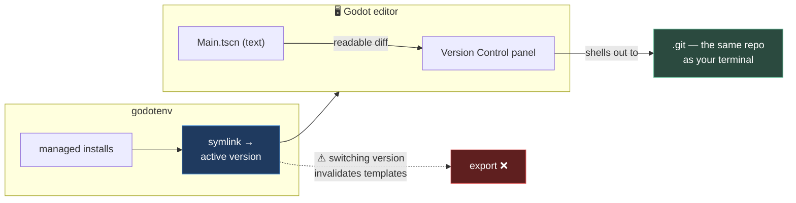

# Chapter 0.17 — Dev-Loop Tools 🧰

🪜 **Scaffolding: 85 / 15.**

---

## 🎯 Goal

By the end, git works inside the Godot editor, **GodotEnv manages your engine versions**, and you will have deliberately broken an export by switching versions — proving why [0.2](../0A/0.2_GodotAndDotNet.md) insisted templates match.

---

## 🏃 Fast-Track Summary

*Path C: read this and the cheat sheet, do ⭐ P2, move on.*

- **Godot Git Plugin** — official, from AssetLib. Gives you a **Version Control** panel: per-file diffs of `.tscn` and `.cs`, staging, commits, without leaving the editor.
- **GodotEnv** — a .NET global tool that installs and switches Godot versions:
  ```bash
  dotnet tool install --global Chickensoft.GodotEnv
  godotenv godot install 4.7.2        # your version
  godotenv godot list
  ```
- ⭐ **Break it on purpose:** switch Godot versions and try to export. **Templates no longer match** → the export fails. That is [0.2](../0A/0.2_GodotAndDotNet.md)'s warning, felt.
- Godot's `.tscn` format is **text**, which is why an in-editor diff is possible at all — engines with binary scene formats cannot do this.
- These are 🧰 **adoptions after the fact** ([ADR-028](../../../meta/Decisions.md#adr-028)): you have used raw `git` since [0.7](../0A/0.7_GitForGameProjects.md) and installed Godot by hand since [0.2](../0A/0.2_GodotAndDotNet.md). Now you meet the tools that automate what you already understand.
- Commit: `ch 0.17: dev-loop tools`

---

## 🧭 Before you start

| You need | From |
|---|---|
| Raw `git` used from the command line | [0.7](../0A/0.7_GitForGameProjects.md) |
| A working export to your phone | [0.8](../0A/0.8_P00HelloPhone.md) |
| The six evaluation questions | [0.15](0.15_EvaluatingADependency.md) |

> 📌 **Order matters here.** You learned `git` before the GUI, and you installed Godot by hand before the version manager. Both are [ADR-028](../../../meta/Decisions.md#adr-028) — **when these tools misbehave, you will know what they were doing on your behalf.**

---

## 🔨 Build

### Step 1 — The Godot Git Plugin

`AssetLib` → search **Git Plugin** → Download → Install. It is the official one, maintained by the Godot organisation. `[UNVERIFIED]` — exact naming and availability for your version.

Then: `Project → Project Settings → Plugins` → enable it. Restart if asked.

Open your P00 project. A **Version Control** panel appears in the bottom bar, beside Output and Debugger. `[UNVERIFIED]` — its exact placement.

### Step 2 — Diff a scene, which is the point ⭐

1. Open `Main.tscn`.
2. Move the camera slightly and save.
3. Open the **Version Control** panel and select `Main.tscn`.

**You get a readable line-by-line diff of a 3D scene.**

```text
- transform = Transform3D(1, 0, 0, 0, 1, 0, 0, 0, 1, 0, 2, 4)
+ transform = Transform3D(1, 0, 0, 0, 1, 0, 0, 0, 1, 0, 2.5, 4)
```

> 💡 **This is only possible because Godot's scene format is text** ([0.7](../0A/0.7_GitForGameProjects.md)). Engines with binary scene formats cannot show you this, and teams working in them resort to *file locking* — one person may edit a scene at a time. You are inheriting a real advantage, and this panel is where you notice it.

Stage and commit from the panel. Then confirm from the terminal:

```bash
git log --oneline -1
```

Same repository, same commits. **The plugin is a front end for the git you already know** — which is precisely why learning `git` first was the right order.

### Step 3 — GodotEnv

```bash
dotnet tool install --global Chickensoft.GodotEnv
godotenv --version
```

`[UNVERIFIED]` — package id and command name; check <https://github.com/chickensoft-games/GodotEnv> if it differs.

> 🐣 **A .NET *global tool*** is a command-line program distributed through NuGet ([0.16](0.16_NuGet.md)) and installed onto your `PATH` rather than into a project. Same ecosystem, different delivery.

Now let it manage your engine:

```bash
godotenv godot list                  # what it knows about
godotenv godot install 4.7.2         # your current version — use yours
godotenv godot list                  # again
```

It downloads the engine, stores it in a managed location, and creates a **symlink** that always points at the active version.

> 💡 **The symlink is the whole idea.** Your IDE, scripts and shortcuts point at one stable path; GodotEnv changes what sits behind it. That is the same trick `nvm` and `pyenv` use.

⚠️ **Make sure you install the `.NET` variant.** GodotEnv can fetch either; the standard build has no C# ([0.2](../0A/0.2_GodotAndDotNet.md)).

### Step 4 — Evaluate them properly

Both are 🧰 adoptions, so run [0.15](0.15_EvaluatingADependency.md)'s six questions on each and record verdicts in [`DecisionsLog.md`](../../../meta/DecisionsLog.md). Some answers are already obvious:

| | Git Plugin | GodotEnv |
|---|---|---|
| Licence | MIT (official Godot org) | MIT (Chickensoft) |
| Maintained | Official | Actively maintained |
| C# viability | n/a — an editor tool | ✅ It **is** a .NET tool |
| Mobile cost | **Zero** — editor only, never ships | Zero — never in the project |
| If abandoned | Fall back to CLI `git` | Fall back to manual installs |
| Write it in a day? | No | No |

> 📌 **Note the pattern in row 4.** Editor-only tools cost nothing at runtime. That is a genuinely different risk profile from a gameplay addon, and it is why the six questions are a *framework* rather than a checklist — question 4 is nearly free to answer here and was the expensive one in [0.15](0.15_EvaluatingADependency.md).

### Step 5 — Commit

```bash
git add .
git commit -m "ch 0.17: dev-loop tools"
git push
```

---

## ▶️ Run it

- [ ] Version Control panel shows a **readable diff of `Main.tscn`**
- [ ] A commit made from inside the editor appears in `git log`
- [ ] `godotenv godot list` shows your installed version
- [ ] Both evaluated, verdicts in `DecisionsLog.md`

---

## 👀 Observe

Neither tool did anything you could not already do. That is the point of adopting *after* hand-building — you can see exactly what each one is automating, and you would know what to do if it vanished.

Look at the scene diff again. **You can read a 3D change as text.** That fact underpins code review of scene files, sane merges when the capstone has four levels, and the architecture chapters in Module 10 that assume scenes are diffable.

---

## 🧠 Why it works

### Why a version manager exists at all

Godot is portable — unzip and run — which makes *installing* trivial and *managing several versions* fiddly. You end up with folders like `Godot_v4.7.2`, `Godot_v4.8_test`, shortcuts pointing at the wrong one, and an IDE configured against a path you deleted.

A version manager fixes it with **indirection**: everything points at one stable path, and the manager changes what is behind it.

That matters more than convenience here, because of a fact you already met: **export templates must match the editor version exactly** ([0.2](../0A/0.2_GodotAndDotNet.md)). A version manager makes switching easy — and easy switching without matching templates produces exactly the failure you are about to cause.

### Why the git plugin is a front end, not a replacement

It shells out to the same git. Same `.git` directory, same commits, same history, interchangeable with the terminal.

**Which is why [0.7](../0A/0.7_GitForGameProjects.md) came first.** A GUI that hides `git check-ignore -v`, `git ls-files` and `git count-objects` from you is fine *once you know they exist*. Learned in the other order, you inherit a tool you cannot debug — and the first merge conflict is a bad moment to discover it.

> 🔬 **Deep dive — why `.tscn` is text and what it buys.** A Godot scene is an INI-like file listing nodes, properties and resource references. That makes scenes **diffable**, **mergeable** (mostly), and **greppable** — you can `grep -r "MeshInstance3D" scenes/` and get real answers. It costs some load-time parsing, which is why Godot also has a binary `.scn` format for exports. **The editor format optimises for humans and version control; the export format optimises for the machine.** A deliberate trade, and you benefit from both ends.

---

## 🗺️ Mental model



---

## 💥 Break it ⭐

Switch Godot versions and try to ship.

1. Note your current version: `godot --version`. Write it down.
2. Install a **different** version:
   ```bash
   godotenv godot install 4.6.0        # any version you do not have
   godotenv godot use 4.6.0
   godot --version                     # confirm it changed
   ```
   `[UNVERIFIED]` — exact subcommand names.
3. Open P00 in the new version. Note any warnings.
4. **Try to export the Android APK.**
5. Then switch back: `godotenv godot use 4.7.2`, reopen, export again.

---

## 🔎 Diagnose

**What failed, and why did opening the project succeed while exporting did not? Answer before opening.**

<details>
<summary>Answer</summary>

**Opening usually works** — Godot is fairly tolerant of projects from nearby versions, though it may warn or silently re-import.

**Exporting fails**, because export templates are installed **per editor version** and you have none for the new one. `[UNVERIFIED]` — the exact message, but expect it to name the version it wanted.

**Why the difference is instructive.** Opening a project is the editor reading your files. **Exporting requires a matching prebuilt engine binary for the target platform** — and that binary is the template. There is nothing to fall back on, and no way to fudge a mismatch, because template and editor must agree on the data format they exchange.

**This is [0.2](../0A/0.2_GodotAndDotNet.md) Step 5's warning, felt rather than read.** And it is the reason a version manager is a double-edged tool: it makes switching *easy*, which makes it easy to switch and forget the templates.

**The rule that follows, and it is worth writing in your notes:**

> **Changing the Godot version is a three-part operation: editor, export templates, and a test export. Doing one of the three is worse than doing none, because you now have a project that opens fine and cannot ship.**

Note also the shape of the failure: it appeared at **export**, not at open — late, and only when you tried to do the thing that matters. That is the same ordering lesson as [0.8](../0A/0.8_P00HelloPhone.md)'s *ask how far it got before asking what went wrong*, and it is exactly why [0.18](0.18_TheVersionMatrix.md) — the next chapter — makes you write every version down in one place.

</details>

---

## 🏋️ Practicals

**⭐ P1 — Diff something meaningful.** Change three different things in `Main.tscn` — a node's transform, a script's exported value, a node's name — and read the diff for each. **Predict what the text will look like before you look.** You are learning to read the format, which pays off in every merge from here on.

**⭐ P2 — Version-switch drill.** Switch away and back **twice**, exporting successfully at the end of each. Time it. Write the sequence into `Machines.md` as a runbook — you will need it when [11.19d](../../../TableOfContents.md) has you upgrade Godot mid-project.

**P3 — Use the GUI for one full session.** Stage, diff, commit and view history without touching the terminal. Note where it is faster and where it is not. Both answers are worth having.

**🔬 P4 — Find its limits.** Try `git bisect` from the Version Control panel. `[UNVERIFIED]` — it is very likely unsupported. **Knowing what a GUI cannot do is the reason to learn the CLI first**, and you will need bisect in [2.3](../../../TableOfContents.md).

---

## ✅ Check yourself

1. Why can Godot show you a readable diff of a 3D scene?
2. Why learn CLI git before the plugin?
3. What does a version manager actually do?
4. Why did switching versions let you open the project but not export it?
5. What are the three parts of changing your Godot version?

<details>
<summary>Answers</summary>

1. Because **`.tscn` is text** — an INI-like listing of nodes and properties. That makes scenes diffable, mergeable and greppable. Engines with binary scene formats cannot do this, and their teams use file locking instead.
2. Because the plugin **shells out to the same git**. A GUI is fine once you know what it is hiding; learned first, it leaves you with a tool you cannot debug — and the first merge conflict is a bad time to find that out. Also, it cannot do everything: `bisect`, `check-ignore` and friends still need the CLI.
3. **Indirection.** It installs versions into a managed location and points a **stable path** — usually a symlink — at whichever is active. Your IDE and scripts never change; what sits behind the path does.
4. **Opening** is the editor reading your files, and Godot tolerates nearby versions. **Exporting needs a matching prebuilt engine binary for the target platform** — the export template — installed per editor version. A mismatch cannot be fudged, because both sides must agree on the data format.
5. **Editor · export templates · a test export.** Doing one of the three is worse than doing none, because you end up with a project that opens fine and cannot ship.

</details>

---

## 📎 Cheat sheet

| Tool | Gives you |
|---|---|
| **Godot Git Plugin** | In-editor diff/stage/commit. Front end for the same `.git` |
| **GodotEnv** | Install and switch Godot versions via a stable symlink |

| Command | Does |
|---|---|
| `dotnet tool install --global Chickensoft.GodotEnv` | Install |
| `godotenv godot list` | Installed versions |
| `godotenv godot install <ver>` | Fetch one — **use the .NET variant** |
| `godotenv godot use <ver>` | Switch the active version |

> 🚨 **Changing Godot version = editor + templates + a test export.** Anything less gives you a project that opens and cannot ship.

---

## 🔗 Further reading

- [Godot Git Plugin](https://github.com/godotengine/godot-git-plugin)
- [GodotEnv](https://github.com/chickensoft-games/GodotEnv)
- [`Toolchain.md` §6.1](../../../Toolchain.md) — the Chickensoft ecosystem
- [ADR-028](../../../meta/Decisions.md#adr-028) — hand-build first, then adopt

---

## 💾 Commit

```text
ch 0.17: dev-loop tools
```

---

## ➡️ What's next

**[0.18 — The version matrix](0.18_TheVersionMatrix.md).** ⭐ You have just proved that a version mismatch can silently make a project unshippable. Next you write every version down in one file — and build a script that regenerates it.

---

## 🪞 Reflection

In two sentences: **why did the project open but refuse to export, and what does that imply about changing versions?**

---

## 📝 Chapter changelog

| Version | Date | Change |
|---|---|---|
| 1.0 | 2026-09-02 | First published. `[UNVERIFIED]` on plugin naming, GodotEnv subcommands and the export failure text. |
