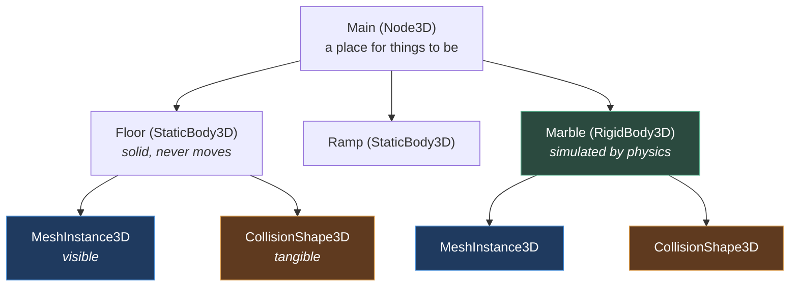

# Chapter 1.1 — Nodes: The One Idea Godot Is Built On

🪜 **Scaffolding: 90 / 10.**

---

## 🎯 Goal

By the end, a marble rolls down a ramp and comes to rest — **with no code at all** — and you will be able to say what a node is and why Godot has thousands of small ones instead of one big one.

---

## 🏃 Fast-Track Summary

*Path C: read this and the cheat sheet, do ⭐ P1, move on.*

- New project `projects/P01_MarbleRunner`, renderer **Mobile**.
- The marble is a **composition**, not a class:
  ```text
  Marble  (RigidBody3D)      ← simulated by physics
  ├── MeshInstance3D         ← you can see it
  └── CollisionShape3D       ← physics can feel it
  ```
- A floor: `StaticBody3D` + `MeshInstance3D` (BoxMesh) + `CollisionShape3D`.
- **`F6`. The marble falls and lands. You wrote zero lines of code.**
- ⭐ **One node, one job.** Visible, collidable and simulated are *three* responsibilities, so they are three nodes. Remove one and exactly one capability disappears.
- Children inherit the parent's transform — the tree is a **hierarchy of space**, not just of ownership.
- Break it: delete the `CollisionShape3D` and watch the marble fall through the world.
- Commit: `ch 1.1: marble falls, no code`

---

## 🧭 Before you start

| You need | From |
|---|---|
| A working export to your phone | [0.8](../../module0/0A/0.8_P00HelloPhone.md) |
| Editor fluency, including the **Remote** tree | [0.6](../../module0/0A/0.6_TheGodotEditor.md) |
| `.gitignore` habits | [0.7](../../module0/0A/0.7_GitForGameProjects.md) |

> 📌 **Module 1 builds one thing.** Every chapter from here to [1.52](../../../TableOfContents.md) adds a feature to **Marble Runner** — a finished, three-level game you will ship in Module 2. Today it is a ball and a floor.

---

## 🔨 Build

### Step 1 — The project

New Godot project at `<course repo>/projects/P01_MarbleRunner`, renderer **Mobile** ([ADR-010](../../../meta/Decisions.md#adr-010)).

Copy in the `.gitignore` you proved in [0.7](../../module0/0A/0.7_GitForGameProjects.md), then:

```bash
git status --short          # should be short — no .godot/, bin/, obj/
```

### Step 2 — A floor to land on

`Scene → New Scene` → **3D Scene**. Rename the root `Main` (`F2`). Save as `res://Main.tscn`.

Add a floor. **Three nodes, deliberately:**

1. `Ctrl+A` → **`StaticBody3D`** → rename `Floor`.
2. With `Floor` selected, `Ctrl+A` → **`MeshInstance3D`**. Inspector → Mesh → **New BoxMesh** → set **Size** to `(10, 0.5, 10)`.
3. With `Floor` selected again, `Ctrl+A` → **`CollisionShape3D`**. Inspector → Shape → **New BoxShape3D** → **Size** `(10, 0.5, 10)`.

```text
Main (Node3D)
└── Floor (StaticBody3D)
    ├── MeshInstance3D    ← the picture
    └── CollisionShape3D  ← the physics
```

> 🐣 **Why is a floor three nodes?** Because "being solid" and "being visible" are genuinely different jobs. A trigger volume is collidable and invisible. A background prop is visible and not collidable. **Godot lets you have either by leaving a node out**, rather than by ticking a box on a big object.

> ⚠️ **The mesh and the shape are set independently, and nothing checks that they match.** Set one to `(10, 0.5, 10)` and the other to `(1, 1, 1)` and you get a floor that looks ten metres wide and is one metre wide. This is a real and common bug. You will cause it on purpose in Break it.

### Step 3 — The marble

Select `Main`, then:

1. `Ctrl+A` → **`RigidBody3D`** → rename `Marble`.
2. Position it at `(0, 4, 0)` — four metres up.
3. Under `Marble`: `Ctrl+A` → **`MeshInstance3D`** → Mesh → **New SphereMesh** → Radius `0.5`, Height `1.0`.
4. Under `Marble`: `Ctrl+A` → **`CollisionShape3D`** → Shape → **New SphereShape3D** → Radius `0.5`.

```text
Main (Node3D)
├── Floor  (StaticBody3D)
│   ├── MeshInstance3D
│   └── CollisionShape3D
└── Marble (RigidBody3D)      ← position (0, 4, 0)
    ├── MeshInstance3D
    └── CollisionShape3D
```

### Step 4 — See it

Add a camera and a light so there is something to look at:

- `Camera3D` under `Main`, position `(0, 4, 9)`, rotation X `-15°`
- `DirectionalLight3D` under `Main`, rotation `(-50, -35, 0)`

Save (`Ctrl+S`), then **`F6`**.

**The marble falls, hits the floor and settles.**

> 🚨 **Count the lines of code you have written. Zero.** Gravity, collision detection, the collision response, the settling — all of it came from choosing a `RigidBody3D` and giving it a shape. **This is what people mean when they call Godot's node system composable**: behaviour arrives by assembling parts, not by writing a class that has the behaviour.

### Step 5 — A ramp, and what parenting really does

1. Select `Main` → `Ctrl+A` → **`StaticBody3D`** → rename `Ramp`.
2. Give it a `MeshInstance3D` (BoxMesh, Size `(4, 0.3, 8)`) and a `CollisionShape3D` (BoxShape3D, same size).
3. Select `Ramp` and set **Rotation X** to `-20°`, **Position** to `(0, 1.5, -3)`.

Notice the children rotated with it. **You set the rotation on the parent and both children followed** — you did not touch them.

Now move the marble to sit above the ramp: `Marble` position `(0, 5, -6)`.

`F6`. **The marble rolls down the ramp**, off the end, onto the floor.

> 💡 **The tree is a hierarchy of space.** A child's transform is expressed *relative to its parent*. That is why moving `Ramp` moves its collision shape and its mesh together, permanently in step — and why in [1.24](../../../TableOfContents.md) a camera parented to a `SpringArm3D` follows the marble for free.

### Step 6 — One node, one job

Prove the claim. With the game **not** running:

1. Select the `Marble`'s `MeshInstance3D` and **untick its visibility** (the eye icon in the Scene dock).
2. `F6`.

The marble is invisible — **and still rolls down the ramp**, because collision is a different node's job. Press `F8`, re-enable it.

### Step 7 — Commit

```bash
git add projects/P01_MarbleRunner
git commit -m "ch 1.1: marble falls, no code"
git push
```

---

## ▶️ Run it

- [ ] The marble falls and settles on the floor
- [ ] With the ramp, it rolls down and off the end
- [ ] Rotating `Ramp` rotated both of its children
- [ ] Hiding the mesh left the physics working
- [ ] **You have written no C# in this chapter**

---

## 👀 Observe

You built a working physics scene by **choosing and arranging** nodes. Nothing was configured that could have been left out, and nothing was written.

Now look at the Scene dock and count: seven nodes, and **every one has exactly one job**. `RigidBody3D` is simulated. `MeshInstance3D` is drawn. `CollisionShape3D` has a shape. None of them does two things.

That is not an accident of this scene — it is how Godot's whole library is designed, and it is why there are hundreds of node types rather than a dozen configurable ones.

---

## 🧠 Why it works

### What a node actually is

A node is **an object with a name, a parent, children, and a lifecycle** — and, crucially, **one responsibility**. Godot ships hundreds of them: `Timer`, `AudioStreamPlayer3D`, `Camera3D`, `Button`, `NavigationAgent3D`.

You build behaviour by **composing** them, not by configuring one large object.

> 🔬 **Deep dive — why not one `GameObject` with components?** Unity's model is a single `GameObject` that holds a list of components. Godot's is a *tree of small objects*. Both are composition; the difference is that in Godot **the composition is also the spatial hierarchy and the ownership hierarchy**. One structure does three jobs: it says what exists, what contains what, and what moves with what. That is why a Godot scene is a single readable tree and why `.tscn` diffs are legible ([0.7](../../module0/0A/0.7_GitForGameProjects.md)) — and it is also the reason you must think about *where* a node sits, not only *that* it exists.

### Why physics needed two nodes

`CollisionShape3D` answers *"what shape am I, to the physics engine?"* `MeshInstance3D` answers *"what do I look like?"*

Keeping them apart buys you three things you will use constantly:

| You want | You do |
|---|---|
| A trigger volume | Collision shape, no mesh |
| A decorative prop | Mesh, no collision shape |
| A cheap collider on a detailed model | A **simple** shape under a **complex** mesh |

That third row is a performance technique you will lean on hard in [5.15](../../../TableOfContents.md): the player sees ten thousand triangles, the physics engine sees a sphere.

### Why the parent's transform propagates

Each `Node3D` stores a transform **relative to its parent**. The engine multiplies down the tree to get world position. So parenting is not merely organisational — **it is a statement that these things move together.**

Get this wrong and the symptoms are confusing rather than obvious: a collision shape that drifts away from its mesh, a camera that orbits the wrong point. Chapter [1.8](../../../TableOfContents.md) makes the maths explicit.

---

## 🗺️ Mental model



Blue = seen. Orange = felt. Green = simulated. **Three jobs, three node types.**

---

## 💥 Break it

Three sabotages. Predict the result before running each, and restore afterwards.

1. Delete the **`Marble`'s `CollisionShape3D`**. `F6`.
2. Restore it. Now set the **`Floor`'s `CollisionShape3D`** `BoxShape3D` **Size** to `(1, 0.5, 1)` — leaving the mesh at `(10, 0.5, 10)`. `F6`.
3. Restore. Now **drag the `Marble`'s `CollisionShape3D` out of `Marble`** and drop it onto `Main`, so it becomes a sibling instead of a child. `F6`.

---

## 🔎 Diagnose

**For each: what happened, and which of the two jobs — seeing or feeling — was affected? Answer before opening.**

<details>
<summary>Answer</summary>

**1 — No collision shape on the marble.** It falls **straight through the floor and out of the world**, still visible the whole way. `[UNVERIFIED]` — Godot may also print a warning that a `RigidBody3D` has no shape.

The marble is still *simulated* — gravity still applies — but the physics engine has no idea what shape it is, so there is nothing to collide *with*. **Being simulated and being collidable are different things**, and this is the clearest demonstration of it.

**2 — Mismatched floor.** The marble lands on an **invisible one-metre platform in the middle of a ten-metre floor**, and rolls off into nothing. Everything *looks* right.

**This is the worst failure of the three**, because there is no error, no warning, and the scene renders perfectly. It is the [0.11](../../module0/0B/0.11_CSharpFirstContact.md) lesson again in a new costume: *"nothing checks that these two agree."* Godot cannot verify that your shape matches your mesh, because plenty of legitimate scenes deliberately mismatch them (row 3 of the table above). **You are the only check.**

**3 — Collision shape reparented.** The marble again falls through — the shape is now attached to `Main`, which is a plain `Node3D` with no physics body, so it belongs to nobody. Meanwhile there is a stray sphere collider sitting at the world origin.

**The rule this establishes:** a `CollisionShape3D` only means anything as a **direct child of a physics body**. It is not a free-floating property of the world; **the parent is what gives it meaning.**

**The pattern across all three.** Each broke a *relationship*, not a value — a missing part, two parts disagreeing, a part in the wrong place. None produced a compile error, because none of them is expressible in code at all. **In a composition-based engine, most bugs are structural**, and the Scene dock is where you debug them. That is why [1.3](1.3_TheSceneTree.md) is about the tree itself, and why the **Remote** tree from [0.6](../../module0/0A/0.6_TheGodotEditor.md) is your best tool here — it shows you the structure as it actually is while the game runs.

</details>

---

## 🏋️ Practicals

**⭐ P1 — Build a second obstacle.** Add a wall the marble bounces off, using the same three-node pattern. Then a **trigger** — an `Area3D` with a collision shape and **no mesh** — and confirm the marble passes through it.

**P2 — Make one node do less.** Give the `Floor` a *second* `CollisionShape3D`, a small box, positioned as a step. One body, two shapes. Note that the node types did not change — you added a part.

**P3 — Reparent deliberately.** Put the `Camera3D` **under** the `Marble` and run. It is now a first-person marble camera, and it is horrible. Note that you changed no code and no camera settings — only the tree. Undo it.

**🔬 P4 — Count the library.** In the Add Node dialog, expand `Node3D` and read the list of descendants. You will use perhaps thirty of them across this course. **Knowing roughly what exists is a real skill** — it stops you writing a `Timer` by hand.

---

## ✅ Check yourself

1. What is a node, in one sentence?
2. Why do the mesh and the collision shape live in separate nodes?
3. What does making one node a child of another actually do?
4. Your marble falls through the floor. Name three structural causes.
5. Why did the mismatched-size failure produce no error?

<details>
<summary>Answers</summary>

1. **An object with a name, a parent, children, a lifecycle — and one responsibility.** Behaviour comes from composing many, not configuring one.
2. Because **being visible and being tangible are different jobs**, and you frequently want one without the other: triggers are collidable and invisible, props are visible and intangible, and a detailed model usually wants a *simple* collider for performance.
3. It **places the child in the parent's space** — the child's transform is relative to the parent's, so it moves, rotates and scales with it — *and* it establishes ownership. In Godot one tree does both jobs at once.
4. No `CollisionShape3D`; the shape not a direct child of the physics body; the shape's size not matching the mesh (or being unset). All three are structural, and none is a code error.
5. Because **nothing can check it.** Deliberately mismatching a mesh and a collider is a legitimate and common technique — a cheap collider under a detailed mesh. Godot cannot distinguish that from a mistake, so **you are the only check.**

</details>

---

## 📎 Cheat sheet

| Node | Job |
|---|---|
| `Node3D` | Has a transform. A place for other things |
| `MeshInstance3D` | **Visible.** Needs a `Mesh` resource |
| `CollisionShape3D` | **Tangible.** Needs a `Shape3D`. **Only works as a direct child of a physics body** |
| `StaticBody3D` | Solid, never moves. Floors, walls |
| `RigidBody3D` | Simulated by physics. Never set its position directly ([1.13](../../../TableOfContents.md)) |
| `Area3D` | Detects overlap, never solid. Triggers |
| `Camera3D` · `DirectionalLight3D` | See · light |

| Shortcut | Does |
|---|---|
| `Ctrl+A` | Add Node **as a child of the selection** |
| `F2` | Rename |
| Drag in Scene dock | Reparent — **changes both space and meaning** |
| Eye icon | Toggle visibility, without touching physics |

> 🚨 **Mesh size and collision size are set independently and nothing checks they agree.**

---

## 🔗 Further reading

- [Nodes and scenes](https://docs.godotengine.org/en/stable/getting_started/step_by_step/nodes_and_scenes.html)
- [`projects/README.md`](../../../../projects/README.md) — P01's brief and done-criteria
- [ADR-010](../../../meta/Decisions.md#adr-010) — why Mobile renderer from chapter one

---

## 💾 Commit

```text
ch 1.1: marble falls, no code
```

---

## ➡️ What's next

**[1.2 — Scenes, instancing, and scene inheritance](1.2_ScenesAndInstancing.md).** You have one marble. Next you make it a *thing you can have many of* — and meet Godot's answer to prefabs.

---

## 🪞 Reflection

In two sentences: **why does Godot have hundreds of small node types instead of one configurable object, and what did that buy you in this chapter?**

---

## 📝 Chapter changelog

| Version | Date | Change |
|---|---|---|
| 1.0 | 2026-09-03 | First published. `[UNVERIFIED]` on Godot's missing-shape warning text. |
