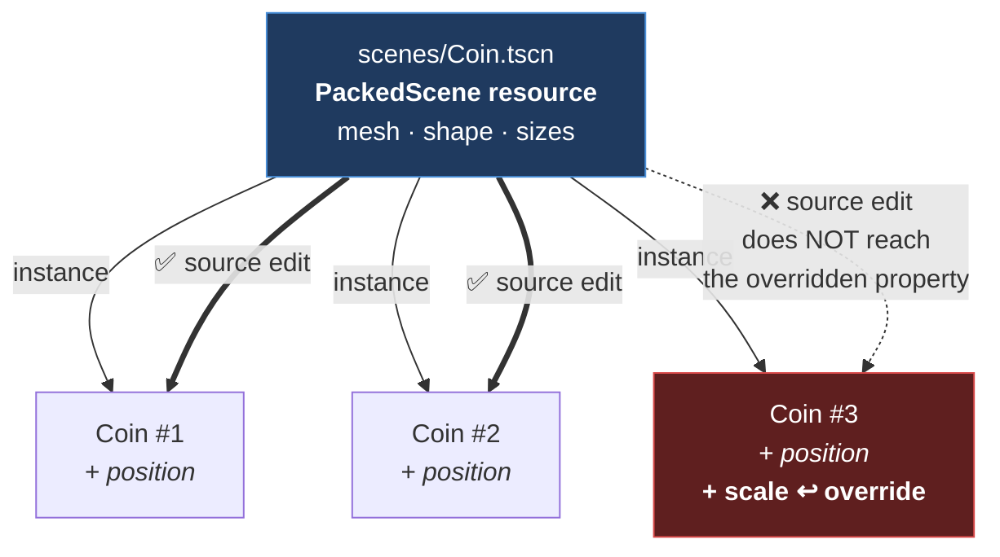

# Chapter 1.2 — Scenes, Instancing, and Scene Inheritance

🪜 **Scaffolding: 90 / 10.**

---

## 🎯 Goal

By the end, five collectibles will exist in your level from **one** source scene — edit the source and all five change — and you will know exactly when they stop obeying it.

---

## 🏃 Fast-Track Summary

*Path C: read this and the cheat sheet, do ⭐ P1, move on.*

- **Scene dock → right-click a branch → Save Branch as Scene.** The subtree becomes a reusable `.tscn` and the original becomes an *instance* of it.
- Instance it: **drag the `.tscn` from FileSystem into the viewport**, or the chain-link icon in the Scene dock.
- ⭐ **Edit the source scene, and every instance updates.** That is the whole point.
- 🚨 **Except any property you changed on an instance.** A changed property becomes a **local override** — Godot marks it with a **revert arrow** — and it stops tracking the source *for that property only*.
- **Scene inheritance** (`Scene → New Inherited Scene`) makes a *variant*: a child scene that follows its parent except where it deliberately differs.
- Instances are cheap: a scene is a **`PackedScene` resource**, loaded once and stamped out.
- Break it: override a property on one instance, then change the source. Watch which of the five move.
- Commit: `ch 1.2: marble and coin scenes, instanced`

---

## 🧭 Before you start

| You need | From |
|---|---|
| P01 with marble, ramp and floor | [1.1](1.1_Nodes.md) |
| Node composition, and what parenting does | [1.1](1.1_Nodes.md) |

---

## 🔨 Build

### Step 1 — Turn the marble into a scene

Right now `Marble` is three nodes sitting inside `Main.tscn`. If you wanted a second marble you would rebuild them by hand.

1. In the Scene dock, **right-click `Marble`** → **Save Branch as Scene**.
2. Save as `res://scenes/Marble.tscn`.

Look at what happened:

- `Marble` in `Main.tscn` now shows a **🎬 clapperboard icon** — it is an **instance** of another scene.
- Its children have **disappeared from the tree**. They still exist; the instance shows as one unit.
- A new file exists: `scenes/Marble.tscn`.

> 🐣 **Nothing was moved or deleted.** The subtree was written out to its own file, and the place it used to be now says *"put a copy of that file here."*

### Step 2 — Prove instancing works

1. Select `Marble` in `Main` and press `Ctrl+D` to duplicate it. Move the copy to `(2, 5, -6)`.
2. Duplicate again → `(-2, 5, -6)`.
3. `F6`. **Three marbles roll down the ramp.**

Now edit the source:

4. Double-click `scenes/Marble.tscn` in the FileSystem dock to **open it**.
5. Select its `MeshInstance3D` → Mesh → **Radius `0.35`, Height `0.7`**.
6. Also shrink the `CollisionShape3D`'s `SphereShape3D` **Radius to `0.35`**.
7. Save (`Ctrl+S`), then reopen `Main.tscn`.

**All three marbles are smaller.** One edit, three objects.

### Step 3 — A collectible, built as a scene from the start

1. `Scene → New Scene` → **Other Node** → `Area3D`. Rename `Coin`.
2. Under it: `MeshInstance3D` → Mesh → **New CylinderMesh** → Height `0.1`, Top/Bottom Radius `0.3`. Rotate the mesh `90°` on X so it stands like a coin.
3. Under it: `CollisionShape3D` → **New CylinderShape3D**, matching size.
4. Save as `res://scenes/Coin.tscn`.

> 💡 **`Area3D`, not `StaticBody3D`.** A coin should be *detected*, not collided with — you pass through it. That is exactly the "collidable but not solid" case from [1.1](1.1_Nodes.md), and [1.14](../../../TableOfContents.md) will wire up the detection.

Now place five of them:

5. Open `Main.tscn`.
6. **Drag `scenes/Coin.tscn` from the FileSystem dock into the viewport.** That is instancing.
7. Position it somewhere on the ramp. Duplicate (`Ctrl+D`) four more times and spread them along the run.

`F6`. The marble rolls through them. Nothing happens yet — that is [1.14](../../../TableOfContents.md)'s job.

### Step 4 — ⭐ Meet the local override

This is the part that catches everyone.

1. In `Main.tscn`, select **one** coin.
2. In the Inspector, change its **Scale** to `(2, 2, 2)`.
3. **Look at the property row.** A small **revert arrow** ↩ has appeared next to `Scale`.

That arrow means: *"this value no longer comes from the source scene."* You have created a **local override**.

Now test what that costs:

4. Open `scenes/Coin.tscn` and set the root `Coin`'s **Scale** to `(0.5, 0.5, 0.5)`. Save.
5. Back in `Main.tscn`: **four coins shrank. The one you edited did not.**

> 🚨 **This is the single most common source of "why didn't my change apply?"** — in this course and in Godot generally. The instance is still linked; it is only *that one property* that has stopped listening. Click the ↩ arrow to give it back.

### Step 5 — Scene inheritance: a variant, not a copy

You want a heavy marble that shares everything with the normal one except its mass.

1. `Scene → New Inherited Scene…` → choose `scenes/Marble.tscn`.
2. The tree appears, its nodes shown in a different colour — they belong to the parent scene.
3. Select the root and set `RigidBody3D` → **Mass** to `10`.
4. Save as `res://scenes/MarbleHeavy.tscn`.

Now instance one `MarbleHeavy` into `Main` alongside the others.

5. Go back to `scenes/Marble.tscn` and change the mesh colour — add a `StandardMaterial3D` with a red albedo to its `MeshInstance3D`. Save.

**Both the normal marbles and the heavy one turn red**, because the heavy one only overrode *mass*.

> 💡 **Inheritance is override-by-exception.** A child scene follows its parent in everything, except where you deliberately differ. That is how [4.x](../../../TableOfContents.md) will build enemy variants, and how the Foundry Kit's pieces will share one material setup.

### Step 6 — Commit

```bash
git add .
git commit -m "ch 1.2: marble and coin scenes, instanced"
git push
```

---

## ▶️ Run it

- [ ] `scenes/Marble.tscn` and `scenes/Coin.tscn` exist
- [ ] Editing `Marble.tscn` changed every instance
- [ ] Five coins from one source scene
- [ ] You created a local override and saw the ↩ arrow
- [ ] The overridden coin **ignored** the source change; the others obeyed
- [ ] `MarbleHeavy.tscn` inherits from `Marble.tscn` and overrides only mass

---

## 👀 Observe

Open `Main.tscn` in a text editor.

```text
[ext_resource type="PackedScene" path="res://scenes/Coin.tscn" id="..."]

[node name="Coin" parent="." instance=ExtResource("...")]
transform = ...
```

Each instance is **one line plus its overrides**. The coin's mesh, shape and sizes are not repeated five times — they live once, in `Coin.tscn`.

That is why instancing matters beyond convenience: **`Main.tscn` stays small and diffable**, and a change to a coin is one line in one file rather than five identical edits spread across a level ([0.7](../../module0/0A/0.7_GitForGameProjects.md)).

---

## 🧠 Why it works

### A scene is a resource, not a special thing

A `.tscn` loads as a **`PackedScene`** — a resource holding a recipe for building a subtree. Instancing calls `Instantiate()` on it, which stamps out fresh nodes.

Three consequences you will rely on:

| Because a scene is a resource | You can |
|---|---|
| It is loaded once and reused | Spawn hundreds cheaply ([1.32](../../../TableOfContents.md)) |
| It can be `[Export]`ed | Let a designer pick which enemy spawns, in the Inspector |
| It is just data | Build one procedurally, save it, load it |

### Why overrides exist, and why they are not a bug

An instance would be useless if every one had to be identical — they need different positions at least. **Position is itself an override.**

So Godot's rule is: *inherit everything, remember what you changed*. It stores only the differences, which is why an instance is one line in the `.tscn`.

The cost is exactly what you saw in Step 4: **an override is invisible unless you look for the arrow**, and it silently wins over later source edits. That is a real trade, made deliberately, and the mitigation is knowing the arrow exists.

> 🔬 **Deep dive — instancing versus duplication, and where each belongs.** `Ctrl+D` on an *instance* produces another instance — still linked. But building the same three nodes twice by hand produces two independent copies with no link at all, and you will not notice until you edit one and the other stays behind. In [1.1](1.1_Nodes.md) you built the marble by hand; here you converted it to a scene so it could be shared. **The rule of thumb: the second time you need a thing, make it a scene.** Not the first — a scene you only ever use once adds a file and buys nothing.

---

## 🗺️ Mental model



---

## 💥 Break it

1. In `Main.tscn`, select a coin and change its **Scale**, its **Position** *and* its **Visibility**. Note how many ↩ arrows appear.
2. Open `Coin.tscn` and change the root's scale, position and visibility. Save.
3. Return to `Main.tscn`. **Which of your three changes took effect on that instance?**
4. Now select the coin and use **right-click → Revert / the ↩ arrows**. Watch it snap back into line.

---

## 🔎 Diagnose

**Which properties updated, which did not, and what is the general rule? Answer before opening.**

<details>
<summary>Answer</summary>

**None of the three updated on the overridden instance.** Every property you touched had become local, so all three ignored the source. The *other* coins took all three changes.

**The rule:** overriding is **per property, not per node**. An instance can be following the source on twelve properties and ignoring it on three, with nothing to indicate that except small arrows you have to notice.

**Why this is worth taking seriously.** Consider Module 5's Foundry Kit: forty instances of a wall panel across a level. You nudge one panel's scale during blockout, forget, and three weeks later change the kit's material — thirty-nine panels update. Finding the one that did not means checking forty Inspectors, or reading the `.tscn` for stray property lines.

**Three habits that prevent it:**

1. **Look for the ↩ arrow** whenever a change "did not apply". It is the first thing to check, and it takes two seconds.
2. **Prefer overriding position and rotation only.** If you find yourself overriding appearance or physics on an instance, ask whether you actually want a **variant scene** ([Step 5](#step-5--scene-inheritance-a-variant-not-a-copy)) — that is what inheritance is *for*, and it is visible in the file tree rather than hidden in an Inspector.
3. **Read the `.tscn`.** An instance's overrides are literally the lines under its `[node ... instance=...]` header. `grep` finds them; the Inspector makes you hunt.

**And the connection back to [1.1](1.1_Nodes.md):** that chapter's failures were structural — a part missing or in the wrong place. This one is a *relationship* failure — the parts are all correct and the link between them is partly severed. **Both are invisible to the compiler, and both are diagnosed by looking at the tree rather than the code.**

</details>

---

## 🏋️ Practicals

**⭐ P1 — Make a variant properly.** Create `CoinBig.tscn` as an **inherited scene** of `Coin.tscn`, overriding only scale. Replace your locally-overridden coin with one. Note that the variant is now visible in the FileSystem, where an override was not.

**P2 — Find the overrides in text.** Open `Main.tscn` in an editor and locate every property line beneath an `instance=` node header. Those are your overrides, all of them, in one view.

**P3 — Break the link deliberately.** Right-click an instance → **Make Local** *(wording `[UNVERIFIED]`)*. Its children reappear in the tree and it stops tracking the source entirely. Note when that would be right — and undo it.

**🔬 P4 — Instance a scene inside itself?** Try dragging `Main.tscn` into `Main.tscn`. Godot refuses. Work out why before reading further: infinite recursion — a scene that contains itself has no finite expansion.

---

## ✅ Check yourself

1. What is a scene, technically?
2. What does the ↩ revert arrow mean?
3. Is overriding per node or per property? Why does it matter?
4. When should you use scene inheritance instead of an instance override?
5. When should a subtree become its own scene?

<details>
<summary>Answers</summary>

1. A **`PackedScene` resource** — a recipe for building a subtree. Instancing calls `Instantiate()` on it. Because it is a resource it can be loaded once and reused, `[Export]`ed for a designer to pick, and built or saved from code.
2. That the property has a **local override** — its value no longer comes from the source scene, and later source edits to *that property* will not reach this instance.
3. **Per property.** An instance can follow the source on most properties and ignore it on a few, with only small arrows to show it. That is why a change can appear to work on thirty-nine objects and silently fail on the fortieth.
4. When the difference is **intentional and permanent** — a heavy marble, a big coin. Inheritance puts the variant in the file tree where it is visible and reusable; an override hides it in one instance's Inspector.
5. **The second time you need it.** A scene used once adds a file and buys nothing; the moment you want two, a scene means one edit updates both.

</details>

---

## 📎 Cheat sheet

| Action | How |
|---|---|
| Subtree → scene | Right-click branch → **Save Branch as Scene** |
| Instance a scene | Drag `.tscn` from FileSystem into the viewport |
| Duplicate an instance | `Ctrl+D` — still an instance |
| Variant | `Scene → New Inherited Scene…` |
| Sever the link | Right-click → Make Local `[UNVERIFIED]` |
| Undo an override | Click the **↩** arrow beside the property |

| Symptom | Cause |
|---|---|
| Source edit did not reach one instance | **Local override on that property** |
| Editing one copy does not change the other | They were built by hand, not instanced |
| Same thing rebuilt in several places | It should be a scene |

---

## 🔗 Further reading

- [Instancing](https://docs.godotengine.org/en/stable/getting_started/step_by_step/instancing.html)
- [Scene organisation](https://docs.godotengine.org/en/stable/tutorials/best_practices/scene_organization.html)

---

## 💾 Commit

```text
ch 1.2: marble and coin scenes, instanced
```

---

## ➡️ What's next

**[1.3 — The scene tree, the main loop, and the order things happen in](1.3_TheSceneTree.md).** You can build and reuse trees. Next: what the engine actually *does* with one, every frame, and in what order.

---

## 🪞 Reflection

In two sentences: **why does an instance keep some source values and ignore others, and how do you spot which?**

---

## 📝 Chapter changelog

| Version | Date | Change |
|---|---|---|
| 1.0 | 2026-09-03 | First published. `[UNVERIFIED]` on Make Local wording and revert-arrow appearance. |
