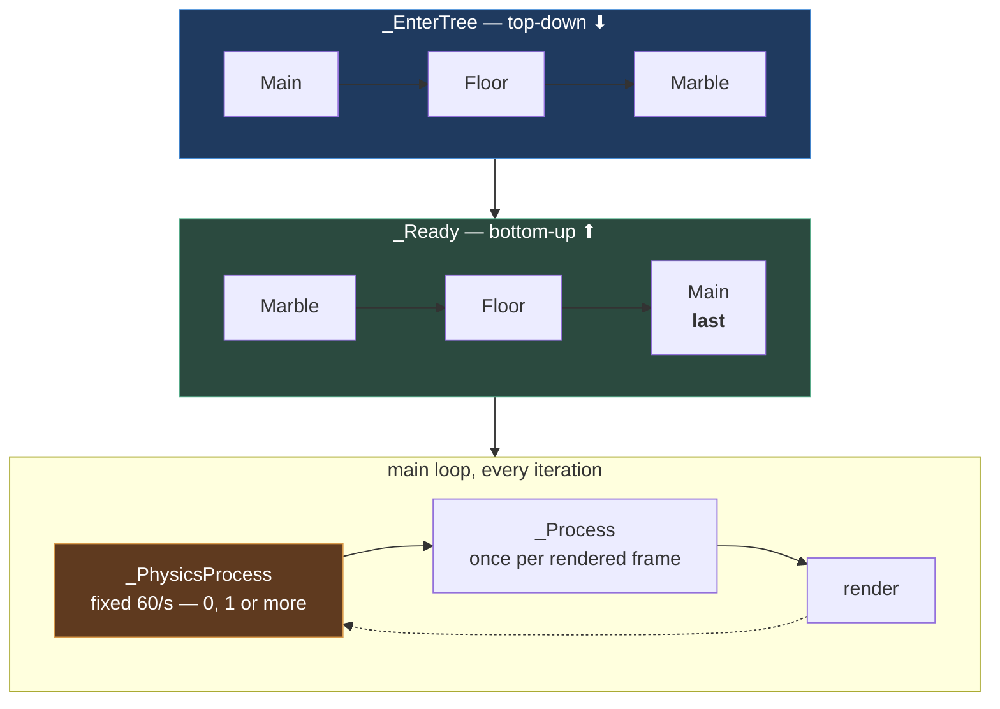

# Chapter 1.3 — The Scene Tree, the Main Loop, and the Order Things Happen In

🪜 **Scaffolding: 90 / 10.**

---

## 🎯 Goal

By the end you will have **printed the engine's actual startup order** across a real tree, and you will know why `_Ready` can safely touch children while `_EnterTree` cannot.

---

## 🏃 Fast-Track Summary

*Path C: read this and the cheat sheet, do ⭐ P1, move on.*

- Four callbacks, in the order the engine calls them:

  | Callback | Fires | Direction |
  |---|---|---|
  | `_EnterTree` | The node joins the tree | **Top-down** — parent first |
  | `_Ready` | The node **and all its children** are ready | **Bottom-up** — deepest child first |
  | `_Process(delta)` | Once per **rendered** frame | Tree order |
  | `_PhysicsProcess(delta)` | Once per **physics tick**, fixed rate | Tree order |

- ⭐ **`_Ready` is bottom-up, and that is the whole point.** By the time a parent's `_Ready` runs, every child has finished its own — so a parent may safely call `GetNode` and touch what it finds.
- 🚨 **`_EnterTree` runs before your children exist.** `GetNode` there is how people get nulls.
- `_Process` and `_PhysicsProcess` are **different clocks**. Idle frames vary with framerate; physics ticks are fixed (60/s by default).
- Break it: `GetNode` a child in `_EnterTree`, then move it to `_Ready`.
- Commit: `ch 1.3: lifecycle order observed`

---

## 🧭 Before you start

| You need | From |
|---|---|
| P01 with `Marble.tscn` and `Coin.tscn` instanced | [1.2](1.2_ScenesAndInstancing.md) |
| MSBuild / Debugger / Output panels | [0.6](../../module0/0A/0.6_TheGodotEditor.md) |

---

## 🔨 Build

### Step 1 — A script that only reports

Create `res://scripts/LifecycleProbe.cs`:

```csharp
using Godot;

public partial class LifecycleProbe : Node
{
    public override void _EnterTree()  => GD.Print($"  _EnterTree  {Name}");
    public override void _Ready()      => GD.Print($"  _Ready      {Name}");
    public override void _ExitTree()   => GD.Print($"  _ExitTree   {Name}");
}
```

> ⚠️ **`: Node`, deliberately.** Every node type inherits from `Node`, so this script attaches to anything — a `RigidBody3D`, a `MeshInstance3D`, an `Area3D`. That is the composition idea from [1.1](1.1_Nodes.md) applied to scripts.
>
> But a C# class's **filename must match** ([0.11](../../module0/0B/0.11_CSharpFirstContact.md)), and one script can only be attached to *one node at a time*. So you cannot reuse this file across several nodes simultaneously — you will make copies in Step 2.

### Step 2 — Probe a real tree

Make three copies so several nodes can report at once:

```bash
cd projects/P01_MarbleRunner/scripts
cp LifecycleProbe.cs ProbeA.cs && cp LifecycleProbe.cs ProbeB.cs && cp LifecycleProbe.cs ProbeC.cs
```

Edit each so the class name matches its filename (`ProbeA`, `ProbeB`, `ProbeC`).

Now attach them in `Main.tscn`:

| Node | Script |
|---|---|
| `Main` (root) | `ProbeA.cs` |
| `Marble` (an instance) | `ProbeB.cs` |
| `Floor` | `ProbeC.cs` |

Build, then **`F6`** and read the **Output** panel.

### Step 3 — Read the order ⭐

You should see something with this shape — `[UNVERIFIED]`, so record what you actually get:

```text
  _EnterTree  Main
  _EnterTree  Floor
  _EnterTree  Marble
  _Ready      Floor
  _Ready      Marble
  _Ready      Main        ← the root is LAST
```

**Two facts, and they run in opposite directions:**

- **`_EnterTree` is top-down.** `Main` first, then its children. A node enters the tree before its children can.
- **`_Ready` is bottom-up.** `Main` is *last*, because `_Ready` means *"I and everything beneath me are ready."*

### Step 4 — Prove it matters

Add to `ProbeA.cs` (on `Main`) — a parent trying to find a child:

```csharp
    public override void _EnterTree()
    {
        GD.Print($"  _EnterTree  {Name}");
        var floor = GetNodeOrNull<Node>("Floor");
        GD.Print($"    in _EnterTree, Floor is: {(floor is null ? "NULL" : floor.Name)}");
    }

    public override void _Ready()
    {
        GD.Print($"  _Ready      {Name}");
        var floor = GetNodeOrNull<Node>("Floor");
        GD.Print($"    in _Ready,     Floor is: {(floor is null ? "NULL" : floor.Name)}");
    }
```

Build, `F6`.

> 💡 **`GetNodeOrNull` rather than `GetNode`.** `GetNode` raises an error when it fails; `GetNodeOrNull` returns `null` so you can *ask the question* without a crash. Use it whenever absence is a legitimate answer — as it is here.

`[UNVERIFIED]` — whether `Floor` is null in `_EnterTree` on your version. **Record what you see.** The rule it demonstrates holds regardless: *`_Ready` is where you can rely on the tree being assembled.*

### Step 5 — Two different clocks

Add to `ProbeB.cs` (on the marble):

```csharp
    private int _idleFrames, _physicsTicks;
    private double _elapsed;

    public override void _Process(double delta)
    {
        _idleFrames++;
        _elapsed += delta;
        if (_elapsed >= 1.0)
        {
            GD.Print($"  1 second: {_idleFrames} idle frames, {_physicsTicks} physics ticks");
            _idleFrames = _physicsTicks = 0;
            _elapsed = 0;
        }
    }

    public override void _PhysicsProcess(double delta) => _physicsTicks++;
```

Build, `F6`, and watch for a few seconds.

**Physics ticks should hold steady near 60 per second. Idle frames will not** — they follow your monitor and your GPU load.

> 🚨 **This is why physics goes in `_PhysicsProcess`.** A fixed clock means the simulation behaves identically on a 60 Hz phone and a 144 Hz desktop. Chapter [1.4](1.4_YourFirstRealScript.md) turns this into the `delta` rule; [1.13](../../../TableOfContents.md) applies it to the marble's movement.

### Step 6 — Leaving the tree

Add to `ProbeB.cs`:

```csharp
    public override void _Ready()
    {
        GD.Print($"  _Ready      {Name}");
        GetTree().CreateTimer(3.0).Timeout += () =>
        {
            GD.Print("  --- freeing the marble ---");
            QueueFree();
        };
    }
```

Build, `F6`. After three seconds the marble vanishes and `_ExitTree` prints.

> 🐣 **`QueueFree()`, not `Free()`.** `QueueFree` schedules deletion for the end of the current frame; `Free` deletes immediately, which is dangerous if the engine is mid-way through iterating or resolving physics. **Default to `QueueFree` always.**

### Step 7 — Commit

```bash
git add .
git commit -m "ch 1.3: lifecycle order observed"
git push
```

---

## ▶️ Run it

- [ ] `_EnterTree` prints **top-down**, `_Ready` **bottom-up**
- [ ] The root's `_Ready` is **last**
- [ ] You recorded whether `GetNodeOrNull` finds a child in `_EnterTree`
- [ ] Physics ticks per second are steady; idle frames are not
- [ ] `_ExitTree` fires when the marble is freed

---

## 👀 Observe

Look at the two directions again. `_EnterTree` descends; `_Ready` ascends. That is not arbitrary — **each is the only order that could work** for what it promises. A node cannot enter a tree its parent has not joined; a node cannot claim its subtree is ready before its children have said so.

Then look at the two counters. On your desktop the gap is probably large. On a phone under thermal load it will move around unpredictably — which is precisely the reason a fixed physics clock exists at all.

---

## 🧠 Why it works

### The `SceneTree` and the main loop

Godot runs one **`SceneTree`**, and each iteration of the main loop does roughly:

```text
   ┌─ collect input events
   ├─ run physics ticks   → _PhysicsProcess   (0, 1 or more, to catch up)
   ├─ run one idle frame  → _Process          (exactly one)
   └─ render
```

**Physics ticks are decoupled from frames.** If a frame takes 40 ms, the engine may run two or three 60 Hz physics ticks to catch up before rendering. If frames are very fast, some frames run no physics tick at all.

That is why the two counters differ, and why mixing the two clocks causes bugs that only appear on slow hardware.

### Why `_Ready` bottom-up is the useful guarantee

`_Ready` means: **"my entire subtree is constructed and each part has run its own `_Ready`."**

That single guarantee is what makes it safe to write, in a parent:

```csharp
public override void _Ready()
{
    var mesh = GetNode<MeshInstance3D>("MeshInstance3D");  // certain to exist
}
```

Whereas in `_EnterTree` there is no such promise, so the same line is a gamble.

> 🔬 **Deep dive — where the constructor fits.** A C# constructor runs when the object is *created*, which is before it has a parent, before children exist, and **before values from the `.tscn` are applied**. So a constructor sees your C# field initialisers, not the numbers a designer typed into the Inspector. That is the whole reason `_Ready` exists as a separate step, and the reason "initialise in `_Ready`, not in the constructor" is a rule rather than a preference. You will meet the consequence directly in [1.5](1.5_TuningWithoutRecompiling.md).

---

## 🗺️ Mental model



---

## 💥 Break it

1. In `ProbeA.cs`, change the `_EnterTree` lookup from `GetNodeOrNull<Node>("Floor")` to **`GetNode<Node>("Floor")`**. Build, `F6`.
2. Restore. Now in `_Ready`, replace `QueueFree()` in `ProbeB` with **`Free()`** and run.
3. Restore. Finally, move the physics counter: put `_physicsTicks++` in `_Process` instead of `_PhysicsProcess`, and compare the numbers.

---

## 🔎 Diagnose

**Which of the three actually failed, and which merely gave a wrong answer? Answer before opening.**

<details>
<summary>Answer</summary>

**1 — `GetNode` in `_EnterTree`.** If the child is not yet in the tree this raises an error and prints a stack trace in the **Debugger** ([0.9](../../module0/0A/0.9_ReadingErrors.md)). `[UNVERIFIED]` — the exact behaviour on your version; some lookups succeed depending on instancing order, which is *worse* than failing, because it makes the code look correct.

**That conditional success is the trap.** Code that works because of node ordering will break the day someone reorders the Scene dock — and nothing about the change will look related to the failure.

**2 — `Free()` instead of `QueueFree()`.** May work, or may crash, depending on what the engine was doing at that instant. `[UNVERIFIED]`. **Intermittent is the signature of this class of bug**: it deletes an object the engine is still holding a reference to mid-frame, so the failure depends on timing rather than on your code.

**3 — Counting physics ticks in `_Process`.** **Nothing fails at all.** No error, no warning. You simply get a number that is silently wrong — you are now counting frames twice and calling one of them "physics".

**And #3 is the one worth dwelling on.** The first two announce themselves. The third is a *correct-looking program producing a wrong answer*, which is the fourth failure category from [0.9](../../module0/0A/0.9_ReadingErrors.md) P3 — the one no panel reports.

**The general rule this establishes for the rest of the course:**

> **Ask which clock you are on.** Anything affecting physics, movement, or the simulation goes in `_PhysicsProcess`. Anything affecting only what you *see* — camera smoothing, UI tweens, visual interpolation — goes in `_Process`.

Get it backwards and your game behaves differently on a 144 Hz desktop and a 60 Hz phone — and, because the desktop is where you develop, **you will not notice until you deploy.** That is [ADR-034](../../../meta/Decisions.md#adr-034)'s reason for making device testing structural, and it is exactly the bug class Module 2 hunts.

</details>

---

## 🏋️ Practicals

**⭐ P1 — Probe a deeper tree.** Attach a probe to a `Coin` *inside* its own scene, and another to `Main`. Confirm the coin's `_Ready` fires before `Main`'s even though the coin is an instance of a separate file. **Instancing does not change lifecycle order.**

**P2 — Force a slow frame.** In `_Process`, add a busy loop that wastes ~30 ms. Watch the counters. Physics ticks per second should hold while idle frames collapse — the engine catching up.

**P3 — Reorder and observe.** Drag `Marble` above `Floor` in the Scene dock and re-run. Note which prints change order. That is *sibling* order, and it is why code depending on it is fragile.

**🔬 P4 — Find the process priority.** In the Inspector, look for `Node → Process → Priority` `[UNVERIFIED]`. Set two probes to different priorities and see the order change. You will need this once in Module 4; knowing it exists is enough today.

---

## ✅ Check yourself

1. Why is `_EnterTree` top-down and `_Ready` bottom-up?
2. Why is a C# constructor the wrong place to read an exported value?
3. Name the difference between `_Process` and `_PhysicsProcess` in one sentence each.
4. Why `QueueFree()` rather than `Free()`?
5. You put movement code in `_Process`. What happens, and where will you notice?

<details>
<summary>Answers</summary>

1. Each is **the only order that could work**. A node cannot enter a tree its parent has not joined, so entering must descend. A node cannot honestly claim its subtree is ready before its children have said so, so readiness must ascend.
2. A constructor runs **before the node has a parent, before children exist, and before `.tscn` values are applied**. It sees your C# field initialisers, not the value a designer typed in the Inspector.
3. `_Process` runs **once per rendered frame**, with a `delta` that varies with framerate. `_PhysicsProcess` runs **at a fixed rate** (60/s by default), possibly zero or several times per frame as the engine catches up.
4. `QueueFree` schedules deletion for the end of the frame; `Free` deletes **immediately**, which can destroy an object the engine is still using mid-frame. The resulting crashes are **intermittent**, which makes them expensive to diagnose.
5. Movement becomes **framerate-dependent** — faster on a 144 Hz desktop than a 60 Hz phone. **You will not notice on the desktop**, because that is where it feels right. It surfaces on device, which is why device testing is structural rather than a final step.

</details>

---

## 📎 Cheat sheet

| Callback | When | Order | Safe to `GetNode` children? |
|---|---|---|---|
| *constructor* | Object created | — | ❌ No parent, no children, no `.tscn` values |
| `_EnterTree` | Joins the tree | **Top-down** | ⚠️ Not reliably |
| `_Ready` | Subtree complete | **Bottom-up** | ✅ **Yes** |
| `_Process(delta)` | Per rendered frame | Tree order | ✅ |
| `_PhysicsProcess(delta)` | Per physics tick, fixed | Tree order | ✅ |
| `_ExitTree` | Leaves the tree | — | Cleanup here |

| Do | Not |
|---|---|
| `QueueFree()` | `Free()` |
| `GetNodeOrNull<T>()` when absence is legitimate | `GetNode<T>()` for an optional child |
| **Simulation → `_PhysicsProcess`** | Simulation in `_Process` |
| **Visuals → `_Process`** | |

---

## 🔗 Further reading

- [Godot notifications & lifecycle](https://docs.godotengine.org/en/stable/tutorials/scripting/godot_notifications.html)
- [Idle and physics processing](https://docs.godotengine.org/en/stable/tutorials/scripting/idle_and_physics_processing.html)

---

## 💾 Commit

```text
ch 1.3: lifecycle order observed
```

---

## ➡️ What's next

**[1.4 — Your first real C# script](1.4_YourFirstRealScript.md).** You know when the engine calls you. Next: what to do with `delta` — and why forgetting it makes your game run at a different speed on every device.

---

## 🪞 Reflection

In two sentences: **why can a parent safely call `GetNode` in `_Ready` but not in `_EnterTree`, and which of this chapter's three sabotages was the most dangerous?**

---

## 📝 Chapter changelog

| Version | Date | Change |
|---|---|---|
| 1.0 | 2026-09-03 | First published. `[UNVERIFIED]` on exact `_EnterTree` lookup behaviour, `Free()` outcome and process-priority location. |
