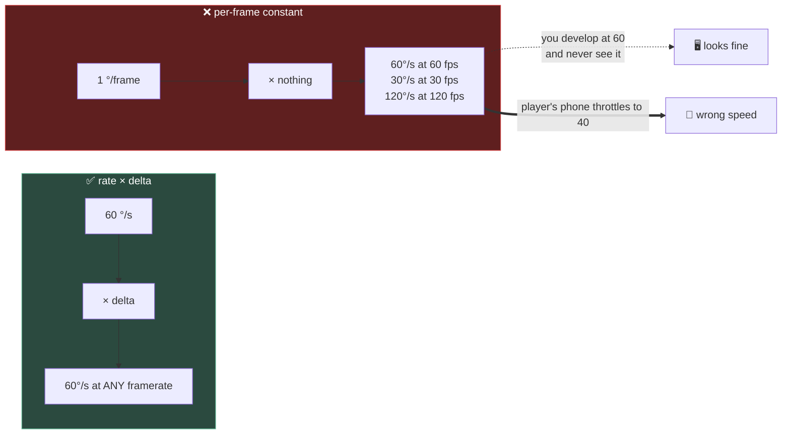

# Chapter 1.4 — Your First Real C# Script

🪜 **Scaffolding: 90 / 10.**

---

## 🎯 Goal

By the end, the marble respawns when it falls out of the world, two platforms rotate side by side — and you will have **watched one of them break** when you change the framerate.

---

## 🏃 Fast-Track Summary

*Path C: read this and the cheat sheet, do ⭐ P1, move on.*

- **`delta` is seconds since the last call.** Multiply every per-frame change by it:
  ```csharp
  RotateY(SpeedRadiansPerSecond * (float)delta);   // ✅ same speed everywhere
  RotateY(SpeedRadiansPerFrame);                    // ❌ speed follows framerate
  ```
- The rule: **a rate × `delta` = an amount.** If a value is "per second", it must meet `delta` before it is used.
- Respawn: in `_PhysicsProcess`, if `GlobalPosition.Y < KillY`, put the marble back and **zero its velocity**.
- 🚨 **Zeroing velocity matters.** A `RigidBody3D` teleported without clearing `LinearVelocity` arrives at the spawn point already falling at terminal speed.
- ⭐ Break it with `Engine.MaxFps = 30` then `120`. The delta-less platform changes speed; the correct one does not.
- Commit: `ch 1.4: respawn and framerate independence`

---

## 🧭 Before you start

| You need | From |
|---|---|
| P01 with marble, ramp, floor and coins | [1.2](1.2_ScenesAndInstancing.md) |
| The two-clock distinction | [1.3](1.3_TheSceneTree.md) |

---

## 🔨 Build

### Step 1 — Two rotating platforms

Add two obstacles to `Main.tscn`, identical except for their script.

For each: `StaticBody3D` + `MeshInstance3D` (BoxMesh `(3, 0.3, 1)`) + `CollisionShape3D` (BoxShape3D, same). Name them **`SpinnerGood`** at `(-2.5, 0.5, 2)` and **`SpinnerBad`** at `(2.5, 0.5, 2)`.

### Step 2 — The correct one

`res://scripts/SpinPlatform.cs`, attached to `SpinnerGood`:

```csharp
using Godot;

public partial class SpinPlatform : StaticBody3D
{
    [Export] public float DegreesPerSecond { get; set; } = 60f;

    public override void _PhysicsProcess(double delta)
    {
        // a RATE multiplied by TIME gives an AMOUNT
        RotateY(Mathf.DegToRad(DegreesPerSecond) * (float)delta);
    }
}
```

### Step 3 — The broken one

`res://scripts/SpinPlatformBad.cs`, attached to `SpinnerBad`:

```csharp
using Godot;

public partial class SpinPlatformBad : StaticBody3D
{
    // ⚠️ deliberately wrong — no delta
    [Export] public float DegreesPerFrame { get; set; } = 1f;

    public override void _PhysicsProcess(double delta)
    {
        RotateY(Mathf.DegToRad(DegreesPerFrame));
    }
}
```

Build, `F6`. **Both platforms rotate at roughly the same speed** — 60 ticks/s × 1° = 60°/s. They look identical.

> 🚨 **That is exactly why this bug survives to release.** At your development framerate the wrong code is indistinguishable from the right code.

### Step 4 — ⭐ Change the framerate

Create `res://scripts/FpsSwitcher.cs`, attached to `Main`:

```csharp
using Godot;

public partial class FpsSwitcher : Node3D
{
    [Export] public int MaxFps { get; set; } = 0;   // 0 = uncapped

    public override void _Ready()
    {
        Engine.MaxFps = MaxFps;
        GD.Print($"MaxFps = {MaxFps} (0 means uncapped)");
    }
}
```

Now run three times, changing `MaxFps` in the Inspector each time:

| `MaxFps` | `SpinnerGood` | `SpinnerBad` |
|---|---|---|
| `0` (uncapped) | | |
| `30` | | |
| `120` | | |

Watch both platforms and write down what you see.

> 💡 **`Engine.MaxFps` caps rendered frames, not physics ticks.** So the *idle* clock changes while the physics clock holds. `SpinnerBad` uses `_PhysicsProcess`, so it may look stable — **move both scripts to `_Process` and repeat.** The divergence then becomes obvious, and *that* difference is itself the lesson from [1.3](1.3_TheSceneTree.md).

`[UNVERIFIED]` — your exact observations. Record them; this is a genuine experiment.

### Step 5 — Respawn: a real feature

The marble rolls off the end and falls forever. Fix it.

`res://scripts/Marble.cs`, attached to the **root of `scenes/Marble.tscn`** (so every marble gets it):

```csharp
using Godot;

public partial class Marble : RigidBody3D
{
    [Export] public float KillY { get; set; } = -10f;
    [Export] public Vector3 SpawnPoint { get; set; } = new Vector3(0, 5, -6);

    private int _respawns;

    public override void _Ready()
    {
        SpawnPoint = GlobalPosition;     // wherever the designer placed me
        GD.Print($"{Name} spawns at {SpawnPoint}");
    }

    public override void _PhysicsProcess(double delta)
    {
        if (GlobalPosition.Y < KillY)
            Respawn();
    }

    private void Respawn()
    {
        _respawns++;
        GD.Print($"{Name} fell out of the world — respawn #{_respawns}");

        // 🚨 order matters, and so does clearing momentum
        LinearVelocity  = Vector3.Zero;
        AngularVelocity = Vector3.Zero;
        GlobalPosition  = SpawnPoint;
    }
}
```

> ⚠️ **`SpawnPoint` is `[Export]`ed *and* overwritten in `_Ready`.** That is deliberate: the exported value gives a designer a default they can see, and `_Ready` replaces it with wherever the node actually sits — which is only knowable once the scene has loaded. **This is [1.3](1.3_TheSceneTree.md)'s constructor lesson in practice**: `GlobalPosition` is meaningless before the node is in the tree.

Build, `F6`. Let the marble roll off. **It reappears at the top.**

### Step 6 — Feel why velocity must be cleared

Comment out the two velocity lines and run again.

The marble reappears — and immediately shoots downward, because it kept the speed it had accumulated during its fall. Uncomment them.

### Step 7 — Commit

```bash
git add .
git commit -m "ch 1.4: respawn and framerate independence"
git push
```

---

## ▶️ Run it

- [ ] Both platforms rotate; at your default framerate they look the same
- [ ] With `MaxFps` changed (and both in `_Process`), they **visibly diverge**
- [ ] Your three observations are written down
- [ ] The marble respawns when it falls below `KillY`
- [ ] Without clearing velocity, it respawns already moving fast

---

## 👀 Observe

At your development framerate, the correct and the incorrect platform were **indistinguishable**. The bug only appeared when you changed a number that has nothing to do with the code.

That is the shape of the whole problem: **you develop on one device, at one framerate, and the failure lives on someone else's.** A phone that thermally throttles from 60 to 40 fps mid-session ([2.7](../../../TableOfContents.md)) will make every delta-less calculation quietly change speed — and no panel will report it ([0.9](../../module0/0A/0.9_ReadingErrors.md)).

---

## 🧠 Why it works

### What `delta` is

`delta` is **seconds elapsed since this callback last ran**. At 60 fps it is about `0.0167`; at 30 fps, about `0.0333`.

So the identity that makes framerate independence work is just arithmetic:

```text
    rate  ×  time   =   amount
  60 °/s  ×  0.0167 s  =  1.0°     per frame at 60 fps
  60 °/s  ×  0.0333 s  =  2.0°     per frame at 30 fps
```

Half the frames, twice the movement each — **the same 60° per second either way.**

**The rule to carry:** if you name a value "per second", it must be multiplied by `delta` before use. If you find yourself naming one "per frame", you have already made the mistake — the name is the warning.

### Why `(float)delta`

`_Process` and `_PhysicsProcess` give you a `double`; most engine maths takes `float`. C# will not narrow implicitly because it loses precision ([0.11](../../module0/0B/0.11_CSharpFirstContact.md)), so the cast is required and is not noise.

### Why a `RigidBody3D` needs its velocity cleared

Setting `GlobalPosition` on a `RigidBody3D` **teleports it without telling the physics engine anything changed**. Its velocity is unaffected — so a body that had accumulated 30 m/s falling arrives at the spawn point still doing 30 m/s.

> 🔬 **Deep dive — and why this respawn is a temporary solution.** Assigning `GlobalPosition` on a simulated body is exactly what [1.13](../../../TableOfContents.md) will tell you not to do: the physics server owns that transform, and writing it directly can push the body through walls, because no collision resolution happens for a teleport. It is acceptable **here** because the marble is in empty space when it triggers, so there is nothing to tunnel through. The correct general tool is `PhysicsServer3D`'s body-state callback, which Module 1 reaches at [1.13](../../../TableOfContents.md). **Knowing that today's solution is scoped rather than universal is part of the lesson** — the naive version comes first, and the correct version arrives when you have felt why it is needed ([ADR-002](../../../meta/Decisions.md#adr-002)).

---

## 🗺️ Mental model



---

## 💥 Break it

1. In `Marble.cs`, remove `SpawnPoint = GlobalPosition;` from `_Ready` and rely on the exported default. Place a *second* marble somewhere else. Run and let both fall.
2. Restore. Now move the `KillY` check from `_PhysicsProcess` into `_Ready`.
3. Restore. Finally, change `Respawn()` to set `GlobalPosition` **before** zeroing the velocities, and run repeatedly.

---

## 🔎 Diagnose

**Which of the three is wrong in a way you could see, and which is wrong in a way you might not? Answer before opening.**

<details>
<summary>Answer</summary>

**1 — Exported default only.** Every marble respawns at the *same* hard-coded point, regardless of where the designer placed it. Visible immediately, and the fix is obvious: a per-instance value must be read from the instance, not from a shared default. **This is [1.2](1.2_ScenesAndInstancing.md)'s override lesson from the code side** — the exported value is the scene's, and each instance needs its own.

**2 — Check in `_Ready`.** The check runs **exactly once**, at startup, when the marble has not fallen. Nothing happens, ever. No error — just a feature that silently does not exist.

`_Ready` is a *one-off*; anything that must be true continuously belongs in a per-frame callback. Confusing "set this up" with "keep checking this" is one of the commonest beginner bugs, and it never announces itself.

**3 — Position before velocity.** Usually works, sometimes does not. `[UNVERIFIED]` — depends on where in the physics step the assignment lands.

**That intermittency is the interesting part.** Both orderings look correct in code review. But between setting the position and clearing the velocity there is a window in which the body is at the spawn point *and* still moving fast, and if the physics server steps in that window the marble is displaced before you finish. Clearing velocity first closes the window.

**The generalisation, which recurs throughout Module 1:** when you mutate several related pieces of state, **ask what would happen if the engine ran between two of your lines.** Usually nothing; occasionally the difference between a solid feature and a bug that reproduces once a week. It is the same family as `Free()` versus `QueueFree()` in [1.3](1.3_TheSceneTree.md) — both are about not leaving the engine a half-finished state to observe.

</details>

---

## 🏋️ Practicals

**⭐ P1 — Run the framerate experiment properly.** Move both spinner scripts to `_Process`, then test at `MaxFps` 30, 60 and 120. Record all six observations in [`Journal.md`](../../../meta/Journal.md). **This is the evidence for a rule you will apply several hundred times.**

**P2 — Respawn with a delay.** Make the marble wait one second before returning, using `GetTree().CreateTimer(1.0)`. Note that you need a guard so `_PhysicsProcess` does not fire the respawn sixty times while it waits.

**P3 — A moving platform.** Make a platform slide back and forth with `Mathf.Sin`. Multiply the *phase* by `delta`-accumulated time, not by frame count. Confirm it is framerate independent.

**🔬 P4 — Find the physics tick rate.** `Project Settings → Physics → Common → Physics Ticks per Second` `[UNVERIFIED]`. Set it to 20 and re-run. Note what degrades — and that `SpinnerGood` still turns at 60°/s.

---

## ✅ Check yourself

1. What is `delta`, and what is the identity that makes it work?
2. Why did the wrong platform look correct on your machine?
3. Why must `(float)` be written explicitly?
4. Why clear a `RigidBody3D`'s velocity before teleporting it?
5. Why does putting the fall check in `_Ready` produce no error?

<details>
<summary>Answers</summary>

1. **Seconds since this callback last ran.** The identity is `rate × time = amount`: 60 °/s × 0.0167 s = 1° at 60 fps, and 60 °/s × 0.0333 s = 2° at 30 fps — the same 60° per second either way.
2. Because at 60 fps, `1° per frame` and `60° per second` are **the same number**. The bug is invisible at the framerate you develop at, and appears on hardware you are not holding.
3. `delta` is a `double`; most engine maths takes `float`. Narrowing **loses precision**, so C# requires you to say so rather than doing it silently as C would.
4. Assigning `GlobalPosition` **teleports the body without informing the physics engine**, so its accumulated velocity survives. It arrives at the spawn point still travelling at whatever speed it had built up falling.
5. Because `_Ready` runs **once**, at startup, when the condition is false. There is no error — just a feature that never happens. Confusing "set this up once" with "keep checking this" is silent by nature.

</details>

---

## 📎 Cheat sheet

| Rule | |
|---|---|
| ⭐ **rate × `delta` = amount** | Anything "per second" must meet `delta` |
| Naming something "per frame" | Is itself the warning sign |
| `(float)delta` | `delta` is `double`; engine maths is `float` |
| Simulation → `_PhysicsProcess` | Visuals → `_Process` ([1.3](1.3_TheSceneTree.md)) |
| Teleporting a `RigidBody3D` | **Clear `LinearVelocity` and `AngularVelocity` first** |
| Continuous checks | Never in `_Ready` — it runs once |

| API | Does |
|---|---|
| `Engine.MaxFps` | Cap rendered frames — for testing |
| `GetTree().CreateTimer(s)` | One-shot timer with a `Timeout` signal |
| `GlobalPosition` | World-space position |
| `LinearVelocity` / `AngularVelocity` | A `RigidBody3D`'s momentum |

---

## 🔗 Further reading

- [Idle and physics processing](https://docs.godotengine.org/en/stable/tutorials/scripting/idle_and_physics_processing.html)
- [`RigidBody3D`](https://docs.godotengine.org/en/stable/classes/class_rigidbody3d.html) — switch the docs to C#

---

## 💾 Commit

```text
ch 1.4: respawn and framerate independence
```

---

## ➡️ What's next

**[1.4b — The C# you have not met, I](1.4b_TheCSharpYouHaveNotMet.md).** You have written real gameplay code. Next, three C# facts that will bite a C or C++ programmer specifically — starting with why `marble.Position.X = 5` does not do what it looks like.

---

## 🪞 Reflection

In two sentences: **why is a missing `delta` invisible during development, and where does it surface?**

---

## 📝 Chapter changelog

| Version | Date | Change |
|---|---|---|
| 1.0 | 2026-09-03 | First published. `[UNVERIFIED]` on framerate observations, teleport ordering and physics-tick setting location. |
