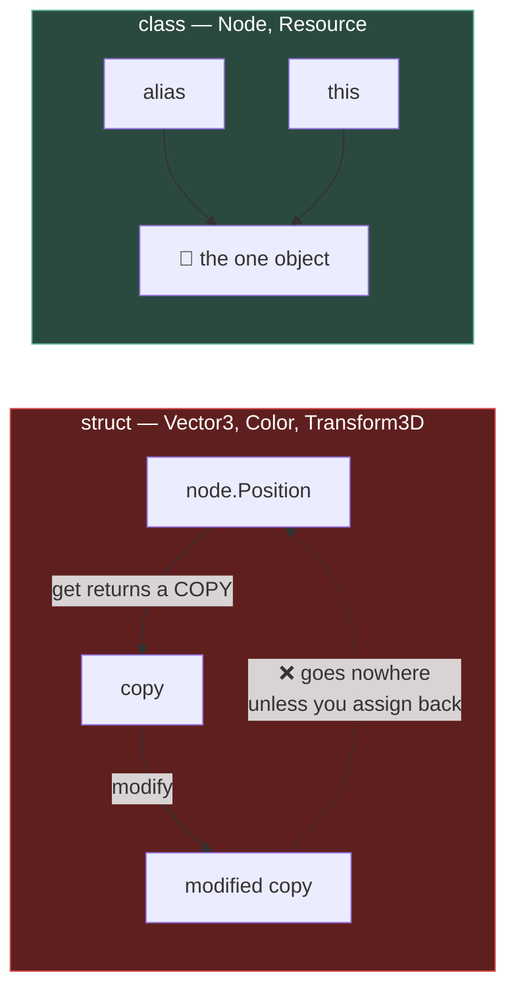

# Chapter 1.4b — The C# You Have Not Met, I

🪜 **Scaffolding: 90 / 10.**

> 📌 **Micro-track.** C#-specific things a C or C++ programmer has not seen. **Properties, `partial`, attributes and `[Export]` were covered in [0.11](../../module0/0B/0.11_CSharpFirstContact.md)** and are not repeated. Never variables and loops.

---

## 🎯 Goal

By the end you will know why **`marble.Position.X = 5` does not work**, you will hold your coins in a `List<T>`, and you will have watched managed memory climb from a single careless line in `_Process`.

---

## 🏃 Fast-Track Summary

*Path C: read this and the cheat sheet, do ⭐ P1, move on.*

- 🚨 **`Vector3`, `Transform3D`, `Color` and `Basis` are `struct`s — value types.** A property returning one hands you a **copy**.
  ```csharp
  node.Position.X = 5f;                 // ❌ compiler refuses
  var p = node.Position; p.X = 5f;      // ❌ compiles, silently does nothing
  node.Position = node.Position with { X = 5f };   // ✅
  node.Position += Vector3.Right * 5f;              // ✅
  ```
- **`class` = reference type.** `Node`, `Resource`, `PackedScene`. Two variables can point at one object — which is why a shared `Resource` edited once changes everywhere ([1.6](1.6_NodesVsResources.md)).
- **`List<T>`** replaces a raw array: `_coins.Add(c)`, `_coins.Count`, `foreach`.
- **C# is garbage-collected.** You never free anything — and every `new` in `_Process` is 60 allocations a second the collector must eventually sweep.
- ⭐ Break it both ways: the compiler catches one mistake and **silently permits the other**.
- Commit: `ch 1.4b: value types, collections, gc`

---

## 🧭 Before you start

| You need | From |
|---|---|
| `Marble.cs` with respawn | [1.4](1.4_YourFirstRealScript.md) |
| Five coin instances | [1.2](1.2_ScenesAndInstancing.md) |
| The Remote tree and monitors | [0.6](../../module0/0A/0.6_TheGodotEditor.md) |

> 🐣 **Coming from C or C++?** You already understand *stack versus heap*. C# calls the same distinction **value type** (`struct`) versus **reference type** (`class`), and — unlike C++ — **you do not choose per variable.** The type's author chose. `Vector3` is a `struct` and always behaves like one; `Node` is a `class` and always behaves like one. That single fact explains everything in this chapter.

---

## 🔨 Build

### Step 1 — Watch the copy happen

Add to `Marble.cs`:

```csharp
    public override void _Ready()
    {
        SpawnPoint = GlobalPosition;
        GD.Print($"{Name} spawns at {SpawnPoint}");

        // --- value type demonstration ---
        Vector3 copy = Position;        // this is a COPY, not a view
        copy.X += 100f;

        GD.Print($"  copy.X    = {copy.X}");
        GD.Print($"  Position.X = {Position.X}   ← unchanged");
    }
```

Build, `F6`.

**`copy.X` is 100 higher. `Position.X` did not move.**

> 🚨 **Nothing warned you.** The code compiled, ran, and did precisely nothing useful. If you had written this expecting to move the marble, you would now be hunting a bug in your movement logic.

### Step 2 — The three ways that do work

```csharp
        // 1. read, modify, write back
        Vector3 p = Position;
        p.X += 1f;
        Position = p;

        // 2. `with` — a copy that differs in named fields (C# 10+)
        Position = Position with { X = 5f };

        // 3. operate on the whole value
        Position += Vector3.Right * 2f;
```

Try each, printing `Position` after. All three move the marble; **the difference is only readability.**

> 💡 **Option 3 is what you will write 95% of the time.** `Position += velocity * (float)delta` reads as intent, and it sidesteps the whole issue because it assigns the property rather than trying to reach inside it.

### Step 3 — Reference types behave the opposite way

```csharp
        // Node is a CLASS — a reference type
        Node3D alias = this;
        alias.Name = "RenamedThroughAlias";
        GD.Print($"  my name is now: {Name}");
```

**The rename sticks**, because `alias` and `this` are two names for **one object**.

| | `struct` — value | `class` — reference |
|---|---|---|
| Assignment | **copies** the data | copies the **reference** |
| Two variables | two independent things | **one shared thing** |
| Godot examples | `Vector3` `Transform3D` `Color` `Basis` `Rect2` | `Node` `Resource` `PackedScene` `Material` |

> ⚠️ **`Resource` is a class.** Assign one material to three meshes and change it — **all three change** ([1.6](1.6_NodesVsResources.md) is entirely about this).

### Step 4 — Collections: hold the coins

`res://scripts/CoinTracker.cs`, attached to `Main`:

```csharp
using Godot;
using System.Collections.Generic;   // ← List<T>, Dictionary<,> live here

public partial class CoinTracker : Node3D
{
    private readonly List<Area3D> _coins = new();

    public override void _Ready()
    {
        foreach (Node child in GetChildren())
        {
            if (child is Area3D coin)      // pattern match: test and bind in one step
                _coins.Add(coin);
        }

        GD.Print($"Found {_coins.Count} coins");

        foreach (Area3D coin in _coins)
            GD.Print($"  {coin.Name} at {coin.GlobalPosition}");
    }
}
```

Build, `F6`. It reports your five coins.

> 🐣 **Three C# things in eight lines.** `List<T>` is a growable array — `Add`, `Count`, indexable, `foreach`-able. **`is Area3D coin`** tests the type *and* declares a correctly-typed variable in one step; there is no C equivalent. And `new()` on the right of `=` infers the type from the left — a *target-typed new*.

### Step 5 — ⭐ Watch the garbage collector

C# frees memory for you. That is not free.

Add a deliberately wasteful line:

```csharp
    public override void _Process(double delta)
    {
        // ⚠️ allocates a new object EVERY FRAME
        var wasteful = new List<int>(1000);
        wasteful.Add(1);
    }
```

Build and run. Now open **Debugger → Monitors** and watch **Memory → Static** (or the equivalent) climb. `[UNVERIFIED]` — exact monitor names in your version.

Remove the line and run again. The climb stops.

> 🚨 **Sixty frames a second is 3,600 allocations a minute** from one line. Each must eventually be collected, and a collection pause is a dropped frame. On a phone with less memory and a slower collector, that is a stutter the player feels.
>
> This is not something to fix today — [10.2](../../../TableOfContents.md) is a whole chapter on it. **The habit that starts now is noticing `new` inside `_Process`.**

### Step 6 — Commit

```bash
git add .
git commit -m "ch 1.4b: value types, collections, gc"
git push
```

---

## ▶️ Run it

- [ ] `copy.X` changed and `Position.X` did **not**
- [ ] All three working forms move the marble
- [ ] Renaming through an alias **did** stick
- [ ] `CoinTracker` reports five coins with their positions
- [ ] Memory visibly climbed with a `new` in `_Process`, and stopped without it

---

## 👀 Observe

Two failures in this chapter behaved completely differently.

`node.Position.X = 5` — **the compiler refuses.** You cannot ship it.

`var p = node.Position; p.X = 5;` — **compiles, runs, does nothing.** You can absolutely ship it.

Same misunderstanding, two outcomes. The difference is that C# can see the first is meaningless *at the point you write it*, and cannot see that the second's result was ever meant to go anywhere.

---

## 🧠 Why it works

### Why `Position.X = 5` cannot work

`Position` is a **property** — a `get` method ([0.11](../../module0/0B/0.11_CSharpFirstContact.md)). Calling it returns a **copy** of a `Vector3`, because `Vector3` is a `struct`.

So `node.Position.X = 5f` means: *call the getter, receive a temporary copy, modify the copy, throw the copy away.* The compiler recognises that as pointless and refuses.

But once you store the copy in a variable, the compiler no longer knows you meant it to reach the node. **Modifying `p` is a perfectly reasonable thing to do to a local variable**, so it compiles — and does nothing to the marble.

### Why Godot uses structs for maths types

Millions of `Vector3` operations happen per second. If every one allocated on the heap, the collector would never stop working. Value types live on the stack, cost nothing to create, and produce no garbage.

**That performance decision is exactly the source of the copy semantics** — and it is why `Node` goes the other way. A node has identity: there is *one* marble, and every reference to it must see the same object.

> 🔬 **Deep dive — where this bites again.** Any Godot property returning a struct behaves this way: `Transform3D`, `Basis`, `Color`, `Rect2`. So `mesh.Mesh.Size.X = 2` fails, `light.Rotation.Y += 0.1f` fails, and the read-modify-write pattern is the answer every time. It also explains an idiom you will see in Godot's own C# examples — `var t = GlobalTransform; t.Origin = …; GlobalTransform = t;` — which looks clumsy until you know it is the only correct shape. You will use it in [1.9](../../../TableOfContents.md) for rotations.

---

## 🗺️ Mental model



---

## 💥 Break it

1. Write `Position.X = 5f;` directly in `_Ready`. **Build.**
2. Remove it. Write instead:
   ```csharp
   Vector3 p = Position;
   p.X = 5f;                 // no write-back
   ```
   **Build and run.**
3. Remove it. Now in `CoinTracker`, change `List<Area3D>` to `List<Node>` and add **every** child rather than only `Area3D`s. Run and read the count.

---

## 🔎 Diagnose

**Which failed at build, which at runtime, and which not at all? Answer before opening.**

<details>
<summary>Answer</summary>

**1 — `Position.X = 5f`.** **Build error.** `[UNVERIFIED]` — expect wording about not being able to modify the return value because it is not a variable.

**This is the compiler doing you a large favour.** It has spotted that you are modifying something that is about to be discarded, and refused. It is one of the few places C# will stop you from writing a *semantically* pointless statement rather than a type-incorrect one.

**2 — Copy without write-back.** **Compiles. Runs. Does nothing.** No error, no warning, no output.

**This is the dangerous form of exactly the same misunderstanding.** The compiler cannot help, because modifying a local variable is entirely legitimate — it has no way to know you intended the change to reach the node. You would look for the bug in your movement code, in the physics, in the scene setup: everywhere except the line that is wrong.

**3 — `List<Node>` with every child.** No error, and a count that is simply larger — it now includes the floor, the ramp, the camera, the light, the spinners. **A number that is wrong without being broken.**

**Three sabotages, three failure classes, and it is worth naming them together:**

| # | Failure | Who catches it |
|---|---|---|
| 1 | Semantically impossible | **The compiler** |
| 2 | Legal code, no effect | **Nobody.** You, eventually, by inspection |
| 3 | Legal code, wrong answer | **Nobody.** You, if you check the number |

You have now met this shape repeatedly — the filename rule in [0.11](../../module0/0B/0.11_CSharpFirstContact.md), the shader-parameter string in [0.13](../../module0/0B/0.13_GDShaderFirstContact.md), the mismatched collider in [1.1](1.1_Nodes.md), the local override in [1.2](1.2_ScenesAndInstancing.md), the check in `_Ready` in [1.4](1.4_YourFirstRealScript.md).

**The consistent lesson: a clean build tells you your code is well-formed, not that it does anything.** Which is why every chapter of this course ends with *run it and look*, and why [2.1](../../../TableOfContents.md) puts a test around the save system before Module 2 is a week old.

</details>

---

## 🏋️ Practicals

**⭐ P1 — Fix a struct mistake in the wild.** Add `Rotation.Y += 0.1f;` to `_Process` somewhere. It will not compile. Rewrite it three ways — read-modify-write, `with`, and `+=` on the whole property — and pick the one you find clearest. **That preference is worth having settled now**, because you will write it hundreds of times.

**P2 — A dictionary.** Change `CoinTracker` to hold a `Dictionary<string, Area3D>` keyed by coin name. Print a lookup by name. `Dictionary<,>` is your `map`.

**P3 — Hunt an allocation.** Look back at `Marble.cs` and `SpinPlatform.cs` for anything allocating per frame. `Mathf.DegToRad` does not; a `new Vector3(...)` does. Note which of yours would matter at scale.

**🔬 P4 — Prove `readonly` is not deep.** `_coins` is `readonly`, yet `_coins.Add(...)` works. Explain why to yourself: `readonly` freezes the **reference**, not the object it points to. That distinction is a `class`-versus-`struct` question wearing a different hat.

---

## ✅ Check yourself

1. Why does `node.Position.X = 5f` not compile?
2. Why does the copy-without-write-back version compile *and* do nothing?
3. Name three Godot value types and three reference types.
4. Why did Godot make `Vector3` a `struct`?
5. What is wrong with `new` inside `_Process`, and when does it actually matter?

<details>
<summary>Answers</summary>

1. `Position` is a **property**, so the getter returns a **copy** of a `Vector3` (a `struct`). Modifying that temporary copy is meaningless — it is discarded immediately — and the compiler refuses.
2. Because once the copy is stored in a local variable, **modifying a local is entirely legitimate**. The compiler has no way to know you meant the change to reach the node, so it compiles cleanly and has no effect.
3. **Value:** `Vector3`, `Transform3D`, `Color`, `Basis`, `Rect2`. **Reference:** `Node`, `Resource`, `PackedScene`, `Material`.
4. **Performance.** Millions of vector operations happen per second; heap-allocating each one would keep the garbage collector permanently busy. Value types cost nothing to create and produce no garbage — and the copy semantics are the direct consequence of that choice.
5. Every `new` is an allocation the collector must eventually sweep, and **60 frames a second is 3,600 a minute**. A collection pause is a dropped frame. It matters most on a phone, with less memory and a slower collector — [10.2](../../../TableOfContents.md).

</details>

---

## 📎 Cheat sheet

| Wrong | Right |
|---|---|
| `node.Position.X = 5f;` ❌ build error | `node.Position += Vector3.Right * 5f;` |
| `var p = node.Position; p.X = 5f;` ❌ silent | `var p = node.Position; p.X = 5f; node.Position = p;` |
| | `node.Position = node.Position with { X = 5f };` |

| `struct` (value) | `class` (reference) |
|---|---|
| `Vector3` `Vector2` `Transform3D` `Basis` `Color` `Rect2` | `Node` `Resource` `PackedScene` `Material` `Mesh` |
| Assignment copies **data** | Assignment copies the **reference** |

| C# | Is |
|---|---|
| `List<T>` | Growable array. `Add` `Count` `foreach` |
| `Dictionary<K,V>` | Map |
| `if (x is Area3D coin)` | Type test **and** typed binding, in one |
| `new()` | Target-typed — infers from the left |
| `readonly` field | Freezes the **reference**, not the object |

> 🚨 **A clean build means well-formed, not working.**

---

## 🔗 Further reading

- [C# value and reference types](https://learn.microsoft.com/dotnet/csharp/language-reference/builtin-types/value-types)
- [C# in Godot: differences](https://docs.godotengine.org/en/stable/tutorials/scripting/c_sharp/c_sharp_differences.html)

---

## 💾 Commit

```text
ch 1.4b: value types, collections, gc
```

---

## ➡️ What's next

**[1.5 — Tuning without recompiling](1.5_TuningWithoutRecompiling.md).** You can write code that works. Next: why a number typed into that code is a design problem, and how live tuning changes what you are able to find.

---

## 🪞 Reflection

In two sentences: **why can the compiler catch one struct mistake and not the other, and what does that say about clean builds?**

---

## 📝 Chapter changelog

| Version | Date | Change |
|---|---|---|
| 1.0 | 2026-09-03 | First published. Deliberately does not repeat [0.11](../../module0/0B/0.11_CSharpFirstContact.md)'s properties/`partial`/attributes. `[UNVERIFIED]` on compiler wording and monitor names. |
