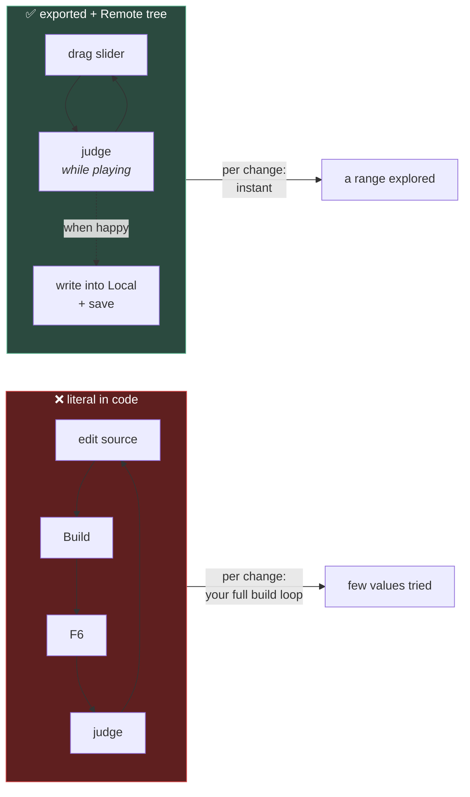

# Chapter 1.5 — Tuning Without Recompiling

🪜 **Scaffolding: 85 / 15.** The method is given; the numbers are yours.

---

## 🎯 Goal

By the end every tunable number in Marble Runner will be exported, you will have **found good values by playing rather than by guessing**, and you will have measured what a hard-coded number costs you per change.

---

## 🏃 Fast-Track Summary

*Path C: read this and the cheat sheet, do ⭐ P1 and ⭐ P2, move on.*

- 🚨 **A literal number in gameplay code is a design smell**, not a style preference. It cannot be tuned while playing, cannot differ per instance, and cannot be found by anyone else.
- Export everything a designer might touch, with hints that make the widget useful:
  ```csharp
  [ExportGroup("Motion")]
  [Export(PropertyHint.Range, "0,30,0.5")] public float MaxSpeed { get; set; } = 8f;
  [Export(PropertyHint.Range, "0,1,0.01")] public float Friction { get; set; } = 0.15f;
  ```
- ⭐ **Tune from the Remote tree while the game runs** ([0.6](../../module0/0A/0.6_TheGodotEditor.md)). Change the value, *feel* the result, change again — no build, no restart.
- Then **write the value you found back into the Local tree** and save. Remote edits do not persist.
- The test for a magic number: *"would I ever want a different value here, or want to try one?"* If yes, export it.
- Break it: hard-code one value and tune it the slow way. Time both.
- Commit: `ch 1.5: everything tunable`

---

## 🧭 Before you start

| You need | From |
|---|---|
| `Marble.cs`, `SpinPlatform.cs` | [1.4](1.4_YourFirstRealScript.md) |
| Your C# iteration median | [0.12](../../module0/0B/0.12_MeasuredTwoLanguages.md) — you will use the number |
| Remote-tree tuning | [0.6](../../module0/0A/0.6_TheGodotEditor.md) Step 5 |

> 📌 **[0.11](../../module0/0B/0.11_CSharpFirstContact.md) taught the syntax of `[Export]`.** This chapter is about the *discipline* — what to export, and what it changes about how you work.

---

## 🔨 Build

### Step 1 — Find the magic numbers you have already written

Go through your P01 scripts and list every literal number that affects behaviour.

| File | Literal | Should it be exported? |
|---|---|---|
| `Marble.cs` | `-10f` (KillY) | Already exported ✅ |
| `SpinPlatform.cs` | `60f` | Already exported ✅ |
| `Marble.cs` | `_respawns` starting at 0 | No — internal state, not a design decision |
| `Main.tscn` | camera position | Already in the Inspector — a node property |

> 💡 **The test is not "is it a number?"** It is: **"would anyone ever want a different value, or want to try one?"** A loop counter starting at zero is not a design decision. A respawn height is.

### Step 2 — Give the marble a real tuning surface

Rewrite `Marble.cs`'s exports:

```csharp
using Godot;

public partial class Marble : RigidBody3D
{
    [ExportGroup("Respawn")]
    [Export(PropertyHint.Range, "-50,0,1")]
    public float KillY { get; set; } = -10f;

    [Export(PropertyHint.Range, "0,3,0.1")]
    public float RespawnDelay { get; set; } = 0f;

    [ExportGroup("Feel")]
    [Export(PropertyHint.Range, "0,1,0.01")]
    public float Bounciness { get; set; } = 0.3f;

    [Export(PropertyHint.Range, "0,1,0.01")]
    public float Friction { get; set; } = 0.5f;

    [ExportGroup("Debug")]
    [Export] public bool LogRespawns { get; set; } = true;

    private Vector3 _spawnPoint;
    private int _respawns;

    public override void _Ready()
    {
        _spawnPoint = GlobalPosition;
        ApplyFeel();
    }

    private void ApplyFeel()
    {
        var mat = new PhysicsMaterial { Bounce = Bounciness, Friction = Friction };
        PhysicsMaterialOverride = mat;
    }

    public override void _PhysicsProcess(double delta)
    {
        if (GlobalPosition.Y < KillY) Respawn();
    }

    private void Respawn()
    {
        _respawns++;
        if (LogRespawns) GD.Print($"{Name} respawn #{_respawns}");
        LinearVelocity = Vector3.Zero;
        AngularVelocity = Vector3.Zero;
        GlobalPosition = _spawnPoint;
    }
}
```

> ⚠️ **`_spawnPoint` is now private, not exported.** In [1.4](1.4_YourFirstRealScript.md) it was `[Export]`ed *and* overwritten in `_Ready`, which is confusing — the Inspector showed a value that was always discarded. **An exported property that code always overwrites is worse than no export at all**, because it lies to whoever reads it.

Build, `F6`. Confirm the Inspector shows three groups with sliders.

### Step 3 — ⭐ Tune by playing

This is the chapter.

1. `F6` and **leave the game running**.
2. Scene dock → **Remote**.
3. Select the `Marble`.
4. Drag **Bounciness** from `0` to `1` while watching. Find the value where the marble feels like a marble rather than a rubber ball or a stone.
5. Do the same with **Friction**.

> 🚨 **`ApplyFeel()` runs in `_Ready`, so changing the exported value at runtime will not update the physics material.** Add a setter that reapplies:
>
> ```csharp
>     [Export(PropertyHint.Range, "0,1,0.01")]
>     public float Bounciness
>     {
>         get => _bounciness;
>         set { _bounciness = value; ApplyFeel(); }
>     }
>     private float _bounciness = 0.3f;
> ```
>
> **That is a real use for a property having a `set` body** — precisely the point [0.11](../../module0/0B/0.11_CSharpFirstContact.md) made about why `[Export]` wants a property rather than a field. Do the same for `Friction`.

Rebuild and repeat. Now the marble changes **as you drag the slider**.

6. Write down the values you settled on.
7. **Stop the game.** Switch to **Local**. Type those values in. Save.

> 🚨 **Remote edits do not persist** ([0.6](../../module0/0A/0.6_TheGodotEditor.md)). Find the value while playing; write it down; set it in Local. Forgetting this step is how an hour of tuning disappears.

### Step 4 — ⭐ Measure the alternative

Now feel what you have avoided.

1. Delete the `Friction` export and hard-code `Friction = 0.5f` inside `ApplyFeel()`.
2. **Time this loop, three times:** change the literal → save → **Build** → `F6` → judge → stop.
3. Compare against the same three judgements made by dragging a slider.

Use your C# iteration median from [0.12](../../module0/0B/0.12_MeasuredTwoLanguages.md) as the expected per-change cost.

| Method | Seconds per change | Changes in 10 minutes |
|---|---|---|
| Hard-coded (edit → build → run) | | |
| Exported (drag the slider) | | |

Restore the export afterwards.

### Step 5 — Export the level, not just the marble

Same discipline applied to `SpinPlatform.cs`:

```csharp
    [ExportGroup("Motion")]
    [Export(PropertyHint.Range, "-360,360,5")] public float DegreesPerSecond { get; set; } = 60f;
    [Export] public bool Clockwise { get; set; } = true;

    public override void _PhysicsProcess(double delta)
    {
        float dir = Clockwise ? 1f : -1f;
        RotateY(Mathf.DegToRad(DegreesPerSecond) * dir * (float)delta);
    }
```

Now your two spinner instances can have **different speeds and directions** without two scripts. That is the per-instance argument for exporting, and it is separate from the tuning one.

### Step 6 — Commit

```bash
git add .
git commit -m "ch 1.5: everything tunable"
git push
```

---

## ▶️ Run it

- [ ] Marble's Inspector shows **Respawn**, **Feel** and **Debug** groups
- [ ] Dragging Bounciness at runtime **changes the marble immediately**
- [ ] You found values by feel and wrote them into the **Local** tree
- [ ] Both timings recorded in [`Journal.md`](../../../meta/Journal.md)
- [ ] The two spinners have different speeds, from one script

---

## 👀 Observe

Look at your two timings. The ratio is the point — and it is **per change**, so multiply by how many times you will tune a value while building a game.

Then notice something subtler about the slider. You did not only tune *faster*; you tuned **differently**. With a slider you sweep through values and notice where the feel changes. With edit-build-run you pick a value you can justify, test it, and pick another — you never see the space between them.

**Fast iteration does not just save time; it changes what you are able to find.** That is why chapter [6.9](../../../TableOfContents.md)'s game-feel work is built almost entirely on live tuning.

---

## 🧠 Why it works

### What a hard-coded number actually costs

| Cost | Why |
|---|---|
| **Per change** | Your full build-and-run loop, every time |
| **Per instance** | Every user of the script is stuck with the same value |
| **Discoverability** | Nobody finds it without reading the source |
| **The values you never try** | The real cost — you sample a few points instead of sweeping a range |

The fourth is the one people underestimate. A number you can only change slowly is a number you change three times; a number on a slider is one you explore.

### Why `[Export]` and not a config file

An exported property lives **on the declaration it describes** ([0.11](../../module0/0B/0.11_CSharpFirstContact.md)). Rename it and the metadata follows. Delete it and the metadata goes. A separate settings file drifts out of sync the first time anyone refactors.

It also serialises **per instance into the `.tscn`** — which is what lets your two spinners differ, and what makes those differences visible in a diff ([0.7](../../module0/0A/0.7_GitForGameProjects.md)).

> 🔬 **Deep dive — where this stops being enough.** Exported properties are per-node. When you want a *set* of values shared by many objects and swappable as a unit — three difficulty presets, five enemy types — you want a **`Resource`**, which is the next chapter. And when the values must be editable by someone who never opens Godot, you want data files, which is [10.5](../../../TableOfContents.md). **The progression is: literal → exported property → Resource → data file**, and each step is taken when the previous one starts to hurt, not before.

---

## 🗺️ Mental model



---

## 💥 Break it

1. Add `[Export] public float Gravity { get; set; } = 9.8f;` to `Marble.cs` — **and never read it anywhere.** Build, run, change it in the Inspector.
2. Remove it. Now export a value and **also** set it unconditionally in `_Ready`:
   ```csharp
   [Export] public float KillY { get; set; } = -10f;
   public override void _Ready() { KillY = -10f; /* ... */ }
   ```
   Change `KillY` in the Inspector to `-3` and run.
3. Restore. Finally, tune Bounciness to something you like in the **Remote** tree, then stop the game and run again **without** writing it to Local.

---

## 🔎 Diagnose

**All three produce a control that appears to work and does not. What is each one lying about? Answer before opening.**

<details>
<summary>Answer</summary>

**1 — Exported but never read.** The slider moves, the value is stored in the `.tscn`, and **nothing consumes it**. To anyone using your scene, this is a knob that does nothing — and they will spend real time working out whether they are using it wrongly.

**2 — Exported and overwritten in `_Ready`.** Worse, because it is *plausible*. The designer sets `-3`, runs, and the marble still dies at `-10`. The Inspector says one thing and the game does another, and nothing in either points at the constructor-versus-`_Ready` ordering that causes it ([1.3](1.3_TheSceneTree.md)). **This is what [1.4](1.4_YourFirstRealScript.md)'s `SpawnPoint` was doing**, which is why Step 2 made it private.

**3 — Remote edit not written back.** Your tuning is gone. No error, no warning; the value silently reverts to whatever is in the `.tscn`, because you were editing the running game's memory ([0.6](../../module0/0A/0.6_TheGodotEditor.md)).

**What all three share: an interface that promises control it does not deliver.** That is a specific and nasty class of bug, because the person who hits it has no reason to suspect the control itself — they will assume they misunderstood the feature.

**Three rules that prevent all three:**

1. **Every export must be read somewhere.** If you delete the code that uses a value, delete the export.
2. **Never unconditionally overwrite an exported value.** If code must compute it, it is not an export — make it private, like `_spawnPoint`.
3. **Write remote-tuned values back to Local before you stop the game.** Or better: write them down as you go, because the moment you stop, they are gone.

**And the broader point, which is [1.4b](1.4b_TheCSharpYouHaveNotMet.md)'s again in a new setting:** every one of these compiles cleanly, runs without error, and is wrong. The Inspector is a user interface, and **a UI that lies is worse than no UI**.

</details>

---

## 🏋️ Practicals

**⭐ P1 — Export everything worth exporting.** Sweep all P01 scripts. Every literal that affects behaviour becomes an exported property with a `Range` hint and a sensible group. Every one that does not is left alone — **and be able to say why for each.**

**⭐ P2 — Tune by feel and record it.** Spend ten minutes with the Remote tree finding values for bounciness, friction and spinner speed that make the level feel good. Write the final numbers **and the range you rejected** in [`Journal.md`](../../../meta/Journal.md). The rejected range is the more interesting half.

**P3 — Tune on the phone.** Deploy, then connect the Remote tree over Wi-Fi ([0.5](../../module0/0A/0.5_ConnectingYourPhone.md)) and tune **while playing on the device**. Feel is a touch-and-screen property; a value chosen on a desktop is a guess about the phone.

**🔬 P4 — Find a hint you have not used.** Read `PropertyHint` in the class reference (`F1`). Find one useful for P01 — `PropertyHint.Enum`, `PropertyHint.Layers3DPhysics` — and use it. Layer hints will matter in [1.12](../../../TableOfContents.md).

---

## ✅ Check yourself

1. What is the test for whether a number should be exported?
2. Name the four costs of a hard-coded gameplay value.
3. Why does live tuning change *what you find*, not just how fast?
4. Why is an exported property that `_Ready` overwrites worse than no export?
5. What is the progression beyond exported properties, and when do you take each step?

<details>
<summary>Answers</summary>

1. **"Would anyone ever want a different value, or want to try one?"** Not "is it a number" — a loop counter starting at zero is not a design decision; a respawn height is.
2. Your full build loop **per change** · every instance stuck with **the same value** · **nobody finds it** without reading the source · and **the values you never try**, which is the largest and least obvious.
3. Because a slider lets you **sweep a range and notice where the feel changes**, whereas edit-build-run makes you pick justifiable points and never see between them. Fast iteration changes the search, not just its speed.
4. Because it **lies**. The Inspector shows a control that appears to work; the designer changes it, nothing happens, and nothing in the code or the UI points at the cause. An interface promising control it does not deliver is worse than no interface.
5. **Literal → exported property → `Resource` → data file.** Take each step when the previous starts to hurt: a Resource when a *set* of values must be shared and swapped as a unit ([1.6](1.6_NodesVsResources.md)); a data file when someone who never opens Godot must edit them ([10.5](../../../TableOfContents.md)).

</details>

---

## 📎 Cheat sheet

| Export | Widget |
|---|---|
| `[Export(PropertyHint.Range, "0,30,0.5")]` | Slider, min/max/step |
| `[Export(PropertyHint.Enum, "A,B,C")]` | Dropdown |
| `[ExportGroup("Name")]` · `[ExportSubgroup(…)]` | Collapsible sections |
| `[Export] public bool Debug…` | Checkbox — put debug toggles in their own group |

| Rule | |
|---|---|
| Test for exporting | *Would anyone want a different value, or want to try one?* |
| ⭐ Tune in **Remote**, write into **Local** | Remote edits do not persist |
| Every export must be **read** somewhere | Otherwise it is a knob that does nothing |
| Never unconditionally overwrite an export | Make it private instead |
| Need a runtime response to a change? | Give the property a `set` body |

---

## 🔗 Further reading

- [C# exports](https://docs.godotengine.org/en/stable/tutorials/scripting/c_sharp/c_sharp_exports.html)
- [`PropertyHint`](https://docs.godotengine.org/en/stable/classes/class_%40globalscope.html) — switch to C#

---

## 💾 Commit

```text
ch 1.5: everything tunable
```

---

## ➡️ What's next

**[1.6 — Nodes vs Resources](1.6_NodesVsResources.md).** Exported properties are per-node. Next: what to do when a *set* of values must be shared across many objects — and the sharing bug that catches everyone once.

---

## 🪞 Reflection

In two sentences: **why does live tuning change what you can find, and what makes an exported value that `_Ready` overwrites worse than no export at all?**

---

## 📝 Chapter changelog

| Version | Date | Change |
|---|---|---|
| 1.0 | 2026-09-03 | First published. Repointed from the original plan, which duplicated [0.11](../../module0/0B/0.11_CSharpFirstContact.md)'s `[Export]` syntax; this covers the discipline instead. |
