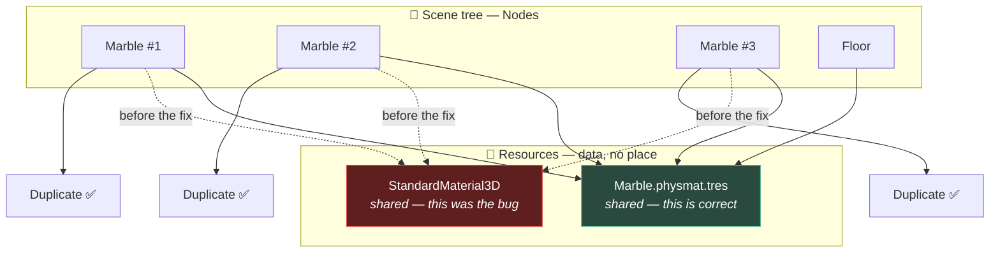

# Chapter 1.6 — Nodes vs Resources

🪜 **Scaffolding: 85 / 15.**

---

## 🎯 Goal

By the end, one `PhysicsMaterial` file will govern every marble in the game — and you will have **changed one marble's colour and watched all of them change**, then fixed it deliberately.

---

## 🏃 Fast-Track Summary

*Path C: read this and the cheat sheet, do ⭐ P1, move on.*

- **Node** = *a thing in the tree.* Has a parent, children, a lifecycle, a position. `Marble`, `Camera3D`.
- **Resource** = *data.* No parent, no lifecycle, no place. `Mesh`, `Material`, `PhysicsMaterial`, `PackedScene`, `Texture2D`.
- ⭐ **Resources are reference types, and they are shared by default** ([1.4b](1.4b_TheCSharpYouHaveNotMet.md)). Assign one material to three meshes, edit it once, **all three change.**
- Save one to disk: Inspector → the resource dropdown → **Save As…** → `res://resources/Marble.physmat.tres`. Now it is a file, reusable and diffable.
- 🚨 **To make a copy instead:** the resource dropdown → **Make Unique**. Without it you are editing everyone's copy.
- **Local to Scene** makes each *instance* get its own copy automatically — the fix for "the coin I collected made all coins fade".
- Break it: tint one marble at runtime and watch the others change too.
- Commit: `ch 1.6: shared resources`

---

## 🧭 Before you start

| You need | From |
|---|---|
| Three marbles instanced | [1.2](1.2_ScenesAndInstancing.md) |
| `Marble.cs` with exported feel values | [1.5](1.5_TuningWithoutRecompiling.md) |
| Value vs reference types | [1.4b](1.4b_TheCSharpYouHaveNotMet.md) |

---

## 🔨 Build

### Step 1 — Make a resource into a file

In [1.5](1.5_TuningWithoutRecompiling.md) the marble built a `PhysicsMaterial` in code. Do it as data instead.

1. Open `scenes/Marble.tscn`.
2. Select the root. Inspector → `RigidBody3D` → **Physics Material Override** → **New PhysicsMaterial**.
3. Expand it. Set **Bounce** `0.4`, **Friction** `0.6`.
4. Click the resource dropdown ▾ → **Save As…** → `res://resources/Marble.physmat.tres`.

`[UNVERIFIED]` — exact menu wording.

You now have a file:

```bash
cat projects/P01_MarbleRunner/resources/Marble.physmat.tres
```

It is **text** — three or four lines. Diffable, greppable, reviewable ([0.7](../../module0/0A/0.7_GitForGameProjects.md)).

Now remove the `ApplyFeel()` call and the `Bounciness`/`Friction` exports from `Marble.cs`. The data has moved out of the code and into a file.

> 💡 **That is the [1.5](1.5_TuningWithoutRecompiling.md) progression's next step.** A literal became an exported property; now a *set* of related values has become a resource that many objects can share.

### Step 2 — Share it, and see what that means

1. Assign the same `Marble.physmat.tres` to the `Floor`'s `StaticBody3D` → Physics Material Override. *(Drag the file from FileSystem onto the property.)*
2. `F6`. Note how the marble behaves.
3. **Stop.** Open `resources/Marble.physmat.tres` from the FileSystem dock and change **Bounce** to `0.9`.
4. `F6` again.

**Both the marble and the floor changed**, because they are not two materials that happen to match — they are **one material, referenced twice**.

### Step 3 — ⭐ The sharing bug, on purpose

Give the marble a visual material and then tint it from code.

1. In `scenes/Marble.tscn`, select the `MeshInstance3D` → **Surface Material Override → 0** → **New StandardMaterial3D**. Set Albedo to white.

> ⚠️ **Surface Material Override, not Material Override.** Two different slots in two different Inspector sections — see [0.13](../../module0/0B/0.13_GDShaderFirstContact.md) and [D-017](../../../meta/Doubts.md#d-017).

2. Add to `Marble.cs`:

```csharp
    [Export] public Color Tint { get; set; } = Colors.White;

    public override void _Ready()
    {
        _spawnPoint = GlobalPosition;

        var mesh = GetNode<MeshInstance3D>("MeshInstance3D");
        if (mesh.GetSurfaceOverrideMaterial(0) is StandardMaterial3D mat)
            mat.AlbedoColor = Tint;          // ⚠️ this edits a SHARED resource
    }
```

3. In `Main.tscn`, give your three marbles **different** `Tint` values — red, green, blue.
4. Build, `F6`.

**All three marbles are the same colour** — whichever ran last.

> 🚨 **This is the single most common resource bug**, and it is invisible in code review. Nothing looks wrong: each marble sets its own tint on *its* material. But `Marble.tscn` has one `StandardMaterial3D`, and all three instances point at it.

### Step 4 — Two ways to fix it

**Fix A — duplicate at runtime.** Give each instance its own copy:

```csharp
        if (mesh.GetSurfaceOverrideMaterial(0) is StandardMaterial3D shared)
        {
            var mine = (StandardMaterial3D)shared.Duplicate();
            mine.AlbedoColor = Tint;
            mesh.SetSurfaceOverrideMaterial(0, mine);
        }
```

`F6`. **Three different colours.**

**Fix B — Local to Scene.** Select the material in the Inspector, expand **Resource**, and tick **Local to Scene** `[UNVERIFIED]`. Now every *instance of the scene* gets its own copy automatically, and Fix A's `Duplicate()` becomes unnecessary.

> 💡 **Fix B is usually the right one**, because it puts the decision next to the data rather than in every script that touches it. Use Fix A when only *some* users need a private copy.

### Step 5 — Where sharing is what you want

Sharing is not a bug — it is the point. Prove it:

1. Confirm all three marbles still use the **same** `Marble.physmat.tres`.
2. Change its Bounce once. All three marbles change.

**One file, one edit, every marble.** That is the same argument as instancing in [1.2](1.2_ScenesAndInstancing.md), applied to data instead of structure — and in Module 3 it is how one material governs a fourteen-piece art kit.

### Step 6 — Commit

```bash
git add .
git commit -m "ch 1.6: shared resources"
git push
```

---

## ▶️ Run it

- [ ] `resources/Marble.physmat.tres` exists and is **text**
- [ ] Editing it changes both the marble and the floor
- [ ] Three marbles came out **one colour** before the fix
- [ ] After `Duplicate()` or Local to Scene, **three colours**
- [ ] You can say which of sharing and copying you want, and why

---

## 👀 Observe

The same property — **resources are shared** — was a bug in Step 3 and a feature in Step 5. Nothing about the mechanism changed; only what you wanted from it.

That is why Godot cannot warn you. Sharing a physics material across every marble is correct. Sharing a colour across marbles you intended to differ is wrong. **The engine has no way to tell those apart**, which puts it in the same family as [1.1](1.1_Nodes.md)'s mismatched collider: *the tool cannot check your intent, so you are the check.*

---

## 🧠 Why it works

### The distinction, in one table

| | **Node** | **Resource** |
|---|---|---|
| Lives | In the scene tree | In memory, referenced by anything |
| Has | Parent, children, `_Ready`, a transform | **None of those** |
| Identity | There is *one* marble | Data — many things may point at it |
| Freed by | `QueueFree()` | **Reference counting** — when nothing points at it |
| Saved as | `.tscn` | `.tres` (text) or `.res` (binary) |
| Examples | `Marble` `Camera3D` `Area3D` | `Mesh` `Material` `PhysicsMaterial` `Texture2D` `PackedScene` |

**The test:** *does this thing have a place in the world?* A marble does. Its bounciness does not — it is a fact *about* the marble.

### Why reference counting matters

A resource is freed when the last thing referencing it lets go. You never call `QueueFree` on a material.

Practically: **loading the same `.tres` twice gives you the same object**, not two copies. That is why one file can govern fifty objects with no memory cost — and equally why `Duplicate()` is required the moment you want them to differ.

> 🔬 **Deep dive — `PackedScene` is a resource, which closes the loop.** [1.2](1.2_ScenesAndInstancing.md) said a scene is a `PackedScene`. That is why instancing is cheap: the recipe is loaded **once** and shared, and each `Instantiate()` produces fresh *nodes* from shared *data*. So the node/resource split explains the scene system rather than being separate from it — **nodes are the things, resources are what the things are made of.** In [10.5](../../../TableOfContents.md) you will write your own `Resource` subclasses to hold level and dialogue data, and it works because of exactly this.

---

## 🗺️ Mental model



---

## 💥 Break it

1. Undo Fix A/B so the material is shared again. Now change `Tint` on **one** marble in the Inspector and run. Which marbles change?
2. Restore the fix. Now assign `Marble.physmat.tres` to a marble and, in `_Ready`, write `PhysicsMaterialOverride.Bounce = 1.5f;`. Run, stop, and **look at the `.tres` file on disk.**
3. Restore. Finally, delete `resources/Marble.physmat.tres` from the FileSystem while the scenes still reference it. Reopen `Marble.tscn`.

---

## 🔎 Diagnose

**Which of the three changed a file on disk, and which failed loudly? Answer before opening.**

<details>
<summary>Answer</summary>

**1 — Shared material, one tint changed.** Whichever marble's `_Ready` runs **last** wins, and all three show that colour. Change a *different* marble's tint and the outcome may flip, depending on tree order ([1.3](1.3_TheSceneTree.md)). **A bug whose result depends on node ordering** — reorder the Scene dock and the colour changes, with nothing to connect the two.

**2 — Writing to a resource at runtime.** The value changes in the running game. `[UNVERIFIED]` — whether it also persists to the `.tres` on disk depends on your version and whether the editor saves it; **in the editor with a `[Tool]` script it certainly can.**

**That possibility is the alarming part.** Runtime code that mutates a shared, on-disk resource can modify your *project files*. It is the resource equivalent of a program editing its own source, and it is why [10.5](../../../TableOfContents.md) is careful to separate resources used as **read-only data** from state that changes.

**3 — Deleting a referenced resource.** This one **fails loudly** — Godot reports the missing dependency when the scene loads, and the property shows as empty or broken. `[UNVERIFIED]` — exact wording.

**Compare the three, because the ranking is the lesson:**

| # | Symptom | How you find out |
|---|---|---|
| 1 | Wrong colour, order-dependent | Only by looking, and it may look deliberate |
| 2 | Project file quietly modified | Possibly a `git status` days later |
| 3 | Missing dependency | **Immediately, with a message** |

**The loudest failure is the least dangerous**, which has been true in every chapter of this block: [1.1](1.1_Nodes.md)'s mismatched collider was silent, [1.2](1.2_ScenesAndInstancing.md)'s override was silent, [1.4](1.4_YourFirstRealScript.md)'s check-in-`_Ready` was silent, [1.4b](1.4b_TheCSharpYouHaveNotMet.md)'s struct copy was silent.

**The habit worth carrying out of Module 1A: when something is wrong and nothing complained, suspect a relationship** — a shared resource, an instance override, a wrong clock, a copy that was never written back. **Those are the bugs this engine's design makes possible, and they are all diagnosed by looking at structure rather than at code.**

</details>

---

## 🏋️ Practicals

**⭐ P1 — Make the coins share properly.** Give `Coin.tscn` a `StandardMaterial3D` and make it **Local to Scene**. Then write a `Collect()` that fades *one* coin. Confirm the others do not fade. **This is the exact bug you will otherwise hit in [1.14](../../../TableOfContents.md).**

**P2 — Read the `.tres`.** Open both your `.physmat.tres` and `Marble.tscn` in a text editor. Find where the scene *references* the resource by path. That line is the whole mechanism.

**P3 — Share on purpose.** Make every coin, the ramp and the floor use one shared `StandardMaterial3D`. Change it once and watch the level restyle. That is the Module 3 art-kit workflow in miniature.

**🔬 P4 — Count the references.** Add `GD.Print(mat.GetReferenceCount())` `[UNVERIFIED]`, or reason it out from the scene. Predict the number before you check.

---

## ✅ Check yourself

1. What is the test for whether something is a node or a resource?
2. Why are three marbles one colour when each sets its own tint?
3. Name the two fixes, and when each is right.
4. How is a resource freed?
5. Why can Godot not warn you about accidental sharing?

<details>
<summary>Answers</summary>

1. **Does it have a place in the world?** A marble does — parent, children, transform, lifecycle. Its bounciness does not; that is a fact *about* the marble, so it is a resource.
2. Because the scene contains **one material**, and all three instances reference it. Each `_Ready` writes to the same object, so whichever runs **last** wins — which also makes the result depend on tree order.
3. **`Duplicate()` at runtime** — right when only *some* users need a private copy. **Local to Scene** — right by default, because it puts the decision next to the data instead of in every script that touches it.
4. **Reference counting.** When the last reference is dropped, it is freed. You never call `QueueFree` on a resource, and loading the same `.tres` twice gives you the *same object*.
5. Because **sharing is correct at least as often as it is wrong.** One physics material across every marble is the point; one colour across marbles meant to differ is a bug. The engine cannot tell intent apart, so you are the check — the same situation as a mismatched collider in [1.1](1.1_Nodes.md).

</details>

---

## 📎 Cheat sheet

| | Node | Resource |
|---|---|---|
| In the tree | ✅ | ❌ |
| Lifecycle (`_Ready`) | ✅ | ❌ |
| Freed by | `QueueFree()` | reference counting |
| File | `.tscn` | `.tres` (text) / `.res` (binary) |
| Examples | `Marble` `Camera3D` `Area3D` | `Mesh` `Material` `PhysicsMaterial` `PackedScene` |

| Action | How |
|---|---|
| Save a resource to disk | Resource dropdown ▾ → **Save As…** |
| Give one object its own copy | ▾ → **Make Unique**, or `res.Duplicate()` in code |
| Give every scene instance its own | Resource → **Local to Scene** ⭐ |
| Share deliberately | Assign the same `.tres` to several objects |

> 🚨 **Resources are shared by default.** Editing one at runtime edits it **for everything that references it** — and may touch the file on disk.

---

## 🔗 Further reading

- [Resources](https://docs.godotengine.org/en/stable/tutorials/scripting/resources.html)
- [When to use scenes versus scripts](https://docs.godotengine.org/en/stable/tutorials/best_practices/scenes_versus_scripts.html)

---

## 💾 Commit

```text
ch 1.6: shared resources
```

---

## ➡️ What's next

**Block 1B — Space and motion**, starting with [1.7](../../../TableOfContents.md): Godot's coordinate system, and the mistakes that follow from getting it wrong. Block **1A is complete** — you can now read a Godot scene and say what every part of it is *for*.

---

## 🪞 Reflection

In two sentences: **why is resource sharing a feature and a bug at the same time, and what should you suspect when something is wrong and nothing complained?**

---

## 📝 Chapter changelog

| Version | Date | Change |
|---|---|---|
| 1.0 | 2026-09-03 | First published. Closes block 1A. `[UNVERIFIED]` on menu wording, on-disk persistence and reference-count API. |
