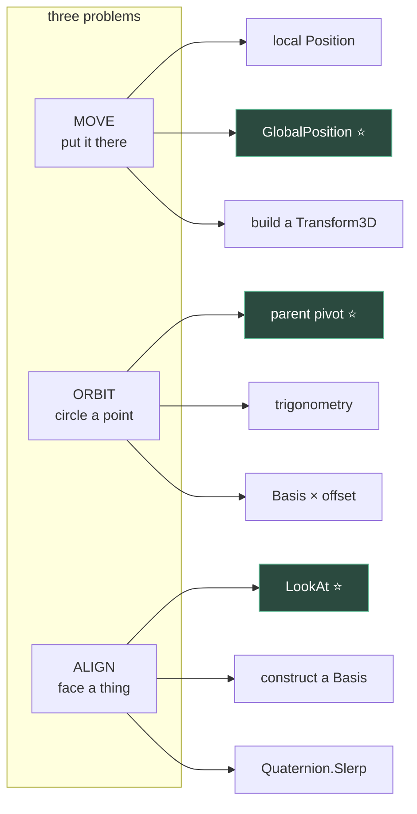

# Chapter 1.10 — Drill: Move, Orbit and Align Three Ways

**[X] Exercise set — closes block 1B**

🪜 **Scaffolding: 40 / 60.** The specification and the marker are given. The solutions are yours.

---

## 🎯 Goal

Nine small problems: **three tasks, three ways each.** A test harness marks them for you, so you get an answer rather than an opinion. Then you do them again against the clock.

**This is the first chapter that does not teach you anything new.** It makes what you already know *fast*, which is a different thing and needs its own session.

---

## 🏃 Fast-Track Summary

*Path C: build the harness, do one solution per task (M1, O1, A1), skip the timed round.*

- Build `DrillHarness.cs` — it asserts positions and orientations **within a tolerance** and prints ✅ / ❌.
- **Move:** by local position · by world position · by a transform you construct.
- **Orbit:** by parent pivot · by trigonometry · by rotating an offset vector with a `Basis`.
- **Align:** by `LookAt` · by building a `Basis` from axes · by slerping a `Quaternion`.
- Each way is *correct*. The drill is about knowing **which one you would reach for**, and being able to write it without looking it up.
- Commit: `ch 1.10: nine ways, all green`

---

## 🧭 Before you start

You need all of block 1B in your hands: [1.7](1.7_3DSpaceInGodot.md) (−Z forward), [1.8](1.8_Transform3D.md) (local vs global), [1.9](1.9_Rotations.md) (slerp, `LookAt`).

> 💡 **Do not re-read them first.** Attempt each problem cold, and only look back when you are stuck. **Finding out what you cannot yet do unaided is the point of a drill** — a drill you sail through taught you nothing except that you were ready for it.
>
> 🔑 **Every one of the nine is worked in full at the end of this chapter** — [🔑 Complete Solutions](#-complete-solutions) — with the scene, the whole file, why each choice and how to verify it. Use it the moment you are stuck rather than grinding: **the struggle is worth minutes, not an evening.**

---

## 🔨 Build

### Step 1 — Build the marker

New scene, `Node3D` root named `Drill`, saved as `scenes/Drill.tscn`. Attach:

```csharp
using Godot;

public partial class Drill : Node3D
{
    private int _pass, _fail;

    // --- the marker -------------------------------------------------------
    private void Check(string id, bool ok, string detail = "")
    {
        if (ok) { _pass++; GD.Print($"✅ {id}"); }
        else    { _fail++; GD.PrintErr($"❌ {id}  {detail}"); }
    }

    private void CheckPos(string id, Node3D n, Vector3 expected, float tol = 0.01f)
        => Check(id, n.GlobalPosition.DistanceTo(expected) <= tol,
                 $"got {n.GlobalPosition}, want {expected}");

    private void CheckFacing(string id, Node3D n, Vector3 target, float degTol = 1f)
    {
        Vector3 want    = (target - n.GlobalPosition).Normalized();
        Vector3 forward = -n.GlobalTransform.Basis.Z;
        float   deg     = Mathf.RadToDeg(forward.AngleTo(want));
        Check(id, deg <= degTol, $"off by {deg:F2}°");
    }

    private void Report()
        => GD.Print($"\n=== {_pass} passed, {_fail} failed ===");
}
```

> 🚨 **`CheckPos` uses a distance and a tolerance, not `==`.** [1.8](1.8_Transform3D.md) Step 2 showed you why: rotations produce values like `-1.31e-07` where you expected `0`. **A test that compares floats exactly fails on correct answers**, and then you debug the solution instead of the test. `CheckFacing` compares an *angle between directions* for the same reason — and because two different bases can point the same way.

Add a `MeshInstance3D` child named `Subject` (a small `BoxMesh`) — that is the thing you will be moving.

### Step 2 — Task M: move it there

**Specification.** `Subject` starts at the origin. Put it at world `(2, 1, -3)`, three ways. `Pivot` is a `Node3D` parent you may add, **rotated `(0, 40, 0)`** — chosen so local and global differ and a wrong answer is visible.

| ID | Constraint |
|---|---|
| **M1** | Write to the node's **local** `Position`. The parent is rotated, so compute what local value lands you there. |
| **M2** | Write to `GlobalPosition`. One line. |
| **M3** | Do not write any position property. Build a `Transform3D` and assign `GlobalTransform`. |

```csharp
    public override void _Ready()
    {
        var subject = GetNode<Node3D>("Pivot/Subject");
        var target  = new Vector3(2, 1, -3);

        // M1 — your code here

        CheckPos("M1", subject, target);

        // ... M2, M3 the same way, resetting between each
        Report();
    }
```

> 💡 **M1 is the one that teaches.** If you find yourself wanting `Pivot.GlobalTransform.AffineInverse() * target`, you have understood [1.8](1.8_Transform3D.md) properly. If you find yourself guessing numbers until it goes green, that is worth knowing too — go back and re-read [1.8](1.8_Transform3D.md)'s Step 3, then return.

### Step 3 — Task O: orbit it

**Specification.** `Subject` circles the world origin at **radius 4**, in the XZ plane, at **45°/second**, counter-clockwise seen from above ([1.7](1.7_3DSpaceInGodot.md)).

| ID | Constraint |
|---|---|
| **O1** | A rotating parent `Node3D`. `Subject` itself never moves. |
| **O2** | Trigonometry. Compute the position each frame from an accumulated angle. No parent. |
| **O3** | No trigonometry, no parent. Rotate an offset **vector** with a `Basis` and add it. |

Mark it by sampling: after exactly 2 seconds it must be **90°** around from where it began.

```csharp
    private float _elapsed;
    private bool  _sampled;

    public override void _Process(double delta)
    {
        // ... your orbit code ...

        _elapsed += (float)delta;
        if (!_sampled && _elapsed >= 2f)
        {
            _sampled = true;
            CheckPos("O", GetNode<Node3D>("Subject"), new Vector3(0, 0, -4), 0.15f);
        }
    }
```

> ⚠️ **The tolerance is deliberately loose — `0.15`.** You are sampling on whichever frame first crosses two seconds, so you overshoot by up to one frame of travel. **A drill whose marker is stricter than its measurement is a drill that fails correct code**, and you would spend the session hunting a bug in the harness. Working out *how loose is honest* is itself the exercise: at 45°/s and radius 4, one 60 fps frame is about 0.05 units.

**O3 is the interesting one.** `Basis` has a constructor taking an axis and an angle `[UNVERIFIED]`; a basis multiplied by a vector rotates it. Two lines, no `Sin`, no `Cos` — and it generalises to any axis, which is why it is worth having in your hands.

### Step 4 — Task A: align it

**Specification.** `Subject` faces the `Marble` — that is, its **−Z** points at the marble's global position.

| ID | Constraint |
|---|---|
| **A1** | `LookAt`. One line. |
| **A2** | No `LookAt` and no `LookingAt`. Construct a `Basis` from three orthonormal vectors you compute. |
| **A3** | Approach the target orientation over ~0.5 s with `Quaternion.Slerp`, framerate-independently. |

Mark with `CheckFacing("A1", subject, marble.GlobalPosition)`.

> 💡 **A2 is the one worth struggling with.** You want forward, then a right perpendicular to forward and world up, then a true up. `Vector3.Cross` and `.Normalized()` are the whole toolkit, and **the order and sign of the cross products decide whether you get the right answer or a mirror of it** ([1.7](1.7_3DSpaceInGodot.md)'s handedness, made concrete). Godot's `Basis` constructor takes the columns X, Y, Z in that order `[UNVERIFIED]` — and [1.7](1.7_3DSpaceInGodot.md) told you that Z is **back**, not forward. That single fact is the difference between A2 passing and A2 pointing exactly backwards.

### Step 5 — All green

Run until you see:

```
✅ M1  ✅ M2  ✅ M3
✅ O1  ✅ O2  ✅ O3
✅ A1  ✅ A2  ✅ A3

=== 9 passed, 0 failed ===
```

### Step 6 — ⭐ The timed round

The drill proper. **Delete all nine solutions.** Keep the harness.

Now redo them, timing each task with a stopwatch. Target: **under 5 minutes per task**, all three ways, no documentation.

Record in [`Journal.md`](../../../meta/Journal.md):

| Task | First attempt | Timed round | Looked anything up? |
|---|---|---|---|
| M | | | |
| O | | | |
| A | | | |

> 💡 **Deleting work you just wrote feels wasteful and is the entire method.** The first pass was problem-solving; the second is retrieval, and retrieval is what makes something available to you later, at speed, while you are thinking about something else. **Nothing in the next 330 chapters wants you thinking about `Basis` constructors** — they want you thinking about the game.

### Step 7 — Commit

```bash
git add .
git commit -m "ch 1.10: nine ways, all green"
git push
```

---

## ▶️ Run it

- [ ] Harness prints ✅/❌ and a final tally
- [ ] All nine green
- [ ] M1 solved by transforming the point, not by guessing numbers
- [ ] O3 has no `Sin` or `Cos`
- [ ] A2 has no `LookAt`, and points **at** the marble, not away
- [ ] A3 tested at two framerates
- [ ] Timed round done, six numbers recorded

---

## 👀 Observe

Look at your two columns. The gap between them is not a measure of intelligence — it is a measure of **retrieval**, and it is the thing that separates someone who *knows* Godot from someone who can *use* it.

Now look at which task was slowest. It is usually **A**, because alignment is where all three of block 1B's ideas meet at once: a direction (1.7), a basis (1.8) and an interpolation (1.9). **A slow task is a diagnosis, not a verdict** — it names the chapter to revisit, and revisiting one chapter beats re-reading three.

And note what the harness gave you that reading could not: **an answer**. Every chapter so far ended with "check yourself" questions you marked in your own head. This one marked you. That difference is why Module 5's optimisation work and Module 11's playtesting are built on measurement rather than judgement — **you cannot see your own blind spot by looking harder.**

---

## 🧠 Why it works

### Why three ways, when one would do

Because in real work you rarely get to choose freely. The parent is already rotated; the object is already parented; the value arrives as a quaternion from an animation. **Knowing only one route means those situations stop you**, and you fall back to the route you know by fighting the scene into a shape that suits it — extra pivot nodes, transforms in code that contradict the editor, and a scene nobody else can read.

| Task | Reach for | When you cannot |
|---|---|---|
| Move | `GlobalPosition` | Local, when a parent defines the layout |
| Orbit | Parent pivot ⭐ | Trig or basis, when you may not add nodes |
| Align | `LookAt` | Basis when you need roll control; slerp when it must be smooth |

**The starred ones are what you should reach for by default** — the editor-visible, artist-editable option. Code that a designer can see and adjust in the Inspector beats code that only you can change ([1.5](../1A/1.5_TuningWithoutRecompiling.md)).

> 🔬 **Deep dive — why O1 is usually right.** Nesting under a rotating parent costs one node and no per-frame code of yours. The engine already walks the tree and multiplies transforms ([1.8](1.8_Transform3D.md)); your orbit is free inside work that happens regardless. O2 adds a `Sin` and a `Cos` per object per frame, and — worse — puts the object's motion in a script where an artist cannot see it. **Prefer the version the engine already does for you**, which is a theme that returns hard in Module 5's performance work.

---

## 🗺️ Mental model



---

## 💥 Break it

1. Change `CheckPos`'s tolerance to `0f` and re-run all nine.
2. Restore. In `CheckFacing`, compare `n.GlobalTransform.Basis.Z` to `want` instead of `-...Basis.Z`. Which tasks now "pass"?
3. Restore. Make `Pivot`'s scale `(2, 1, 1)` and re-run **M1** and **A2**.

---

## 🔎 Diagnose

**One of these turns your marker into a liar. Answer before opening.**

<details>
<summary>Answer</summary>

**1 — Zero tolerance.** Tasks fail that are visibly correct, because a rotation through 40° leaves `1e-07` residue ([1.8](1.8_Transform3D.md)). **The code is right and the test is wrong**, and you would spend an hour on the solution. **Every float comparison in a game needs a tolerance chosen to match the physical thing being measured** — and "how loose is honest?" is a judgement, as Step 3's 0.15 showed.

**2 — Wrong sign in the marker.** 🚨 **This is the liar.** Now the checks pass when the subject faces **exactly away**. Your solutions did not change; the marker's definition of correct did. The output still says nine green, and the scene visibly shows a box facing the wrong way — **and you would believe the printout over your eyes**, because the printout is the thing you built to be trusted.

**A test is a claim, and a claim can be wrong.** Nothing checks the checker except your own attention. This is why [11.11](../../../TableOfContents.md)'s playtesting protocol makes you watch a player rather than only reading their score, and why Module 5 asks for a screenshot alongside every framerate number. **A green suite is evidence, not proof.**

**3 — Non-uniform parent scale.** [1.8](1.8_Transform3D.md)'s shear, now sabotaging your homework. M1's inverse-transform still lands the position correctly — positions survive shear fine. **A2's orthonormal basis does not**: you construct perpendicular unit vectors, the parent's scale skews them on the way to world space, and the result is neither the direction nor the roll you built. `[UNVERIFIED]` — exactly how far off. **The lesson is where it fails, not that it fails**: shear leaves *points* alone and destroys *frames*, which is precisely why it breaks models and colliders while positions keep looking fine.

**The ranking:**

| # | Effect | Danger |
|---|---|---|
| 1 | Correct code marked wrong | Wastes an hour |
| 2 | **Wrong code marked right** | 🚨 Ships |
| 3 | Right code, sabotaged scene | Teaches where shear bites |

**False failures cost time; false passes cost releases.** When you write a test, spend your scepticism on whether it can fail — the fastest check is to break the code on purpose and confirm the test notices. Do that now with #2 restored: point the subject 90° off and confirm A1 goes red.

</details>

---

## 🏋️ Practicals

**⭐ P1 — The fourth way.** For any one task, find a route the chapter did not list — a `Tween`, `Transform3D.InterpolateWith`, a `RemoteTransform3D` node `[UNVERIFIED]`. Make it pass the same marker. **Then argue in one paragraph whether it is better than the three given**, and for what.

**⭐ P2 — Break your own harness deliberately.** Introduce a wrong answer for each of the nine and confirm the marker catches all nine. **Any check that cannot fail is not a check** — record whether all nine actually went red.

**P3 — Retire the drill properly.** A week from now, delete the solutions and redo all nine, cold. Add a third column to your table. **Spaced repetition is the only version of this that sticks**, and one week is roughly the right gap.

**🔬 P4 — Port a task to GDScript.** Take task O and write all three ways in GDScript ([0.10](../../module0/0B/0.10_GDScriptFirstContact.md)). Time yourself, and add the numbers to your [0.14](../../module0/0B/0.14_LanguageDecisionTable.md) decision table. **Real evidence for a table you have so far filled with two data points.**

---

## ✅ Check yourself

1. Why does `CheckPos` use a distance and a tolerance instead of `==`?
2. Why is O1 usually the right choice in production?
3. In A2, which single fact decides between facing the target and facing away?
4. Why delete working solutions and redo them?
5. Which is worse — a test that fails correct code, or one that passes wrong code?

<details>
<summary>Answers</summary>

1. Because rotation produces floating-point residue like `-1.3e-07` where you expect `0`, so exact comparison **fails correct answers** and sends you debugging the solution instead of the test.
2. Because the engine already walks the tree and multiplies transforms, so a rotating parent costs **no per-frame code of your own** — and it stays **visible and editable in the editor**, where a designer can change it.
3. That **`Basis.Z` is back, not forward** ([1.7](1.7_3DSpaceInGodot.md)). Build the basis with your computed forward in the Z column unchanged and the subject faces exactly away.
4. Because the first pass is **problem-solving** and the second is **retrieval** — and retrieval is what makes something available later, at speed, while you are thinking about the game instead of about `Basis`.
5. **Passing wrong code**, decisively. A false failure costs an hour; a false pass ships. Which is why the fastest thing to do with a new test is break the code on purpose and confirm it notices.

</details>

---

## 📎 Cheat sheet

| Move | |
|---|---|
| World point → local | `parent.GlobalTransform.AffineInverse() * p` |
| Set both at once | `GlobalTransform = new Transform3D(basis, origin)` |

| Orbit | |
|---|---|
| ⭐ Parent | `pivot.RotateY(rate * delta)` |
| Trig | `new Vector3(Cos(a), 0, Sin(a)) * r` |
| Basis | `new Basis(Vector3.Up, angle) * offset` |

| Align | |
|---|---|
| ⭐ Snap | `LookAt(target, Vector3.Up)` |
| Construct | forward, `Cross` for right, `Cross` for up — 🚨 **Z column is back** |
| Smooth | `Slerp` with `t = 1 - Exp(-k * delta)` |

| Testing | |
|---|---|
| Positions | distance ≤ tolerance |
| Directions | `AngleTo` ≤ degrees |
| 🚨 Never | `==` on floats, vectors or transforms |
| Always | Break the code and confirm the test goes red |

---

## 🔗 Further reading

- [Using transforms](https://docs.godotengine.org/en/stable/tutorials/3d/using_transforms.html)
- [`Basis`](https://docs.godotengine.org/en/stable/classes/class_basis.html) · [`Transform3D`](https://docs.godotengine.org/en/stable/classes/class_transform3d.html)

---

## 💾 Commit

```text
ch 1.10: nine ways, all green
```

---

## 🔑 Complete Solutions

> 🚨 **Read this section only after you have attempted a task.** The reading order still matters — the value of a drill is in the struggle, not the answer. But being stuck should cost you **minutes, not an evening** ([ADR-038](../../../meta/Decisions.md#adr-038)), so every one of the nine is here in full: the scene, the complete file, why this and not something else, and how to check it.
>
> Each task is collapsed separately, so opening M1 does not spoil O3.

---

### 🏗️ The scene — build this once

📄 **NEW SCENE** `scenes/Drill.tscn`. Every task gets its **own subject**, so nothing needs resetting between runs.

```
Drill                 Node3D            ← Drill.cs attached here
├── Pivot             Node3D            Rotation = (0, 40, 0)      ← tasks M1–M3
│   └── Subject       MeshInstance3D    BoxMesh 0.5³, Position (0,0,0)
├── Orbiter           Node3D            Position (0,0,0)           ← task O1
│   └── OrbitSubject  MeshInstance3D    BoxMesh 0.5³, Position (4,0,0)
├── FreeSubject       MeshInstance3D    BoxMesh 0.5³, Position (4,0,0)  ← O2, O3, A1–A3
├── Marble            MeshInstance3D    SphereMesh r=0.4, Position (3,1,2)  ← the A-task target
└── Camera3D                            Position (0,12,14), Rotation (-35,0,0)
```

**Exact steps:**

1. **Scene → New Scene → 3D Scene.** Rename the root `Drill`. Save as `res://scenes/Drill.tscn`.
2. Right-click `Drill` → **Add Child Node** → `Node3D` → rename **`Pivot`**. In the Inspector set **Transform → Rotation → y = 40**.
3. Right-click `Pivot` → Add Child → `MeshInstance3D` → rename **`Subject`**. Inspector → **Mesh → New BoxMesh**, expand it, **Size = (0.5, 0.5, 0.5)**.
4. Right-click `Drill` → Add Child → `Node3D` → rename **`Orbiter`**. Leave its transform at zero.
5. Right-click `Orbiter` → Add Child → `MeshInstance3D` → rename **`OrbitSubject`**. Same `BoxMesh` 0.5³. **Position = (4, 0, 0)**.
6. Right-click `Drill` → Add Child → `MeshInstance3D` → rename **`FreeSubject`**. Same mesh. **Position = (4, 0, 0)**.
7. Right-click `Drill` → Add Child → `MeshInstance3D` → rename **`Marble`**. **Mesh → New SphereMesh**, Radius `0.4`, Height `0.8`. **Position = (3, 1, 2)**.
8. Right-click `Drill` → Add Child → `Camera3D`. **Position = (0, 12, 14)**, **Rotation = (-35, 0, 0)**.
9. Select `Drill` → attach `res://scripts/Drill.cs` (the next block).
10. **Project → Project Settings → Application → Run → Main Scene** — or just press **F6** with `Drill.tscn` open, which runs the current scene.

> 💡 **Why `OrbitSubject` starts at `(4, 0, 0)`.** The marker checks for `(0, 0, -4)` after two seconds. At 45°/s that is 90° of travel, and a **positive** rotation about Y takes `+X` to `−Z` ([1.7](1.7_3DSpaceInGodot.md)). Start anywhere else and a correct solution fails the check.

---

### 📄 The complete `Drill.cs`

📄 **NEW FILE** `res://scripts/Drill.cs`. This is the whole file — harness and all nine solutions. Pick one with the **Which** dropdown in the Inspector and press F6.

```csharp
using Godot;

public partial class Drill : Node3D
{
    public enum Task
    {
        Move,           // runs M1, M2 and M3 in one go
        OrbitParent,    // O1
        OrbitTrig,      // O2
        OrbitBasis,     // O3
        AlignLookAt,    // A1
        AlignBasis,     // A2
        AlignSlerp      // A3
    }

    [Export] public Task Which { get; set; } = Task.Move;

    [ExportGroup("Orbit")]
    [Export] public float Radius { get; set; } = 4f;
    [Export] public float DegreesPerSecond { get; set; } = 45f;

    [ExportGroup("Align")]
    [Export(PropertyHint.Range, "0.5,20,0.5")] public float SlerpRate { get; set; } = 6f;

    private Node3D _pivot, _subject, _orbiter, _orbitSubject, _free, _marble;
    private int _pass, _fail;
    private float _angle, _elapsed;
    private bool _sampled;

    // ---------------------------------------------------------------- marker
    private void Check(string id, bool ok, string detail = "")
    {
        if (ok) { _pass++; GD.Print($"✅ {id}"); }
        else    { _fail++; GD.PrintErr($"❌ {id}  {detail}"); }
    }

    private void CheckPos(string id, Node3D n, Vector3 expected, float tol = 0.01f)
        => Check(id, n.GlobalPosition.DistanceTo(expected) <= tol,
                 $"got {n.GlobalPosition}, want {expected}");

    private void CheckFacing(string id, Node3D n, Vector3 target, float degTol = 1f)
    {
        Vector3 want    = (target - n.GlobalPosition).Normalized();
        Vector3 forward = -n.GlobalTransform.Basis.Z;
        float   deg     = Mathf.RadToDeg(forward.AngleTo(want));
        Check(id, deg <= degTol, $"off by {deg:F2}°");
    }

    private void Report() => GD.Print($"\n=== {_pass} passed, {_fail} failed ===");

    // ----------------------------------------------------------------- setup
    public override void _Ready()
    {
        _pivot        = GetNode<Node3D>("Pivot");
        _subject      = GetNode<Node3D>("Pivot/Subject");
        _orbiter      = GetNode<Node3D>("Orbiter");
        _orbitSubject = GetNode<Node3D>("Orbiter/OrbitSubject");
        _free         = GetNode<Node3D>("FreeSubject");
        _marble       = GetNode<Node3D>("Marble");

        if (Which == Task.Move) { RunMoveTasks(); Report(); }
    }

    // =========================================================== TASK M: move
    private void RunMoveTasks()
    {
        Vector3 target = new Vector3(2, 1, -3);

        // ---- M1: write the LOCAL Position -------------------------------
        // Convert a world point into the parent's local space, then store it.
        // AffineInverse() is the transform that undoes Pivot's transform.
        _subject.Position = _pivot.GlobalTransform.AffineInverse() * target;
        GD.Print($"   M1 local Position = {_subject.Position}");   // ≈ (3.46, 1, -1.01)
        CheckPos("M1", _subject, target);

        _subject.Position = Vector3.Zero;                          // reset

        // ---- M2: write GlobalPosition -----------------------------------
        _subject.GlobalPosition = target;
        CheckPos("M2", _subject, target);

        _subject.Position = Vector3.Zero;                          // reset

        // ---- M3: assign a whole Transform3D -----------------------------
        // Keep the existing orientation, replace only the origin.
        _subject.GlobalTransform = new Transform3D(_subject.GlobalTransform.Basis, target);
        CheckPos("M3", _subject, target);
    }

    // ========================================================== TASKS O: orbit
    public override void _Process(double delta)
    {
        switch (Which)
        {
            case Task.OrbitParent: OrbitParent(delta); break;
            case Task.OrbitTrig:   OrbitTrig(delta);   break;
            case Task.OrbitBasis:  OrbitBasis(delta);  break;
            case Task.AlignLookAt: AlignLookAt();      break;
            case Task.AlignBasis:  AlignBasis();       break;
            case Task.AlignSlerp:  AlignSlerp(delta);  break;
            default: return;
        }

        SampleAtTwoSeconds(delta);
    }

    // ---- O1: a rotating parent. The subject itself never moves. ----------
    private void OrbitParent(double delta)
        => _orbiter.RotateY(Mathf.DegToRad(DegreesPerSecond) * (float)delta);

    // ---- O2: trigonometry, no parent. ------------------------------------
    private void OrbitTrig(double delta)
    {
        _angle += Mathf.DegToRad(DegreesPerSecond) * (float)delta;
        _free.GlobalPosition = new Vector3(
            Mathf.Cos(_angle) * Radius,
            0f,
            -Mathf.Sin(_angle) * Radius);     // note the MINUS — see the solution notes
    }

    // ---- O3: rotate an offset VECTOR with a Basis. No trig, no parent. ----
    private void OrbitBasis(double delta)
    {
        _angle += Mathf.DegToRad(DegreesPerSecond) * (float)delta;
        Basis b = new Basis(Vector3.Up, _angle);
        _free.GlobalPosition = b * new Vector3(Radius, 0, 0);
    }

    // ========================================================== TASKS A: align
    // ---- A1: one line. ---------------------------------------------------
    private void AlignLookAt() => _free.LookAt(_marble.GlobalPosition, Vector3.Up);

    // ---- A2: build the Basis by hand. No LookAt. -------------------------
    private void AlignBasis()
    {
        Vector3 forward = (_marble.GlobalPosition - _free.GlobalPosition).Normalized();

        // Degenerate: aiming straight up or down leaves "right" undefined.
        if (Mathf.Abs(forward.Dot(Vector3.Up)) > 0.999f) return;

        Vector3 right = forward.Cross(Vector3.Up).Normalized();
        Vector3 up    = right.Cross(forward);

        // Columns are X, Y, Z — and Z is BACK, not forward (1.7).
        _free.GlobalBasis = new Basis(right, up, -forward);
    }

    // ---- A3: approach the target orientation, framerate-independently. ---
    private void AlignSlerp(double delta)
    {
        Transform3D want = _free.GlobalTransform.LookingAt(_marble.GlobalPosition, Vector3.Up);

        Quaternion current = _free.GlobalBasis.GetRotationQuaternion();
        Quaternion desired = want.Basis.GetRotationQuaternion();

        float t = 1f - Mathf.Exp(-SlerpRate * (float)delta);
        _free.GlobalBasis = new Basis(current.Slerp(desired, t));
    }

    // ------------------------------------------------------------- sampling
    private void SampleAtTwoSeconds(double delta)
    {
        _elapsed += (float)delta;
        if (_sampled || _elapsed < 2f) return;
        _sampled = true;

        switch (Which)
        {
            case Task.OrbitParent:
                CheckPos("O1", _orbitSubject, new Vector3(0, 0, -Radius), 0.15f); break;
            case Task.OrbitTrig:
                CheckPos("O2", _free, new Vector3(0, 0, -Radius), 0.15f); break;
            case Task.OrbitBasis:
                CheckPos("O3", _free, new Vector3(0, 0, -Radius), 0.15f); break;
            case Task.AlignLookAt:
                CheckFacing("A1", _free, _marble.GlobalPosition); break;
            case Task.AlignBasis:
                CheckFacing("A2", _free, _marble.GlobalPosition); break;
            case Task.AlignSlerp:
                CheckFacing("A3", _free, _marble.GlobalPosition, 2f); break;
        }
        Report();
    }
}
```

> ⚠️ **The A-task subject is `FreeSubject`, which O2 and O3 also move.** Run one task at a time. If you want to run an align task after an orbit task, stop the game and press F6 again — the scene reloads from disk, so `FreeSubject` returns to `(4, 0, 0)`.

---

<details>
<summary><b>M1 — write the local <code>Position</code></b> (the one that teaches)</summary>

**The line:**

```csharp
_subject.Position = _pivot.GlobalTransform.AffineInverse() * target;
```

**Step by step:**

1. `target` is `(2, 1, -3)` **in world space**.
2. `Subject`'s parent is `Pivot`, so `Subject.Position` is measured **in Pivot's space**.
3. `_pivot.GlobalTransform` maps *Pivot-space → world space*.
4. `.AffineInverse()` gives the transform that goes the other way: *world → Pivot-space*.
5. `Transform3D * Vector3` **transforms a point** — rotation, scale and translation all applied.
6. So the product is the world point expressed in Pivot's coordinates, which is exactly what `Position` wants.

**What you should see printed:**

```
   M1 local Position = (3.46073, 1, -1.01167)
✅ M1
```

**Verify the number by hand.** A +40° rotation about Y sends a local `(3.46, 1, −1.01)` to:

- `x = cos40·3.46 + sin40·(−1.01) = 2.65 − 0.65 = 2.00` ✅
- `z = −sin40·3.46 + cos40·(−1.01) = −2.23 − 0.77 = −3.00` ✅

**Why not `Position = target`?** Because that means "3.46… no — **2 metres along Pivot's X**", and Pivot's X is not the world's X. You would land at roughly `(1.53, 1, −3.58)`. Try it: the check fails and prints how far off you are.

**Why `AffineInverse()` and not `Inverse()`?** `Inverse()` assumes the basis is orthonormal — no scale — and is cheaper. `AffineInverse()` handles scale correctly. Pivot has no scale here, so both work; **use `AffineInverse()` as the habit**, because the day a parent has a scale, `Inverse()` fails silently ([1.8](1.8_Transform3D.md)).

**Fallback if you get stuck on the operator:** `_pivot.ToLocal(target)` does the same job with a friendlier name `[UNVERIFIED]` — worth knowing, but do it with `AffineInverse()` at least once so you know what `ToLocal` is doing.

</details>

<details>
<summary><b>M2 — write <code>GlobalPosition</code></b></summary>

**The line:**

```csharp
_subject.GlobalPosition = target;
```

That is the whole solution. One line, no maths.

**What happens underneath:** Godot solves `GlobalTransform = parent.GlobalTransform * Transform` backwards for the local value, which is precisely the M1 calculation — the engine does it for you. Print `_subject.Position` afterwards and you will see the same `(3.46, 1, −1.01)`.

**Why bother with M1 at all, then?** Two reasons. First, you now know `GlobalPosition` is not free — it is a small solve, and in a hot loop over thousands of nodes that matters. Second, **`ToLocal`/`AffineInverse` is the tool for questions Godot does not have a property for**: "where is that world point, relative to this door's frame?" has no `GlobalSomething` shortcut.

</details>

<details>
<summary><b>M3 — assign a whole <code>Transform3D</code></b></summary>

**The line:**

```csharp
_subject.GlobalTransform = new Transform3D(_subject.GlobalTransform.Basis, target);
```

**Step by step:**

1. `new Transform3D(Basis, Vector3)` builds a transform from an orientation and an origin.
2. Passing the **existing** `GlobalTransform.Basis` keeps the current rotation and scale.
3. `target` becomes the new origin.
4. Assigning to `GlobalTransform` writes both at once.

**The alternative, and why it is worth seeing:**

```csharp
Transform3D t = _subject.GlobalTransform;   // a COPY — Transform3D is a struct
t.Origin = target;                          // modifies the copy
_subject.GlobalTransform = t;               // write it back  ← this line is mandatory
```

**Drop that third line and nothing happens, silently.** That is [1.4b](../1A/1.4b_TheCSharpYouHaveNotMet.md)'s value-type lesson in its natural habitat — and the reason `_subject.GlobalTransform.Origin = target;` does not even compile.

**When you would actually use M3:** whenever position and orientation must change **together, in one statement** — a camera cut, a projectile spawn, a teleport. Setting them on two lines leaves one frame in which the object is at the new place with the old rotation ([1.8](1.8_Transform3D.md) Step 5).

</details>

<details>
<summary><b>O1 — orbit with a rotating parent</b> ⭐ the production answer</summary>

**Setup:** `Orbiter` at the origin, `OrbitSubject` a child at Position `(4, 0, 0)`.

**The line:**

```csharp
_orbiter.RotateY(Mathf.DegToRad(DegreesPerSecond) * (float)delta);
```

**Step by step:**

1. `DegreesPerSecond` is `45`. `Mathf.DegToRad` converts to radians because every Godot rotation API takes radians.
2. `× delta` makes it **rate × time = amount** ([1.4](../1A/1.4_YourFirstRealScript.md)) — a per-second rate turned into this frame's share.
3. `RotateY` **multiplies** the existing basis by that rotation, rather than setting an angle, so it never suffers gimbal lock or Euler drift ([1.9](1.9_Rotations.md)).
4. The child never moves in its own space. Its world position falls out of the parent chain ([1.8](1.8_Transform3D.md)).

**Verify:** at 2 s the subject is at `(0, 0, −4)`. Positive Y rotation is counter-clockwise seen from above, and takes `+X` to `−Z`.

**Why this is the one to reach for:** the engine already walks the tree and multiplies transforms every frame. Your orbit is free inside work that happens anyway — and, more importantly, **the radius and the pivot are visible in the editor**, so a designer can drag them. O2 and O3 hide both inside a script.

</details>

<details>
<summary><b>O2 — orbit by trigonometry</b></summary>

**The lines:**

```csharp
_angle += Mathf.DegToRad(DegreesPerSecond) * (float)delta;
_free.GlobalPosition = new Vector3(
    Mathf.Cos(_angle) * Radius,
    0f,
    -Mathf.Sin(_angle) * Radius);
```

**Step by step:**

1. `_angle` is a **field**, not a local — it must survive between frames.
2. Accumulate `rate × delta` each frame, exactly as O1 does.
3. Convert the angle to a point on a circle of radius `Radius`.

**🚨 The minus sign on the Z term is the whole exercise.** School trigonometry gives `(cos θ, sin θ)` for a counter-clockwise circle in a **Y-up 2D plane**. Here the plane is **XZ**, and Godot is **right-handed with +Z toward the viewer** ([1.7](1.7_3DSpaceInGodot.md)). Writing `+Mathf.Sin` orbits **clockwise** seen from above — the opposite of the specification — and the marker fails you at 2 s with `got (0,0,4), want (0,0,-4)`.

**How to derive it rather than remember it.** At `θ = 0` you want `(4, 0, 0)`: both versions agree. At `θ = 90°` you want `(0, 0, −4)`, because that is where a positive Y rotation puts `+X`. `cos 90° = 0`, `sin 90° = 1`, so the Z term must be `−1 × 4`. **The minus is forced.**

**When to use this:** when you need the position at an arbitrary time without simulating — a preview, a spawn point, a path lookup, a scrubbable cutscene. `_angle` can be *computed* rather than accumulated: `_angle = elapsed * rate`.

</details>

<details>
<summary><b>O3 — orbit with a <code>Basis</code>, no trigonometry</b> (the one worth having)</summary>

**The lines:**

```csharp
_angle += Mathf.DegToRad(DegreesPerSecond) * (float)delta;
Basis b = new Basis(Vector3.Up, _angle);
_free.GlobalPosition = b * new Vector3(Radius, 0, 0);
```

**Step by step:**

1. `new Basis(axis, angle)` builds a rotation of `angle` radians about `axis` `[UNVERIFIED]` — check the signature in the class reference (`F1` → `Basis`).
2. `Basis * Vector3` **rotates the vector**. It is the same operator as M1's, minus the translation, because a `Basis` has no origin.
3. `(Radius, 0, 0)` is the offset from the centre. Rotate it, and you have the orbit position.

**No `Sin`, no `Cos`, no sign trap** — the handedness is baked into `Basis`, which is exactly why this version is harder to get wrong than O2.

**Why it is the one worth keeping:** change `Vector3.Up` to any other axis and you orbit in that plane, with no new maths. Try `new Vector3(1, 1, 0).Normalized()` and watch it tilt. **O2 would need rewriting from scratch to do that.** Generalising for free is the argument for the basis form, and it is the same shape as [1.9](1.9_Rotations.md)'s case for quaternions.

**To orbit a moving centre**, add it back afterwards:

```csharp
_free.GlobalPosition = centre.GlobalPosition + b * new Vector3(Radius, 0, 0);
```

</details>

<details>
<summary><b>A1 — align with <code>LookAt</code></b></summary>

**The line:**

```csharp
_free.LookAt(_marble.GlobalPosition, Vector3.Up);
```

**Step by step:**

1. `LookAt` takes a **global** position — passing `_marble.Position` is wrong the moment the marble has a parent ([1.8](1.8_Transform3D.md)).
2. It points the node's **−Z** at that point ([1.7](1.7_3DSpaceInGodot.md)).
3. The second argument is the **up hint**, used to decide roll. `Vector3.Up` keeps the object level.

**Verify:** `CheckFacing` measures the angle between `-GlobalTransform.Basis.Z` and the direction to the marble. Under a degree is a pass.

**🚨 It fails when the target is directly above or below**, because "up" is then parallel to the aim direction and roll is undefined ([1.9](1.9_Rotations.md) Step 5). That is why A2 guards the degenerate case and why real cameras clamp their pitch.

</details>

<details>
<summary><b>A2 — build the <code>Basis</code> by hand</b> (the one worth struggling with)</summary>

**The lines:**

```csharp
Vector3 forward = (_marble.GlobalPosition - _free.GlobalPosition).Normalized();

if (Mathf.Abs(forward.Dot(Vector3.Up)) > 0.999f) return;   // degenerate: straight up/down

Vector3 right = forward.Cross(Vector3.Up).Normalized();
Vector3 up    = right.Cross(forward);

_free.GlobalBasis = new Basis(right, up, -forward);
```

**Step by step:**

1. **Forward** is the direction to the target, normalised — a basis column must be unit length or you have introduced a scale.
2. **Guard** the degenerate case. If `forward` is parallel to `Vector3.Up`, the cross product is the zero vector and `Normalized()` produces `NaN`, which then poisons the transform silently.
3. **Right** = `forward × Up`. Perpendicular to both.
4. **Up** = `right × forward`. A *true* up, perpendicular to the other two — the world's up only got you started.
5. **Assemble** with columns `X = right`, `Y = up`, `Z = -forward`.

**🚨 Step 5 is where nearly everyone loses this task.** [1.7](1.7_3DSpaceInGodot.md) told you `Basis.Z` is **back**, not forward. Write `new Basis(right, up, forward)` and the subject points **exactly away** from the marble — and `CheckFacing` reports `off by 180.00°`, which is a satisfying way to be told.

**🚨 And the cross-product order is the other half.** `forward.Cross(Vector3.Up)` gives right; `Vector3.Up.Cross(forward)` gives **left**. Check it with the identity case — forward `(0,0,−1)`, up `(0,1,0)`:

- `forward × Up = (0,0,−1) × (0,1,0) = (1, 0, 0)` ✅ right
- `Up × forward = (0,1,0) × (0,0,−1) = (−1, 0, 0)` ❌ left

**Verify the assembled basis is right-handed:** `right × up` must equal `-forward`. With the identity case: `(1,0,0) × (0,1,0) = (0,0,1)`, and `-forward = (0,0,1)` ✅.

**Verify the column order at runtime**, because `Basis`'s constructor argument order is worth confirming for yourself rather than trusting this chapter:

```csharp
GD.Print($"want right={right}  got X={_free.GlobalBasis.X}");
```

If those disagree, the constructor takes rows rather than columns in your version, and `new Basis(right, up, -forward).Transposed()` is the fix.

**Why do this at all when A1 is one line?** Because `LookAt` always levels the object against world up. **Building the basis yourself is how you control roll** — a plane banking into a turn, a spaceship with no "up", a camera that rolls on impact. Feed it a different up vector and you get a different, valid answer that `LookAt` cannot produce.

</details>

<details>
<summary><b>A3 — approach the orientation with <code>Slerp</code></b></summary>

**The lines:**

```csharp
Transform3D want = _free.GlobalTransform.LookingAt(_marble.GlobalPosition, Vector3.Up);

Quaternion current = _free.GlobalBasis.GetRotationQuaternion();
Quaternion desired = want.Basis.GetRotationQuaternion();

float t = 1f - Mathf.Exp(-SlerpRate * (float)delta);
_free.GlobalBasis = new Basis(current.Slerp(desired, t));
```

**Step by step:**

1. `LookingAt` is the **non-mutating** twin of `LookAt` — it returns the transform instead of applying it. That is what lets you use the answer as a target rather than a result.
2. Convert both orientations to quaternions, because that is the type whose interpolation is correct ([1.9](1.9_Rotations.md)).
3. `Slerp` walks the **shortest arc** at constant angular speed.
4. Wrap back into a `Basis` and assign.

**🚨 Why `1 - Mathf.Exp(-rate * delta)` and not `rate * delta`.** `Slerp`'s `t` is *a fraction of the remaining gap*, so `Slerp(a, b, rate * delta)` closes a fraction **per frame** — more frames, more closing, and the turn speed tracks your framerate. `delta` being in the expression is not the test ([1.13](../1C/1.13_MakingTheMarbleRoll.md)).

The exponential form is the framerate-independent way to say *"close the gap at this rate"*. Its parameter is a **time constant**: with `SlerpRate = k`, the remaining error falls to about 5% after `3/k` seconds. So `k = 6` arrives in roughly **half a second**, which is the spec.

**Verify it properly — this is the point of the task.** Run at 30 fps and at 144 fps using [1.4](../1A/1.4_YourFirstRealScript.md)'s FPS switcher and time how long it takes to face the marble. **The two numbers must match.** Then swap in `Slerp(desired, SlerpRate * (float)delta)` and watch them diverge.

**Note the marker's looser tolerance** — `2f` degrees rather than `1f`. An exponential approach never exactly arrives, so a tolerance tight enough for A1's snap would fail A3's correct answer ([1.10](1.10_TransformDrill.md)'s own Break-it #1).

</details>

---

### ✅ All nine, in one run

Set **Which** to each value in turn and press F6. You are looking for:

```
✅ M1   ✅ M2   ✅ M3      (one run — Which = Move)
✅ O1                      (Which = OrbitParent)
✅ O2                      (Which = OrbitTrig)
✅ O3                      (Which = OrbitBasis)
✅ A1                      (Which = AlignLookAt)
✅ A2                      (Which = AlignBasis)
✅ A3                      (Which = AlignSlerp)
```

**Now do Step 6.** Delete the nine bodies — keep the harness, the enum and the scene — and write them again from the specification. **The solutions above are here so that being stuck costs minutes; they are not here to replace the second pass**, which is the one that puts these in your hands.

## ➡️ What's next

**Block 1C — Physics**, starting with [1.11](../../../TableOfContents.md): the four body types, and why the marble is a `RigidBody3D` while the ramp is not. **Block 1B is complete** — you can put anything anywhere, pointing any way, in any parent, and you can prove it.

---

## 🪞 Reflection

In two sentences: **what did the harness tell you that your own judgement could not, and which of the three tasks was slowest — what does that name?**

---

## 📝 Chapter changelog

| Version | Date | Change |
|---|---|---|
| 1.1 | 2026-09-07 | Added 🔑 **Complete Solutions** — all nine tasks worked in full, plus the exact scene and the whole `Drill.cs`. [ADR-038](../../../meta/Decisions.md#adr-038), on the learner's instruction. |
| 1.0 | 2026-09-03 | First published. Closes block 1B. First chapter with an automated marker. `[UNVERIFIED]` on `Basis(axis, angle)`, column order and `RemoteTransform3D`. |
