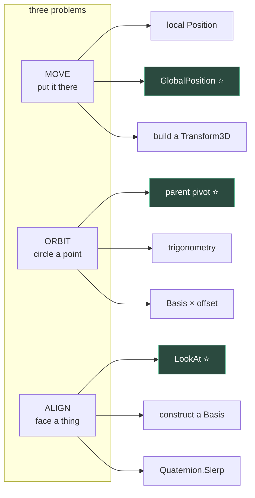

# Chapter 1.10 — Drill: Move, Orbit and Align Three Ways

**[X] Exercise set — closes block 1B**

🪜 **Scaffolding: 40 / 60.** The specification and the marker are given. The solutions are yours.

---

## 🎯 Goal

Nine small problems: **three tasks, three ways each.** A test harness marks them for you, so you get an answer rather than an opinion. Then you do them again against the clock.

**This is the first chapter that does not teach you anything new.** It makes what you already know *fast*, which is a different thing and needs its own session.

---

## 🏃 Fast-Track Summary

*Path C: build the harness, do one solution per task (M1, O1, A1), skip the timed round.*

- Build `DrillHarness.cs` — it asserts positions and orientations **within a tolerance** and prints ✅ / ❌.
- **Move:** by local position · by world position · by a transform you construct.
- **Orbit:** by parent pivot · by trigonometry · by rotating an offset vector with a `Basis`.
- **Align:** by `LookAt` · by building a `Basis` from axes · by slerping a `Quaternion`.
- Each way is *correct*. The drill is about knowing **which one you would reach for**, and being able to write it without looking it up.
- Commit: `ch 1.10: nine ways, all green`

---

## 🧭 Before you start

You need all of block 1B in your hands: [1.7](1.7_3DSpaceInGodot.md) (−Z forward), [1.8](1.8_Transform3D.md) (local vs global), [1.9](1.9_Rotations.md) (slerp, `LookAt`).

> 💡 **Do not re-read them first.** Attempt each problem cold, and only look back when you are stuck. **Finding out what you cannot yet do unaided is the point of a drill** — a drill you sail through taught you nothing except that you were ready for it.

---

## 🔨 Build

### Step 1 — Build the marker

New scene, `Node3D` root named `Drill`, saved as `scenes/Drill.tscn`. Attach:

```csharp
using Godot;

public partial class Drill : Node3D
{
    private int _pass, _fail;

    // --- the marker -------------------------------------------------------
    private void Check(string id, bool ok, string detail = "")
    {
        if (ok) { _pass++; GD.Print($"✅ {id}"); }
        else    { _fail++; GD.PrintErr($"❌ {id}  {detail}"); }
    }

    private void CheckPos(string id, Node3D n, Vector3 expected, float tol = 0.01f)
        => Check(id, n.GlobalPosition.DistanceTo(expected) <= tol,
                 $"got {n.GlobalPosition}, want {expected}");

    private void CheckFacing(string id, Node3D n, Vector3 target, float degTol = 1f)
    {
        Vector3 want    = (target - n.GlobalPosition).Normalized();
        Vector3 forward = -n.GlobalTransform.Basis.Z;
        float   deg     = Mathf.RadToDeg(forward.AngleTo(want));
        Check(id, deg <= degTol, $"off by {deg:F2}°");
    }

    private void Report()
        => GD.Print($"\n=== {_pass} passed, {_fail} failed ===");
}
```

> 🚨 **`CheckPos` uses a distance and a tolerance, not `==`.** [1.8](1.8_Transform3D.md) Step 2 showed you why: rotations produce values like `-1.31e-07` where you expected `0`. **A test that compares floats exactly fails on correct answers**, and then you debug the solution instead of the test. `CheckFacing` compares an *angle between directions* for the same reason — and because two different bases can point the same way.

Add a `MeshInstance3D` child named `Subject` (a small `BoxMesh`) — that is the thing you will be moving.

### Step 2 — Task M: move it there

**Specification.** `Subject` starts at the origin. Put it at world `(2, 1, -3)`, three ways. `Pivot` is a `Node3D` parent you may add, **rotated `(0, 40, 0)`** — chosen so local and global differ and a wrong answer is visible.

| ID | Constraint |
|---|---|
| **M1** | Write to the node's **local** `Position`. The parent is rotated, so compute what local value lands you there. |
| **M2** | Write to `GlobalPosition`. One line. |
| **M3** | Do not write any position property. Build a `Transform3D` and assign `GlobalTransform`. |

```csharp
    public override void _Ready()
    {
        var subject = GetNode<Node3D>("Pivot/Subject");
        var target  = new Vector3(2, 1, -3);

        // M1 — your code here

        CheckPos("M1", subject, target);

        // ... M2, M3 the same way, resetting between each
        Report();
    }
```

> 💡 **M1 is the one that teaches.** If you find yourself wanting `Pivot.GlobalTransform.AffineInverse() * target`, you have understood [1.8](1.8_Transform3D.md) properly. If you find yourself guessing numbers until it goes green, that is worth knowing too — go back and re-read [1.8](1.8_Transform3D.md)'s Step 3, then return.

### Step 3 — Task O: orbit it

**Specification.** `Subject` circles the world origin at **radius 4**, in the XZ plane, at **45°/second**, counter-clockwise seen from above ([1.7](1.7_3DSpaceInGodot.md)).

| ID | Constraint |
|---|---|
| **O1** | A rotating parent `Node3D`. `Subject` itself never moves. |
| **O2** | Trigonometry. Compute the position each frame from an accumulated angle. No parent. |
| **O3** | No trigonometry, no parent. Rotate an offset **vector** with a `Basis` and add it. |

Mark it by sampling: after exactly 2 seconds it must be **90°** around from where it began.

```csharp
    private float _elapsed;
    private bool  _sampled;

    public override void _Process(double delta)
    {
        // ... your orbit code ...

        _elapsed += (float)delta;
        if (!_sampled && _elapsed >= 2f)
        {
            _sampled = true;
            CheckPos("O", GetNode<Node3D>("Subject"), new Vector3(0, 0, -4), 0.15f);
        }
    }
```

> ⚠️ **The tolerance is deliberately loose — `0.15`.** You are sampling on whichever frame first crosses two seconds, so you overshoot by up to one frame of travel. **A drill whose marker is stricter than its measurement is a drill that fails correct code**, and you would spend the session hunting a bug in the harness. Working out *how loose is honest* is itself the exercise: at 45°/s and radius 4, one 60 fps frame is about 0.05 units.

**O3 is the interesting one.** `Basis` has a constructor taking an axis and an angle `[UNVERIFIED]`; a basis multiplied by a vector rotates it. Two lines, no `Sin`, no `Cos` — and it generalises to any axis, which is why it is worth having in your hands.

### Step 4 — Task A: align it

**Specification.** `Subject` faces the `Marble` — that is, its **−Z** points at the marble's global position.

| ID | Constraint |
|---|---|
| **A1** | `LookAt`. One line. |
| **A2** | No `LookAt` and no `LookingAt`. Construct a `Basis` from three orthonormal vectors you compute. |
| **A3** | Approach the target orientation over ~0.5 s with `Quaternion.Slerp`, framerate-independently. |

Mark with `CheckFacing("A1", subject, marble.GlobalPosition)`.

> 💡 **A2 is the one worth struggling with.** You want forward, then a right perpendicular to forward and world up, then a true up. `Vector3.Cross` and `.Normalized()` are the whole toolkit, and **the order and sign of the cross products decide whether you get the right answer or a mirror of it** ([1.7](1.7_3DSpaceInGodot.md)'s handedness, made concrete). Godot's `Basis` constructor takes the columns X, Y, Z in that order `[UNVERIFIED]` — and [1.7](1.7_3DSpaceInGodot.md) told you that Z is **back**, not forward. That single fact is the difference between A2 passing and A2 pointing exactly backwards.

### Step 5 — All green

Run until you see:

```
✅ M1  ✅ M2  ✅ M3
✅ O1  ✅ O2  ✅ O3
✅ A1  ✅ A2  ✅ A3

=== 9 passed, 0 failed ===
```

### Step 6 — ⭐ The timed round

The drill proper. **Delete all nine solutions.** Keep the harness.

Now redo them, timing each task with a stopwatch. Target: **under 5 minutes per task**, all three ways, no documentation.

Record in [`Journal.md`](../../../meta/Journal.md):

| Task | First attempt | Timed round | Looked anything up? |
|---|---|---|---|
| M | | | |
| O | | | |
| A | | | |

> 💡 **Deleting work you just wrote feels wasteful and is the entire method.** The first pass was problem-solving; the second is retrieval, and retrieval is what makes something available to you later, at speed, while you are thinking about something else. **Nothing in the next 330 chapters wants you thinking about `Basis` constructors** — they want you thinking about the game.

### Step 7 — Commit

```bash
git add .
git commit -m "ch 1.10: nine ways, all green"
git push
```

---

## ▶️ Run it

- [ ] Harness prints ✅/❌ and a final tally
- [ ] All nine green
- [ ] M1 solved by transforming the point, not by guessing numbers
- [ ] O3 has no `Sin` or `Cos`
- [ ] A2 has no `LookAt`, and points **at** the marble, not away
- [ ] A3 tested at two framerates
- [ ] Timed round done, six numbers recorded

---

## 👀 Observe

Look at your two columns. The gap between them is not a measure of intelligence — it is a measure of **retrieval**, and it is the thing that separates someone who *knows* Godot from someone who can *use* it.

Now look at which task was slowest. It is usually **A**, because alignment is where all three of block 1B's ideas meet at once: a direction (1.7), a basis (1.8) and an interpolation (1.9). **A slow task is a diagnosis, not a verdict** — it names the chapter to revisit, and revisiting one chapter beats re-reading three.

And note what the harness gave you that reading could not: **an answer**. Every chapter so far ended with "check yourself" questions you marked in your own head. This one marked you. That difference is why Module 5's optimisation work and Module 11's playtesting are built on measurement rather than judgement — **you cannot see your own blind spot by looking harder.**

---

## 🧠 Why it works

### Why three ways, when one would do

Because in real work you rarely get to choose freely. The parent is already rotated; the object is already parented; the value arrives as a quaternion from an animation. **Knowing only one route means those situations stop you**, and you fall back to the route you know by fighting the scene into a shape that suits it — extra pivot nodes, transforms in code that contradict the editor, and a scene nobody else can read.

| Task | Reach for | When you cannot |
|---|---|---|
| Move | `GlobalPosition` | Local, when a parent defines the layout |
| Orbit | Parent pivot ⭐ | Trig or basis, when you may not add nodes |
| Align | `LookAt` | Basis when you need roll control; slerp when it must be smooth |

**The starred ones are what you should reach for by default** — the editor-visible, artist-editable option. Code that a designer can see and adjust in the Inspector beats code that only you can change ([1.5](../1A/1.5_TuningWithoutRecompiling.md)).

> 🔬 **Deep dive — why O1 is usually right.** Nesting under a rotating parent costs one node and no per-frame code of yours. The engine already walks the tree and multiplies transforms ([1.8](1.8_Transform3D.md)); your orbit is free inside work that happens regardless. O2 adds a `Sin` and a `Cos` per object per frame, and — worse — puts the object's motion in a script where an artist cannot see it. **Prefer the version the engine already does for you**, which is a theme that returns hard in Module 5's performance work.

---

## 🗺️ Mental model



---

## 💥 Break it

1. Change `CheckPos`'s tolerance to `0f` and re-run all nine.
2. Restore. In `CheckFacing`, compare `n.GlobalTransform.Basis.Z` to `want` instead of `-...Basis.Z`. Which tasks now "pass"?
3. Restore. Make `Pivot`'s scale `(2, 1, 1)` and re-run **M1** and **A2**.

---

## 🔎 Diagnose

**One of these turns your marker into a liar. Answer before opening.**

<details>
<summary>Answer</summary>

**1 — Zero tolerance.** Tasks fail that are visibly correct, because a rotation through 40° leaves `1e-07` residue ([1.8](1.8_Transform3D.md)). **The code is right and the test is wrong**, and you would spend an hour on the solution. **Every float comparison in a game needs a tolerance chosen to match the physical thing being measured** — and "how loose is honest?" is a judgement, as Step 3's 0.15 showed.

**2 — Wrong sign in the marker.** 🚨 **This is the liar.** Now the checks pass when the subject faces **exactly away**. Your solutions did not change; the marker's definition of correct did. The output still says nine green, and the scene visibly shows a box facing the wrong way — **and you would believe the printout over your eyes**, because the printout is the thing you built to be trusted.

**A test is a claim, and a claim can be wrong.** Nothing checks the checker except your own attention. This is why [11.11](../../../TableOfContents.md)'s playtesting protocol makes you watch a player rather than only reading their score, and why Module 5 asks for a screenshot alongside every framerate number. **A green suite is evidence, not proof.**

**3 — Non-uniform parent scale.** [1.8](1.8_Transform3D.md)'s shear, now sabotaging your homework. M1's inverse-transform still lands the position correctly — positions survive shear fine. **A2's orthonormal basis does not**: you construct perpendicular unit vectors, the parent's scale skews them on the way to world space, and the result is neither the direction nor the roll you built. `[UNVERIFIED]` — exactly how far off. **The lesson is where it fails, not that it fails**: shear leaves *points* alone and destroys *frames*, which is precisely why it breaks models and colliders while positions keep looking fine.

**The ranking:**

| # | Effect | Danger |
|---|---|---|
| 1 | Correct code marked wrong | Wastes an hour |
| 2 | **Wrong code marked right** | 🚨 Ships |
| 3 | Right code, sabotaged scene | Teaches where shear bites |

**False failures cost time; false passes cost releases.** When you write a test, spend your scepticism on whether it can fail — the fastest check is to break the code on purpose and confirm the test notices. Do that now with #2 restored: point the subject 90° off and confirm A1 goes red.

</details>

---

## 🏋️ Practicals

**⭐ P1 — The fourth way.** For any one task, find a route the chapter did not list — a `Tween`, `Transform3D.InterpolateWith`, a `RemoteTransform3D` node `[UNVERIFIED]`. Make it pass the same marker. **Then argue in one paragraph whether it is better than the three given**, and for what.

**⭐ P2 — Break your own harness deliberately.** Introduce a wrong answer for each of the nine and confirm the marker catches all nine. **Any check that cannot fail is not a check** — record whether all nine actually went red.

**P3 — Retire the drill properly.** A week from now, delete the solutions and redo all nine, cold. Add a third column to your table. **Spaced repetition is the only version of this that sticks**, and one week is roughly the right gap.

**🔬 P4 — Port a task to GDScript.** Take task O and write all three ways in GDScript ([0.10](../../module0/0B/0.10_GDScriptFirstContact.md)). Time yourself, and add the numbers to your [0.14](../../module0/0B/0.14_LanguageDecisionTable.md) decision table. **Real evidence for a table you have so far filled with two data points.**

---

## ✅ Check yourself

1. Why does `CheckPos` use a distance and a tolerance instead of `==`?
2. Why is O1 usually the right choice in production?
3. In A2, which single fact decides between facing the target and facing away?
4. Why delete working solutions and redo them?
5. Which is worse — a test that fails correct code, or one that passes wrong code?

<details>
<summary>Answers</summary>

1. Because rotation produces floating-point residue like `-1.3e-07` where you expect `0`, so exact comparison **fails correct answers** and sends you debugging the solution instead of the test.
2. Because the engine already walks the tree and multiplies transforms, so a rotating parent costs **no per-frame code of your own** — and it stays **visible and editable in the editor**, where a designer can change it.
3. That **`Basis.Z` is back, not forward** ([1.7](1.7_3DSpaceInGodot.md)). Build the basis with your computed forward in the Z column unchanged and the subject faces exactly away.
4. Because the first pass is **problem-solving** and the second is **retrieval** — and retrieval is what makes something available later, at speed, while you are thinking about the game instead of about `Basis`.
5. **Passing wrong code**, decisively. A false failure costs an hour; a false pass ships. Which is why the fastest thing to do with a new test is break the code on purpose and confirm it notices.

</details>

---

## 📎 Cheat sheet

| Move | |
|---|---|
| World point → local | `parent.GlobalTransform.AffineInverse() * p` |
| Set both at once | `GlobalTransform = new Transform3D(basis, origin)` |

| Orbit | |
|---|---|
| ⭐ Parent | `pivot.RotateY(rate * delta)` |
| Trig | `new Vector3(Cos(a), 0, Sin(a)) * r` |
| Basis | `new Basis(Vector3.Up, angle) * offset` |

| Align | |
|---|---|
| ⭐ Snap | `LookAt(target, Vector3.Up)` |
| Construct | forward, `Cross` for right, `Cross` for up — 🚨 **Z column is back** |
| Smooth | `Slerp` with `t = 1 - Exp(-k * delta)` |

| Testing | |
|---|---|
| Positions | distance ≤ tolerance |
| Directions | `AngleTo` ≤ degrees |
| 🚨 Never | `==` on floats, vectors or transforms |
| Always | Break the code and confirm the test goes red |

---

## 🔗 Further reading

- [Using transforms](https://docs.godotengine.org/en/stable/tutorials/3d/using_transforms.html)
- [`Basis`](https://docs.godotengine.org/en/stable/classes/class_basis.html) · [`Transform3D`](https://docs.godotengine.org/en/stable/classes/class_transform3d.html)

---

## 💾 Commit

```text
ch 1.10: nine ways, all green
```

---

## ➡️ What's next

**Block 1C — Physics**, starting with [1.11](../../../TableOfContents.md): the four body types, and why the marble is a `RigidBody3D` while the ramp is not. **Block 1B is complete** — you can put anything anywhere, pointing any way, in any parent, and you can prove it.

---

## 🪞 Reflection

In two sentences: **what did the harness tell you that your own judgement could not, and which of the three tasks was slowest — what does that name?**

---

## 📝 Chapter changelog

| Version | Date | Change |
|---|---|---|
| 1.0 | 2026-09-03 | First published. Closes block 1B. First chapter with an automated marker. `[UNVERIFIED]` on `Basis(axis, angle)`, column order and `RemoteTransform3D`. |
