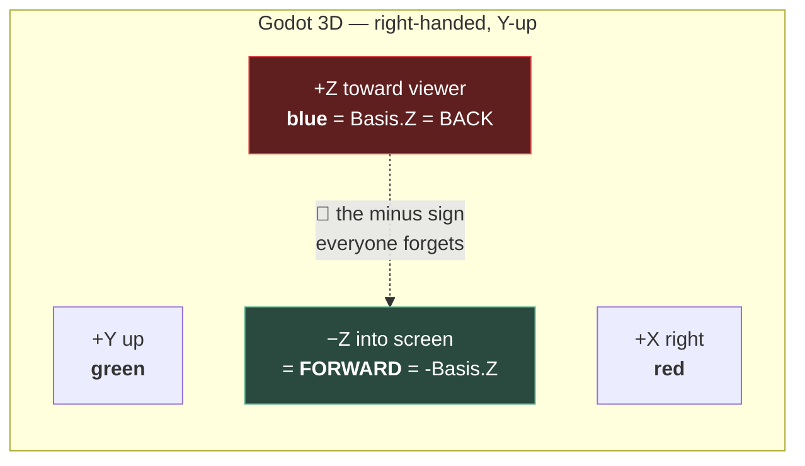

# Chapter 1.7 — 3D Space in Godot

**Right-handed, Y-up, −Z forward — and the mistakes that follow**

🪜 **Scaffolding: 80 / 20.** You will build a measuring instrument, then use it to answer questions I deliberately will not answer for you.

---

## 🎯 Goal

By the end you will have built a reusable **axis gizmo** and used it to *prove* which way is forward — rather than taking my word for it — and you will know why a Blender export sometimes arrives lying on its side.

---

## 🏃 Fast-Track Summary

*Path C: read this and the cheat sheet, do ⭐ P1, move on.*

- Godot 3D is **right-handed, Y-up**: **+X right, +Y up, +Z toward you.**
- So **forward is −Z.** Cameras look down their own −Z, and so does every node by convention.
- 🚨 **The forward vector is `-GlobalTransform.Basis.Z`.** The minus sign is not optional, and forgetting it is the single most common orientation bug in Godot.
- Axis colours are consistent everywhere in the editor: **X = red, Y = green, Z = blue.**
- **Rotation is right-handed**: right thumb along the axis, fingers curl the positive direction.
- ⚠️ **Godot 2D is Y-down.** Same engine, opposite convention — it will bite you in Module 2's UI.
- **Blender is Z-up; Godot is Y-up.** The glTF importer converts on import ([3.14](../../../TableOfContents.md)), which is why models usually arrive correct — and why unapplied rotations still cause trouble.
- Commit: `ch 1.7: axis gizmo, and which way is forward`

---

## 🧭 Before you start

| You need | From |
|---|---|
| P01 open, marble rolling | [1.6](../1A/1.6_NodesVsResources.md) |
| Saving a scene for reuse | [1.2](../1A/1.2_ScenesAndInstancing.md) |
| A script on a node | [1.4](../1A/1.4_YourFirstRealScript.md) |

---

## 🔨 Build

### Step 1 — Build a thing that tells you the truth

Rather than memorising a diagram, build an instrument.

1. **Scene → New Scene → Node3D**, rename it `AxisGizmo`. Save as `scenes/AxisGizmo.tscn`.
2. Add three `MeshInstance3D` children: `X`, `Y`, `Z`.
3. For each: **Mesh → New BoxMesh**, Size `(1, 0.05, 0.05)` for `X`. Position it at `(0.5, 0, 0)`.
   - `Y`: size `(0.05, 1, 0.05)`, position `(0, 0.5, 0)`
   - `Z`: size `(0.05, 0.05, 1)`, position `(0, 0, 0.5)`
4. Give each a `StandardMaterial3D` with **Albedo**: `X` red, `Y` green, `Z` blue.

> 💡 **Those are Godot's own axis colours** — the same red/green/blue you see on the editor's move gizmo, on the viewport grid, and on the `Transform` rows in the Inspector. **RGB maps to XYZ, in order.** That one mnemonic will save you more time than anything else in this chapter.

5. Add a fourth child: `MeshInstance3D` named `Forward`, **Mesh → New CylinderMesh**, Top Radius `0`, Bottom Radius `0.15`, Height `0.4` — a cone. Make it **white**.
6. Position it at `(0, 0, -0.8)` and set **Rotation** `x = 90°` so it points *away* from you `[UNVERIFIED]` — adjust until the tip aims down −Z.

> ⚠️ **Note what you just did.** The three bars are drawn along **positive** axes. The forward cone is at **negative** Z. That asymmetry is the whole chapter.

7. Save. Instance `AxisGizmo` into `Main.tscn` at the origin ([1.2](../1A/1.2_ScenesAndInstancing.md)).

### Step 2 — ⭐ Prove which way the camera looks

**Do not read ahead. Predict first, then test.**

1. In `Main.tscn`, set your `Camera3D`'s **Transform** to identity: position `(0, 0, 0)`, rotation `(0, 0, 0)`.
2. Add a `MeshInstance3D` with a `BoxMesh`, at position `(0, 0, -5)`.
3. **Write your prediction in [`Journal.md`](../../../meta/Journal.md): will you see the cube?**
4. `F6`.
5. Now move the cube to `(0, 0, +5)`. Predict again. `F6`.

You have just measured the single most useful fact in Godot 3D, and you did not have to trust anyone for it.

### Step 3 — Make the gizmo report its own forward

Attach `AxisGizmo.cs` to the gizmo root:

```csharp
using Godot;

public partial class AxisGizmo : Node3D
{
    [Export] public bool ReportOnReady { get; set; } = true;

    public override void _Ready()
    {
        if (!ReportOnReady) return;

        Basis b = GlobalTransform.Basis;
        GD.Print($"--- {Name} ---");
        GD.Print($"  right   (+X) = {b.X}");
        GD.Print($"  up      (+Y) = {b.Y}");
        GD.Print($"  back    (+Z) = {b.Z}");
        GD.Print($"  FORWARD (-Z) = {-b.Z}");
    }
}
```

Build, `F6`, read the Output panel. With no rotation you get the identity basis:

```
  right   (+X) = (1, 0, 0)
  up      (+Y) = (0, 1, 0)
  back    (+Z) = (0, 0, 1)
  FORWARD (-Z) = (0, -0, -1)
```

> 🚨 **`Basis.Z` is BACK, not forward.** Read that line again. Nearly every "my character runs backwards" and "my turret aims behind itself" bug in Godot is a missing minus sign right here. Godot gives you `Vector3.Forward`, and it equals `(0, 0, -1)` — the engine agrees with you, so use the constant rather than typing signs by hand.

### Step 4 — ⭐ Rotate it and predict, three times

Now use the instrument. **For each, write your prediction before running.**

| # | Set the gizmo's rotation to | Predict: where does the white cone point? |
|---|---|---|
| 1 | `(0, 90, 0)` | |
| 2 | `(0, -90, 0)` | |
| 3 | `(90, 0, 0)` | |

Set the rotation in the Inspector, run, read both the cone and the printed `FORWARD` line.

**The rule you are testing: rotation is right-handed.** Point your right thumb along the **positive** axis of rotation; your fingers curl in the direction of **positive** rotation. For Y (up), positive rotation turns **left** — counter-clockwise seen from above.

If your prediction for #1 was wrong, you are in the majority. Do #2 and #3 anyway, and see whether the rule now predicts them.

### Step 5 — Move along your own forward, not the world's

Add to `AxisGizmo.cs`:

```csharp
    [Export] public bool DriveForward { get; set; } = false;
    [Export(PropertyHint.Range, "0,10,0.1")] public float Speed { get; set; } = 2f;

    public override void _Process(double delta)
    {
        if (!DriveForward) return;

        // Its OWN forward — the third basis column, negated.
        Vector3 forward = -GlobalTransform.Basis.Z;
        GlobalPosition += forward * Speed * (float)delta;
    }
```

1. Tick `DriveForward`, leave rotation at zero, `F6`. It slides toward the camera's far side.
2. Stop. Set rotation `(0, 90, 0)`. `F6`. **It moves in a different world direction** — because "forward" turned with it.
3. Now change one line:

```csharp
        GlobalPosition += Vector3.Forward * Speed * (float)delta;   // the WORLD's forward
```

Run again with rotation `(0, 90, 0)`. **It moves the same way no matter how the gizmo is turned.**

> 💡 **Those two lines look almost identical and mean completely different things.** `-Basis.Z` is *this object's* forward; `Vector3.Forward` is *the world's*. Choosing between them is what [1.8](1.8_Transform3D.md) is entirely about — you have just met the question that chapter answers.

### Step 6 — The 2D exception, in sixty seconds

Do this once so it does not surprise you in Module 2.

1. New scene, `Node2D` root, add a `Sprite2D` with any texture.
2. Set its position to `(0, 100)`.

**It moves *down* the screen.** Godot 2D is **Y-down**, matching every screen coordinate system ever made; Godot 3D is **Y-up**, matching every 3D maths convention ever made. Both are right; they are answering different questions.

Delete the scene. You have seen it; that is enough.

### Step 7 — Commit

```bash
git add .
git commit -m "ch 1.7: axis gizmo, and which way is forward"
git push
```

---

## ▶️ Run it

- [ ] `AxisGizmo.tscn` exists, RGB = XYZ, white cone down −Z
- [ ] You **predicted before testing** in Step 2, and recorded both
- [ ] Output prints `FORWARD (-Z) = (0, -0, -1)` at zero rotation
- [ ] Three rotation predictions recorded, with which ones you got wrong
- [ ] You saw `-Basis.Z` and `Vector3.Forward` behave differently
- [ ] You have seen 2D's Y go down

---

## 👀 Observe

Count your wrong predictions in Step 4. Most people miss at least one, and there is no shame in it — but notice **what** the misses have in common. Almost always it is a **sign**, not a magnitude. Nobody predicts that rotating 90° will move something 3 metres. They predict the correct axis and the wrong direction.

That is why this chapter builds an instrument instead of showing a diagram. **Orientation bugs are sign bugs, signs are invisible in code, and the only reliable defence is being able to look.** Chapter [1.11b](../../../TableOfContents.md) adds Debug Draw 3D so you can draw these vectors in the running game — the same instinct, better tools.

---

## 🧠 Why it works

### Right-handed, and what "handed" means

Hold your right hand out: thumb = **+X**, index = **+Y**, middle finger bent toward you = **+Z**. That is Godot's 3D space, and it is the same convention as OpenGL, Blender, Maya and most maths.

The consequence that catches everyone: **with +Z pointing at the viewer, "into the screen" is −Z.** So forward — the direction a camera faces and a character walks — is negative. It is not an arbitrary choice; it falls out of insisting on a right-handed system with Y up.

### Basis columns are the object's own axes

`Transform3D` has two parts, and [1.8](1.8_Transform3D.md) covers them properly. What matters here:

| Column | Is | Watch out |
|---|---|---|
| `Basis.X` | the object's **right** | |
| `Basis.Y` | the object's **up** | |
| `Basis.Z` | the object's **back** | 🚨 **not forward** |

So `-Basis.Z` is forward, and this is *rotation-aware for free*: rotate the node and the basis rotates with it. You never do trigonometry to find where something is facing.

> 🔬 **Deep dive — why the engine keeps a basis instead of three angles.** A `Basis` is a 3×3 matrix whose columns are those axes. Storing orientation this way makes "which way am I facing" a **column read** rather than a computation, makes combining rotations a matrix multiply, and — critically — has no gimbal lock, which is exactly the failure [1.9](1.9_Rotations.md) makes you reproduce on purpose. Euler angles in the Inspector are a *human-facing convenience* converted to a basis on the way in and back on the way out. **The Inspector's three rotation numbers are not what the engine stores.**

### Blender is Z-up

| | Up | Forward |
|---|---|---|
| **Godot 3D** | +Y | −Z |
| **Blender** | +Z | −Y |
| **Godot 2D** | −Y (down) | n/a |

Godot's glTF importer applies the conversion, so a correctly exported model arrives upright. When one *does* arrive on its side, the cause is almost never the importer — it is an unapplied rotation in Blender, and [3.14](../../../TableOfContents.md) drills the `Ctrl+A` habit that prevents it.

---

## 🗺️ Mental model



---

## 💥 Break it

1. In Step 5, delete the minus: `Vector3 forward = GlobalTransform.Basis.Z;`. Run with rotation `(0, 0, 0)`, then `(0, 180, 0)`.
2. Restore it. Now set the gizmo's **scale** to `(1, 1, -1)` and run. Watch the cone, the printed vectors, and the *lighting on the bars*.
3. Restore. Add a `Camera3D` as a **child** of the gizmo at `(0, 0, 0)`, tick `DriveForward`, and run.

---

## 🔎 Diagnose

**Which of these is the one you could ship without noticing? Answer before opening.**

<details>
<summary>Answer</summary>

**1 — Missing minus.** It moves backwards. Obvious at zero rotation... except that at `(0, 180, 0)` it moves **the way you wanted**, because 180° flips the sign back. **A bug that is correct for exactly one orientation** is the worst kind: you fix your test scene by rotating the object, ship it, and it fails everywhere else.

**2 — Negative scale.** This is the one that ships. A `-1` scale on Z **mirrors** the object. The cone still looks like it points forward, the printed forward vector looks plausible — but the basis is now **left-handed**, so cross products reverse, and **normals point inward, so lighting goes wrong**. Symptoms appear far from the cause: faces lit from the wrong side, culling inverted, physics behaving oddly. `[UNVERIFIED]` — exactly which of those you see. **Never use negative scale to mirror.** Rotate 180°, or mirror the mesh in Blender and apply the transform ([3.14](../../../TableOfContents.md)).

**3 — Camera as a child.** The camera moves with the gizmo, so the gizmo appears **frozen in the centre of the screen while the world slides past**. Nothing is broken; your frame of reference moved. It is worth feeling once, because it is the mechanism behind every third-person camera you will build in [1.19](../../../TableOfContents.md) — and behind the "my player won't move" reports that turn out to be a camera parented to the player.

**The ranking, and the pattern:**

| # | Wrong at | Found |
|---|---|---|
| 1 | every orientation but one | quickly, unless you tested at 180° |
| 2 | **all of them, subtly** | 🚨 weeks later, as a lighting bug |
| 3 | nothing — it is correct | immediately, and confusingly |

**#2 is the dangerous one because its symptom is not an orientation symptom.** You would go looking at materials and lights, and the cause is a `-1` typed into a scale field. This is [1.6](../1A/1.6_NodesVsResources.md)'s lesson wearing different clothes: **the failure that does not announce itself is the expensive one**, and the defence is knowing which operations are quietly destructive. Negative scale is one. Keep the list.

</details>

---

## 🏋️ Practicals

**⭐ P1 — Predict ten, check ten.** Write ten rotations of the gizmo — including two-axis ones like `(45, 45, 0)` — and predict the resulting `FORWARD` vector's **signs** for each. Run and score yourself. **Signs only; nobody expects you to do the trigonometry.**

**P2 — A gizmo you will actually keep.** Add an exported `bool ShowLabels` that spawns `Label3D` children reading "X" "Y" "Z" "FWD" `[UNVERIFIED]`. You will use this scene in Module 4's rigging chapters and Module 8's camera work — build it well now.

**P3 — Point the spinner.** Add an `AxisGizmo` as a child of your `SpinPlatform` and watch the forward vector rotate. Predict what the printed value does when you make it spin — **including whether `_Ready`'s single print can show it at all** ([1.3](../1A/1.3_TheSceneTree.md)).

**🔬 P4 — Find the conversion.** Export a cube from Blender with a distinctive orientation, import it, and determine empirically whether Godot rotated the **node** or the **mesh data**. The answer tells you where to look when an import arrives wrong. Record it — [3.14](../../../TableOfContents.md) will ask.

---

## ✅ Check yourself

1. Which way is forward, and what is the expression for it?
2. Why is forward negative? Is that arbitrary?
3. What do the editor's red, green and blue gizmo arrows mean?
4. Which way does a positive Y rotation turn, and how do you work it out without looking it up?
5. Why is negative scale worse than a wrong sign?

<details>
<summary>Answers</summary>

1. **−Z.** `-GlobalTransform.Basis.Z`, or the constant `Vector3.Forward` which equals `(0, 0, -1)`. `Basis.Z` on its own is **back**.
2. **Not arbitrary — it falls out of a right-handed system with Y up.** Fix +X right and +Y up, and right-handedness forces +Z toward the viewer, so "into the screen" is −Z.
3. **X, Y, Z in RGB order** — red X, green Y, blue Z. The same mapping on the move gizmo, the grid and the Inspector's transform rows.
4. **Counter-clockwise seen from above** — it turns left. Right-hand rule: thumb along +Y (up), fingers curl the positive direction.
5. Because a sign error is wrong in an **obvious, directional** way, while negative scale makes the basis **left-handed** — normals invert, lighting and culling go wrong, and **the symptom does not look like an orientation problem at all.** You would debug materials for a week. Mirror by rotating 180° or in Blender with the transform applied.

</details>

---

## 📎 Cheat sheet

| Direction | Vector | From a node |
|---|---|---|
| Right | `Vector3.Right` `(1,0,0)` | `Basis.X` |
| Up | `Vector3.Up` `(0,1,0)` | `Basis.Y` |
| **Forward** | `Vector3.Forward` `(0,0,-1)` | 🚨 `-Basis.Z` |
| Back | `Vector3.Back` `(0,0,1)` | `Basis.Z` |

| Fact | |
|---|---|
| Colours | **R→X, G→Y, B→Z** everywhere in the editor |
| Rotation | **Right-handed** — thumb along +axis, fingers curl positive |
| +Y rotation | Counter-clockwise from above = turns **left** |
| Cameras | Look down their own **−Z** |
| **2D** | ⚠️ **Y is DOWN** |
| Blender | **Z-up, −Y forward** — glTF import converts |
| Negative scale | 🚨 Never. Mirrors handedness, breaks normals |

---

## 🔗 Further reading

- [Introduction to 3D](https://docs.godotengine.org/en/stable/tutorials/3d/introduction_to_3d.html)
- [Using transforms](https://docs.godotengine.org/en/stable/tutorials/3d/using_transforms.html)
- [`Vector3`](https://docs.godotengine.org/en/stable/classes/class_vector3.html) — switch to C#

---

## 💾 Commit

```text
ch 1.7: axis gizmo, and which way is forward
```

---

## ➡️ What's next

**[1.8 — Transform3D, Basis, and local vs global](1.8_Transform3D.md).** You met the question in Step 5 — *my forward or the world's?* Next: the type that answers it, and why setting position and rotation separately is sometimes a bug.

---

## 🪞 Reflection

In two sentences: **why is forward negative, and what did your wrong predictions in Step 4 have in common?**

---

## 📝 Chapter changelog

| Version | Date | Change |
|---|---|---|
| 1.0 | 2026-09-03 | First published. Opens block 1B. `[UNVERIFIED]` on cone orientation, `Label3D` behaviour and negative-scale symptoms. |
