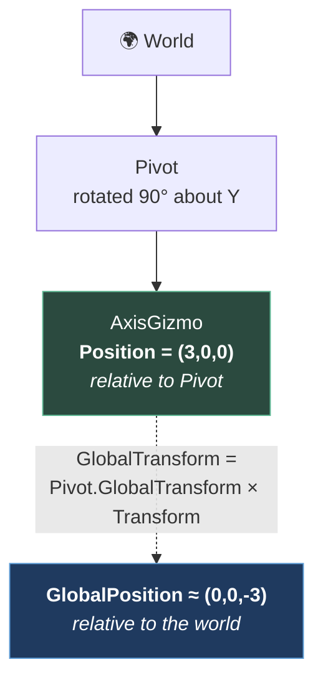

# Chapter 1.8 — `Transform3D`, `Basis`, and Local vs Global

🪜 **Scaffolding: 80 / 20.**

---

## 🎯 Goal

By the end you will be able to answer, for any node in any scene, **"relative to what?"** — and you will have watched a parent's scale quietly destroy a child's shape.

---

## 🏃 Fast-Track Summary

*Path C: read this and the cheat sheet, do ⭐ P1 and ⭐ P3, move on.*

- Every `Node3D` has one `Transform3D` = **`Basis` (3×3: rotation + scale) + `Origin` (position)**.
- 🚨 **Every transform property comes in two flavours**, and choosing wrong is the most common bug in this chapter:

  | Local — *relative to the parent* | Global — *relative to the world* |
  |---|---|
  | `Position` `Rotation` `Scale` `Basis` `Transform` | `GlobalPosition` `GlobalRotation` `GlobalBasis` `GlobalTransform` |

- **With no parent — or a parent at identity — they are equal.** That is why the distinction stays invisible until the day it bites.
- `Position` is `Transform.Origin`. Same storage, two names.
- ⭐ **Set a whole `Transform` at once** when you mean "put it exactly here, facing exactly there": `GlobalTransform = new Transform3D(basis, origin)`.
- `Translated()` moves along **world** axes; `TranslatedLocal()` moves along **its own** ([1.7](1.7_3DSpaceInGodot.md)'s Step 5, now with a name).
- 🚨 **Never scale a parent non-uniformly.** Rotate a child inside it and the child **shears** — a bug that looks like a broken model.
- Commit: `ch 1.8: local vs global, and the shear`

---

## 🧭 Before you start

| You need | From |
|---|---|
| `AxisGizmo.tscn` | [1.7](1.7_3DSpaceInGodot.md) |
| Parent/child node relationships | [1.1](../1A/1.1_Nodes.md) |
| `_Ready` vs `_Process` | [1.3](../1A/1.3_TheSceneTree.md) |

---

## 🔨 Build

### Step 1 — Make the difference visible

1. In `Main.tscn`, add a `Node3D` named `Pivot` at the origin.
2. Drag your `AxisGizmo` instance to be a **child** of `Pivot`.
3. Set the gizmo's **Position** to `(3, 0, 0)`. It sits three metres to the right.
4. Now set **`Pivot`'s** rotation to `(0, 90, 0)`.

**The gizmo moved** — but look at its Inspector. Its `Position` still reads `(3, 0, 0)`.

> 💡 **Nothing is wrong.** `Position` means *"three metres along my parent's X"*, and the parent turned. The gizmo did not move relative to its parent at all; the parent moved relative to the world.

### Step 2 — ⭐ Print both, and fill in the table yourself

Add to `AxisGizmo.cs`:

```csharp
    public override void _Ready()
    {
        if (!ReportOnReady) return;

        GD.Print($"--- {Name} ---");
        GD.Print($"  Position       = {Position}");
        GD.Print($"  GlobalPosition = {GlobalPosition}");
        GD.Print($"  Rotation°      = {RotationDegrees}");
        GD.Print($"  GlobalRotation°= {GlobalRotationDegrees}");
        GD.Print($"  forward (-Z)   = {-GlobalTransform.Basis.Z}");
    }
```

Run once for each row. **Predict `GlobalPosition` before each run.**

| `Pivot` rotation | gizmo `Position` | predict `GlobalPosition` | actual |
|---|---|---|---|
| `(0, 0, 0)` | `(3, 0, 0)` | | |
| `(0, 90, 0)` | `(3, 0, 0)` | | |
| `(0, 180, 0)` | `(3, 0, 0)` | | |
| `(0, 90, 0)` | `(0, 0, -3)` | | |

> ⚠️ **Expect small numbers like `-1.31134e-07` instead of a clean `0`.** That is floating-point rounding through a sine, not an error. **Never compare transforms with `==`**; use `Mathf.IsEqualApprox` or `Vector3.IsEqualApprox`. This will matter every time you test whether something has arrived somewhere.

### Step 3 — Write to global, read the local

With `Pivot` rotated `(0, 90, 0)`, add a one-shot:

```csharp
    [Export] public bool SnapToWorldOrigin { get; set; } = false;

    public override void _Ready()
    {
        // ... the prints above ...
        if (SnapToWorldOrigin)
        {
            GlobalPosition = new Vector3(0, 2, 0);       // I want it HERE, in the world
            GD.Print($"  after: Position={Position}  GlobalPosition={GlobalPosition}");
        }
    }
```

Tick it and run. **`GlobalPosition` is exactly what you asked for; `Position` is something you never typed.** Godot solved for the local value that puts the node at that world point given its parent.

That is the whole mechanism: **the two are different views of one stored value**, and writing either one updates the other.

### Step 4 — The two ways to move

```csharp
    [Export] public bool UseLocalTranslate { get; set; } = false;

    public override void _Process(double delta)
    {
        if (!DriveForward) return;
        float step = Speed * (float)delta;

        if (UseLocalTranslate)
            TranslateObjectLocal(Vector3.Forward * step);   // along ITS OWN forward
        else
            GlobalTranslate(Vector3.Forward * step);        // along the WORLD's forward
    }
```

Run each with the gizmo rotated `(0, 45, 0)`. **Two different paths.** `TranslateObjectLocal` is [1.7](1.7_3DSpaceInGodot.md) Step 5's `-Basis.Z` idea, packaged.

> 💡 **`TranslateObjectLocal` is what you want for a vehicle, a character or a projectile** — anything that moves the way it is pointing. `GlobalTranslate` is for wind, conveyor belts and gravity.

### Step 5 — Set a whole transform at once

Sometimes you want position *and* orientation in one statement, with no intermediate frame where the object is half-placed:

```csharp
    public void PlaceLookingAt(Vector3 where, Vector3 target)
    {
        GlobalTransform = new Transform3D(Basis.Identity, where)
            .LookingAt(target, Vector3.Up);
    }
```

> 🚨 **This matters more than it looks.** Setting `GlobalPosition` and then `GlobalRotation` on separate lines produces **one frame** — or, worse, one physics tick — in which the object is at the new place with the old rotation. Most of the time you never see it. In a camera, a projectile spawn, or anything that reads transforms in `_PhysicsProcess`, you see it as a **one-frame flicker or a wrong-direction shot**, and you will not connect it to two innocuous assignment lines. `LookingAt` also fails if `where` equals `target` — the direction is undefined `[UNVERIFIED]`.

### Step 6 — ⭐ Break a model with a parent

This is the step to remember.

1. Set `Pivot`'s **Scale** to `(3, 1, 1)` — non-uniform, only X.
2. Set the gizmo's own **Rotation** to `(0, 45, 0)`.
3. Look at it in the viewport.

**The bars are no longer square, and no longer at right angles to each other.** Nothing is scaled *or* rotated the way you asked. The gizmo has been **sheared**.

4. Now set `Pivot`'s scale to `(3, 3, 3)` — uniform. The gizmo is three times bigger and still correct.

> 🚨 **Non-uniform scale plus rotation equals shear.** A stretch along the parent's X applied to a child that is turned 45° stretches it diagonally, and there is no rotation-and-scale that describes the result. This is why the working rule in production is: **scale meshes in Blender, not nodes in Godot** ([3.14](../../../TableOfContents.md)) — and why `Ctrl+A → Apply Scale` is drilled so hard in the Blender track.

### Step 7 — Commit

```bash
git add .
git commit -m "ch 1.8: local vs global, and the shear"
git push
```

---

## ▶️ Run it

- [ ] Gizmo's `Position` stays `(3,0,0)` while `GlobalPosition` changes
- [ ] Four-row table predicted **and** filled
- [ ] You saw near-zeros like `-1.3e-07` and know not to use `==`
- [ ] `SnapToWorldOrigin` produced a `Position` you never typed
- [ ] `TranslateObjectLocal` and `GlobalTranslate` traced different paths
- [ ] **You made the gizmo shear, and know which parent scale did it**

---

## 👀 Observe

In Steps 1 and 2 nothing was broken and nothing printed a warning — the gizmo simply was not where a reasonable person expected. That is what a local/global mistake looks like every time: **not an error, a discrepancy.**

Now notice the condition under which it hides. With no parent, or a parent at identity, `Position` and `GlobalPosition` are **identical**. So the bug is absent throughout the early scene where you would have caught it, and appears the day you put your object inside something rotated — usually weeks later, in someone else's scene.

**Ask "relative to what?" as a reflex**, especially when reading a number out of the Inspector. The Inspector shows **local** values. It has been showing you local values in every chapter so far, and until this one it made no difference.

---

## 🧠 Why it works

### One value, two views

`Transform3D` is a `Basis` and an `Origin`:

```
Transform3D
├── Basis   3×3   columns are the object's X, Y, Z axes — rotation AND scale
└── Origin  Vec3  position
```

`Position` **is** `Transform.Origin` — the same storage under a shorter name. `Rotation` and `Scale` are *decoded* from the basis on read and *encoded* on write.

**Global values are computed, not stored.** A node's `GlobalTransform` is every ancestor's transform multiplied down the chain:

```
GlobalTransform = parent.GlobalTransform * Transform
```

That single line explains everything in this chapter. Writing `GlobalPosition` makes Godot solve that equation backwards for the local value, which is why Step 3's `Position` was a number you never typed.

> 🔬 **Deep dive — why rotation and scale live in one matrix.** A basis stores three axis vectors. Rotating turns them; scaling lengthens them. Both are just "what are my axes now", so one 3×3 holds both — which is why combining transforms is a multiply, and why the engine reads a facing direction as a column ([1.7](1.7_3DSpaceInGodot.md)).
>
> **And it is exactly why shear is possible.** Not every 3×3 decomposes into a rotation and a scale; the matrix is more general than the two concepts you are using to think about it. A non-uniform parent scale composed with a child rotation lands you outside that subset, and the Inspector then shows you rotation and scale numbers that **cannot reproduce what you are seeing** — the engine is reporting the closest decomposition it can find. `[UNVERIFIED]` — exactly what Godot 4 displays for a sheared node.

### Which to use

| You mean | Use |
|---|---|
| Offset from my parent, an editor-authored layout | `Position` |
| A point in the world, a distance to another object | `GlobalPosition` |
| Move the way I am facing | `TranslateObjectLocal` |
| Move along world axes | `GlobalTranslate` |
| Place and aim in one operation | `GlobalTransform = …` |

**Distances and directions between two objects are always global.** `a.Position.DistanceTo(b.Position)` is meaningless unless they share a parent — and it will happen to be right while they do.

---

## 🗺️ Mental model



---

## 💥 Break it

1. Un-parent the gizmo from `Pivot` (drag it to the root) **without** changing anything. Where does it go?
2. Re-parent it. Now, with `Pivot` rotated `(0, 90, 0)`, write `Position = new Vector3(0, 5, 0);` in `_Ready` and predict where it lands **before** running.
3. Set `Pivot`'s scale to `(2, 0.5, 1)` and give the gizmo a `CollisionShape3D` with a `SphereShape3D` `[UNVERIFIED]`. Compare the drawn shape against the mesh.

---

## 🔎 Diagnose

**One of these three has no visible symptom at all until something collides. Answer before opening.**

<details>
<summary>Answer</summary>

**1 — Un-parenting.** The node keeps its **local** `Position` `(3,0,0)`, which now means three metres along the *world's* X. **It jumps.** Godot offers `Reparent(newParent, keepGlobalTransform: true)` `[UNVERIFIED]` for exactly this, and dragging in the editor does preserve the visual position. **Doing it from code without thinking does not** — which is the bug you will hit in [1.14](../../../TableOfContents.md) when a collected coin is reparented to the player.

**2 — Writing local when you meant world.** With the pivot at 90°, `Position = (0,5,0)` puts it 5 up — Y survives a Y-rotation unchanged, so this one *looks* correct. **Change the pivot's rotation to `(90, 0, 0)` and the same line sends it sideways.** A line that is right for one parent orientation and wrong for others is [1.7](1.7_3DSpaceInGodot.md)'s missing-minus-sign again: **correct in the test scene, wrong in the game.**

**3 — Non-uniform scale on a collision shape.** 🚨 **This is the one with no visible symptom.** The *mesh* stretches, so the object looks the way you intended. But physics shapes are not arbitrary meshes — a sphere has one radius, and it **cannot** represent an ellipsoid. Godot must pick something. `[UNVERIFIED]` — whether it takes one axis, an average, or warns. Either way **the collider stops matching the visuals**, and you have [1.1](../1A/1.1_Nodes.md)'s mismatched-collider bug delivered by a parent node you were not looking at.

**The ranking:**

| # | Symptom | Found |
|---|---|---|
| 1 | Object jumps | Instantly |
| 2 | Wrong place, for some parent rotations | When the scene changes |
| 3 | **None — until something collides wrongly** | 🚨 Playtesting, or never |

**#3 is why the rule is "never scale nodes non-uniformly" rather than "be careful with scale".** A rule with an exception you have to evaluate every time is a rule you will get wrong under deadline; a flat rule costs you nothing, because the correct place to scale a model is Blender, where the scale is baked into the vertices and no node needs to carry it.

**Three chapters, one shape.** [1.6](../1A/1.6_NodesVsResources.md)'s shared resource, [1.7](1.7_3DSpaceInGodot.md)'s negative scale, and now non-uniform scale: **each is a legal operation whose damage shows up somewhere else entirely.** You cannot find these by reading the code that failed. You find them by knowing the short list of operations that do this — so keep the list, and add to it as the course goes.

</details>

---

## 🏋️ Practicals

**⭐ P1 — The orbit, twice.** Make the gizmo orbit a point, first by rotating a parent `Pivot`, then with no parent at all by computing `GlobalPosition` yourself each frame. Both should look identical. **Then rotate the whole rig 30° about Z and run both again** — and explain why only one still works.

**P2 — Relative-to-what audit.** Go through every script in P01. For each transform property, write down which flavour it is and whether that is what you meant. `Marble.cs`'s `_spawnPoint` is the interesting one: it stores `GlobalPosition` in `_Ready` — under what circumstance would storing `Position` have been wrong, and would you have noticed?

**⭐ P3 — Shear on purpose, then fix it.** Reproduce Step 6's shear, screenshot it, then fix it **without** removing the stretch: apply the scale to the mesh in Blender, or use a `BoxMesh` sized `(3,1,1)` with the node at scale `1`. Note in [`Journal.md`](../../../meta/Journal.md) which fix you would use in production and why.

**🔬 P4 — Read a matrix.** Print `GlobalTransform.Basis` with the pivot at `(0, 45, 0)`. Identify the three columns as axis vectors and confirm each still has length 1. Then set a non-uniform parent scale and check the lengths again — **the lengths are the scale**, and that is the whole trick to reading a basis by eye.

---

## ✅ Check yourself

1. What are the two parts of a `Transform3D`, and what does each hold?
2. Why do `Position` and `GlobalPosition` so often agree, and why is that dangerous?
3. Why did writing `GlobalPosition` change `Position` to a value you never typed?
4. Why is setting position and rotation on separate lines sometimes a bug?
5. What exactly goes wrong with non-uniform parent scale, and why is the rule absolute?

<details>
<summary>Answers</summary>

1. **`Basis`** — a 3×3 whose columns are the object's own X, Y, Z axes, carrying **rotation and scale together** — and **`Origin`**, the position. `Position` *is* `Transform.Origin`.
2. Because they are equal whenever the node has **no parent or an identity parent**, which describes most early scenes. Dangerous because the mistake is invisible exactly where you would have caught it, and appears later inside somebody's rotated rig.
3. Because global is **computed**, not stored: `GlobalTransform = parent.GlobalTransform * Transform`. Writing the global value makes Godot solve that backwards for the local one that lands you there.
4. Because there is a frame — or a physics tick — where the object is at the **new position with the old rotation**. Usually invisible; in cameras, spawns and anything reading transforms in `_PhysicsProcess` it is a flicker or a shot in the wrong direction, and it looks nothing like two assignment lines.
5. **Shear.** A non-uniform parent scale composed with a child rotation produces a matrix that **is not any rotation-and-scale**, so the Inspector's numbers cannot reproduce what you see. The rule is absolute because the worst case — a collision shape that silently stops matching its mesh — has **no visible symptom**, and because the correct place to scale is Blender, so the rule costs nothing.

</details>

---

## 📎 Cheat sheet

| Local (vs parent) | Global (vs world) |
|---|---|
| `Position` `Rotation` `RotationDegrees` | `GlobalPosition` `GlobalRotation` `GlobalRotationDegrees` |
| `Scale` `Basis` `Transform` | `GlobalBasis` `GlobalTransform` |
| `TranslateObjectLocal(v)` — own axes | `GlobalTranslate(v)` — world axes |

| Rule | |
|---|---|
| Ask **"relative to what?"** | Every single time |
| The Inspector shows **local** | Always |
| Distances/directions between objects | **Always global** |
| Place *and* aim | One `GlobalTransform =` assignment |
| Compare transforms | `IsEqualApprox`, **never `==`** |
| 🚨 Non-uniform node scale | **Never.** Scale in Blender |
| Reparent in code | `Reparent(p, keepGlobalTransform: true)` |

---

## 🔗 Further reading

- [Using transforms](https://docs.godotengine.org/en/stable/tutorials/3d/using_transforms.html)
- [`Transform3D`](https://docs.godotengine.org/en/stable/classes/class_transform3d.html) · [`Basis`](https://docs.godotengine.org/en/stable/classes/class_basis.html)

---

## 💾 Commit

```text
ch 1.8: local vs global, and the shear
```

---

## ➡️ What's next

**[1.9 — Rotations: Euler, gimbal lock, quaternions](1.9_Rotations.md).** You have used `RotationDegrees` freely. Next: the day it stops working, reproduced deliberately — and the type that does not have the problem.

---

## 🪞 Reflection

In two sentences: **why does a local/global mistake stay hidden for so long, and what do this chapter's shear, [1.7](1.7_3DSpaceInGodot.md)'s negative scale and [1.6](../1A/1.6_NodesVsResources.md)'s shared resource have in common?**

---

## 📝 Chapter changelog

| Version | Date | Change |
|---|---|---|
| 1.0 | 2026-09-03 | First published. `[UNVERIFIED]` on `LookingAt` degenerate input, sheared-node Inspector display, scaled collision-shape behaviour and `Reparent`'s signature. |
