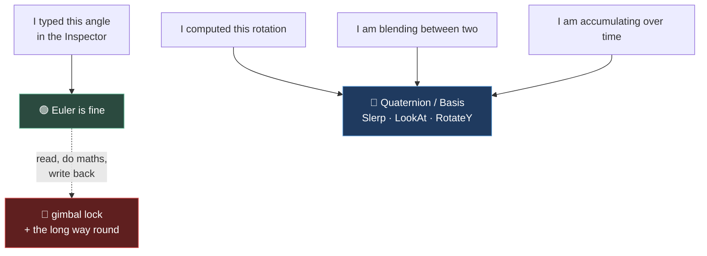

# Chapter 1.9 — Rotations: Euler, Gimbal Lock, Quaternions

🪜 **Scaffolding: 75 / 25.** The failures are reproduced step by step; the fixes are increasingly yours.

---

## 🎯 Goal

By the end you will have **broken Euler angles on purpose** — twice, in two different ways — and built a turret that tracks the marble smoothly using the type that does not have the problem.

---

## 🏃 Fast-Track Summary

*Path C: read this and the cheat sheet, do ⭐ P1 and ⭐ P2, move on.*

- **Euler angles** = three numbers applied in a fixed order. Great for typing into an Inspector. **Bad for maths.**
- 🚨 **Gimbal lock**: at 90° pitch, two of your three axes do the same thing. **You lose a degree of freedom**, and no value of the third gets it back.
- 🚨 **Never interpolate Euler angles.** `Lerp(350°, 10°)` goes **the long way round** — 340 degrees of spin to travel 20.
- **Quaternion** = a rotation with no order, no lock, and correct interpolation. Use it whenever a rotation is *computed* rather than typed.
- ⭐ `Quaternion.Slerp(a, b, t)` — the shortest arc between two orientations, at constant speed.
- `LookAt(target, Vector3.Up)` aims a node's **−Z** at a point ([1.7](1.7_3DSpaceInGodot.md)). Snappy. For smooth, slerp toward the basis `LookAt` would give.
- **Euler is fine in the Inspector.** The rule is about *computed* and *interpolated* rotations, not authored ones.
- Commit: `ch 1.9: gimbal lock reproduced, turret tracks`

---

## 🧭 Before you start

| You need | From |
|---|---|
| `AxisGizmo`, and −Z is forward | [1.7](1.7_3DSpaceInGodot.md) |
| `Basis` columns, local vs global | [1.8](1.8_Transform3D.md) |
| The marble rolling | [1.6](../1A/1.6_NodesVsResources.md) |

---

## 🔨 Build

### Step 1 — ⭐ Reproduce gimbal lock

Everyone is told about gimbal lock. Almost nobody has watched it happen. Do it now.

1. Select your `AxisGizmo` in `Main.tscn`, no parent rotation, at the origin.
2. Set **Rotation** to `(0, 0, 0)`. Drag the **Y** value and watch the cone sweep around. Drag **Z** and watch it tilt. Two independent controls. Good.
3. Now set **X to 90**.
4. Drag **Y**. Watch the cone.
5. Set Y back, and drag **Z**. Watch the cone.

**They do the same thing.** With X at 90°, the Y and Z axes have been rotated onto each other, and you now have **two controls that produce one motion**. There is no combination of Y and Z that gives you back the rotation you have lost.

6. Write in [`Journal.md`](../../../meta/Journal.md): *which* motion became impossible.

> 🚨 **This is not a Godot bug and no other engine fixes it.** Three ordered angles cannot describe orientation without a degenerate case; it is a property of the representation. Unity, Unreal and Blender all have it. It is why a camera pitched straight up or straight down is where flight-sim and third-person-camera bugs cluster.

### Step 2 — ⭐ The second failure: interpolation

This one bites far more often than gimbal lock, and almost nobody is warned about it.

Attach to the gizmo:

```csharp
    [ExportGroup("Spin test")]
    [Export] public bool LerpEuler { get; set; } = false;
    [Export] public float FromDeg { get; set; } = 350f;
    [Export] public float ToDeg   { get; set; } = 10f;
    [Export(PropertyHint.Range, "0.1,3,0.1")] public float Seconds { get; set; } = 2f;

    private float _t;

    public override void _Process(double delta)
    {
        if (!LerpEuler) return;

        _t = Mathf.Min(_t + (float)delta / Seconds, 1f);
        float y = Mathf.Lerp(FromDeg, ToDeg, _t);          // ❌ naive
        RotationDegrees = new Vector3(0, y, 0);
    }
```

Tick `LerpEuler`, run, and **watch**.

You asked to turn from 350° to 10° — **20 degrees**. It travelled **340 degrees the other way**. The numbers interpolated perfectly; the *rotation* did not, because `350` and `10` are 20 apart as angles and 340 apart as numbers, and `Mathf.Lerp` only knows about numbers.

> 💡 **`Mathf.LerpAngle` exists and fixes exactly this** for a single angle `[UNVERIFIED]`. Swap it in and run again. Then notice what it does **not** fix: it handles one axis. Three axes interpolated independently still take a path through orientation space that nobody asked for.

### Step 3 — The type without the problem

```csharp
    [Export] public bool SlerpQuat { get; set; } = false;

    public override void _Process(double delta)
    {
        if (SlerpQuat)
        {
            _t = Mathf.Min(_t + (float)delta / Seconds, 1f);

            var from = Quaternion.FromEuler(new Vector3(0, Mathf.DegToRad(FromDeg), 0));
            var to   = Quaternion.FromEuler(new Vector3(0, Mathf.DegToRad(ToDeg),   0));

            Basis = new Basis(from.Slerp(to, _t));
            return;
        }
        // ... LerpEuler as above ...
    }
```

Run. **20 degrees, the short way, at constant speed.**

A quaternion has no axis order, so there is nothing to lock, and `Slerp` — *spherical linear interpolation* — walks the **shortest arc** between two orientations. You do not need the maths to use it correctly. You need one rule, in Step 6.

### Step 4 — Build the turret

Something real. A turret that watches the marble.

1. In `Main.tscn`, add a `Node3D` named `Turret` beside the ramp. Give it a `MeshInstance3D` child — a `CylinderMesh`, height `1.5` — and add an `AxisGizmo` child so you can see which way it faces.
2. `Turret.cs`:

```csharp
using Godot;

public partial class Turret : Node3D
{
    [Export] public Node3D Target { get; set; }
    [Export] public bool Smooth { get; set; } = true;
    [Export(PropertyHint.Range, "0.5,20,0.5")] public float TurnSpeed { get; set; } = 5f;

    public override void _Process(double delta)
    {
        if (Target is null) return;

        if (!Smooth)
        {
            LookAt(Target.GlobalPosition, Vector3.Up);      // snap
            return;
        }

        // The orientation LookAt WOULD give us...
        Transform3D want = GlobalTransform.LookingAt(Target.GlobalPosition, Vector3.Up);

        // ...approached along the shortest arc.
        Quaternion current = GlobalBasis.GetRotationQuaternion();
        Quaternion desired = want.Basis.GetRotationQuaternion();

        float t = 1f - Mathf.Exp(-TurnSpeed * (float)delta);   // framerate-independent
        GlobalBasis = new Basis(current.Slerp(desired, t));
    }
}
```

3. Attach it, and drag the `Marble` into the exported **Target** slot in the Inspector.
4. `F6`. **The turret tracks the marble.** Toggle `Smooth` and feel the difference.

> 🚨 **That `1f - Mathf.Exp(-speed * delta)` is not decoration.** The obvious `Slerp(current, desired, TurnSpeed * delta)` is a *fraction of the remaining distance per frame*, which makes the turn speed depend on framerate — the exact [1.4](../1A/1.4_YourFirstRealScript.md) failure, wearing a disguise that survives casual inspection because `delta` **is** in the expression. The exponential form is the framerate-independent way to say "close the gap at this rate". Test it: run at 30 fps and 120 fps with your [1.4](../1A/1.4_YourFirstRealScript.md) FPS switcher, both ways.

### Step 5 — Watch it lock

Prove that `LookAt` inherits the problem when the geometry is degenerate.

1. Move the `Turret` so the marble passes **directly overhead**.
2. Run with `Smooth` off, and watch the moment the marble crosses the top.

`[UNVERIFIED]` — the exact behaviour. Expect a **snap, a spin, or a warning**: aiming at a point straight up makes "up" ambiguous, since the up-vector you passed is parallel to the direction you are aiming. The turret has no way to choose a roll.

**The fix is not a better function.** It is to *avoid the degenerate case*: turrets clamp their pitch, cameras clamp theirs to ±89°, and that clamp is in every third-person camera ever shipped — including the one you build in [1.19](../../../TableOfContents.md).

### Step 6 — Commit

```bash
git add .
git commit -m "ch 1.9: gimbal lock reproduced, turret tracks"
git push
```

---

## ▶️ Run it

- [ ] You reproduced gimbal lock and wrote down which motion was lost
- [ ] The naive lerp visibly went **the long way** 350° → 10°
- [ ] `LerpAngle` fixed one axis; you know why that is not the general fix
- [ ] `Slerp` took the short arc at constant speed
- [ ] Turret tracks the marble, snappy and smooth both working
- [ ] You tested the turn at two framerates
- [ ] You saw what happens with the target directly overhead

---

## 👀 Observe

Look back at Step 2. **Nothing was broken.** `Mathf.Lerp(350, 10, t)` did exactly what it promises — it interpolated two numbers. The bug was that **an angle is not a number**: it wraps, and `350` and `10` are neighbours.

That is the real content of this chapter, and it is bigger than rotation. `RotationDegrees` gives you a `Vector3`, and a `Vector3` invites every operation you know — add them, lerp them, average two of them. **All of those compile. Most of them are wrong.** The type system cannot help you, because the type is right and the *meaning* is not.

**A quaternion's practical value is that it refuses the invalid operations.** You cannot casually add two quaternions and get something meaningful-looking, so you reach for `Slerp`, which is correct. **Choosing a type that makes the wrong thing awkward is a real engineering technique**, and Module 10 builds on it.

---

## 🧠 Why it works

### What Euler angles actually are

Three rotations applied **in a fixed order** — Godot uses YXZ by default `[UNVERIFIED]`. Order matters: X-then-Y and Y-then-X land in different places. Try it in the Inspector.

Gimbal lock is what happens when the middle rotation swings the first and third axes onto each other. The three numbers still *exist*; they no longer *span* all orientations near that point.

| | Euler (`Vector3`) | Quaternion |
|---|---|---|
| Readable by a human | ✅ | ❌ |
| Type into an Inspector | ✅ | ❌ |
| Free of gimbal lock | ❌ | ✅ |
| Interpolates correctly | ❌ | ✅ `Slerp` |
| Compose rotations | awkward | ✅ multiply |
| Storage | 3 floats | 4 floats |

**So use both.** Euler for authored values a human types; quaternions for anything computed, interpolated or accumulated. That is not a compromise — it is each type doing what it is good at, and it is exactly why Godot's Inspector shows Euler while `Basis` stores something else ([1.8](1.8_Transform3D.md)).

> 🔬 **Deep dive — you do not need the maths, but here is the shape of it.** A quaternion encodes *"rotate by angle θ about axis **n**"* in four numbers. Every orientation is a point on a 4D unit sphere, and `Slerp` walks the great circle between two points — the shortest path, at constant angular speed. Since there is no "first axis", there is no axis to collapse onto another. The costs are that it is unreadable by eye, and that **`q` and `−q` are the same rotation**, which is why `Slerp` has to pick the shorter of two arcs. Godot handles that for you `[UNVERIFIED]`; other engines have historically not, which is the origin of the "my character spun the long way round once" bug.

### Accumulating rotation

`RotateY()` — which you have used since [1.4](../1A/1.4_YourFirstRealScript.md) — multiplies the basis by a rotation. It does **not** add to a Euler number, so it neither locks nor drifts. That is why the spinner works fine.

The trouble starts when you *read* `RotationDegrees`, do arithmetic, and write it back. **Read-modify-write on Euler angles is the pattern to avoid**; `RotateY`, `LookAt` and `Slerp` all avoid it for you.

---

## 🗺️ Mental model



---

## 💥 Break it

1. In `Turret.cs`, replace the exponential with `current.Slerp(desired, TurnSpeed * (float)delta)`. Run at 30 fps and 120 fps and compare how fast it turns.
2. Restore. Now make the turret track by Euler instead:
   ```csharp
   RotationDegrees = new Vector3(0, Mathf.RadToDeg(Mathf.Atan2(-d.X, -d.Z)), 0);
   ```
   …where `d = Target.GlobalPosition - GlobalPosition`. Drive the marble in a full circle around the turret.
3. Restore. Set `TurnSpeed` to `0.5` and put the marble **directly behind** the turret at start.

---

## 🔎 Diagnose

**Two of these are wrong; one is correct but will still get you a bug report. Which is which?**

<details>
<summary>Answer</summary>

**1 — Framerate-dependent slerp.** The turret turns **faster at higher framerates**. `Slerp(a, b, k·delta)` closes a *fraction of the remaining gap* each frame; more frames means more fractions. This is [1.4](../1A/1.4_YourFirstRealScript.md)'s bug in disguise — and the disguise is effective, because **`delta` is right there in the expression**, so it passes the visual check you learned to apply. The rule from [1.4](../1A/1.4_YourFirstRealScript.md) needs sharpening: *multiplying by `delta` is not the same as being framerate-independent.* It is correct for a **rate** (`degrees × delta`), not for a **fraction of what remains**. For that, `1 - exp(-k·delta)`.

**2 — Euler tracking.** It works — until the marble crosses the ±180° seam behind the turret, where `Atan2` jumps from `+180` to `-180` and the turret **whips the whole way round**. Step 2's bug in a real feature. Snapping hides it; add smoothing and it becomes a spectacular spin at exactly one bearing.

**3 — Slow turn, target behind.** 🚨 **This is the correct code that still gets reported.** With the target exactly 180° behind, the shortest arc is a **tie** — left and right are equally short. `Slerp` picks one deterministically, so it always turns the same way, and if a player expects the other way it reads as "the turret is wrong". Nothing is broken; the situation is genuinely ambiguous.

**The distinction worth carrying:**

| # | Kind |
|---|---|
| 1 | A defect — wrong at most framerates |
| 2 | A defect — wrong at one bearing |
| 3 | **Correct code, ambiguous situation** |

**#3 is the one that teaches something new.** Not every bug report is a defect. Sometimes the maths is right and the *design* has to decide — which is why turrets bias their turn direction, cameras clamp pitch, and characters have a distinct turn-in-place animation. **Recognising "this is under-specified, not broken" saves you from fixing correct code**, and the fix belongs in design, not in the slerp.

**Note also which chapter each of these came from.** #1 is 1.4, #2 is this chapter's Step 2, #3 is new. Two of three bugs in a fresh feature were bugs you had already met in a different costume, which is the argument for the Break-it sections generally: **you are building a catalogue of shapes, not a list of fixes.**

</details>

---

## 🏋️ Practicals

**⭐ P1 — Gimbal lock in three orders.** Reproduce lock with X at 90°. Then find whether Y at 90° or Z at 90° locks the same way. **Explain the pattern in one sentence** — which position in the order is the dangerous one, and why.

**⭐ P2 — Framerate-proof your turn.** Test both slerp forms at 30 / 60 / 120 fps with the [1.4](../1A/1.4_YourFirstRealScript.md) switcher. Record the time-to-face-target for each in [`Journal.md`](../../../meta/Journal.md). Six numbers; the table is the deliverable.

**P3 — Clamp the pitch.** Let the turret aim up and down as well, then clamp its pitch to ±80° and confirm the overhead case is gone. **You have now written the core of every third-person camera** — [1.19](../../../TableOfContents.md) adds collision and lag on top of exactly this.

**🔬 P4 — Prove the double cover.** Print `desired` and `-desired` (negate all four components) and confirm they produce the same orientation. Then slerp from `current` to each. Do they take the same path? **The answer is the whole reason `Slerp` needs a sign check.**

---

## ✅ Check yourself

1. What is gimbal lock, and whose fault is it?
2. Why did lerping 350° → 10° go the long way, and what is the general lesson?
3. When is Euler the right choice?
4. Why is `Slerp(a, b, speed * delta)` framerate-dependent when `delta` is in it?
5. What is the practical argument for quaternions, if you never learn the maths?

<details>
<summary>Answers</summary>

1. When the middle rotation of three ordered angles swings the first and third axes onto each other, so **two controls produce one motion and a degree of freedom is lost**. Nobody's fault — a property of the representation. Every engine has it.
2. Because `Lerp` interpolated **numbers**, and 350 and 10 are 340 apart as numbers but 20 apart as angles. The general lesson: **a `Vector3` of angles invites every vector operation, and most of them are meaningless** — the type is right and the meaning is not, so the compiler cannot help.
3. For values **a human types** — the Inspector, authored poses, a designer's tuning ([1.5](../1A/1.5_TuningWithoutRecompiling.md)). Not for computed, interpolated or accumulated rotations.
4. Because it closes a **fraction of the remaining gap** per frame, so more frames means more closing. `delta` being present is not the test; being a **rate × time** is. Use `1 - Mathf.Exp(-k * delta)`.
5. **It refuses the invalid operations.** You cannot casually add two quaternions and get something plausible, so you reach for `Slerp`, which is correct. Choosing a type that makes wrong things awkward is the technique.

</details>

---

## 📎 Cheat sheet

| Want | Use |
|---|---|
| Author a rotation by hand | Inspector Euler ✅ |
| Aim at a point, instantly | `LookAt(pos, Vector3.Up)` |
| Aim at a point, smoothly | `GlobalTransform.LookingAt(...)` → `Slerp` toward it |
| Blend two orientations | `Quaternion.Slerp(a, b, t)` |
| Spin continuously | `RotateY(rate * delta)` |
| Approach at a rate | `t = 1f - Mathf.Exp(-k * delta)` ⭐ |
| Euler ↔ Quaternion | `Quaternion.FromEuler(v)` · `q.GetEuler()` |
| From a basis | `GlobalBasis.GetRotationQuaternion()` |

| 🚨 Never | Because |
|---|---|
| `Lerp` Euler angles | Wraps — goes the long way |
| Read-modify-write `RotationDegrees` | Lock and seams |
| `Slerp(a, b, k * delta)` | Framerate-dependent |
| `LookAt` straight up/down | Degenerate — clamp pitch |

---

## 🔗 Further reading

- [Using transforms — interpolating with quaternions](https://docs.godotengine.org/en/stable/tutorials/3d/using_transforms.html)
- [`Quaternion`](https://docs.godotengine.org/en/stable/classes/class_quaternion.html) · [`Basis`](https://docs.godotengine.org/en/stable/classes/class_basis.html)

---

## 💾 Commit

```text
ch 1.9: gimbal lock reproduced, turret tracks
```

---

## ➡️ What's next

**[1.10 — Drill: move, orbit and align three ways](1.10_TransformDrill.md).** An exercise set, not a lecture. Blocks 1B's three chapters gave you the tools; the drill makes them fast.

---

## 🪞 Reflection

In two sentences: **why can the compiler not stop you lerping two Euler angles, and what makes a quaternion practically useful even if you never learn the maths?**

---

## 📝 Chapter changelog

| Version | Date | Change |
|---|---|---|
| 1.0 | 2026-09-03 | First published. `[UNVERIFIED]` on Godot's Euler order, `LerpAngle`, degenerate `LookAt` behaviour and `Slerp`'s sign handling. |
