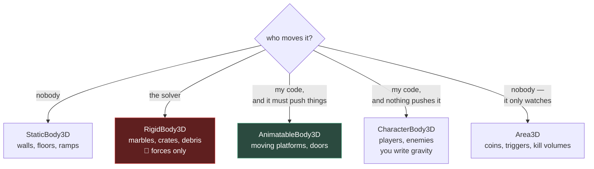

# Chapter 1.11 — The Four Body Types

**`StaticBody3D`, `RigidBody3D`, `CharacterBody3D`, `Area3D` — and who is allowed to move each one**

🪜 **Scaffolding: 80 / 20.**

---

## 🎯 Goal

By the end you will have built all four side by side, pushed each one, and **watched a `RigidBody3D` fight you** when you move it the way you have been moving everything else for ten chapters.

---

## 🏃 Fast-Track Summary

*Path C: read this and the cheat sheet, do ⭐ P1, move on.*

- **One question decides the type: *who moves this thing?***

  | Who moves it | Type |
  |---|---|
  | Nobody | **`StaticBody3D`** |
  | The physics engine | **`RigidBody3D`** |
  | Your code, and it must push things | **`AnimatableBody3D`** |
  | Your code, and it must not be pushed back | **`CharacterBody3D`** |
  | Nobody — it only watches | **`Area3D`** |

- 🚨 **Never set a `RigidBody3D`'s position or rotation directly.** You are teleporting a body the solver is mid-way through simulating. Use forces and impulses ([1.13](1.13_MakingTheMarbleRoll.md)).
- ⚠️ **A moving platform is `AnimatableBody3D`, not `StaticBody3D`** — that is the whole reason it exists, and it is a correction to [1.4](../1A/1.4_YourFirstRealScript.md).
- `CharacterBody3D` is not simulated. **You** write gravity, **you** call `MoveAndSlide()`. It gives you collision *response*, not physics.
- `Area3D` detects overlap and never collides. Coins, kill volumes, checkpoints ([1.14](1.14_AreaTriggers.md)).
- Every body needs a `CollisionShape3D` child, and it is **not** the mesh ([1.1](../1A/1.1_Nodes.md)).
- Commit: `ch 1.11: four bodies, one ramp`

---

## 🧭 Before you start

| You need | From |
|---|---|
| Marble, ramp, floor | [1.6](../1A/1.6_NodesVsResources.md) |
| Local vs global transforms | [1.8](1.8_Transform3D.md) |
| `_PhysicsProcess` vs `_Process` | [1.3](../1A/1.3_TheSceneTree.md) |

> 🚨 **First, a repair.** If your `Marble.cs` contains an `[ExportGroup("Motion")]` with `DegreesPerSecond` and a `RotateY` call in `_PhysicsProcess`, delete both — chapter [1.5](../1A/1.5_TuningWithoutRecompiling.md)'s Step 5 code belongs in `SpinPlatform.cs` ([D-018](../../../meta/Doubts.md#d-018)). **This chapter is the one that explains why it matters**, so do the deletion now and Step 4 will show you what it was doing.

---

## 🔨 Build

### Step 1 — Four bodies, one ramp

📄 **NEW SCENE** `scenes/BodyTypes.tscn`, root `Node3D` named `Lab`.

Build a shared stage:
- `Floor` — `StaticBody3D` + `MeshInstance3D` (`BoxMesh` 20×0.5×20) + `CollisionShape3D` (`BoxShape3D`, same size)
- A `Camera3D` looking at the middle.

Now four subjects in a row, each a `MeshInstance3D` (`BoxMesh` 1×1×1) plus a `CollisionShape3D` (`BoxShape3D` 1×1×1), all at `y = 3`:

| Name | Type | x |
|---|---|---|
| `A_Static` | `StaticBody3D` | −6 |
| `B_Rigid` | `RigidBody3D` | −2 |
| `C_Character` | `CharacterBody3D` | 2 |
| `D_Area` | `Area3D` | 6 |

Give each a differently coloured `StandardMaterial3D` **with Local to Scene ticked** ([1.6](../1A/1.6_NodesVsResources.md) — you know why now).

`F6`. **Predict which ones fall before you run it.**

Only `B_Rigid` falls. The other three hang in the air at `y = 3`, because **nothing is moving them and only `RigidBody3D` is simulated.**

### Step 2 — Push them

➕ **ADD to** a new script on the `Lab` root — `Lab.cs`:

```csharp
using Godot;

public partial class Lab : Node3D
{
    [Export] public bool Push { get; set; } = false;

    public override void _Ready()
    {
        if (!Push) return;

        // The only correct way to shove a rigid body.
        GetNode<RigidBody3D>("B_Rigid").ApplyImpulse(new Vector3(0, 0, -5f));
        GD.Print("impulse applied to B_Rigid");
    }
}
```

Tick `Push`, run. The rigid body flies off. **There is no equivalent call on the other three** — `ApplyImpulse` does not exist on them, because pushing is meaningless for a thing the solver does not simulate.

### Step 3 — Make the character move

A `CharacterBody3D` does nothing on its own. You drive it.

📄 **NEW FILE** `scripts/CharacterProbe.cs`, attached to `C_Character`:

```csharp
using Godot;

public partial class CharacterProbe : CharacterBody3D
{
    [Export] public float Gravity { get; set; } = 20f;
    [Export] public float DriftSpeed { get; set; } = 2f;

    public override void _PhysicsProcess(double delta)
    {
        Vector3 v = Velocity;

        if (!IsOnFloor())
            v.Y -= Gravity * (float)delta;   // ← YOU write gravity. Nobody does it for you.
        else
            v.Y = 0f;

        v.X = DriftSpeed;
        Velocity = v;

        MoveAndSlide();
    }
}
```

Run. It falls, lands, slides sideways, and **stops dead against anything solid** — no bounce, no tumbling, no spin.

> 💡 **That is the trade.** You wrote four lines of gravity that `RigidBody3D` gave you free, and in exchange the thing does **exactly** what you told it to. A player character that bounces off a wall or tips over is a bug; for a marble it is the entire game. **This is why almost every player character in every engine is a character body, not a rigid body** — you want control, not realism.

### Step 4 — ⭐ Watch a rigid body fight you

The experiment that explains [D-018](../../../meta/Doubts.md#d-018).

🔁 **REPLACE** `Lab.cs`'s body entirely — the `Push` code goes:

```csharp
using Godot;

public partial class Lab : Node3D
{
    [Export] public bool ShoveRigidBodyByHand { get; set; } = false;

    public override void _PhysicsProcess(double delta)
    {
        if (!ShoveRigidBodyByHand) return;

        var b = GetNode<RigidBody3D>("B_Rigid");
        b.GlobalPosition += new Vector3(2f * (float)delta, 0, 0);   // ❌ the wrong tool
        b.RotateY(Mathf.DegToRad(90f) * (float)delta);              // ❌ so is this
    }
}
```

Tick it and run. Watch closely, then read your Output panel.

**What to look for:**
- The cube moves, but **jitters** — it is being teleported by you and corrected by the solver, alternately, sixty times a second.
- Drop it onto the floor while shoving. It **sinks, judders, or squirts sideways** `[UNVERIFIED]` — the solver resolves a penetration you created after the fact.
- Its `LinearVelocity` stays near **zero** the whole time. Print it. **The body is moving through space with no velocity**, so anything it touches is hit by an object that, as far as physics is concerned, is standing still.

> 🚨 **This is what was happening to your marble.** Not a cosmetic spin — a body whose transform is rewritten every physics tick has no meaningful velocity, no correct collision response, and no momentum to transfer. It looks *almost* right, which is why it survives a casual look.

Untick it.

### Step 5 — ⭐ The moving platform, done properly

Here is the type nobody discovers on their own, and a correction to [1.4](../1A/1.4_YourFirstRealScript.md).

Your `SpinPlatform` is a `StaticBody3D` that you rotate every frame. Test what that does to a passenger:

1. In `Main.tscn`, place the `Marble` resting **on top of** the spinning platform.
2. Run. **The platform rotates under the marble and the marble barely moves.**

The platform has no velocity either — same problem as Step 4, for the same reason. A static body is *declared* immovable, so the solver never asks how fast it is going.

Now fix it properly:

3. Change `SpinnerGood`'s type from `StaticBody3D` to **`AnimatableBody3D`** *(right-click the node → Change Type `[UNVERIFIED]`)*.
4. ✏️ **EDIT** `SpinPlatform.cs` — one line, the base class:

```csharp
public partial class SpinPlatform : AnimatableBody3D   // was StaticBody3D
```

5. Confirm **Sync To Physics** is on in the Inspector `[UNVERIFIED]`.
6. Run again.

**The marble now rides the platform.** `AnimatableBody3D` exists for exactly this: *moved by your code, but it reports its motion to the solver so it can carry and push things.*

> ⚠️ **[1.4](../1A/1.4_YourFirstRealScript.md) told you to make it a `StaticBody3D`, and that was the wrong type** for a thing that moves. It was right for what the chapter was teaching — `delta` and framerate independence — and nothing there put anything on the platform, so the defect was invisible. **That is the honest shape of most engine mistakes: correct for the test you ran.**

### Step 6 — The one that only watches

`D_Area` has been hanging in the air doing nothing. Give it a job.

➕ **ADD to** `Lab.cs`:

```csharp
    public override void _Ready()
    {
        var area = GetNode<Area3D>("D_Area");
        area.BodyEntered += b => GD.Print($"D_Area: {b.Name} entered");
        area.BodyExited  += b => GD.Print($"D_Area: {b.Name} left");
    }
```

Move `D_Area` so the rigid body falls through it. Run.

**It prints, and nothing bounces.** An `Area3D` occupies space without resisting it — the whole basis of [1.14](1.14_AreaTriggers.md)'s coins and checkpoints.

### Step 7 — Commit

```bash
git add .
git commit -m "ch 1.11: four bodies, one ramp"
git push
```

---

## ▶️ Run it

- [ ] Four bodies built; only the rigid one fell
- [ ] `ApplyImpulse` moved the rigid body
- [ ] The character body falls only because **you** wrote gravity
- [ ] You saw a hand-moved rigid body **jitter**, and printed its near-zero velocity
- [ ] The marble did **not** ride the `StaticBody3D`, and **does** ride the `AnimatableBody3D`
- [ ] `Area3D` printed enter/exit without colliding
- [ ] `Marble.cs` no longer contains the spinner code

---

## 👀 Observe

Steps 4 and 5 were the same defect wearing two faces. A rigid body shoved by hand and a static body rotated by hand both **move through space while telling the solver they are stationary.** One jitters; one silently fails to carry a passenger.

Notice how you would have found each. The jitter you would eventually see. The platform you would **not** — it looks completely fine until something stands on it, and when a player reports "the platform doesn't carry me" you would go looking at friction, at the marble's mass, at the collision shape. **The cause is the node's class, which is not code you would ever re-read.**

**Body type is a decision you make once, in a dropdown, and then never look at again.** That is what makes it worth a whole chapter — and worth the habit of asking *who moves this?* out loud before you pick.

---

## 🧠 Why it works

### Who owns the transform

Every physics failure in this chapter is one question: **who is allowed to write this node's transform?**

| Type | Transform owned by | You may |
|---|---|---|
| `StaticBody3D` | Nobody — it does not move | Place it in the editor |
| `AnimatableBody3D` | **You**, and the solver is told | Move it in `_PhysicsProcess` ✅ |
| `RigidBody3D` | **The solver** | Apply forces and impulses only 🚨 |
| `CharacterBody3D` | **You**, via `MoveAndSlide()` | Set `Velocity`, call `MoveAndSlide` |
| `Area3D` | You (it is not simulated) | Anything — it only reports |

Writing a `RigidBody3D`'s transform is not *forbidden* — Godot lets you, and it compiles, and it appears to work. It is simply **the wrong owner writing**, and the symptoms surface as jitter, tunnelling and missing momentum, none of which look like an ownership problem.

> 🔬 **Deep dive — why a hand-moved body has no velocity.** The solver computes velocity from forces and integrates it into position. If you overwrite position afterwards, the *position* changes but the *velocity variable* does not — it is still whatever the solver last computed, near zero. Everything downstream reads that variable: collision response, friction, restitution, the impulse transferred to whatever you hit. So a hand-moved body hits things like a stationary wall that happens to be somewhere new. `AnimatableBody3D` with **sync to physics** fixes this by *deriving* a velocity from the movement you applied and handing it to the solver — which is the entire difference between the two nodes `[UNVERIFIED]`.

### Rigid or character?

The most common real decision, and it is not about realism:

| | `RigidBody3D` | `CharacterBody3D` |
|---|---|---|
| Falls, tumbles, bounces | Free | You write it |
| Responds to being hit | Free | Only if you code it |
| Goes exactly where told | ❌ | ✅ |
| Stops instantly | ❌ | ✅ |
| Good for | debris, marbles, crates, ragdolls | **players, most enemies** |

**Marble Runner is unusual in that its player *is* a rigid body**, and that is the design: the game is about not fully controlling it. [1.13](1.13_MakingTheMarbleRoll.md) makes that controllable enough to be fun, and Module 4's character work uses `CharacterBody3D` for exactly the opposite reason.

---

## 🗺️ Mental model



---

## 💥 Break it

1. Delete the `CollisionShape3D` from `B_Rigid` and run.
2. Restore. Give `B_Rigid` a `CollisionShape3D` **twice the size of its mesh** and drop it on the floor.
3. Restore. Set `B_Rigid`'s mass to `0.001` and drop the `A_Static` cube — retyped as a rigid body at mass `1000` — onto it.

---

## 🔎 Diagnose

**One of these produces a warning you can read. The other two do not. Which?**

<details>
<summary>Answer</summary>

**1 — No collision shape.** Godot **warns you in the Scene dock** — a yellow triangle on the node saying the body has no shape and cannot collide `[UNVERIFIED]`. The body falls through everything. **This is the well-behaved failure**: the engine noticed a structurally impossible configuration and said so before you ran it.

**2 — Oversized shape.** No warning, ever. The cube floats half a metre above the floor, resting on a collider you cannot see. This is [1.1](../1A/1.1_Nodes.md)'s mismatched collider, and it is worth meeting twice because the cause differs: there it was *forgetting* to size the shape, here it is *sizing it wrong*, and both look like a rendering offset rather than a physics fact. **Turn on Debug → Visible Collision Shapes and it is obvious in one second** — which is [1.11b](1.11b_DebugDrawAndConsole.md)'s whole argument.

**3 — Extreme mass ratio.** No warning, and the result is *unstable rather than wrong*: the light body squirts out, jitters, or tunnels through. `[UNVERIFIED]` — exactly which. Solvers work iteratively, and a 1,000,000:1 mass ratio needs more iterations than any real-time solver will spend. **Keep gameplay masses within roughly two orders of magnitude** and this never happens; the fix is a design constraint, not a setting.

**The ranking, and what it says about warnings:**

| # | Warned? | Symptom looks like |
|---|---|---|
| 1 | ✅ Yes | falls through the world |
| 2 | ❌ No | a **rendering** bug |
| 3 | ❌ No | a **random** bug |

**The engine warns about what is structurally impossible, never about what is merely wrong.** A body with no shape cannot work by definition, so Godot can be certain. A shape twice too big is a perfectly valid configuration that happens not to be what you meant — and no engine can know what you meant.

**That line is worth internalising, because it predicts where you will need your own tools.** Everything on the "merely wrong" side of it is invisible until you make it visible, which is why the next chapter is about seeing.

</details>

---

## 🏋️ Practicals

**⭐ P1 — The decision table, in your own words.** For every object in Marble Runner — floor, ramp, walls, marble, spinners, coins, future checkpoints — write the body type and **the one-sentence reason**. Put it in [`Journal.md`](../../../meta/Journal.md). Any you have to think about twice is one to re-check in [1.14](1.14_AreaTriggers.md).

**⭐ P2 — Fix the platform in P01 for real.** Convert both spinners to `AnimatableBody3D`, confirm the marble rides them, and try to break it: spin at 500°/s and see whether the marble is flung, dragged or ignored. Record what you find — [1.13](1.13_MakingTheMarbleRoll.md) explains it.

**P3 — Build the same drop four ways.** One falling cube, implemented as a rigid body, as a character body with hand-written gravity, as an animatable body driven by a curve, and as an `Area3D` that only reports. **Four lines of code to four very different maintenance costs** — write one paragraph on which you would choose for a falling boulder trap, and why.

**🔬 P4 — Find the velocity.** In Step 4, print `LinearVelocity` while shoving by hand, then print it again while pushing with `ApplyImpulse`. **Those two numbers are the entire chapter**, and they are worth pasting into your journal.

---

## ✅ Check yourself

1. What single question decides the body type?
2. Why is a hand-moved `RigidBody3D` worse than it looks?
3. Why does a marble not ride a rotating `StaticBody3D`?
4. What does `CharacterBody3D` give you, and what does it charge?
5. What kinds of mistake will the engine warn you about, and which will it never?

<details>
<summary>Answers</summary>

1. **Who moves this thing?** Nobody → static. The solver → rigid. Your code, must push things → animatable. Your code, must not be pushed → character. Nobody, only watches → area.
2. Because overwriting the transform **does not update the velocity variable**, which stays near zero. Everything downstream — collision response, friction, transferred impulse — reads that variable, so the body moves through space while hitting things like a stationary object. Plus jitter, as you and the solver correct each other 60 times a second.
3. Same reason. A static body is *declared* immovable, so the solver never computes a velocity for it and has nothing to transfer to a passenger. **`AnimatableBody3D` with sync-to-physics derives one from your movement**, which is the entire reason the node exists.
4. It gives **exact control** — it goes where you say and stops dead. It charges you **gravity, acceleration, jumping and every other physical behaviour**, which you must write. Worth it for players, because a player that tumbles is a bug.
5. It warns about what is **structurally impossible** — a body with no shape cannot collide, so it can be certain. It never warns about what is **merely wrong**: an oversized shape or a bad mass ratio are valid configurations that happen not to be what you meant. Everything on that side is invisible until you make it visible.

</details>

---

## 📎 Cheat sheet

| Type | Moved by | Key API |
|---|---|---|
| `StaticBody3D` | nobody | — |
| `AnimatableBody3D` | your code ✅ | set transform; **Sync To Physics** |
| `RigidBody3D` | the solver | `ApplyImpulse` `ApplyForce` `ApplyTorque` |
| `CharacterBody3D` | you | `Velocity`, `MoveAndSlide()`, `IsOnFloor()` |
| `Area3D` | n/a | `BodyEntered` `AreaEntered` |

| 🚨 Never | Instead |
|---|---|
| Set a `RigidBody3D`'s position/rotation | `ApplyImpulse` / `ApplyTorque` |
| Move a platform as `StaticBody3D` | `AnimatableBody3D` |
| Expect a `CharacterBody3D` to fall | Write gravity yourself |
| Mass ratios beyond ~100:1 | Keep gameplay masses close |
| Forget the `CollisionShape3D` | The mesh is **not** a collider |

---

## 🔗 Further reading

- [Physics introduction](https://docs.godotengine.org/en/stable/tutorials/physics/physics_introduction.html)
- [`RigidBody3D`](https://docs.godotengine.org/en/stable/classes/class_rigidbody3d.html) · [`CharacterBody3D`](https://docs.godotengine.org/en/stable/classes/class_characterbody3d.html) · [`AnimatableBody3D`](https://docs.godotengine.org/en/stable/classes/class_animatablebody3d.html)

---

## 💾 Commit

```text
ch 1.11: four bodies, one ramp
```

---

## ➡️ What's next

**[1.11b — Debug Draw 3D and Panku Console](1.11b_DebugDrawAndConsole.md) 🧰.** Diagnose #2 and #3 were invisible because physics is invisible. Next: make it visible — and consume your first GDScript addon from C#.

---

## 🪞 Reflection

In two sentences: **why does a hand-moved body hit things like a stationary object, and what is the line between mistakes the engine warns about and mistakes it cannot?**

---

## 📝 Chapter changelog

| Version | Date | Change |
|---|---|---|
| 1.0 | 2026-09-07 | First published. Opens block 1C. Corrects [1.4](../1A/1.4_YourFirstRealScript.md)'s `StaticBody3D` spinner to `AnimatableBody3D`. First chapter written under [ADR-037](../../../meta/Decisions.md#adr-037). `[UNVERIFIED]` on jitter symptoms, Change Type, Sync To Physics, the no-shape warning and mass-ratio behaviour. |
