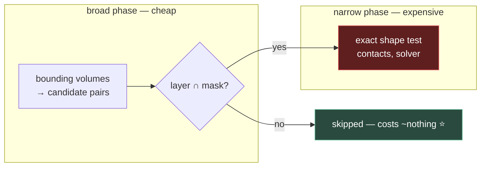

# Chapter 1.12 — Collision Shapes, Layers and Masks

**Choosing shapes, and designing the table that decides what may touch what**

🪜 **Scaffolding: 75 / 25.**

---

## 🎯 Goal

By the end you will have **measured** what each shape type costs, **discovered by experiment** whether collision is one-way or two-way, and written Marble Runner's layer table — a document you will still be editing in Module 11.

---

## 🏃 Fast-Track Summary

*Path C: read this, do Steps 3–4 and ⭐ P1, move on.*

- **Shapes, cheapest first:** `Sphere` → `Box` / `Capsule` → `Cylinder` → `ConvexPolygon` → `ConcavePolygon`.
- 🚨 **`ConcavePolygon` (trimesh) works only on static bodies.** It is a surface, not a volume — nothing can be *inside* it, so the solver cannot push anything out.
- **The collider is never the render mesh.** Approximate. A 2,000-triangle rock is a `SphereShape3D`.
- **Layer = what I am. Mask = what I care about.** Two separate bit sets on every body.
- ⭐ **Name your layers before you use them** — Project Settings → Layer Names → 3D Physics. An unnamed layer 7 is unmaintainable within a month.
- Design the table **once, on paper**, before assigning any bits.
- ⚠️ **Fast + thin = tunnelling.** A marble at 40 m/s skips through a 0.1 m floor between ticks. Continuous CD, or thicker geometry.
- Commit: `ch 1.12: shapes measured, layers named`

---

## 🧭 Before you start

| You need | From |
|---|---|
| Visible collision shapes | [1.11b](1.11b_DebugDrawAndConsole.md) |
| The four body types | [1.11](1.11_TheFourBodyTypes.md) |
| Your framerate baseline | [0.12](../../module0/0B/0.12_MeasuredTwoLanguages.md) |

---

## 🔨 Build

### Step 1 — The shape zoo

📄 **NEW SCENE** `scenes/ShapeZoo.tscn`, root `Node3D`. A `StaticBody3D` floor, and six `RigidBody3D` cubes at `y = 5`, each with the **same** `BoxMesh` but a different `CollisionShape3D`:

| Body | Shape |
|---|---|
| `S_Sphere` | `SphereShape3D` |
| `S_Box` | `BoxShape3D` |
| `S_Capsule` | `CapsuleShape3D` |
| `S_Cylinder` | `CylinderShape3D` |
| `S_Convex` | `ConvexPolygonShape3D` |
| `S_Concave` | `ConcavePolygonShape3D` |

Turn on **Visible Collision Shapes** and run.

**Five behave. One does something wrong** — watch `S_Concave` closely and write down what it does before reading on.

> 🚨 **`ConcavePolygonShape3D` on a `RigidBody3D` is invalid.** Godot may warn, may fall through, may behave erratically `[UNVERIFIED]`. The reason is worth knowing rather than memorising: a concave shape is a **triangle soup — a surface with no inside**. Collision resolution works by pushing objects out of a volume, and there is no "out" of a surface. **Concave is for static geometry only**: terrain, level meshes, walls you will never move.

### Step 2 — ⭐ Measure the cost

Opinions about shape cost are cheap. Get numbers.

📄 **NEW FILE** `scripts/ShapeStress.cs`:

```csharp
using Godot;

public partial class ShapeStress : Node3D
{
    [Export] public PackedScene BodyScene { get; set; }
    [Export(PropertyHint.Range, "10,1000,10")] public int Count { get; set; } = 200;
    [Export] public bool Spawn { get; set; } = false;

    public override void _Ready()
    {
        if (!Spawn || BodyScene is null) return;

        var rng = new RandomNumberGenerator();
        rng.Randomize();

        for (int i = 0; i < Count; i++)
        {
            var b = BodyScene.Instantiate<RigidBody3D>();
            AddChild(b);
            b.GlobalPosition = new Vector3(rng.RandfRange(-5, 5), 5 + i * 0.15f,
                                           rng.RandfRange(-5, 5));
        }
        GD.Print($"spawned {Count}");
    }
}
```

Save each shape variant as its own scene, then run 200 of each and record **physics frame time** from the profiler `[UNVERIFIED] — Debug → Profiler → Physics`:

| Shape | 200 bodies, physics ms | vs sphere |
|---|---|---|
| Sphere | | 1.0× |
| Box | | |
| Capsule | | |
| Cylinder | | |
| Convex (8 pts) | | |
| Convex (64 pts) | | |

> 💡 **Do this on the phone too.** Desktop ratios understate the gap — a phone has less cache and a slower FPU, and the expensive shapes get relatively worse. **A number from your target device is worth ten from your workstation**, and this is the first place in the course where that difference will actually change a decision.

### Step 3 — ⭐ Name your layers before you use them

**Project Settings → General → Layer Names → 3D Physics** `[UNVERIFIED]`.

Fill in names now, before assigning a single bit:

| Bit | Name |
|---|---|
| 1 | `world` |
| 2 | `player` |
| 3 | `pickup` |
| 4 | `hazard` |
| 5 | `trigger` |
| 6 | `platform` |
| 7–20 | *(leave empty until earned)* |

> 🚨 **This is the highest-value five minutes in the chapter.** Unnamed layers show as numbered checkboxes, and within a month "is the player on 2 or 3?" becomes a question you answer by opening three scenes and guessing. **Named layers turn the Inspector into documentation.** Leave the unused ones blank — a layer named speculatively is worse than an empty one, because it looks decided.

### Step 4 — Design the table on paper

Layer = *what I am.* Mask = *what I want to know about.* They are independent, and most bugs come from setting one and forgetting the other.

Fill this in for Marble Runner **before touching the Inspector**:

| Node | Layer (I am) | Mask (I care about) | Why |
|---|---|---|---|
| `Floor`, `Ramp`, walls | `world` | — | Static. Never initiates. |
| `Marble` | `player` | `world`, `platform`, `pickup`, `hazard` | Must hit everything |
| `SpinPlatform` | `platform` | `player` | Carries the marble |
| `Coin` (`Area3D`) | `pickup` | `player` | Only cares about the marble |
| `KillVolume` (`Area3D`) | `hazard` | `player` | |

> 💡 **Notice the floor's empty mask.** Static geometry does not need to *look for* anything — it only needs to *be found*. Leaving its mask empty removes work from every physics tick, and it is the single most common piece of free performance in a Godot project. **A body with no mask still gets hit; it just stops asking.**

### Step 5 — ⭐ Find out whether it is one-way

Do not take my word for the rule. Determine it.

1. Two `RigidBody3D` cubes, `A` and `B`, arranged to fall into each other.
2. Set `A`: layer `1`, mask `2`. Set `B`: layer `2`, mask **empty**.
3. Predict: do they collide? Write it down. Run.
4. Now swap — `A` mask empty, `B` mask `1`. Predict. Run.
5. Both masks empty, layers unchanged. Predict. Run.

Record all three in [`Journal.md`](../../../meta/Journal.md).

> 💡 **You have just derived the rule instead of memorising it**, and you now know it for `RigidBody3D` specifically. **Repeat the experiment with an `Area3D`** — detection and collision are different systems and there is no guarantee they answer the same way `[UNVERIFIED]`. When someone tells you "layers are symmetric in Godot", you will have the three-line experiment that settles it for your version.

### Step 6 — Apply it, and watch coins stop fighting

Your coins are currently on the default layer, which means **every coin collides with every other coin**.

1. Set all coins to layer `pickup`, mask `player`.
2. Set the marble's mask to include `pickup`.
3. Run with twenty coins clustered together.

**Before:** they jostle and drift apart. **After:** they sit exactly where you placed them, and the physics engine stops running collision pairs it will never care about.

> 💡 **That is layers doing both jobs at once** — correctness *and* performance. With *n* coins you removed roughly *n²*/2 useless pair checks. This is why layer design is a *design* activity: it decides what the engine is allowed to spend time on.

### Step 7 — ⚠️ Make the marble tunnel

1. `Floor` thickness → `0.05`.
2. Marble spawn height → `50`.
3. Run.

**It goes straight through.** Between one physics tick and the next it travelled further than the floor is thick, so at no sampled moment was it overlapping anything.

Three fixes, in order of preference:

1. **Thicker geometry** — free, works always, no reason not to.
2. **More physics ticks** — Project Settings → Physics Ticks per Second `[UNVERIFIED]`. Costs CPU everywhere, on every body.
3. **Continuous collision detection** — the `RigidBody3D`'s `Continuous CD` property `[UNVERIFIED]`. Costs CPU on that body only. **For a fast small thing hitting thin things, this is the right tool** — but reach for the free fix first.

### Step 8 — Commit

```bash
git add .
git commit -m "ch 1.12: shapes measured, layers named"
git push
```

---

## ▶️ Run it

- [ ] Six shapes dropped; you know what concave-on-rigid did
- [ ] Cost table filled — **and the phone column too**
- [ ] Layers **named** in Project Settings
- [ ] Layer table written on paper before any bits were set
- [ ] Three one-way experiments predicted and recorded
- [ ] Coins no longer collide with each other
- [ ] You made the marble tunnel, and fixed it the cheap way

---

## 👀 Observe

Look at Step 6. Setting a mask fixed a *gameplay* problem — jostling coins — and a *performance* problem, with the same two clicks. That is unusual. Most decisions in this course trade one against the other, and this chapter's central one does not.

Then look at what made it possible: you decided **what a coin is** and **what it cares about**, separately. Those are different questions, and every layer bug comes from answering only one of them. A coin that is on the `pickup` layer but still masks everything is *correct* and *wasteful*; a coin that masks only `player` but forgot to declare its own layer is *invisible to the marble* and looks broken.

**Layer and mask are two questions, and you must answer both, every time.** Write the table.

---

## 🧠 Why it works

### Why shapes have such different costs

| Shape | Test |
|---|---|
| Sphere | one distance comparison |
| Box / Capsule | a handful of axis tests |
| Cylinder | more, and awkward at the rim caps |
| Convex hull | separating-axis over every face and edge pair |
| Concave | a **search** through a triangle tree |

Cost tracks how much work "am I overlapping?" takes. Two spheres is a subtraction. Two convex hulls is a loop over faces whose length depends on the hull.

**Which is why the collider is never the render mesh.** Your rock has 2,000 triangles because it must *look* like a rock; it collides like a sphere because it must *feel* like a rock, and feeling like one costs a subtraction. Module 3's asset pipeline builds this into the export step — you will author a low-poly collision proxy alongside every model.

> 🔬 **Deep dive — the broad phase, and why masks are nearly free.** A physics tick runs in two stages. **Broad phase** cheaply finds candidate pairs using bounding volumes; **narrow phase** does the expensive exact test on survivors. **Layer/mask filtering happens in the broad phase**, so a filtered-out pair costs essentially nothing — no shape test, no contact generation, no solver constraint. That is why Step 6's twenty coins scaled so well, and why "just put everything on layer 1 and sort it out in code" is such an expensive habit: you pay the full narrow phase to compute a collision your code then throws away.

### Tunnelling

A discrete solver samples positions at fixed intervals and asks "overlapping?" at each. Move further than the obstacle is thick and every sample answers "no".

```
tick 1:  ●
                    ▁▁▁▁  floor (0.05 thick)
tick 2:                       ●     ← never sampled inside
```

Three levers: **make the obstacle thicker** (free), **sample more often** (costs everywhere), or **sweep instead of sample** — continuous CD, which tests the swept path rather than the endpoint (costs on that body). **Prefer the free one.** Most tunnelling in real projects is a 5 cm floor that should have been 20 cm, and the geometry change costs nothing at runtime.

---

## 🗺️ Mental model



---

## 💥 Break it

1. Set the marble's collision **layer** to empty, leaving its mask complete. Run.
2. Restore. Set the marble's **mask** to empty, leaving its layer set. Run.
3. Restore. Give the `Floor` a `ConcavePolygonShape3D` generated from its mesh, then make the floor an `AnimatableBody3D` and move it while the marble rests on top.

---

## 🔎 Diagnose

**Two produce a marble that falls through the world. Why is one much harder to diagnose than the other?**

<details>
<summary>Answer</summary>

**1 — No layer.** The marble is on nothing, so nothing can find it. It falls through the floor. But its mask is full, so **it still detects things** — and this is the confusing part: your `Area3D` coins do not react to it, while the marble's own code that queries the world works fine. **Half the interactions work.** You conclude the problem is with the coins.

**2 — No mask.** The marble looks for nothing. It falls through the floor too — but now the *coins* still detect *it*, because their mask includes `player` and its layer is intact. **The opposite half works.** You conclude the problem is with the marble.

**Same symptom, opposite cause, and each points you at the wrong node.** That is why the table matters more than the checkboxes: with the table in front of you the question "what is this, and what does it care about?" has a written answer to compare against. Without it you are reading bitfields in an Inspector and inferring intent.

**3 — Concave on a moving body.** The subtle one. It works while nothing pushes on it, so a static floor with a trimesh collider is fine. Turn it into an `AnimatableBody3D` and move it, and the marble on top jitters, sinks or falls through `[UNVERIFIED]` — because there is no volume to push out of, and the solver has no consistent answer for "which side is out?" on a surface that is moving.

**Ranked by how long it takes to find:**

| # | Symptom | Misleads you toward |
|---|---|---|
| 1 | falls through; areas ignore it | the **coins** |
| 2 | falls through; areas still fire | the **marble** |
| 3 | works, then fails when moved | **the movement code** |

**#3 is the worst, and note why: it worked.** It passed every test you ran while the floor was static. The defect was introduced by a change somewhere else — converting a body type — and it broke an assumption nothing declared. **This is the third time this block has shown you a defect created by a node-type change** ([1.11](1.11_TheFourBodyTypes.md)'s static platform, that chapter's rigid-body-by-hand, and now this), which is worth noticing as a category: **the type of a node is load-bearing, and changing it silently changes what its other settings mean.**

</details>

---

## 🏋️ Practicals

**⭐ P1 — Write the layer table into the repo.** Not your journal — a real file, `docs/reference/LayerTable.md`, with a row per layer: name, what lives on it, what masks it. **Every layer you add for the rest of the course goes in this file first and the Inspector second.** In Module 11, with combat, enemies, projectiles and destructibles, this file is what stops the layer scheme collapsing.

**⭐ P2 — Cost table on the phone.** Repeat Step 2 on your device. Two columns, desktop and phone, and the ratio between them. **Note which shape's ratio is worst** — that is the one to avoid on mobile, and it may not be the one you expect.

**P3 — Proxy a complex shape.** Take any detailed mesh, give it a `ConvexPolygonShape3D` generated from the mesh, then hand-build an approximation from two or three primitives. Compare physics cost and *feel*. **Most shipped games use the primitives**, and Module 3 makes this a pipeline step.

**🔬 P4 — Find your tunnelling threshold.** For a fixed floor thickness, binary-search the marble's speed until it passes through. Then compute the speed you would predict from thickness × ticks-per-second and compare. **A prediction that matches means you understand the mechanism**; one that does not means there is something else going on, and finding out what is the exercise.

---

## ✅ Check yourself

1. What do layer and mask each mean, and why must you answer both?
2. Why can concave shapes not be used on moving bodies?
3. Why is a filtered-out collision pair almost free?
4. Why is the render mesh never the collider?
5. What are the three fixes for tunnelling, and which comes first?

<details>
<summary>Answers</summary>

1. **Layer = what I am. Mask = what I care about.** They are independent bit sets. Answering only one gives you a body nothing can find, or one that finds nothing — **same symptom, opposite cause**, each pointing you at the wrong node.
2. Because a concave shape is a **triangle soup — a surface with no inside**. Collision resolution pushes objects out of a volume, and there is no "out" of a surface. Fine for static geometry, unstable the moment it moves.
3. Because layer/mask filtering happens in the **broad phase**, before any exact shape test, contact generation or solver constraint. That is why "everything on layer 1, sort it out in code" is expensive: you pay the full narrow phase to compute a collision you then discard.
4. Because the mesh exists to **look** right and the collider exists to **feel** right, and feeling right is far cheaper. A 2,000-triangle rock collides as a sphere — one subtraction instead of a search through a triangle tree.
5. **Thicker geometry** (free, always works) → **more physics ticks** (costs everywhere) → **continuous CD** (costs on one body). Reach for the free one first; most real tunnelling is a 5 cm floor that should have been 20 cm.

</details>

---

## 📎 Cheat sheet

| Shape | Use for | Cost |
|---|---|---|
| `SphereShape3D` | balls, pickups, proxies | 🟢 cheapest |
| `BoxShape3D` | crates, walls, platforms | 🟢 |
| `CapsuleShape3D` | **characters** | 🟢 |
| `CylinderShape3D` | barrels, pillars | 🟡 |
| `ConvexPolygonShape3D` | odd but solid props | 🟠 |
| `ConcavePolygonShape3D` | 🚨 **static level geometry only** | 🔴 |

| Concept | |
|---|---|
| **Layer** | what I am |
| **Mask** | what I care about |
| ⭐ Name layers | Project Settings → Layer Names → 3D Physics |
| Static geometry | layer set, **mask empty** — free performance |
| Filtering happens in | the **broad phase** — skipped pairs are ~free |

| Tunnelling | Fix |
|---|---|
| Fast + thin | ⭐ thicker geometry · more ticks · continuous CD |

---

## 🔗 Further reading

- [Physics introduction — collision layers and masks](https://docs.godotengine.org/en/stable/tutorials/physics/physics_introduction.html)
- [Collision shapes (3D)](https://docs.godotengine.org/en/stable/tutorials/physics/collision_shapes_3d.html)

---

## 💾 Commit

```text
ch 1.12: shapes measured, layers named
```

---

## ➡️ What's next

**[1.13 — Making the marble roll](1.13_MakingTheMarbleRoll.md).** You know what may touch what. Next: forces, impulses, torque and damping — and finally making the marble feel good to control.

---

## 🪞 Reflection

In two sentences: **why do "no layer" and "no mask" produce the same symptom but send you to different nodes, and why is a skipped collision pair nearly free?**

---

## 📝 Chapter changelog

| Version | Date | Change |
|---|---|---|
| 1.0 | 2026-09-07 | First published. `[UNVERIFIED]` on concave-on-rigid behaviour, profiler path, layer-names menu, mask symmetry and continuous-CD property names — Step 5 has the learner derive the symmetry rule rather than trusting the chapter. |
