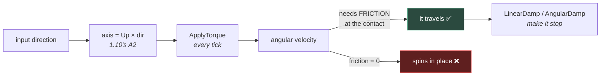

# Chapter 1.13 — Making the Marble Roll

**Forces, impulses, torque, damping — and the first time P01 is fun**

🪜 **Scaffolding: 70 / 30.** The mechanisms are given; the feel is yours to find.

---

## 🎯 Goal

By the end the marble will be **controllable and enjoyable**, and you will know the difference between a force and an impulse well enough to pick correctly without thinking about it.

---

## 🏃 Fast-Track Summary

*Path C: read this, do Steps 3, 5 and 7, and ⭐ P1.*

- **Force = a push held down.** Newtons. Applied **every physics tick**, integrated over time.
- **Impulse = a hit.** Newton-seconds. Applied **once**, changes velocity immediately.
- 🚨 **Never multiply a force by `delta`.** The integrator already does. This is the one place where [1.4](../1A/1.4_YourFirstRealScript.md)'s rule is inverted, and it catches everyone.
- **"Central" means at the centre of mass** → no spin. Off-centre → **torque**, free.
- A marble rolls from **torque**, not from being shoved. `ApplyTorque(Vector3.Right * n)` rolls it forward.
- ⭐ **Damping is what makes it playable.** `LinearDamp` and `AngularDamp` are the difference between a marble that stops and one that rolls into the sea.
- **Impulse and force are both divided by mass.** Double the mass, halve the acceleration — retune, or scale by mass.
- Forces go in **`_PhysicsProcess`**, never `_Process`.
- Commit: `ch 1.13: the marble rolls`

---

## 🧭 Before you start

| You need | From |
|---|---|
| Marble as a `RigidBody3D` with a sphere collider | [1.12](1.12_ShapesLayersMasks.md) |
| Velocity arrows drawn | [1.11b](1.11b_DebugDrawAndConsole.md) |
| The tuning discipline | [1.5](../1A/1.5_TuningWithoutRecompiling.md) |
| ⚠️ `Marble.cs` free of the spinner code | [D-018](../../../meta/Doubts.md#d-018) |

> 💡 **Keep Debug Draw's velocity arrow on for this entire chapter.** Every idea here is about velocity, and you built the tool to see it.

---

## 🔨 Build

### Step 1 — Force and impulse, side by side

🔁 **REPLACE** `Marble.cs`'s `_PhysicsProcess` and add these exports — the `RotateY` line and the `Motion` group must be gone:

```csharp
    [ExportGroup("Drive")]
    [Export] public bool UseImpulse { get; set; } = false;
    [Export(PropertyHint.Range, "0,200,1")] public float Strength { get; set; } = 20f;
    [Export] public bool Fire { get; set; } = false;

    public override void _PhysicsProcess(double delta)
    {
        if (Fire)
        {
            if (UseImpulse)
            {
                ApplyCentralImpulse(Vector3.Forward * Strength);
                Fire = false;                       // once
            }
            else
            {
                ApplyCentralForce(Vector3.Forward * Strength);   // every tick
            }
        }

        if (GlobalPosition.Y < KillY) Respawn();
    }
```

Run twice — once with `UseImpulse` off, once on. Watch the green arrow.

| | Force | Impulse |
|---|---|---|
| Arrow | grows steadily | jumps, then decays |
| Feels like | a rocket | a golf club |
| Applied | every tick | once |

> 🚨 **Now the trap.** Change the force line to `ApplyCentralForce(Vector3.Forward * Strength * (float)delta)` and run. **It barely moves.** You have just divided your force by about sixty, because **the integrator already multiplies by `delta`** — a force is a *rate of change of momentum*, and turning it into an amount is the engine's job.
>
> [1.4](../1A/1.4_YourFirstRealScript.md) told you rate × time = amount and it was right. **`ApplyForce` takes the rate.** `RotateY` took the amount. The rule is not "multiply by delta"; it is **"know which one the API wants"** — and the way to know is to ask what the units are. Newtons is a rate. Degrees is an amount.

Take the `delta` back out.

### Step 2 — Off-centre is free spin

`ApplyImpulse` has a second parameter: **where**, relative to the centre of mass.

✏️ **EDIT** the impulse branch:

```csharp
                ApplyImpulse(Vector3.Forward * Strength, new Vector3(0, 0.5f, 0));
```

Run. **The marble tumbles**, because a push above the centre of mass rotates it.

> 💡 **That is torque, and you did not ask for it.** It is also every "why is my crate spinning?" question ever asked. `ApplyCentralImpulse` is the same call with the offset fixed at zero — **use the central version unless you want spin**, and when something spins unexpectedly, look for an offset.

### Step 3 — ⭐ Roll it, do not shove it

A real marble does not slide — it **rolls**, and it rolls because torque spins it while friction stops the contact point from slipping.

🔁 **REPLACE** the drive block:

```csharp
    [ExportGroup("Drive")]
    [Export(PropertyHint.Range, "0,100,1")] public float TorqueStrength { get; set; } = 12f;

    public override void _PhysicsProcess(double delta)
    {
        Vector3 dir = ReadTemporaryInput();          // Step 6 replaces this

        if (dir != Vector3.Zero)
        {
            // Roll about the axis PERPENDICULAR to travel: cross(up, direction).
            Vector3 axis = Vector3.Up.Cross(dir).Normalized();
            ApplyTorque(axis * TorqueStrength);
        }

        if (GlobalPosition.Y < KillY) Respawn();
    }
```

> 💡 **`Vector3.Up.Cross(dir)` is [1.10](../1B/1.10_TransformDrill.md)'s task A2 doing real work.** To roll *forward*, spin about the axis pointing *right*. Get the cross-product order backwards and the marble rolls away from where you push — a 50/50 you can settle in one run rather than by reasoning ([1.7](../1B/1.7_3DSpaceInGodot.md)).

### Step 4 — Temporary input, clearly labelled

📄 **NEW — add to `Marble.cs`**, and mark it:

```csharp
    // ⚠️ TEMPORARY — hard-coded keys. Chapter 1.16 replaces this with the InputMap.
    // Do not copy this pattern into anything you intend to keep.
    private Vector3 ReadTemporaryInput()
    {
        var d = Vector3.Zero;
        if (Input.IsKeyPressed(Key.W)) d += Vector3.Forward;
        if (Input.IsKeyPressed(Key.S)) d += Vector3.Back;
        if (Input.IsKeyPressed(Key.A)) d += Vector3.Left;
        if (Input.IsKeyPressed(Key.D)) d += Vector3.Right;
        return d.Normalized();
    }
```

Run. **You can drive the marble.**

> 🚨 **The comment is not decoration.** [1.16](../../../TableOfContents.md) exists because hard-coded keys cannot be remapped, cannot be shown in a UI, and do not exist on a phone — which is the platform you are shipping to. **Leaving a labelled placeholder is honest; leaving an unlabelled one is how a prototype becomes a product.** Write the comment now, while you still intend to replace it.

### Step 5 — ⭐ Damping: the difference between a toy and a game

Drive around. **The marble never stops.** It has no reason to — a frictionless sphere on a frictionless plane conserves everything.

Two knobs, and they do different jobs:

| Property | Kills | Feels like |
|---|---|---|
| `LinearDamp` | travel | air resistance |
| `AngularDamp` | spin | a sticky axle |

➕ **ADD to** `Marble.cs`:

```csharp
    [ExportGroup("Feel")]
    [Export(PropertyHint.Range, "0,10,0.1")] public float Linear { get; set; } = 0.5f;
    [Export(PropertyHint.Range, "0,10,0.1")] public float Angular { get; set; } = 1.0f;

    public override void _Ready()
    {
        _spawnPoint = GlobalPosition;
        LinearDamp  = Linear;
        AngularDamp = Angular;
    }
```

Now **tune it while playing** ([1.5](../1A/1.5_TuningWithoutRecompiling.md)): run, open the Remote tree, drag both sliders and drive at the same time.

Find and record three settings in [`Journal.md`](../../../meta/Journal.md):

| Feel | `LinearDamp` | `AngularDamp` | `TorqueStrength` |
|---|---|---|---|
| **Ice** — slides forever | | | |
| **Marble** — what you want | | | |
| **Mud** — stops instantly | | | |

> 💡 **Finding all three is the exercise, not finding the good one.** The middle setting only means something once you have felt the ends, and *ice* and *mud* are both real design choices you may want later — a level's hazard, a power-up. Write them down; [7.16](../../../TableOfContents.md)'s game-feel pass will want them.

### Step 6 — Physics material, and why it is not damping

Damping slows things everywhere, always. **Friction and bounce apply at contact.**

Set your `Marble.physmat.tres`'s **Friction** to `0` and drive. The marble **slides without rolling** — torque spins it, nothing grips, and it stays put while spinning like a wheel in mud.

Set it to `1` and drive. It grips and rolls immediately.

> 🚨 **That is the mechanism you have been taking on faith:** torque alone does not move a ball. **Torque plus friction** does. If your marble spins and does not travel, the answer is in the physics material, not in the torque value — and no amount of turning `TorqueStrength` up will fix it, which is exactly the kind of dead end that costs an evening.

### Step 7 — Mass changes everything

Set the marble's **Mass** from `1` to `10` and drive with the same numbers.

**It barely responds.** Force and torque are both divided by mass — `a = F/m` — so ten times the mass is a tenth of the acceleration.

Two responses, and they are different decisions:

1. **Retune** for the new mass — right when mass is a deliberate design choice ("this is a heavy ball").
2. **Scale by mass**: `ApplyTorque(axis * TorqueStrength * Mass)` — right when you want the *same feel* regardless, which is usually what you want for a player.

> 💡 **Option 2 is how most player controllers work**, and it is why they often feel "unphysical" — deliberately. Realism is not the goal; **consistency of control is.** A player who picks up a heavy power-up should not have to relearn the controls.

### Step 8 — Commit

```bash
git add .
git commit -m "ch 1.13: the marble rolls"
git push
```

---

## ▶️ Run it

- [ ] Force and impulse felt side by side
- [ ] You saw force × `delta` nearly stop the marble, and know why
- [ ] An off-centre impulse made it tumble
- [ ] Torque + cross product rolls it the **right** way
- [ ] Temporary input works, and is **labelled**
- [ ] Three feel settings recorded — ice, marble, mud
- [ ] Zero friction: spins without moving
- [ ] Mass ×10 tested, and you chose retune or scale
- [ ] **It is fun to drive.** That is the acceptance test.

---

## 👀 Observe

Step 1's `delta` trap and [1.4](../1A/1.4_YourFirstRealScript.md)'s missing `delta` are opposite mistakes, and both come from following a rule instead of reading the units.

**`RotateY` wants an amount — radians.** So you supply rate × time. **`ApplyForce` wants a rate — newtons.** So the engine supplies the time. The question is never "should I multiply by delta?"; it is **"what does this parameter measure?"** Degrees is an amount. Newtons is a rate. Metres per second is a rate. Metres is an amount.

That question also answers things this chapter never covered. `ApplyImpulse` takes newton-seconds — already a *quantity*, time included — so no `delta`, and no per-tick application either. **The units tell you both the arithmetic and the calling frequency**, which is a lot of value from reading one word in the documentation.

---

## 🧠 Why it works

### The whole API

| Call | Units | Frequency | Spin? |
|---|---|---|---|
| `ApplyCentralForce(v)` | N | every tick | no |
| `ApplyForce(v, offset)` | N | every tick | yes |
| `ApplyCentralImpulse(v)` | N·s | once | no |
| `ApplyImpulse(v, offset)` | N·s | once | yes |
| `ApplyTorque(v)` | N·m | every tick | only |
| `ApplyTorqueImpulse(v)` | N·m·s | once | only |

Six calls, three questions: **continuous or instant · at the centre or offset · linear or angular.** Nothing else to learn.

> 🔬 **Deep dive — why a rolling ball is the hardest simple thing.** A rolling sphere couples linear and angular motion through a single contact point, so `TorqueStrength`, `Friction`, `AngularDamp`, `LinearDamp` and `Mass` all affect the same felt quantity — how fast it gets going. Change one and the others *appear* to change too. **This is why you tune with sliders while playing rather than by reasoning** ([1.5](../1A/1.5_TuningWithoutRecompiling.md)): the parameters are not independent, so the space cannot be explored one axis at a time. It is also why fixing a "wrong" value by adjusting a different one is so tempting, and why writing down the three named settings beats writing down one.

### Damping vs friction

| | Damping | Friction |
|---|---|---|
| Applies | always, everywhere | at contact only |
| Models | air resistance | surfaces gripping |
| Set on | the **body** | the **physics material** |
| Zero means | rolls forever | slides without rolling |

**Both are needed and they are not substitutes.** Damping without friction gives you a ball that slowly stops while never rolling; friction without damping gives you one that rolls beautifully and never stops.

---

## 🗺️ Mental model



---

## 💥 Break it

1. Move the `ApplyTorque` call from `_PhysicsProcess` into `_Process`. Drive at 30 fps and at 144 fps.
2. Restore. Set `TorqueStrength` to `5000`.
3. Restore. Set `AngularDamp` to `0` and `LinearDamp` to `8`.

---

## 🔎 Diagnose

**One of these is wrong in a way that will pass every test you run on your own machine. Which?**

<details>
<summary>Answer</summary>

**1 — Force from `_Process`.** 🚨 **This is the one that passes your tests.** Forces accumulate and are consumed by the physics step `[UNVERIFIED]`, so applying from the render loop means the number of applications per tick depends on the ratio of framerate to physics rate. At exactly 60/60 it is 1:1 and **behaves perfectly**. At 144 fps you push more than twice as hard; at 30 fps, half. **Your machine is the one where it works** — and this is [1.4](../1A/1.4_YourFirstRealScript.md)'s bug for the third time, now hiding behind a correct-looking `delta`-free call in the wrong method.

**2 — Absurd torque.** It spins so fast it may tunnel ([1.12](1.12_ShapesLayersMasks.md)), jitter, or be flung off. **Loud, obvious, fixed in seconds.** Worth doing once so you know what "solver gave up" looks like.

**3 — No angular damping, heavy linear damping.** The marble keeps spinning after it stops travelling, so it sits still, visibly rotating, and then lurches when it touches anything. It looks *haunted*. **Nothing is broken** — you asked for a frictionless axle and a headwind. It is a good illustration that the two damps are genuinely independent, and that "feels wrong" can come from a perfectly sensible pair of values.

**The ranking:**

| # | Wrong at | Found |
|---|---|---|
| 1 | **every framerate but yours** | 🚨 a bug report from a player |
| 2 | all of them, loudly | in seconds |
| 3 | none — it is a feel problem | when you play it |

**#1 deserves the paranoia because of where it hides.** It is not that the author forgot the physics loop; it is that `_Process` and `_PhysicsProcess` **both compile, both run, and differ only under conditions your development machine does not produce.** Standard advice — "put physics in `_PhysicsProcess`" — is correct and insufficient, because you cannot notice you disobeyed it.

**So make it findable instead of memorable: test at two framerates, every time you touch physics.** You built the switcher in [1.4](../1A/1.4_YourFirstRealScript.md). This is the third chapter where it would have caught a real bug, which is a strong argument for it being a reflex rather than an exercise.

</details>

---

## 🏋️ Practicals

**⭐ P1 — Three feels, written down.** Ice, marble and mud, all five parameters each, in [`Journal.md`](../../../meta/Journal.md). Then hand the game to someone else with the middle setting and **watch them play without explaining anything.** Their first thirty seconds tell you more than your own hour of tuning — that is the entire premise of [11.11](../../../TableOfContents.md).

**⭐ P2 — Framerate-proof the whole marble.** Test drive at 30, 60 and 144 fps. Any behaviour that changes is a defect. **Record the three runs, including "no difference"** — a negative result you wrote down is evidence; one you remember is a feeling.

**P3 — A boost pad.** An `Area3D` that applies an impulse on entry ([1.14](1.14_AreaTriggers.md) formalises the trigger). Decide **impulse or force**, and be able to defend it. Then make the pad's strength independent of the marble's mass.

**🔬 P4 — Reverse-engineer a marble game.** Play any commercial marble or rolling game for ten minutes. Estimate its damping and torque *relative to yours* — does it stop faster? turn sharper? accelerate harder? **Then match it.** Copying feel by observation is a professional skill, and it is far more useful than any table of "correct" values.

---

## ✅ Check yourself

1. What is the difference between a force and an impulse, in units and in use?
2. Why must you not multiply a force by `delta`, when [1.4](../1A/1.4_YourFirstRealScript.md) insisted you multiply?
3. Why does a marble with zero friction spin without moving?
4. What do the two damping values do, and why is neither a substitute for friction?
5. Why is applying force from `_Process` more dangerous than applying an absurd value?

<details>
<summary>Answers</summary>

1. **Force is newtons — a rate**, applied every tick and integrated over time; **impulse is newton-seconds — a quantity**, applied once, changing velocity immediately. A held rocket versus a golf club.
2. Because **the integrator already multiplies by `delta`**. The real rule is not "multiply by delta" but **"know what the parameter measures"**: `RotateY` wants radians (an amount), so you supply rate × time; `ApplyForce` wants newtons (a rate), so the engine supplies the time.
3. Because **torque alone does not translate a ball.** Spin becomes travel only through friction at the contact point. With friction at zero the contact slips freely, so the marble spins in place — and no amount of extra torque fixes it.
4. `LinearDamp` kills travel (air resistance), `AngularDamp` kills spin (a sticky axle) — both always, everywhere. **Friction acts only at contact** and is what converts spin into travel. Damping without friction: never rolls. Friction without damping: never stops.
5. Because the absurd value is **wrong everywhere, loudly**, and gets fixed in seconds. `_Process` is wrong **at every framerate except the one you develop on** — 60/60 gives exactly one application per tick — so it passes your every test and arrives later as a player's bug report.

</details>

---

## 📎 Cheat sheet

| Want | Call | Units | When |
|---|---|---|---|
| Steady push | `ApplyCentralForce(v)` | N | every tick |
| Sudden hit | `ApplyCentralImpulse(v)` | N·s | once |
| Push + spin | `ApplyForce(v, offset)` | N | every tick |
| Roll | `ApplyTorque(axis * n)` | N·m | every tick |
| Sudden spin | `ApplyTorqueImpulse(v)` | N·m·s | once |

| 🚨 Rules | |
|---|---|
| Never `force * delta` | the integrator does it |
| Never apply force in `_Process` | wrong at every framerate but yours |
| Roll axis | `Vector3.Up.Cross(direction)` |
| Spins but does not move | **friction**, not torque |
| Never stops | `LinearDamp` / `AngularDamp` |
| Mass changed the feel | retune, or scale force by `Mass` |

---

## 🔗 Further reading

- [`RigidBody3D`](https://docs.godotengine.org/en/stable/classes/class_rigidbody3d.html)
- [`PhysicsMaterial`](https://docs.godotengine.org/en/stable/classes/class_physicsmaterial.html)

---

## 💾 Commit

```text
ch 1.13: the marble rolls
```

---

## ➡️ What's next

**[1.13b — Jolt physics](1.13b_JoltPhysics.md) 🧰.** You now have a physics feel you can describe in numbers. Next: swap the entire solver underneath it and **measure what changes** — which is only possible because you wrote those numbers down.

---

## 🪞 Reflection

In two sentences: **how do you decide whether an API wants `delta`, and why does a marble with zero friction spin without going anywhere?**

---

## 📝 Chapter changelog

| Version | Date | Change |
|---|---|---|
| 1.0 | 2026-09-07 | First published. Temporary hard-coded input, explicitly labelled for replacement in [1.16](../../../TableOfContents.md). `[UNVERIFIED]` on force accumulation semantics across a physics step. |
