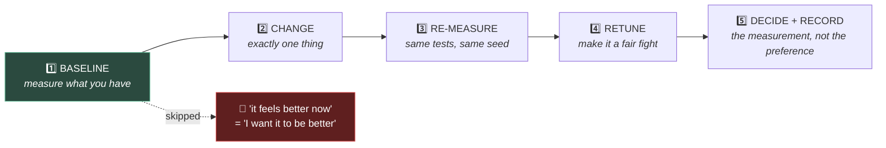

# Chapter 1.13b — Jolt Physics: Choosing a Solver 🧰

**Swapping the engine underneath your game, and measuring what actually changed**

🪜 **Scaffolding: 65 / 35.** The protocol is given. The conclusion is yours, and I do not know what it will be.

---

## 🎯 Goal

By the end you will have **measured your own scene under two physics engines** and made a recorded decision — and you will have found out the hard way that tuning does not transfer between solvers.

---

## 🏃 Fast-Track Summary

*Path C: do Steps 1–2 and 5, record the decision, move on.*

- ⭐ **Check whether your Godot already has Jolt built in** — recent versions ship it as a Project Settings option `[UNVERIFIED]`. If so there is nothing to adopt, and [1.11b](1.11b_DebugDrawAndConsole.md)'s Step 1 rule applies again: **the free thing first.**
- Otherwise, **godot-jolt** is a GDExtension — native binaries, per-ABI APK cost, engine-ABI risk.
- **Jolt is generally better at**: stacking, many bodies, character controllers, stability under stress.
- **Godot Physics is fine at**: small scenes, simple shapes — which is most of P01.
- 🚨 **Switching is one setting and it is not free.** Your [1.13](1.13_MakingTheMarbleRoll.md) feel values will not transfer exactly. **Budget a retune.**
- ⭐ **The point of this chapter is the protocol, not the answer.** Baseline → change one thing → re-measure → decide → record.
- Measure **on the phone**. A desktop verdict is not a mobile verdict.
- Commit: `ch 1.13b: two solvers, measured`

---

## 🧭 Before you start

| You need | From |
|---|---|
| Three recorded feel settings | [1.13](1.13_MakingTheMarbleRoll.md) — **required**, this chapter is meaningless without them |
| Shape cost table | [1.12](1.12_ShapesLayersMasks.md) |
| The dependency checklist | [0.15](../../module0/0C/0.15_EvaluatingADependency.md) |
| A phone you can deploy to | [0.5](../../module0/0A/0.5_ConnectingYourPhone.md) |

> 🚨 **If you skipped [1.13](1.13_MakingTheMarbleRoll.md)'s tuning table, go back and do it.** You cannot detect a change in feel without a written record of the feel you had. This is the chapter that pays for that work.

---

## 🔨 Build

### Step 1 — Do you already have it?

**Project Settings → General → Physics → 3D → Physics Engine** `[UNVERIFIED]`.

Read the dropdown and record what you see in [`ENGINE_VERSION.md`](../../../../ENGINE_VERSION.md):

| If the dropdown offers | Then |
|---|---|
| **Jolt Physics** (built in) | ✅ Nothing to install. Skip to Step 2. |
| Only **Godot Physics** / **Default** | Install **godot-jolt** as an addon — evaluate it first |

> 💡 **This is [1.11b](1.11b_DebugDrawAndConsole.md)'s lesson recurring, and it is worth noticing as a pattern.** Jolt spent years as a third-party GDExtension and then became part of the engine. **A dependency's best outcome is to stop being a dependency**, and that is a real consideration when evaluating one: an addon that fills a gap the engine is visibly moving toward is a *better* bet than one that fills a gap nobody else cares about, because the exit is upstream rather than abandonment.
>
> If you must install it: same checklist as [1.11b](1.11b_DebugDrawAndConsole.md), and note that this addon is **in your shipping path**, not a debug tool. The ABI-rebuild risk that was acceptable for Debug Draw 3D is a much heavier consideration here.

### Step 2 — ⭐ Baseline. Do not skip this.

**Measure the engine you already have before you touch anything.**

📄 **NEW SCENE** `scenes/PhysicsBench.tscn` — three tests in one scene, each toggleable:

```csharp
using Godot;

public partial class PhysicsBench : Node3D
{
    public enum Test { Stack, Pile, Marble }

    [Export] public Test Which { get; set; } = Test.Stack;
    [Export(PropertyHint.Range, "5,60,1")] public int StackHeight { get; set; } = 20;
    [Export(PropertyHint.Range, "50,1000,50")] public int PileCount { get; set; } = 300;
    [Export] public PackedScene BoxScene { get; set; }

    private double _t;

    public override void _Ready()
    {
        switch (Which)
        {
            case Test.Stack: BuildStack(); break;
            case Test.Pile:  BuildPile();  break;
            case Test.Marble: break;               // your P01 scene, driven by hand
        }
    }

    // A tower of boxes. Solvers differ here more than anywhere else.
    private void BuildStack()
    {
        for (int i = 0; i < StackHeight; i++)
        {
            var b = BoxScene.Instantiate<RigidBody3D>();
            AddChild(b);
            b.GlobalPosition = new Vector3(0, 0.5f + i * 1.01f, 0);
        }
    }

    private void BuildPile()
    {
        var rng = new RandomNumberGenerator();
        rng.Seed = 12345;                          // ⭐ FIXED seed — see below
        for (int i = 0; i < PileCount; i++)
        {
            var b = BoxScene.Instantiate<RigidBody3D>();
            AddChild(b);
            b.GlobalPosition = new Vector3(rng.RandfRange(-4, 4), 2 + i * 0.1f,
                                           rng.RandfRange(-4, 4));
        }
    }

    public override void _Process(double delta)
    {
        _t += delta;
        if (_t > 10.0) { GD.Print("--- 10s elapsed ---"); SetProcess(false); }
    }
}
```

> 🚨 **The fixed seed is the most important line in the file.** Comparing two solvers on two different random piles measures the piles, not the solvers. **Any comparison where more than one thing changed tells you nothing**, and a random seed is the easiest way to change a second thing without noticing.

Record, with **Godot Physics**:

| Measurement | Desktop | Phone |
|---|---|---|
| Stack of 20 — still standing after 10 s? | | |
| Stack — visible jitter? | | |
| 300-box pile — physics ms (profiler) | | |
| 300-box pile — did anything sink or explode? | | |
| Marble: time from rest to the ramp's end | | |
| Marble: *does it feel the same as yesterday?* | | |

### Step 3 — Change exactly one thing

Switch the physics engine setting. **Restart Godot** `[UNVERIFIED]`.

Change **nothing else.** Not one tuning value, however tempting.

### Step 4 — ⭐ Re-measure, and expect a surprise

Run the identical three tests and fill in the second column.

**Then drive the marble.** Almost certainly it feels different — often noticeably. Damping, friction and restitution are not standardised quantities; they are **parameters of a particular solver's model**, and `Friction = 0.6` does not mean the same thing to two different implementations.

> 🚨 **This is the cost nobody mentions when recommending a physics engine.** Switching solvers **invalidates your tuning** — every value in [1.13](1.13_MakingTheMarbleRoll.md)'s table, every bounce, every damp, on every object in the game. On a project with one marble that is twenty minutes. On a project with forty tuned objects it is a week, and it is why studios choose a solver early and stop discussing it.
>
> **You are doing this now, at one marble, deliberately.** That is the whole reason this chapter sits in Module 1 rather than Module 10.

### Step 5 — Retune, then compare fairly

Now re-tune the marble under the new solver until it feels like your recorded *marble* setting from [1.13](1.13_MakingTheMarbleRoll.md).

| | Godot Physics | Jolt |
|---|---|---|
| `LinearDamp` | | |
| `AngularDamp` | | |
| `TorqueStrength` | | |
| `Friction` | | |
| `Bounce` | | |

**Only now is the comparison honest.** Comparing an engine you have tuned against one you have not measures your tuning, not the engines — the same error as the random seed, one level up.

Ask the real question: **with both tuned to feel the same, is either better?** Better here means stability, framerate, or a behaviour you could not achieve at all.

### Step 6 — Decide, and write down why

Record in [`DecisionsLog.md`](../../../meta/DecisionsLog.md), dated, as a 🔍 VERIFIED entry ([T-023](../../../meta/ToDos.md)):

- Which engine, and **the measurement that decided it** — not a preference
- The retune cost you actually paid
- What would change your mind later

> 💡 **"Godot Physics, because P01 has nine rigid bodies and I measured no difference" is an excellent decision** and a much better one than adopting Jolt because it is well regarded. **A dependency you do not need is a cost you pay forever** — APK size, upgrade friction, one more thing that can break when Godot updates.
>
> Equally: *"Jolt, because my 300-box pile sank into the floor under Godot Physics and did not under Jolt"* is excellent. **Either conclusion is a good outcome. Neither is the point.** The protocol is the point.

### Step 7 — Commit

```bash
git add .
git commit -m "ch 1.13b: two solvers, measured"
git push
```

---

## ▶️ Run it

- [ ] You checked whether Jolt is already built in
- [ ] Bench scene built, with a **fixed seed**
- [ ] Baseline recorded **before** switching — desktop and phone
- [ ] Exactly one thing changed
- [ ] Second column recorded
- [ ] You felt the marble change, and **retuned it** before comparing
- [ ] Decision in `DecisionsLog.md`, with the measurement that drove it

---

## 👀 Observe

Look at the two Break-it traps you were steered around: the random seed, and comparing tuned against untuned. **Both are the same mistake** — a comparison in which more than one thing differs — and both are easy to commit while feeling rigorous. You would have had numbers, a table, and a confident conclusion about nothing.

Now notice how little of this chapter was about Jolt. Almost all of it was **baseline, change one thing, re-measure, record**, and that protocol is what you will use in [5.18](../../../TableOfContents.md)'s optimisation drill, in [11.11](../../../TableOfContents.md)'s playtests, and every time someone tells you a library is faster.

**You cannot evaluate a change you did not measure before making.** The baseline is the part people skip, and skipping it is not a shortcut — it makes the whole exercise worthless, because "it feels better now" is indistinguishable from "I want it to be better now."

---

## 🧠 Why it works

### What a solver actually does

Sixty times a second: find contacts, then **iteratively** push overlapping bodies apart until the constraints are approximately satisfied, then integrate velocities into positions.

The word doing the work is **iteratively**. There is no exact answer computed in bounded time, so every engine chooses:

| Choice | Consequence |
|---|---|
| How many iterations | accuracy vs CPU |
| Which order to solve constraints | which errors accumulate where |
| How to cache contacts between ticks | stability of resting stacks |
| How to handle deep penetration | whether things explode or sink |

**Those choices are the difference between solvers.** A tall stack is the classic test because errors accumulate along the chain: each box's correctness depends on the one below, so an approximation that is invisible on one box is a visible wobble on twenty.

> 🔬 **Deep dive — why physics is not deterministic across engines, or even across machines.** Floating-point results depend on operation order, compiler optimisation and CPU instruction sets. Two builds of the same engine can produce diverging simulations from identical input, and the divergence compounds. **So never build gameplay on physics being repeatable** — no "the boxes always land like this" puzzle, no physics-driven scoring that must match across devices. When you need determinism, you drive it yourself: fixed timesteps, integer or fixed-point maths, or simply not using rigid-body physics for the thing that must be exact. This is a live constraint in [11.8](../../../TableOfContents.md)'s progression system, and it is the reason replays and lockstep multiplayer are hard.

### When solver choice actually matters

| Situation | Matters? |
|---|---|
| A dozen bodies, simple shapes | ❌ Not measurably |
| Tall stacks, resting contacts | ✅ A lot |
| Hundreds of bodies | ✅ A lot |
| Character controllers | ✅ Often |
| Fast, small objects | ✅ Continuous CD quality differs |
| Feel of one rolling ball | ❌ **Both can be tuned to feel the same** |

**Marble Runner sits in the "not measurably" row today.** That is worth stating plainly, because the temptation in an adoption chapter is to adopt.

---

## 🗺️ Mental model



---

## 💥 Break it

1. Re-run the pile test with `rng.Randomize()` instead of the fixed seed, three times per engine. Compare the spread **within** one engine against the difference **between** engines.
2. Switch solvers and compare the marble **without** retuning. Write down which you prefer.
3. Set physics ticks to 15 per second under each engine and run the stack test.

---

## 🔎 Diagnose

**All three produce a confident conclusion. All three conclusions are worthless. Why, in each case?**

<details>
<summary>Answer</summary>

**1 — Random seed.** The run-to-run spread **within** one engine is often as large as the difference **between** engines. Your measurement has a noise floor, and if you never measured it you cannot know whether your result sits above it. **A single measurement of a noisy system is not a measurement**, and this is the most common error in amateur benchmarking — including, frequently, in published library comparisons.

**2 — Untuned comparison.** You are measuring which solver's *defaults* happen to suit your scene. Defaults are somebody's guess about a typical project, and yours is not typical. **This is the same error as #1** — more than one thing differs — dressed as a fair test, which is what makes it more dangerous than the random seed. It *feels* rigorous.

**3 — Fifteen ticks per second.** Both engines degrade, probably differently `[UNVERIFIED]`, and you learn how each fails under a condition you will never ship. Real, interesting, and **not evidence about your game**, because it answers a question you did not ask. **A measurement outside the operating range does not transfer inward.**

**The shared defect, and it is worth naming precisely:** each of these produces a *number*, and a number feels like evidence. **They differ in what they are evidence about** — #1 about the piles, #2 about the defaults, #3 about a configuration you will not ship. None is about the question "which solver should Marble Runner use?"

**So the discipline is not "measure" — you measured in all three.** It is: **state the question first, then check whether your measurement can answer it.** Write the question at the top of the table before you fill anything in. It is the cheapest possible protection, and it is what makes the difference between benchmarking and collecting numbers.

**And #2 is the one to remember**, because the same shape recurs everywhere for the rest of this course: comparing a thing you have invested effort in against a thing you have not. It will come back when you compare your hand-written camera against [1.24b](../../../TableOfContents.md)'s Phantom Camera, and your own state machine against a library's. **Fairness costs work, and skipping that work always favours whichever side you already tuned.**

</details>

---

## 🏋️ Practicals

**⭐ P1 — Measure the noise floor first.** Before comparing anything, run the pile test five times under **one** engine with random seeds and record the spread. **That number is the threshold below which any difference you find is meaningless.** Put it at the top of your comparison table. Most people never do this, which is why most benchmark posts are wrong.

**⭐ P2 — Phone column, filled in.** Every row of Step 2's table, on device. **If a solver difference appears only on the phone, that is your answer** — and it is entirely plausible, because the CPU, the cache and the thermal budget are all different.

**P3 — Find a scene where it matters.** Build the smallest scene you can where the two engines visibly disagree. Stack height? Body count? Mass ratio ([1.11](1.11_TheFourBodyTypes.md))? **Finding the boundary teaches you far more than either measurement**, because it tells you when to revisit this decision.

**🔬 P4 — Test determinism.** Same seed, same engine, run the pile twice and compare final positions numerically. Then across a debug and a release build. Then on desktop versus phone. **Record where the divergence starts** — that is the constraint [11.8](../../../TableOfContents.md) has to design around.

---

## ✅ Check yourself

1. What is the first question to ask before adopting any addon — twice now?
2. Why must you retune before comparing two solvers?
3. Why is a fixed seed essential, and what does a random one actually measure?
4. Why does switching solvers invalidate your tuning?
5. Why can't you rely on physics being repeatable?

<details>
<summary>Answers</summary>

1. **Is it already there?** Godot ships collision-shape visualisation ([1.11b](1.11b_DebugDrawAndConsole.md)) and, in recent versions, Jolt itself. A dependency's best outcome is to **stop being a dependency** — which makes an addon filling a gap the engine is moving toward a better bet than one filling a gap nobody else cares about.
2. Because otherwise you are comparing **your tuning against their defaults**. Defaults are a guess about a typical project. It is the same "more than one thing differs" error as a random seed, but dressed as rigour — which makes it more dangerous.
3. Because otherwise you measure **the piles, not the solvers**. A random seed measures run-to-run variance, which is exactly the noise floor you need to know *separately* before any comparison means anything.
4. Because friction, damping and restitution are **parameters of a particular solver's model**, not standardised physical quantities. `Friction = 0.6` does not mean the same thing to two implementations. One marble: twenty minutes. Forty tuned objects: a week.
5. Because floating-point results depend on operation order, optimisation and instruction set, so **two builds of the same engine can diverge** from identical input, and the divergence compounds. Never build gameplay that requires repeatability on rigid-body physics.

</details>

---

## 📎 Cheat sheet

| Protocol ⭐ | |
|---|---|
| 1 | Measure the **noise floor** |
| 2 | **Baseline** the thing you already have |
| 3 | Change **exactly one** thing |
| 4 | Re-measure — same tests, **same seed** |
| 5 | **Retune** both sides |
| 6 | Decide, and record **the measurement** |

| Solver choice matters for | Not for |
|---|---|
| stacks, hundreds of bodies | a dozen simple bodies |
| character controllers | the feel of one ball |
| fast small objects (CCD) | |

| 🚨 | |
|---|---|
| Switching solvers | **invalidates all tuning** |
| Physics across builds/devices | **not deterministic** |
| A dependency you do not need | a cost you pay forever |

---

## 🔗 Further reading

- [Physics — engine selection](https://docs.godotengine.org/en/stable/tutorials/physics/physics_introduction.html)
- [Jolt Physics](https://github.com/jrouwe/JoltPhysics) · [godot-jolt](https://github.com/godot-jolt/godot-jolt)

---

## 💾 Commit

```text
ch 1.13b: two solvers, measured
```

---

## ➡️ What's next

**[1.14 — Area3D triggers](1.14_AreaTriggers.md).** Physics is settled. Next: the coins, the kill volumes and the checkpoints — the objects that detect without colliding, and the one signal-ordering trap that catches everybody.

---

## 🪞 Reflection

In two sentences: **what makes a comparison unfair even when it produces real numbers, and why does "it feels better now" fail as evidence?**

---

## 📝 Chapter changelog

| Version | Date | Change |
|---|---|---|
| 1.0 | 2026-09-07 | First published. Second 🧰 adoption chapter, and the first where the correct outcome may be *not adopting*. `[UNVERIFIED]` on whether your Godot ships Jolt, the settings path, restart requirement and degradation behaviour. |
