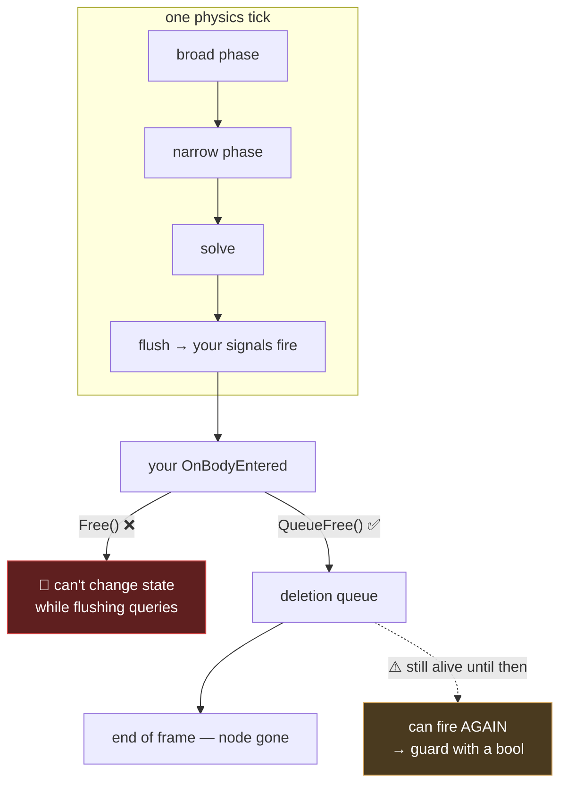

# Chapter 1.14 — `Area3D` Triggers

**Collectibles, kill volumes, checkpoints — and the error every Godot developer meets exactly once**

🪜 **Scaffolding: 75 / 25.** Closes block 1C.

---

## 🎯 Goal

By the end Marble Runner will have **working coins, kill volumes and checkpoints**, and you will have deliberately triggered *"Can't change this state while flushing queries"* — the error that stops everyone, once.

---

## 🏃 Fast-Track Summary

*Path C: read this, do Steps 1–4 and ⭐ P1, move on.*

- `Area3D` detects overlap and never resists it ([1.11](1.11_TheFourBodyTypes.md)).
- Four signals: **`BodyEntered` · `BodyExited` · `AreaEntered` · `AreaExited`**.
- 🚨 **You are inside the physics engine when a signal fires.** Adding, removing or disabling a collider *right then* throws **"Can't change this state while flushing queries!"**
- ⭐ **Two fixes:** `QueueFree()` instead of `Free()`, and `SetDeferred("disabled", true)` instead of `Disabled = true`.
- 🚨 **`QueueFree()` does not delete immediately.** The node lives until end of frame — **so it can be collected twice.** Guard with a `bool`.
- Kill volume → respawn. Checkpoint → **move the spawn point**, do not teleport.
- Set `Monitoring`/`Monitorable` and the layer/mask ([1.12](1.12_ShapesLayersMasks.md)) — a coin masks `player` only.
- Commit: `ch 1.14: coins, kill volumes, checkpoints`

---

## 🧭 Before you start

| You need | From |
|---|---|
| A drivable marble | [1.13](1.13_MakingTheMarbleRoll.md) |
| Layer table with `pickup`, `hazard`, `trigger` | [1.12](1.12_ShapesLayersMasks.md) |
| `Coin.tscn` | [1.2](../1A/1.2_ScenesAndInstancing.md) |
| Local-to-scene materials | [1.6](../1A/1.6_NodesVsResources.md) |

---

## 🔨 Build

### Step 1 — The coin detects

Open `scenes/Coin.tscn`. Root should be an **`Area3D`** with a `MeshInstance3D` and a `CollisionShape3D`.

Inspector: **layer = `pickup`**, **mask = `player`**, `Monitoring` on `[UNVERIFIED]`.

📄 **NEW FILE** `scripts/Coin.cs`:

```csharp
using Godot;

public partial class Coin : Area3D
{
    [Export] public int Value { get; set; } = 1;
    [Export(PropertyHint.Range, "0,360,10")] public float SpinDegrees { get; set; } = 90f;

    public override void _Ready()
    {
        BodyEntered += OnBodyEntered;
    }

    public override void _Process(double delta)
    {
        RotateY(Mathf.DegToRad(SpinDegrees) * (float)delta);   // ✅ an Area3D is not simulated
    }

    private void OnBodyEntered(Node3D body)
    {
        GD.Print($"{Name} touched by {body.Name}");
    }
}
```

> 💡 **`RotateY` on this node is correct**, and it was wrong on the marble ([1.11](1.11_TheFourBodyTypes.md)). An `Area3D` is not simulated, so nothing is fighting you for its transform. **The same line is right or wrong depending on the node type** — which is [1.12](1.12_ShapesLayersMasks.md)'s "node type is load-bearing" again.

Run and drive into a coin. It prints.

### Step 2 — ⭐ Trigger the famous error

Now collect it the obvious way. ✏️ **EDIT** `OnBodyEntered`:

```csharp
    private void OnBodyEntered(Node3D body)
    {
        Free();          // ❌ immediate deletion — do this, on purpose, once
    }
```

Run, drive into the coin, and **read the Output panel**:

```
Can't change this state while flushing queries!
```
`[UNVERIFIED]` — exact wording.

**You are inside the physics server's callback.** It is mid-way through iterating its collision pairs, and you just deleted one of them. It refuses, because the alternative is a crash.

Now the fix — 🔁 **REPLACE** that line:

```csharp
    private void OnBodyEntered(Node3D body)
    {
        QueueFree();     // ✅ "delete this at the end of the frame"
    }
```

Run. **The coin vanishes and nothing complains.**

> 🚨 **This is the most common first-week Godot error, and knowing the rule beats knowing the fix.** Anything that changes the *structure* of the physics world — freeing a body, disabling a shape, adding a collider, reparenting — must be **deferred** out of a physics callback. The two tools:
>
> | Instead of | Use |
> |---|---|
> | `Free()` | `QueueFree()` |
> | `shape.Disabled = true` | `shape.SetDeferred("disabled", true)` |
> | `AddChild(x)` | `CallDeferred(Node.MethodName.AddChild, x)` |

### Step 3 — ⭐ The bug the fix creates

`QueueFree()` schedules deletion. **The node is still alive, still monitoring, for the rest of the frame.**

✏️ **EDIT** to prove it:

```csharp
    private int _collected;

    private void OnBodyEntered(Node3D body)
    {
        _collected++;
        GD.Print($"{Name} collected — count {_collected}");
        QueueFree();
    }
```

Drive through a coin **fast**, or place two marbles, or clip a coin at an angle. `[UNVERIFIED]` — how reliably it reproduces.

**Sooner or later you will see `count 2`.** One coin, collected twice, one score, two points.

The guard:

```csharp
    private bool _taken;

    private void OnBodyEntered(Node3D body)
    {
        if (_taken) return;         // ⭐ the whole fix
        _taken = true;

        GD.Print($"{Name} collected");
        QueueFree();
    }
```

> 🚨 **Every deferred deletion needs a "have I already?" flag.** Not just coins — doors, one-shot triggers, pickups, checkpoints. The pattern is: **the signal is not the state.** The signal says "something happened"; whether you should *act* is a separate question your object must answer for itself.
>
> This is a rare and expensive bug in the wild because it needs a timing coincidence — it survives your testing and appears in a player's session as an impossible score.

### Step 4 — The kill volume

📄 **NEW SCENE** `scenes/KillVolume.tscn` — `Area3D`, layer `hazard`, mask `player`, a big flat `BoxShape3D`, no mesh.

📄 **NEW FILE** `scripts/KillVolume.cs`:

```csharp
using Godot;

public partial class KillVolume : Area3D
{
    public override void _Ready() => BodyEntered += OnBodyEntered;

    private void OnBodyEntered(Node3D body)
    {
        if (body is Marble m) m.Respawn();
    }
}
```

Make `Marble.Respawn()` `public`, and now ✏️ **EDIT** `Marble.cs` to delete the `KillY` check from `_PhysicsProcess` — the volume replaces it.

> 💡 **You just moved a rule out of code and into the level.** `KillY = -10` was one number applying everywhere; a kill volume is a *placeable object* a designer can put anywhere, rotate, resize and duplicate. **This is the same move as [1.5](../1A/1.5_TuningWithoutRecompiling.md)'s exported values, one level up** — from tunable number to placeable object — and it is how level design stops needing a programmer.

### Step 5 — Checkpoints

📄 **NEW FILE** `scripts/Checkpoint.cs`, on an `Area3D` with layer `trigger`, mask `player`:

```csharp
using Godot;

public partial class Checkpoint : Area3D
{
    [Export] public Node3D SpawnPoint { get; set; }

    private bool _armed = true;

    public override void _Ready() => BodyEntered += OnBodyEntered;

    private void OnBodyEntered(Node3D body)
    {
        if (!_armed || body is not Marble m) return;
        _armed = false;

        m.SetSpawnPoint((SpawnPoint ?? this).GlobalPosition);
        GD.Print($"checkpoint {Name} reached");
    }
}
```

➕ **ADD to** `Marble.cs`:

```csharp
    public void SetSpawnPoint(Vector3 p) => _spawnPoint = p;
```

> 🚨 **A checkpoint moves the spawn point. It does not teleport the player.** That sounds obvious and is the single most common beginner mistake in this feature — a trigger that calls `Respawn()` sends you backwards the instant you touch it. **The trigger records; the death acts.** Separating *when a thing is recorded* from *when it is used* is a habit worth forming now; [11.8b](../../../TableOfContents.md)'s save system is the same idea at scale.

**Exported `SpawnPoint`** lets a designer place the respawn marker somewhere other than the trigger itself — past the hazard rather than in front of it.

### Step 6 — Wire up the level

1. Place a `KillVolume` under the whole level, wide and flat.
2. Place two `Checkpoint`s along the course.
3. Scatter coins.
4. Drive, fall, and confirm you respawn at the **last checkpoint**.

Confirm from the layer table ([1.12](1.12_ShapesLayersMasks.md)) that coins do not trigger checkpoints, and that kill volumes ignore coins.

### Step 7 — Commit

```bash
git add .
git commit -m "ch 1.14: coins, kill volumes, checkpoints"
git push
```

---

## ▶️ Run it

- [ ] Coin prints on touch
- [ ] ⭐ You saw **"flushing queries"** with your own eyes
- [ ] `QueueFree()` fixed it
- [ ] You saw — or reasoned out — the **double collect**, and guarded it
- [ ] Kill volume replaces the `KillY` check
- [ ] Checkpoints **move the spawn point**, and do not teleport
- [ ] Falling returns you to the last checkpoint
- [ ] Coins and checkpoints do not trigger each other

---

## 👀 Observe

Steps 2 and 3 are the same lesson twice, and it is the sharpest one in this block.

`Free()` fails **loudly**, immediately, with a message naming the problem. `QueueFree()` succeeds — and introduces a rare timing bug that survives all your testing. **The fix for a loud error created a quiet one.**

That is not an argument against the fix. It is the shape of most engineering: **you rarely remove a problem, you exchange it for a smaller one**, and the exchange is only a good deal if you know what you took on. The `_taken` flag costs one line, and without it you have swapped a first-week error you cannot miss for an impossible-score bug report you cannot reproduce.

**So when you accept a fix, ask what it changed rather than only whether it worked.** That question would have caught this one in the same minute it was introduced.

---

## 🧠 Why it works

### Why the engine refuses

A physics tick runs in phases: broad phase, narrow phase, solve, **then flush the results** — firing your signals. Your callback runs *inside* that last phase, while the server is walking its own lists.

**Deleting a body mid-walk invalidates the list being walked.** Godot could crash; instead it refuses and tells you. The error is a guardrail, not a bug — and it is unusually good at naming its own cause, which is why it is worth triggering once deliberately rather than meeting under deadline.

`QueueFree()` adds the node to a deletion queue processed at a safe point. `SetDeferred` does the same for a property write. `CallDeferred` for anything else.

| Safe in a physics callback | Not safe |
|---|---|
| Reading anything | Freeing a node |
| Setting your own variables | Enabling/disabling a collider |
| `QueueFree()` | Adding a collider to the tree |
| `SetDeferred(...)` | Reparenting |
| Emitting a signal | Changing a body's shape |

> 🔬 **Deep dive — `Monitoring` versus `Monitorable`.** Two properties that sound alike and are opposites. **`Monitoring`** = *"I watch for others"*; turn it off and this area's signals stop. **`Monitorable`** = *"others can see me"*; turn it off and this area vanishes from other areas' detection. A coin needs `Monitoring` on (it watches for the marble) and `Monitorable` is irrelevant unless another area is looking for coins. **And both must be set deferred while in a callback** — turning off `Monitoring` inside your own `BodyEntered` is the same structural change as deleting a collider, and produces the same refusal.

### Signals and ordering

You connected signals in `_Ready` with `BodyEntered += OnBodyEntered`. That is the C# form of Godot's signal system, formalised in [1.27](../../../TableOfContents.md).

The one thing to know now: **`BodyEntered` fires once per body per overlap, not per frame.** If you need "is it still inside?", use `BodyExited` to track it, or ask `GetOverlappingBodies()` — do not assume a repeat.

---

## 🗺️ Mental model



---

## 💥 Break it

1. Remove the `_taken` guard and drive through a line of coins at maximum speed, repeatedly. Watch the count.
2. Restore. In `Coin.OnBodyEntered`, write `Monitoring = false;` before `QueueFree()`.
3. Restore. Make `Checkpoint` call `m.Respawn()` instead of `m.SetSpawnPoint(...)`.

---

## 🔎 Diagnose

**Two fail with an error. One ships. Which — and what does that tell you about which bugs to fear?**

<details>
<summary>Answer</summary>

**1 — No guard.** Occasional double collection. **No error, ever** — you asked to handle a signal and handled it twice, which is not a contradiction. Symptom: a score that is sometimes one too high. `[UNVERIFIED]` — how often it reproduces; it depends on speed, tick rate and how many bodies touch in one tick.

**2 — `Monitoring = false` in the callback.** The same **"flushing queries"** error as `Free()`, and for the same reason: monitoring state is part of the physics world's structure. **This is the useful one to hit**, because it shows the error is not about *deletion* — it is about **structural change**, and the rule generalises to things nobody lists in a tutorial.

**3 — Checkpoint calls `Respawn()`.** 🚨 **This ships.** Nothing errors; the code is valid and does exactly what it says. You touch a checkpoint and get sent to the spawn point — which, before you have moved it, is the *start of the level*. It looks like a bug in the respawn system, or a mis-placed volume, or a physics glitch. **It is a design error expressed in working code**, and no tool can detect it because the tools have no idea what a checkpoint is supposed to do.

**Ranked:**

| # | Detected by | Cost |
|---|---|---|
| 2 | The engine, instantly, by name | minutes |
| 1 | A player, eventually, as a wrong number | hard to reproduce |
| 3 | **A player, immediately, as "the game is broken"** | 🚨 obvious in play, invisible in code |

**#3 is the one worth thinking about, and it inverts this block's usual lesson.** Every other Diagnose in 1C ranked *silent* as worse than *loud*. Here the silent-in-code bug is **blindingly obvious the moment anyone plays it** — and that is the point. **Playing your game is a diagnostic tool that catches a class of defect no error message can**, because it is the only test that knows what the game is meant to do.

**So the two habits are complementary, not competing:** read your errors, *and* play your game after every change. [11.11](../../../TableOfContents.md)'s playtest protocol is this observation taken seriously.

</details>

---

## 🏋️ Practicals

**⭐ P1 — Guard every one-shot.** Audit every `Area3D` in P01. Each must answer: *can this fire twice, and what happens if it does?* Write the answer per object in [`Journal.md`](../../../meta/Journal.md). **The ones where twice is harmless are as worth recording as the ones where it is not** — you are documenting a decision, not just fixing bugs.

**⭐ P2 — A moving hazard.** A kill volume on an `AnimatableBody3D` ([1.11](1.11_TheFourBodyTypes.md)) that sweeps across the track. Confirm it triggers reliably at speed — and if it does not, you have met tunnelling again ([1.12](1.12_ShapesLayersMasks.md)) in a system where it is easy to miss, because nothing bounces to tell you.

**P3 — A counter and a goal.** Count collected coins; a `Goal` area that only opens at the full count. **First time a trigger has read game state rather than just acting** — and the first hint of why [1.29](../../../TableOfContents.md)'s autoload state exists.

**🔬 P4 — Reproduce the double-collect on purpose.** Get `count 2` deliberately: raise the marble's speed, lower the physics tick rate, widen the coin. **Then write down the exact conditions.** A bug you can summon is a bug you can prove fixed — and being able to construct a race condition is a genuinely rare skill.

---

## ✅ Check yourself

1. Why can't you call `Free()` inside `BodyEntered`?
2. Why does `QueueFree()` need a boolean guard?
3. What is the general rule, beyond deletion?
4. Why does a checkpoint move the spawn point rather than teleport?
5. `Monitoring` versus `Monitorable`?

<details>
<summary>Answers</summary>

1. Because your callback runs **inside the physics server's flush phase**, while it walks its own collision lists. Deleting a body invalidates the list being walked, so Godot refuses rather than crashing — a guardrail that names its own cause.
2. Because `QueueFree()` schedules deletion for **end of frame**. Until then the node is alive and still monitoring, so it can fire again. The signal is not the state.
3. **Any structural change to the physics world must be deferred out of a physics callback** — freeing, adding, reparenting, enabling or disabling colliders, toggling monitoring. `QueueFree()`, `SetDeferred`, `CallDeferred`.
4. Because a checkpoint **records** where death should return you; **death** is what acts on it. Calling `Respawn()` sends the player backwards the instant they touch it — valid code, wrong design, and no tool can catch it.
5. **`Monitoring`** = I watch for others (a coin needs this). **`Monitorable`** = others can see me. Opposites that sound alike, and both are structural — set them deferred inside a callback.

</details>

---

## 📎 Cheat sheet

| Signal | Fires |
|---|---|
| `BodyEntered(Node3D)` | a **body** enters — once per overlap |
| `BodyExited(Node3D)` | it leaves |
| `AreaEntered(Area3D)` | another **area** enters |
| `GetOverlappingBodies()` | poll instead of listen |

| 🚨 Inside a callback | Use |
|---|---|
| `Free()` | `QueueFree()` |
| `Disabled = true` | `SetDeferred("disabled", true)` |
| `Monitoring = false` | `SetDeferred("monitoring", false)` |
| `AddChild(x)` | `CallDeferred(...)` |

| Pattern | |
|---|---|
| One-shot trigger | ⭐ `if (_taken) return; _taken = true;` |
| Checkpoint | **records** a spawn point |
| Kill volume | a *placeable object*, not a `KillY` constant |
| Coin | layer `pickup`, mask `player` |

---

## 🔗 Further reading

- [`Area3D`](https://docs.godotengine.org/en/stable/classes/class_area3d.html)
- [Using Area2D/3D](https://docs.godotengine.org/en/stable/tutorials/physics/using_area_2d.html)

---

## 💾 Commit

```text
ch 1.14: coins, kill volumes, checkpoints
```

---

## ➡️ What's next

**Block 1D — Input, on a phone**, starting with [1.16](../../../TableOfContents.md): the InputMap, and retiring the hard-coded keys you were told to label in [1.13](1.13_MakingTheMarbleRoll.md). **Block 1C is complete** — Marble Runner is a game you can lose, and win.

---

## 🪞 Reflection

In two sentences: **what did `QueueFree()` cost you when it fixed the "flushing queries" error, and why is the checkpoint-teleport bug harder for a tool to catch than either error in this chapter?**

---

## 📝 Chapter changelog

| Version | Date | Change |
|---|---|---|
| 1.0 | 2026-09-07 | First published. Closes block 1C. `[UNVERIFIED]` on the exact error string, `Monitoring` defaults and double-collect reproduction rate. |
