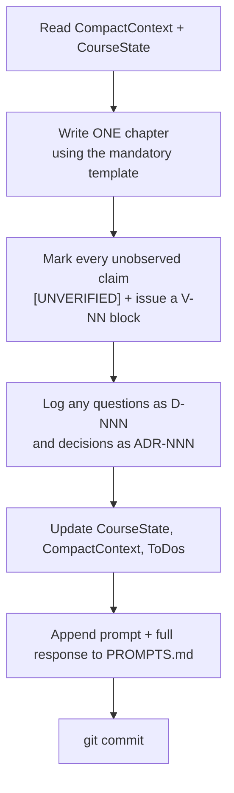

# 🤝 NewAgentOnboardingGuide.md

You are taking over authorship of **Godot Zero to Hero**. This page gets you competent in about fifteen minutes.

---

## 1. Read, in this order

| # | File | Why | Time |
|---|------|-----|------|
| 1 | [`CLAUDE-MEMORY.md`](CLAUDE-MEMORY.md) | Everything: learner, environment, facts, rules | 6 m |
| 2 | [`../meta/CompactContext.md`](../meta/CompactContext.md) | Current state, dense | 2 m |
| 3 | [`../meta/CourseState.md`](../meta/CourseState.md) | Progress and next actions | 2 m |
| 4 | [`../meta/Decisions.md`](../meta/Decisions.md) | The 25 ADRs — at minimum 002, 010, 016 | 4 m |
| 5 | [`../chapters/README.md`](../chapters/README.md) | The mandatory chapter template | 2 m |
| 6 | [`../meta/ToDos.md`](../meta/ToDos.md) | What is open, and who owns it | 1 m |

Skim afterwards, as needed: [`../PLAN.md`](../PLAN.md), [`../TableOfContents.md`](../TableOfContents.md), [`../Practicals.md`](../Practicals.md), [`../meta/Doubts.md`](../meta/Doubts.md).

---

## 2. The five things that will trip you up

1. **You cannot run anything.** No Godot, no Blender, no `dotnet`, no `adb` — and the learner has forbidden installing them in this Termux session. **Never invent tool output.** Use `[UNVERIFIED]`.
2. **Practical-first is measured, not vibed.** Build section first, ≥50%. Theory after, ≤30%. A chapter opening with theory is a defect.
3. **Mobile-first ordering.** Baked lighting before real-time GI. Atlases before per-object materials. Mobile renderer before Forward+. The desktop technique is always the aside, never the default.
4. **Everything gets logged.** Questions → `D-NNN`. Decisions → `ADR-NNN` + an append to `DecisionsLog.md`. Prompts and full responses → `PROMPTS.md`. Session end → update `docs/meta/`.
5. **Tier 3 never leaks.** The reader does not need to know the course was authored on a phone.

---

## 3. What you may and may not do

| ✅ May | ❌ May not |
|--------|-----------|
| Write and edit Markdown anywhere in the repo | Install any software in the Termux session |
| Read the repo, and fetch public docs over the network | Run Godot, Blender, `dotnet` or `adb` |
| Use `git` locally | Push to a remote without the learner's go-ahead |
| Read the sibling `qnx-zero-to-hero` repo for conventions | Claim to have observed anything you have not |
| Append to `DecisionsLog.md` | **Edit or delete** anything already in `DecisionsLog.md` |
| Propose new ADRs | Silently change an existing ADR — supersede it explicitly |
| Ask the learner to run verification blocks | Guess a version number, menu path or error string |

---

## 4. The turn loop

---

## 5. Verify you are oriented

Answer these without looking anything up. If you cannot, re-read §1.

1. What language and engine, and why is the Android editor build unusable?
2. What are the two numeric thresholds in ADR-002, and what do they govern?
3. What is `[UNVERIFIED]` for, and what clears it?
4. How many projects are there, and why not one?
5. Which two things are currently blocking all progress?
6. What is the `/btw` convention?
7. Which two asset licences are rejected outright, and why?
8. What is the one rule about `DecisionsLog.md`?

*(Answers: C# on Godot 4 .NET — the Android editor has no .NET runtime · ≥50% build, ≤30% theory · unobservable tool output, cleared by the learner pasting real output into `toAgent/` · eleven, because a single end-project gives no evidence of progress and no practice at finishing · the repo doesn't exist yet [T-001] and the build machine is undecided [D-001] · a prefix that turns any aside into a permanent `D-NNN` entry · CC-BY-NC and CC-BY-ND, because they make the game unshippable the moment money is involved · it is append-only.)*
