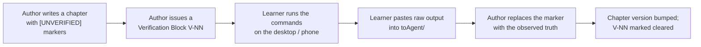

# 🔍 VerificationRuns.md

> **Why this exists.** The author writes from an Ubuntu/Termux session on an Android phone with **no Godot, no Blender, no .NET SDK and no Android SDK**, and has been instructed to install and run nothing there. Therefore the author **cannot observe what any tool actually prints**.
>
> Rather than invent plausible-sounding error messages and menu paths — which is worse than useless, because it is confidently wrong — every unobserved claim carries an `[UNVERIFIED]` marker. See [ADR-016](../meta/Decisions.md#adr-016).

---

## The loop



---

## What a verification block looks like

Each block is small, numbered `V-NN`, and asks for **exact, pasteable output** — never for a summary or an opinion.

> ### V-01 — Toolchain versions
> **Where:** desktop
> **Run:**
> ```bash
> dotnet --version
> dotnet --list-sdks
> java -version
> adb version
> ```
> **Also paste:** the `<TargetFramework>` line from a `.csproj` Godot generated for you, and the version shown in Godot's `Help → About`.
> **Clears:** `[UNVERIFIED]` in [Setup 02 §2](../guides/Setup_02_Godot_And_DotNet.md), [Setup 04 §1](../guides/Setup_04_Android_And_Device.md).

---

## How to report

1. Run the commands exactly as given.
2. Copy the **entire** output, including anything that looks like noise — warnings and stray lines are frequently the interesting part.
3. Create a file in [`../../toAgent/`](../../toAgent/) named `NN.BlockV-NN-ShortDescription.md`.
4. Say in one line whether it looked like it worked.
5. Tell me it's there.

> 💡 **Do not clean up the output.** A truncated paste has cost more debugging time in the QNX course than any other single thing. Paste all of it.

> 💬 **Questions belong in the same file.** Put `/btw` on its own line and ask — it becomes a `D-NNN` entry in [`../meta/Doubts.md`](../meta/Doubts.md) ([ADR-011](../meta/Decisions.md#adr-011)).

---

## Open verification blocks

| ID | Where | What it settles | Status |
|----|-------|-----------------|--------|
| **V-01** | desktop | Toolchain versions — .NET SDK, TFM, JDK, adb, Godot | ⬜ Open |
| **V-02** | desktop | Android SDK API level and build-tools version the current Godot export docs require | ⬜ Open |
| **V-03** | desktop + phone | `adb devices` output; `adb shell getprop ro.product.model`; whether wireless adb pairs | ⬜ Open |
| **V-04** | desktop | The exact text of the three deliberate failures in exercise C0.1 (missing keystore · missing export templates · invalid package name) | ⬜ Open |
| **V-05** | desktop | Blender → Godot 2 m cube round-trip: does it arrive at exactly 2 units? | ⬜ Open |
| **V-06** | phone | Godot's on-device performance monitor readings for P00 — frame time, draw calls, memory | ⬜ Open |
| **V-08** | desktop | **Chapter 0.2** — `godot --version`, `dotnet --list-sdks`, the `.csproj` `<TargetFramework>` line, Help→About wording, export-template path, and the three deliberate build failures' exact text | ⬜ Open |
| **V-09** | desktop | **Chapter 0.3** — `blender --version`; whether the 3 m cube measures `(3,3,3)` via the new `GetAabb()` script | 🔄 **Partly cleared 2026-09-02** — Preferences layout and the add-on list confirmed by screenshot; the cube measurement still outstanding, and the verification *method* was rewritten because the original was wrong |
| **V-10** | desktop | **Chapter 0.4** — `java -version`, `sdkmanager --version`, `adb version`, the JVM path, **the API level and build-tools version the official Godot export page currently requires**, and the `sdkmanager` failure text when `latest/` is renamed | ⬜ Open |
| **V-07** | desktop + phone | **Chapter 0.1** — output of `uname -a`, `lscpu`, `free -h`, `df -h ~`, `lspci`, `vulkaninfo --summary`, `lsusb` (plugged and unplugged); the Termux `dotnet --version` failure text verbatim; and the phone's Settings → About phone fields | ⬜ Open |

---

## Cleared

| ID | Cleared on | Source | What changed |
|----|-----------|--------|--------------|
| Part of **V-08** | 2026-09-02 | `toAgent/3.png` | **Godot version confirmed: `v4.7.2.stable.mono.official`.** Settles that the .NET build reports itself as `mono` — the `[UNVERIFIED]` in [0.2 Step 1](../chapters/Chapter_00.02_GodotAndDotNet.md) is now a verified fact |
| Part of **V-08** | 2026-09-02 | `toAgent/3.png` | **Renderer confirmed working: `D3D12 12_0 — Forward Mobile`** on an NVIDIA T600 Laptop GPU. Validates [ADR-010](../meta/Decisions.md#adr-010)'s Mobile-first choice and the [0.2](../chapters/Chapter_00.02_GodotAndDotNet.md) instruction to create the project on **Mobile** |
| Part of **V-08** | 2026-09-02 | `toAgent/3.png` | **Workshop confirmed as Config A (Windows 11 native)** — D3D12 in the banner. Matches [ADR-036](../meta/Decisions.md#adr-036) |
| Part of **V-09** | 2026-09-02 | `toAgent/1.png`, `toAgent/2.png` | **Blender 4.2+ ships seven built-in add-ons only**; Extra Objects and Copy Attributes Menu are Extensions now. **Preferences → Viewport has no Clip Start.** Both chapter 0.3 and Setup 03 corrected |

---

## What is *not* `[UNVERIFIED]`

To keep the markers meaningful, they are used only for **observable tool behaviour**. These are **not** marked, because they are matters of record or of design:

- Conceptual explanations and theory
- Design decisions and course structure
- Licence terms of asset sources (checked against the sources' own pages)
- API shapes documented in Godot's class reference
- Anything the learner has already reported and had recorded

If a marker appears on something in that list, it is a mistake — say so and it will be removed.
